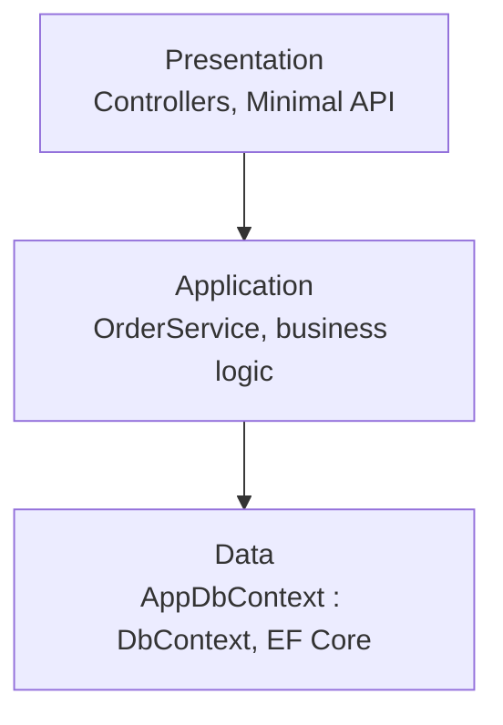
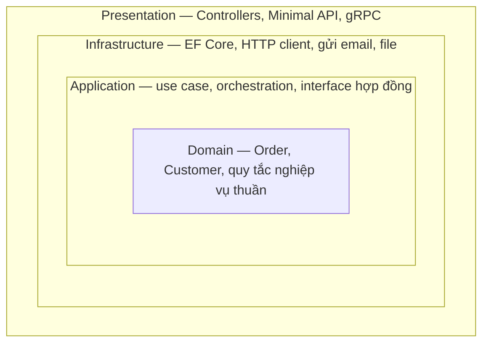
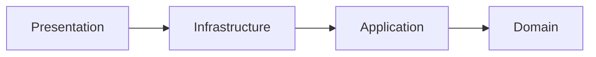

# Clean Architecture & Dependency Rule

!!! info "Bạn đang ở đây · P6 → node `p6-clean-architecture`"
    **Cần trước:** các pattern nâng cao ở P6 (interface, DI, tách trách nhiệm theo lớp — `p6-patterns-advanced`); DI container ASP.NET Core (P3); SOLID mức class (P1 `oop`), đặc biệt nguyên tắc D (Dependency Inversion).
    **Mở khoá:** thiết kế solution nhiều project có thể đổi hạ tầng (database, UI, message broker) mà không sửa logic nghiệp vụ; đọc hiểu solution .NET thực tế theo mẫu "Domain / Application / Infrastructure / Presentation".
    ⏱️ Fast path ~70 phút · Deep dive +70 phút.

> **Mục tiêu (đo được):** Sau chương này bạn (1) **chỉ ra chính xác** vì sao kiến trúc phân lớp thông thường (Presentation → Application → Data) làm Application phụ thuộc cứng vào EF Core; (2) **phát biểu đúng** Dependency Rule và **vẽ được** 4 vòng tròn Domain/Application/Infrastructure/Presentation cùng hướng phụ thuộc; (3) **tự viết lại** một ví dụ từ "Application gọi trực tiếp `DbContext`" thành "Application định nghĩa interface, Infrastructure implement" (Dependency Inversion áp dụng ở tầng kiến trúc, không chỉ tầng class); (4) **nhận diện** khi nào Clean Architecture là đầu tư đúng chỗ, khi nào là over-engineering cho dự án nhỏ.

---

## 0. Đoán nhanh trước khi học (30 giây)

Đọc đoạn code sau — đây là cách viết "tự nhiên" nhất khi mới học ASP.NET Core — và tự đoán: **nếu ngày mai công ty đổi từ SQL Server sang MongoDB, bạn phải sửa bao nhiêu file, và file nào?**

```csharp title="Đoán: đổi database sẽ phải sửa gì?"
// test:skip minh hoạ cấu trúc project, không tự chạy độc lập
// ===== Project: MyApp.Application =====
public class OrderService
{
    private readonly AppDbContext _db;   // <-- Application "thấy" thẳng EF Core

    public OrderService(AppDbContext db) => _db = db;

    public decimal GetTotalSpent(int customerId) =>
        _db.Orders.Where(o => o.CustomerId == customerId).Sum(o => o.Total);
}

// ===== Project: MyApp.Data (EF Core) =====
public class AppDbContext : DbContext
{
    public DbSet<Order> Orders => Set<Order>();
}
```

??? note "Đáp án — mở SAU khi đã đoán"
    Bạn phải sửa **`OrderService`** — lớp thuộc tầng **nghiệp vụ (Application)**, lẽ ra không nên biết database là gì. Vì `OrderService` phụ thuộc trực tiếp vào `AppDbContext` (một kiểu cụ thể của EF Core), mọi lớp nghiệp vụ *chạm* vào `DbContext` đều phải sửa/build lại khi đổi ORM hoặc đổi database. Tệ hơn: bạn **không thể unit test** `OrderService` mà không có một database thật (hoặc SQLite in-memory) chạy phía sau — vì không có gì để "giả" (mock) thay cho `AppDbContext`.

    Đây chính xác là vấn đề gốc mà Clean Architecture giải quyết. Mục 1 sẽ đào sâu vấn đề này bằng ví dụ cụ thể hơn, rồi mục 2-3 chỉ ra cách sửa.

---

## 1. Vấn đề gốc: Application phụ thuộc trực tiếp vào Infrastructure

### 1.1 Kiến trúc phân lớp "thông thường" — trông ổn, nhưng sai hướng phụ thuộc

Hầu hết dự án .NET mới đều tổ chức theo 3 lớp ngang, mỗi lớp là một project riêng:



Nhìn sơ đồ này, mọi thứ "có vẻ" hợp lý: Presentation gọi Application, Application gọi Data. Đây đúng là cách hầu hết tài liệu nhập môn ASP.NET Core dạy. **Vấn đề nằm ở mũi tên thứ hai**: `Application --> Data`. Application — nơi chứa **quy tắc nghiệp vụ**, thứ đắt giá nhất và ít thay đổi nhất của hệ thống — lại phụ thuộc vào **EF Core**, một công nghệ hạ tầng có thể thay đổi (đổi ORM, đổi database, đổi cloud provider).

### 1.2 Hậu quả cụ thể: không test được, không đổi được

Tiếp tục ví dụ ở mục 0. Giả sử bạn muốn viết **unit test** cho `OrderService.GetTotalSpent` — không đụng database thật, chạy trong milli-giây:

```csharp title="Muốn unit test OrderService — nhưng KẸT vì phụ thuộc AppDbContext cụ thể"
// test:skip minh hoạ vấn đề, cố ý không hoàn chỉnh
public class OrderServiceTests
{
    [Fact]
    public void GetTotalSpent_SumsOrders()
    {
        // Muốn: tạo một "AppDbContext giả" chứa vài Order mẫu, không chạm SQL Server.
        // Nhưng AppDbContext là class CỤ THỂ (không phải interface) — muốn giả lập được,
        // bạn phải dựng InMemory provider của EF Core, cấu hình DbContextOptions,
        // seed dữ liệu qua đúng API của EF Core... Test nghiệp vụ biến thành test hạ tầng.
        var service = new OrderService(/* AppDbContext thật hoặc InMemory provider — không có lựa chọn nào "nhẹ" */);
    }
}
```

Vấn đề không phải "EF Core InMemory provider không tồn tại" (nó có). Vấn đề là: **lớp nghiệp vụ đang bị buộc phải biết cách một công nghệ hạ tầng cụ thể hoạt động** để có thể test. Nếu 6 tháng sau, công ty quyết định đổi từ EF Core sang Dapper (vì cần tối ưu hiệu năng cho vài query nặng), bạn phải **sửa lại toàn bộ `OrderService` và mọi lớp Application khác đang cầm `AppDbContext`** — dù quy tắc nghiệp vụ ("tổng tiền = sum các Order") không đổi một chữ nào.

**Gốc của vấn đề:** hướng phụ thuộc trong kiến trúc phân lớp thông thường đi từ **lớp quan trọng, ổn định** (Application) tới **lớp chi tiết, dễ đổi** (hạ tầng cụ thể). Đây là ngược. Mục 2 sẽ định nghĩa nguyên tắc đảo hướng phụ thuộc này.

---

## 2. Dependency Rule: phụ thuộc luôn trỏ VÀO TRONG

**Định nghĩa (Dependency Rule):** trong Clean Architecture, code được chia thành các vòng tròn đồng tâm; **mã nguồn ở một vòng chỉ được phụ thuộc (biết tên, gọi trực tiếp) vào mã nguồn ở vòng cùng cấp hoặc vòng phía trong nó — không bao giờ ngược lại**. Vòng trong cùng (**Domain**) không được biết đến sự tồn tại của bất kỳ vòng nào bên ngoài nó.



Đọc sơ đồ theo hướng **mũi tên phụ thuộc luôn trỏ vào tâm**:



Bốn vòng, từ trong ra ngoài:

| Vòng | Chứa gì | Phụ thuộc vào |
|---|---|---|
| **Domain** | Entity, value object, quy tắc nghiệp vụ thuần (không I/O) | **Không ai** — vòng trung tâm, độc lập tuyệt đối |
| **Application** | Use case (nghiệp vụ ứng dụng), **interface** cho mọi thứ cần hạ tầng (`IOrderRepository`, `IEmailSender`) | Chỉ Domain |
| **Infrastructure** | **Cài đặt cụ thể** của các interface trên: EF Core, HTTP client, SMTP, file system | Application (để implement interface) + Domain |
| **Presentation** | Controller, Minimal API handler, gRPC, CLI | Application (gọi use case), thường cũng thấy Infrastructure lúc `Program.cs` đăng ký DI |

**Điểm mấu chốt dễ hiểu lầm:** "Infrastructure phụ thuộc Application" nghe *ngược* so với sơ đồ 3 lớp thông thường (`Application --> Data`) ở mục 1.1 — và đúng là **ngược thật**. Đây chính là điều Clean Architecture thay đổi: EF Core (Infrastructure) giờ đi **implement** một interface do Application định nghĩa, thay vì Application gọi thẳng EF Core. Mục 3 giải phẫu cơ chế này.

!!! danger "Đính chính hiểu lầm phổ biến"
    "Clean Architecture nghĩa là chia 4 project/folder tên Domain, Application, Infrastructure, Presentation." — **SAI, đó chỉ là hình thức.** Bản chất là **hướng phụ thuộc biên dịch** (compile-time dependency): project Application **không được reference** project Infrastructure trong file `.csproj`. Bạn có thể đặt 4 folder đúng tên nhưng vẫn phụ thuộc sai hướng (nếu Application `using` namespace của EF Core) — đó không phải Clean Architecture, chỉ là đặt tên cho giống.

---

## 3. Dependency Inversion ở tầng kiến trúc: Domain/Application định nghĩa interface, Infrastructure implement

Bạn đã biết Dependency Inversion Principle (DIP) ở mức **class** từ P1 `oop` (mục D, ví dụ `OrderService` phụ thuộc `INotifier` thay vì `EmailNotifier`). Clean Architecture áp dụng **đúng nguyên tắc đó**, nhưng ở mức **project/module**: interface được **định nghĩa trong Application**, còn **cài đặt cụ thể nằm trong Infrastructure** — một project riêng, được phép phụ thuộc *vào trong* nhưng Application không hề biết nó tồn tại.

### 3.1 Trước: Application phụ thuộc trực tiếp Infrastructure (sai hướng)

Đây là code ở mục 0/1, viết lại rõ ràng theo project để thấy hướng tham chiếu `.csproj`:

```csharp title="TRƯỚC — MyApp.Application reference MyApp.Data (EF Core)"
// test:skip minh hoạ vấn đề, xem lại mục 0-1 để hiểu hậu quả
// ---- Project: MyApp.Application.csproj ----
// <ProjectReference Include="..\MyApp.Data\MyApp.Data.csproj" />  <-- Application PHỤ THUỘC Data
using MyApp.Data;

public class OrderService(AppDbContext db)
{
    public decimal GetTotalSpent(int customerId) =>
        db.Orders.Where(o => o.CustomerId == customerId).Sum(o => o.Total);
}

// ---- Project: MyApp.Data.csproj (EF Core) ----
public class AppDbContext : DbContext
{
    public DbSet<Order> Orders => Set<Order>();
}
public class Order { public int Id; public int CustomerId; public decimal Total; }
```

Hướng tham chiếu project: `Application --> Data`. Application "biết" EF Core tồn tại.

### 3.2 Sau: Application định nghĩa interface, Infrastructure implement — đảo hướng

Bước 1 — **Domain/Application định nghĩa interface** mô tả *cái ứng dụng cần*, không nói gì về *cách lấy dữ liệu*:

```csharp title="SAU (bước 1) — Application chỉ định nghĩa interface, KHÔNG biết EF Core"
// test:skip minh hoạ cấu trúc nhiều project, ghép với bước 2-3 để chạy được
// ---- Project: MyApp.Domain.csproj — KHÔNG reference project nào khác ----
public class Order
{
    public int Id { get; init; }
    public int CustomerId { get; init; }
    public decimal Total { get; init; }
}

// ---- Project: MyApp.Application.csproj — chỉ reference MyApp.Domain ----
public interface IOrderRepository
{
    IEnumerable<Order> GetByCustomer(int customerId);
}

public class OrderService(IOrderRepository repository)   // phụ thuộc INTERFACE, không phụ thuộc EF Core
{
    public decimal GetTotalSpent(int customerId) =>
        repository.GetByCustomer(customerId).Sum(o => o.Total);
}
```

Bước 2 — **Infrastructure implement interface đó**, và đây là nơi duy nhất "biết" EF Core:

```csharp title="SAU (bước 2) — Infrastructure implement IOrderRepository bằng EF Core"
// test:skip ghép với bước 1 và 3 để chạy độc lập được
// ---- Project: MyApp.Infrastructure.csproj — reference MyApp.Application + MyApp.Domain ----
using Microsoft.EntityFrameworkCore;

public class AppDbContext : DbContext
{
    public DbSet<Order> Orders => Set<Order>();
    protected override void OnConfiguring(DbContextOptionsBuilder o) =>
        o.UseInMemoryDatabase("demo");   // ví dụ tối giản; thực tế dùng UseSqlServer/UseNpgsql
}

public class EfOrderRepository(AppDbContext db) : IOrderRepository
{
    public IEnumerable<Order> GetByCustomer(int customerId) =>
        db.Orders.Where(o => o.CustomerId == customerId).ToList();
}
```

Bước 3 — **Presentation (`Program.cs`) là nơi duy nhất nối hai đầu lại** bằng DI container — đây là *lúc* Infrastructure và Application gặp nhau, nhưng chỉ ở **runtime**, không phải ở **compile-time reference của Application**:

```csharp title="SAU (bước 3) — Program.cs nối Application với Infrastructure qua DI (dùng EF Core thật)"
// test:skip cần package ngoài Microsoft.EntityFrameworkCore.InMemory — minh hoạ cách nối 3 project qua DI
// Mô phỏng gọn 3 project trong 1 file — thực tế đây là 3 .csproj riêng.
var repo = new EfOrderRepository(SeedDb());
var service = new OrderService(repo);   // OrderService chỉ thấy IOrderRepository
Console.WriteLine(service.GetTotalSpent(1));  // 300

AppDbContext SeedDb()
{
    var db = new AppDbContext();
    db.Orders.AddRange(
        new Order { Id = 1, CustomerId = 1, Total = 100m },
        new Order { Id = 2, CustomerId = 1, Total = 200m },
        new Order { Id = 3, CustomerId = 2, Total = 999m });
    db.SaveChanges();
    return db;
}

public interface IOrderRepository { IEnumerable<Order> GetByCustomer(int customerId); }

public class OrderService(IOrderRepository repository)
{
    public decimal GetTotalSpent(int customerId) =>
        repository.GetByCustomer(customerId).Sum(o => o.Total);
}

public class Order
{
    public int Id { get; init; }
    public int CustomerId { get; init; }
    public decimal Total { get; init; }
}

public class AppDbContext : Microsoft.EntityFrameworkCore.DbContext
{
    public Microsoft.EntityFrameworkCore.DbSet<Order> Orders => Set<Order>();
    protected override void OnConfiguring(Microsoft.EntityFrameworkCore.DbContextOptionsBuilder o) =>
        o.UseInMemoryDatabase("demo");
}

public class EfOrderRepository(AppDbContext db) : IOrderRepository
{
    public IEnumerable<Order> GetByCustomer(int customerId) =>
        db.Orders.Where(o => o.CustomerId == customerId).ToList();
}
```

Nếu chạy thật (có package `Microsoft.EntityFrameworkCore.InMemory`), kết quả in ra là `300` (tổng `Total` của 2 Order thuộc `CustomerId = 1`). Để tự kiểm chứng logic **không cần EF Core**, đây là bản tương đương chỉ dùng BCL — thay `AppDbContext`/`EfOrderRepository` bằng một cài đặt `IOrderRepository` trong bộ nhớ:

```csharp title="Kiểm chứng logic tương đương — CHỈ BCL, không cần EF Core"
// test:run
var repo = new InMemoryOrderRepository(new List<Order>
{
    new() { Id = 1, CustomerId = 1, Total = 100m },
    new() { Id = 2, CustomerId = 1, Total = 200m },
    new() { Id = 3, CustomerId = 2, Total = 999m }
});
var service = new OrderService(repo);          // OrderService chỉ thấy IOrderRepository
Console.WriteLine(service.GetTotalSpent(1));    // 300 — giống hệt kết quả với EfOrderRepository ở trên

public interface IOrderRepository { IEnumerable<Order> GetByCustomer(int customerId); }

public class OrderService(IOrderRepository repository)
{
    public decimal GetTotalSpent(int customerId) =>
        repository.GetByCustomer(customerId).Sum(o => o.Total);
}

public class Order
{
    public int Id { get; init; }
    public int CustomerId { get; init; }
    public decimal Total { get; init; }
}

// "Infrastructure giả" — đứng vai EfOrderRepository nhưng không cần EF Core
public class InMemoryOrderRepository(List<Order> data) : IOrderRepository
{
    public IEnumerable<Order> GetByCustomer(int customerId) =>
        data.Where(o => o.CustomerId == customerId);
}
```

```text title="Kết quả"
300
```

### 3.3 Vì sao đây là "đảo hướng", không chỉ là "thêm interface"

So hai hướng tham chiếu project:

| | Trước (3 lớp thông thường) | Sau (Dependency Rule) |
|---|---|---|
| Ai định nghĩa `IOrderRepository`/kiểu dữ liệu? | Không có interface — Application dùng thẳng `AppDbContext` | **Application** (gần Domain) |
| Ai implement? | — | **Infrastructure** — implement interface của Application |
| Hướng tham chiếu `.csproj` | `Application --> Data` | `Infrastructure --> Application` (**ngược lại**) |
| Application có `using EF Core` không? | Có | **Không** — Application thậm chí không cần cài NuGet package EF Core |
| Test `OrderService` cần gì? | Cần dựng `AppDbContext` (thật hoặc InMemory provider) | Chỉ cần một class/mock implement `IOrderRepository` bằng `List<Order>` trong bộ nhớ — không NuGet nào của EF Core |

Đây chính là DIP (P1) áp dụng ở **mức module**: "high-level module (Application, chứa quy tắc nghiệp vụ) không phụ thuộc low-level module (Infrastructure, chi tiết kỹ thuật); cả hai phụ thuộc **abstraction**". Khác biệt so với DIP mức class là: ở đây abstraction (`IOrderRepository`) không chỉ tách một dependency trong *cùng project*, mà tách **toàn bộ project Infrastructure ra khỏi compile-time reference của Application** — đổi EF Core sang Dapper/MongoDB chỉ cần viết một `XxxOrderRepository` mới trong Infrastructure, **không sửa một dòng nào trong Application hoặc Domain**.

!!! danger "Cạm bẫy: đặt interface `IOrderRepository` TRONG project Infrastructure"
    Nếu bạn định nghĩa `IOrderRepository` bên trong `MyApp.Infrastructure` rồi để `MyApp.Application` `using MyApp.Infrastructure`, hướng tham chiếu **vẫn là** `Application --> Infrastructure` — bạn chỉ thêm một lớp interface *thừa*, không đảo được gì. Interface phải **thuộc project mà nó phục vụ nhu cầu** (Application/Domain), không thuộc project cài đặt nó (Infrastructure). Đây là lỗi thực chiến rất phổ biến khi nhóm mới áp dụng Clean Architecture.

### 3.4 Áp dụng lại với một use case khác: gửi email xác nhận đơn hàng

Để chắc chắn bạn không nhầm "đảo hướng phụ thuộc" là thứ chỉ áp dụng cho *dữ liệu* (repository), hãy áp dụng lại đúng 3 bước ở mục 3.2 cho một nhu cầu hạ tầng khác hẳn: **gửi email**.

```csharp title="TRƯỚC — OrderService gọi trực tiếp SmtpClient (hạ tầng cụ thể)"
// test:skip minh hoạ vấn đề tương tự mục 3.1, nhưng cho use case gửi email
using System.Net.Mail;   // SmtpClient — công nghệ hạ tầng cụ thể

public class OrderService
{
    public void ConfirmOrder(string customerEmail, string orderId)
    {
        // Application "biết" chi tiết SMTP — khó test, khó đổi sang nhà cung cấp email khác
        using var client = new SmtpClient("smtp.mycompany.com");
        client.Send("orders@mycompany.com", customerEmail, "Xác nhận đơn hàng", $"Đơn {orderId} đã được xác nhận.");
    }
}
```

```csharp title="SAU — Application định nghĩa IEmailSender, Infrastructure implement bằng SMTP"
// test:run
var sender = new ConsoleEmailSender();      // "Infrastructure giả" — đứng vai SmtpEmailSender thật
var service = new OrderService(sender);
service.ConfirmOrder("an@example.com", "ORD-001");

// ---- Application: chỉ biết interface ----
public interface IEmailSender
{
    void Send(string to, string subject, string body);
}

public class OrderService(IEmailSender sender)
{
    public void ConfirmOrder(string customerEmail, string orderId) =>
        sender.Send(customerEmail, "Xác nhận đơn hàng", $"Đơn {orderId} đã được xác nhận.");
}

// ---- Infrastructure: cài đặt cụ thể (ở đây giả bằng Console cho gọn; thật ra sẽ là SmtpEmailSender dùng SmtpClient) ----
public class ConsoleEmailSender : IEmailSender
{
    public void Send(string to, string subject, string body) =>
        Console.WriteLine($"[email tới {to}] {subject}: {body}");
}
```

```text title="Kết quả"
[email tới an@example.com] Xác nhận đơn hàng: Đơn ORD-001 đã được xác nhận.
```

Nhận ra mẫu hình lặp lại giống hệt mục 3.2: bất kể nhu cầu hạ tầng là gì — database, email, gọi API bên thứ ba, đọc/ghi file, hàng đợi message — **quy trình đảo hướng luôn giống nhau**: (1) Application mô tả *cái nó cần* bằng interface; (2) Infrastructure viết *cách làm cụ thể*; (3) Presentation nối hai bên bằng DI. Đây là lý do Dependency Rule là một **nguyên tắc kiến trúc tổng quát**, không phải một "trick" chỉ dành riêng cho truy cập dữ liệu.

---

## 4. Khi nào Clean Architecture là THỪA (over-engineering)

Clean Architecture đổi lấy khả năng **thay hạ tầng dễ dàng + test Application không cần database** bằng **chi phí**: nhiều project hơn, nhiều interface hơn, nhiều lớp gián tiếp hơn (gọi hàm qua interface thay vì gọi trực tiếp). Chi phí này **chỉ đáng** khi lợi ích thực sự dùng tới.

**Dùng Clean Architecture khi:**

- Dự án đủ lớn, nhiều người/nhiều team cùng làm, cần ranh giới rõ để tránh đụng code lẫn nhau.
- Có khả năng thật (không phải giả định) sẽ đổi hạ tầng: đổi database, thêm nhiều loại client (Web API + gRPC + worker nền) cùng dùng một lõi nghiệp vụ, hoặc cần test nghiệp vụ nặng mà không muốn phụ thuộc DB thật trong CI.
- Quy tắc nghiệp vụ phức tạp, đáng để bảo vệ khỏi rò rỉ chi tiết kỹ thuật (ví dụ hệ thống tính phí, tính thuế, quy trình phê duyệt nhiều bước).

**Đừng dùng — hoặc dùng ít hơn — khi:**

- Dự án nhỏ, **một developer**, ít khả năng đổi database trong vòng đời dự án (CRUD nội bộ, MVP, prototype). Chi phí dựng 4 project + interface cho từng thứ **không đáng** so với lợi ích chưa chắc dùng tới.
- Team chưa quen kỷ luật giữ hướng phụ thuộc — dễ rơi vào tình trạng "4 project đúng tên nhưng phụ thuộc lộn xộn" (xem cạm bẫy mục 3.3), tức là **tốn chi phí mà không có lợi ích thật**.
- Bạn đã dùng EF Core: `DbContext`/`DbSet<T>` **đã là** một dạng Unit-of-Work + Repository-like abstraction có sẵn (đúng như đã nói ở chương pattern trước, `p6-patterns-advanced`). Việc bọc thêm một lớp Repository *bên trong Application* để "chuẩn Clean Architecture" mà không có nhu cầu đổi ORM thật thì chỉ là gián tiếp hoá không cần thiết — hai lớp trừu tượng chồng lên nhau (interface Repository *và* EF Core) mà lợi ích chỉ nhận một lần.

!!! danger "Over-engineering kinh điển: 4 project cho một CRUD app 3 màn hình"
    Một dấu hiệu rõ: bạn tạo `MyApp.Domain`, `MyApp.Application`, `MyApp.Infrastructure`, `MyApp.Presentation`, nhưng **Domain chỉ có 2 entity**, **Application chỉ có CRUD 1-1 với bảng**, và **không ai trong team từng cân nhắc đổi database**. Ở quy mô này, một project `MyApp.Web` dùng Minimal API + EF Core trực tiếp (kiến trúc phân lớp đơn giản mục 1.1) sẽ **nhanh hơn để viết, dễ hơn để onboard người mới, và không mất gì** — vì rủi ro "phải đổi hạ tầng" gần như bằng 0. Áp Clean Architecture ở đây là trả chi phí kiến trúc cho một lợi ích không tồn tại.

**Quy tắc ngón tay cái:** hỏi "nếu 1 năm nữa phải đổi database/ORM, hoặc phải viết unit test cho nghiệp vụ mà không có DB, việc đó có **thực sự** xảy ra không?" Nếu câu trả lời là "gần như không" và team nhỏ — kiến trúc phân lớp đơn giản là lựa chọn *đúng*, không phải lựa chọn *tạm*.

---

## 5. Cấu trúc solution thật: project, `.csproj`, và nơi `Program.cs` nối mọi thứ

Hai mục trước dùng ví dụ gộp nhiều "project" vào một file để dễ chạy thử. Mục này cho thấy **hình dạng thật** của một solution .NET áp dụng Dependency Rule — để khi bạn mở một repo thực tế theo mẫu này, biết ngay đang nhìn vào đâu.

### 5.1 Cây thư mục và hướng `ProjectReference`

```text title="Cấu trúc solution — 4 project, mỗi mũi tên là một ProjectReference"
MyApp.sln
├── src/
│   ├── MyApp.Domain/              (không ProjectReference nào)
│   │   └── MyApp.Domain.csproj
│   ├── MyApp.Application/         (ProjectReference -> MyApp.Domain)
│   │   └── MyApp.Application.csproj
│   ├── MyApp.Infrastructure/      (ProjectReference -> MyApp.Application, MyApp.Domain)
│   │   └── MyApp.Infrastructure.csproj
│   └── MyApp.Api/                 (ProjectReference -> MyApp.Application, MyApp.Infrastructure)
│       └── MyApp.Api.csproj
└── tests/
    └── MyApp.Application.Tests/   (ProjectReference -> MyApp.Application, MyApp.Domain — KHÔNG cần Infrastructure)
        └── MyApp.Application.Tests.csproj
```

Điểm quan trọng nhất để **tự kiểm tra** một solution có tuân thủ Dependency Rule hay không: mở `MyApp.Application.csproj`, tìm mọi thẻ `<ProjectReference>` — nó **chỉ được** trỏ tới `MyApp.Domain`, không bao giờ tới `MyApp.Infrastructure` hay `MyApp.Api`.

```xml title="MyApp.Application.csproj — chỉ reference Domain, KHÔNG reference Infrastructure"
<!-- test:skip minh hoạ nội dung .csproj, không phải C# nên không compile bằng dotnet -->
<Project Sdk="Microsoft.NET.Sdk">
  <PropertyGroup>
    <TargetFramework>net10.0</TargetFramework>
  </PropertyGroup>
  <ItemGroup>
    <ProjectReference Include="..\MyApp.Domain\MyApp.Domain.csproj" />
    <!-- KHÔNG có dòng nào trỏ tới MyApp.Infrastructure ở đây -->
  </ItemGroup>
</Project>
```

Ngược lại, `MyApp.Infrastructure.csproj` **được phép** — và **phải** — reference `MyApp.Application` (để implement interface của nó):

```xml title="MyApp.Infrastructure.csproj — reference Application (ngược hướng so với 3 lớp thông thường)"
<!-- test:skip minh hoạ nội dung .csproj -->
<Project Sdk="Microsoft.NET.Sdk">
  <PropertyGroup>
    <TargetFramework>net10.0</TargetFramework>
  </PropertyGroup>
  <ItemGroup>
    <PackageReference Include="Microsoft.EntityFrameworkCore.SqlServer" Version="10.0.0" />
  </ItemGroup>
  <ItemGroup>
    <ProjectReference Include="..\MyApp.Application\MyApp.Application.csproj" />
    <ProjectReference Include="..\MyApp.Domain\MyApp.Domain.csproj" />
  </ItemGroup>
</Project>
```

### 5.2 `Program.cs` — Composition Root, nơi duy nhất "thấy" cả hai đầu

`MyApp.Api` (Presentation) reference **cả** `MyApp.Application` và `MyApp.Infrastructure` — đây là project duy nhất được phép làm vậy, vì nó đóng vai **Composition Root**: nơi ráp các interface với cài đặt cụ thể bằng DI container, rồi từ đó mọi request chỉ đi qua interface.

```csharp title="Program.cs thật — đăng ký IOrderRepository, IEmailSender; endpoint chỉ gọi Application"
// test:compile
var builder = WebApplication.CreateBuilder(args);

// Đăng ký cài đặt CỤ THỂ (Infrastructure) cho từng interface (Application) —
// đây là DÒNG DUY NHẤT trong toàn solution "biết" cả hai đầu.
builder.Services.AddScoped<IOrderRepository, InMemoryOrderRepository>();
builder.Services.AddScoped<IEmailSender, ConsoleEmailSender>();
builder.Services.AddScoped<OrderService>();

var app = builder.Build();

// Handler chỉ nói chuyện với Application (OrderService) — không biết InMemoryOrderRepository tồn tại.
app.MapGet("/orders/{customerId:int}/total", (int customerId, OrderService service) =>
    service.GetTotalSpent(customerId));

app.Run();

// ---- Application ----
public interface IOrderRepository { IEnumerable<Order> GetByCustomer(int customerId); }
public interface IEmailSender { void Send(string to, string subject, string body); }

public class OrderService(IOrderRepository repository)
{
    public decimal GetTotalSpent(int customerId) =>
        repository.GetByCustomer(customerId).Sum(o => o.Total);
}

// ---- Domain ----
public class Order
{
    public int Id { get; init; }
    public int CustomerId { get; init; }
    public decimal Total { get; init; }
}

// ---- Infrastructure (ở đây rút gọn thành in-memory để ví dụ tự đứng được, không cần EF Core) ----
public class InMemoryOrderRepository : IOrderRepository
{
    private readonly List<Order> _data = new()
    {
        new() { Id = 1, CustomerId = 1, Total = 100m },
        new() { Id = 2, CustomerId = 1, Total = 200m }
    };
    public IEnumerable<Order> GetByCustomer(int customerId) => _data.Where(o => o.CustomerId == customerId);
}

public class ConsoleEmailSender : IEmailSender
{
    public void Send(string to, string subject, string body) => Console.WriteLine($"[email] {to}: {subject}");
}
```

Đây là hình ảnh đầy đủ khớp với sơ đồ 4 vòng ở mục 2: `Program.cs` (Presentation) → biết `OrderService` (Application) và đăng ký `InMemoryOrderRepository` (Infrastructure) cho interface `IOrderRepository` (định nghĩa trong Application) — nhưng **handler** `MapGet` chỉ nhận `OrderService`, không bao giờ chạm trực tiếp `InMemoryOrderRepository`.

### 5.3 Tên gọi khác của cùng ý tưởng: Onion Architecture, Hexagonal Architecture, Ports & Adapters

Bạn sẽ gặp nhiều tên khác nhau cho **cùng một nguyên tắc cốt lõi** (phụ thuộc trỏ vào tâm, tâm không biết hạ tầng):

| Tên | Ai đặt | Điểm khác biệt về TỪ VỰNG (bản chất Dependency Rule giống nhau) |
|---|---|---|
| **Clean Architecture** | Robert C. Martin (2012) | Đặt tên 4 vòng: Entities, Use Cases, Interface Adapters, Frameworks & Drivers — chương này dùng tên rút gọn phổ biến trong .NET: Domain/Application/Infrastructure/Presentation |
| **Onion Architecture** | Jeffrey Palermo (2008), ra trước Clean Architecture | Cùng ý tưởng vòng tròn đồng tâm, tên gọi "củ hành" vì bóc từng lớp từ ngoài vào trong |
| **Hexagonal Architecture / Ports & Adapters** | Alistair Cockburn (2005) | Tập trung vào "cổng" (port = interface) và "adapter" (cài đặt cụ thể) hai bên: bên trong core, bên ngoài là adapter cho DB/UI/message queue — vẽ hình lục giác cho đẹp, không phải 6 cạnh có ý nghĩa gì đặc biệt |

**Điểm chung, và cũng là điều bạn cần nhớ hơn tên gọi:** cả ba đều thực thi đúng một quy tắc — **logic nghiệp vụ không phụ thuộc chi tiết kỹ thuật; chi tiết kỹ thuật phụ thuộc (implement) hợp đồng do nghiệp vụ định ra**. Khi đọc tài liệu hoặc phỏng vấn, nếu ai đó dùng tên khác (Onion, Hexagonal), đừng bối rối — hỏi lại "hướng phụ thuộc đi đâu?" sẽ lộ ra ngay đó là cùng một nguyên tắc.

---

## Cạm bẫy & thực chiến

1. **Interface đặt sai project.** `IOrderRepository` phải nằm trong Application/Domain, không nằm trong Infrastructure — nếu không, hướng phụ thuộc không đảo được gì (mục 3.3).
2. **4 project đúng tên nhưng sai hướng tham chiếu.** Đặt tên Domain/Application/Infrastructure/Presentation không tự nhiên tạo ra Clean Architecture — phải kiểm tra `.csproj` của Application **không** có `ProjectReference` tới Infrastructure.
3. **Domain "rò rỉ" thuộc tính EF Core.** Nếu entity trong Domain có thuộc tính chỉ để phục vụ EF Core (navigation property thiết kế riêng cho join, thuộc tính đặt tên theo convention của ORM cụ thể), Domain đã ngầm phụ thuộc ORM dù không `using` trực tiếp — hãy giữ Domain là POCO thuần nghiệp vụ.
4. **Áp dụng cho dự án nhỏ, một người, ít thay đổi hạ tầng.** Đây là over-engineering — chi phí dựng 4 project + interface cho mọi thứ không tương xứng với lợi ích chưa chắc dùng tới (mục 4). Không phải cứ là "kiến trúc tốt" thì lúc nào cũng nên dùng.
5. **Bọc thêm Repository quanh EF Core "cho đủ chuẩn"** khi không có nhu cầu đổi ORM. `DbSet<T>` đã là abstraction; thêm một lớp interface Repository nữa mà không giải quyết vấn đề cụ thể (test không cần DB, hoặc thật sự cần đổi ORM) là gián tiếp hoá thừa.
6. **Nhầm Dependency Rule với "nhiều tầng thì luôn tốt."** Dependency Rule nói về **hướng** phụ thuộc (luôn vào trong), không nói về **số lượng** tầng. Bạn có thể có 4 project đúng hướng nhưng vẫn thiết kế nghiệp vụ tồi; ngược lại 1 project vẫn có thể tách rõ interface nội bộ nếu cần.

---

## Bài tập

### Bài 1 (giàn giáo): Đảo hướng phụ thuộc cho `ProductService`

Cho code sau (một project duy nhất, Application phụ thuộc trực tiếp EF Core):

```csharp title="Đề bài — sửa để Application không còn biết EF Core"
// test:skip giàn giáo — người học tự sửa
public class ProductService(AppDbContext db)
{
    public int CountInStock() => db.Products.Count(p => p.Quantity > 0);
}

public class AppDbContext : Microsoft.EntityFrameworkCore.DbContext
{
    public Microsoft.EntityFrameworkCore.DbSet<Product> Products => Set<Product>();
}
public class Product { public int Quantity; }
```

Yêu cầu: tạo `IProductRepository` (chứa `CountInStock()` trả `IEnumerable<Product>` hoặc số lượng tuỳ bạn thiết kế), để `ProductService` chỉ phụ thuộc interface đó; viết một `EfProductRepository` implement bằng `AppDbContext`; chứng minh bằng cách gọi qua một implementation giả (list trong bộ nhớ, không có EF Core) để thấy `ProductService` chạy được mà không cần `AppDbContext`.

??? success "Lời giải"
    ```csharp title="Bài 1 — lời giải"
    // test:run
    var fakeRepo = new InMemoryProductRepository(new List<Product>
    {
        new() { Quantity = 5 }, new() { Quantity = 0 }, new() { Quantity = 2 }
    });
    var service = new ProductService(fakeRepo);
    Console.WriteLine(service.CountInStock());   // 2 — không cần EF Core, không cần database

    public interface IProductRepository
    {
        IEnumerable<Product> GetAll();
    }

    public class ProductService(IProductRepository repository)
    {
        public int CountInStock() => repository.GetAll().Count(p => p.Quantity > 0);
    }

    public class Product { public int Quantity { get; init; } }

    // "Infrastructure giả" dùng để test — thay cho EfProductRepository thật
    public class InMemoryProductRepository(List<Product> data) : IProductRepository
    {
        public IEnumerable<Product> GetAll() => data;
    }
    ```
    Điểm mấu chốt: `ProductService` không đổi một dòng dù bạn cắm `InMemoryProductRepository` (test) hoặc `EfProductRepository` (production) — vì nó chỉ biết `IProductRepository`. Đây chính là lợi ích cụ thể của Dependency Rule, không phải lý thuyết suông.

### Bài 2 (thiết kế): Đánh giá có nên áp Clean Architecture

Cho 3 tình huống: (a) app quản lý công việc cá nhân, 1 developer, không kế hoạch đổi database; (b) hệ thống đặt phòng khách sạn cho chuỗi 200 khách sạn, 8 developer, dự kiến thêm gRPC service nội bộ dùng lại logic đặt phòng; (c) MVP demo cho nhà đầu tư, cần xong trong 3 ngày, có thể bị bỏ nếu không gọi được vốn. Với mỗi tình huống, quyết định **nên/không nên** áp Clean Architecture đầy đủ (4 project + interface hoá mọi truy cập hạ tầng) và giải thích bằng tiêu chí ở mục 4.

??? success "Lời giải"
    - **(a) Không nên.** Một developer, không kế hoạch đổi hạ tầng → chi phí 4 project/interface không đổi lấy được lợi ích nào (không ai cần đổi ORM, không cần nhiều client). Dùng kiến trúc phân lớp đơn giản (mục 1.1) hoặc thậm chí 1 project.
    - **(b) Nên.** Nhiều developer (ranh giới rõ giúp tránh đụng code), có kế hoạch thật (không phải giả định) thêm gRPC dùng lại cùng logic đặt phòng → đúng lý do Presentation có thể có nhiều "cổng vào" (Web API + gRPC) cùng gọi một Application. Đây là lợi ích cụ thể, không phải lý thuyết.
    - **(c) Không nên.** Thời gian là ràng buộc cứng (3 ngày), và vòng đời dự án rất có thể kết thúc sớm (không gọi được vốn) → đầu tư kiến trúc cho khả năng mở rộng tương lai là lãng phí thời gian quý giá nhất lúc này. Tiêu chí "sẽ đổi hạ tầng thật không" trả lời là "không quan trọng, vì có thể không còn dự án để đổi."

### Bài 3 (soi lỗi): Tìm chỗ Dependency Rule bị vi phạm "ngầm"

Solution sau có 4 project đặt tên đúng chuẩn (`Domain`, `Application`, `Infrastructure`, `Api`), và không project nào `ProjectReference` sai hướng. Nhưng vẫn có một vi phạm Dependency Rule "ngầm" — không bắt được chỉ bằng cách soi `ProjectReference` (không có tham chiếu project nào sai hướng), mà phải đọc chính nội dung class. Tìm nó.

```csharp title="Đề bài — Application.csproj chỉ reference Domain, nhưng có gì sai?"
// test:skip cố ý minh hoạ lỗi tinh vi — xem lời giải để hiểu tại sao đây vẫn là vi phạm
// ---- Project: MyApp.Application (chỉ ProjectReference MyApp.Domain — ĐÚNG về mặt .csproj) ----
public class OrderService(IOrderRepository repository)
{
    public IResult GetTotal(int customerId)   // <-- IResult là gì?
    {
        var total = repository.GetByCustomer(customerId).Sum(o => o.Total);
        return Microsoft.AspNetCore.Http.Results.Ok(total);  // <-- và đây?
    }
}
```

??? success "Lời giải"
    Vi phạm nằm ở kiểu trả về `IResult` và lời gọi `Microsoft.AspNetCore.Http.Results.Ok(...)`. Đây là kiểu/API của **ASP.NET Core** — thuộc về Presentation, không phải Application. Dù `MyApp.Application.csproj` không có `ProjectReference` sai hướng (thực ra để dùng được `IResult`, bạn phải thêm `<FrameworkReference Include="Microsoft.AspNetCore.App" />` hoặc tương đương — bản thân việc phải thêm điều đó đã là dấu hiệu rõ), Application đã "biết" về web framework, đúng như DEEP DIVE điểm 6 cảnh báo. Nếu ngày mai bạn muốn gọi `OrderService` từ một worker service (không có HTTP request nào), `GetTotal` không còn hợp lý (không ai cần `IResult`).

    Sửa: `OrderService` chỉ nên trả kiểu thuần dữ liệu (`decimal`, hoặc một DTO tự định nghĩa trong Application), để Presentation (`Program.cs`/controller) tự quyết định bọc nó thành `Results.Ok(...)`, `200 OK` XML, hay bất kỳ định dạng response nào:
    ```csharp title="Bài 3 — sửa đúng: Application trả dữ liệu thuần, Presentation tự bọc HTTP"
    // test:run
    var repo = new InMemoryOrderRepository();
    var service = new OrderService(repo);
    decimal total = service.GetTotal(1);           // Application trả decimal thuần
    Console.WriteLine(total);                       // 300 — Presentation (ở đây là Console) tự quyết định hiển thị

    public interface IOrderRepository { IEnumerable<Order> GetByCustomer(int customerId); }

    public class OrderService(IOrderRepository repository)
    {
        public decimal GetTotal(int customerId) =>     // không còn IResult, không còn using AspNetCore
            repository.GetByCustomer(customerId).Sum(o => o.Total);
    }

    public class Order
    {
        public int Id { get; init; }
        public int CustomerId { get; init; }
        public decimal Total { get; init; }
    }

    public class InMemoryOrderRepository : IOrderRepository
    {
        private readonly List<Order> _data = new()
        {
            new() { Id = 1, CustomerId = 1, Total = 100m },
            new() { Id = 2, CustomerId = 1, Total = 200m }
        };
        public IEnumerable<Order> GetByCustomer(int customerId) => _data.Where(o => o.CustomerId == customerId);
    }
    ```
    Điểm mấu chốt: Dependency Rule không chỉ kiểm tra được bằng `ProjectReference` — bạn còn phải tự kiểm bằng mắt xem **kiểu dữ liệu** đi qua ranh giới Application có "rò rỉ" chi tiết của vòng ngoài (HTTP, EF Core, SMTP...) không.

---

## Tự kiểm tra

Trả lời rồi mở đáp án.

1. clean-architecture-q1: Trong kiến trúc phân lớp thông thường (Presentation → Application → Data), điều gì SAI về hướng phụ thuộc, cụ thể là ai phụ thuộc vào ai?
   ??? note "Đáp án"
       Application (chứa quy tắc nghiệp vụ, đáng lẽ ổn định nhất) lại phụ thuộc trực tiếp vào Data/hạ tầng cụ thể (ví dụ `AppDbContext` của EF Core) — lớp quan trọng phụ thuộc lớp chi tiết dễ đổi, thay vì ngược lại.

2. clean-architecture-q2: Phát biểu chính xác Dependency Rule bằng một câu.
   ??? note "Đáp án"
       Phụ thuộc (compile-time reference) luôn trỏ **vào trong**, về phía các vòng gần Domain hơn; Domain — vòng trung tâm — không phụ thuộc vào bất kỳ vòng nào khác (Application, Infrastructure, Presentation).

3. clean-architecture-q3: `IOrderRepository` nên được định nghĩa trong project nào, và implement trong project nào?
   ??? note "Đáp án"
       Định nghĩa trong **Application** (hoặc Domain, tuỳ độ chi tiết dự án). Implement (ví dụ bằng EF Core) trong **Infrastructure** — Infrastructure phụ thuộc Application để implement interface, không phải ngược lại.

4. clean-architecture-q4: Vì sao đặt `IOrderRepository` trong project Infrastructure rồi để Application `using` nó là một lỗi phổ biến?
   ??? note "Đáp án"
       Vì hướng tham chiếu `.csproj` vẫn là `Application --> Infrastructure` — thêm interface không đảo được gì cả nếu nó nằm sai project. Interface phải thuộc project *cần* nó (Application), không thuộc project *cài đặt* nó (Infrastructure).

5. clean-architecture-q5: Nêu 2 dấu hiệu cho thấy áp Clean Architecture là over-engineering cho một dự án cụ thể.
   ??? note "Đáp án"
       Ví dụ: (1) dự án nhỏ, một developer, không có kế hoạch thật đổi hạ tầng; (2) team chưa có kỷ luật giữ hướng phụ thuộc, dễ tạo ra 4 project đúng tên nhưng tham chiếu lộn xộn (tốn chi phí mà không có lợi ích); (3) đã dùng EF Core và bọc thêm Repository riêng mà không có nhu cầu đổi ORM thật.

6. clean-architecture-q6: `DbSet<T>` của EF Core có phải là một dạng Repository/Unit-of-Work sẵn có không? Điều này ảnh hưởng gì tới quyết định có nên viết thêm interface Repository riêng?
   ??? note "Đáp án"
       Đúng, `DbSet<T>` + `DbContext` đã là Unit-of-Work + Repository-like abstraction có sẵn. Nếu mục tiêu chỉ là "trừu tượng hoá truy cập dữ liệu" mà không có nhu cầu thật (đổi ORM, hoặc test Application không cần EF Core), viết thêm một lớp Repository bọc quanh `DbSet<T>` là dư thừa. Interface Repository trong Clean Architecture chỉ đáng viết khi nó phục vụ đúng mục tiêu: cắt đứt compile-time reference của Application tới EF Core.

7. clean-architecture-q7: Trong ví dụ `OrderService`/`IOrderRepository`, viết unit test cho `OrderService` cần gì trước và sau khi đảo hướng phụ thuộc?
   ??? note "Đáp án"
       Trước: cần một `AppDbContext` thật hoặc InMemory provider của EF Core (test nghiệp vụ biến thành test hạ tầng). Sau: chỉ cần một class nhỏ implement `IOrderRepository` bằng `List<Order>` trong bộ nhớ — không cần NuGet package EF Core nào trong project test/Application.

8. clean-architecture-q8: Domain có được phép biết Application, Infrastructure, hay Presentation không?
   ??? note "Đáp án"
       Không. Domain là vòng trung tâm, không phụ thuộc bất kỳ vòng nào khác — đây là điều kiện chặt nhất của Dependency Rule.

---

??? abstract "DEEP DIVE: biên giới thật của các vòng, và vì sao Presentation cũng "thấy" Infrastructure"
    **1. Vì sao sơ đồ 4 vòng không hoàn toàn "tuyến tính".** Trong thực tế, `Program.cs` (Presentation, hoặc một project "Composition Root" riêng) là nơi **duy nhất** được phép biết cả Application (để gọi use case) **và** Infrastructure (để đăng ký DI: `builder.Services.AddScoped<IOrderRepository, EfOrderRepository>()`). Điều này không phá Dependency Rule — Presentation là vòng ngoài cùng, được phép phụ thuộc mọi vòng trong nó. Cái Dependency Rule cấm là **Application phụ thuộc Infrastructure**, không cấm "ai đó ở ngoài biết cả hai để nối chúng lại".

    **2. Domain "thuần" nghĩa là gì về mặt kỹ thuật.** Domain không nên có `using Microsoft.EntityFrameworkCore`, không nên có thuộc tính chỉ tồn tại để phục vụ mapping ORM (như navigation property hai chiều được thiết kế riêng cho join tối ưu), không nên `throw` exception loại HTTP-specific (`BadHttpRequestException`). Domain nên chỉ chứa: entity, value object, enum, exception nghiệp vụ tự định nghĩa (`InsufficientStockException`), và các method thuần tính toán (không I/O). Nếu Domain project có bất kỳ `<PackageReference>` nào ngoài BCL, đó là dấu hiệu cần xem lại.

    **3. Application "mỏng" hay "dày"?** Có hai trường phái: (a) Application chỉ **điều phối** (orchestration) — gọi Domain, gọi interface Infrastructure, không chứa quy tắc nghiệp vụ thật; quy tắc nghiệp vụ nằm hết trong Domain (rich domain model). (b) Application chứa luôn quy tắc nghiệp vụ đơn giản (anemic domain model — Domain chỉ là property bag). Clean Architecture không bắt buộc chọn bên nào; nhưng nếu Domain trở thành chỉ toàn property không có method, bạn đang chuyển hết "trí tuệ" sang Application — vẫn tuân thủ Dependency Rule về hướng phụ thuộc, nhưng đang bỏ lỡ lợi ích đóng gói hành vi cạnh dữ liệu (khác câu chuyện, thuộc phạm vi Domain-Driven Design, ngoài phạm vi chương này).

    **4. Chi phí thật của nhiều project trong .NET.** Mỗi `ProjectReference` thêm là một đơn vị build riêng — solution 4 project build chậm hơn 1 project một chút (MSBuild build tuần tự theo dependency graph, có thể song song hoá phần độc lập). Chi phí này nhỏ ở solution vừa/lớn, nhưng với solution siêu nhỏ (vài class) tỷ lệ overhead/lợi ích lại cao — một lý do kỹ thuật cụ thể (ngoài lý do thiết kế ở mục 4) để không áp Clean Architecture cho project quá nhỏ.

    **5. Testing pyramid và các vòng.** Domain nên có **unit test thuần** (nhanh nhất, không mock gì). Application nên có unit test dùng **fake/mock cho mọi interface** (như bài tập 1) — vẫn nhanh, không cần DB/network. Infrastructure cần **integration test** thật (chạm DB thật hoặc container test như Testcontainers) vì đây là nơi logic mapping/query thật sự chạy. Presentation thường có **API test** (gọi HTTP thật vào `WebApplicationFactory`). Cấu trúc 4 vòng của Clean Architecture ánh xạ khá tự nhiên vào 4 loại test này — đây là lợi ích phụ thường bị bỏ qua khi chỉ nhìn kiến trúc trên giấy.

    **6. Vì sao Application "không cần biết" ASP.NET Core cũng là một dạng Dependency Rule.** Nhiều người chỉ nghĩ tới database khi nói Clean Architecture, nhưng nguyên tắc áp dụng **cho mọi framework**, kể cả framework web đang chạy nó. Nếu `OrderService` có tham số kiểu `HttpContext` hoặc `throw new BadHttpRequestException(...)`, nó đã "rò rỉ" Presentation ngược vào Application — dù ASP.NET Core không phải "hạ tầng lưu trữ", nó vẫn là một **framework cụ thể**, và Application không nên biết framework nào đang gọi nó (có thể là Web API hôm nay, worker service hoặc CLI ngày mai). Cách kiểm tra nhanh: mở project Application, tìm `using Microsoft.AspNetCore` — nếu có, đó là dấu hiệu Presentation đã "leak" vào trong.

    **7. `record` (P1) là lựa chọn tự nhiên cho Domain value object.** Value object trong Domain (như `Money`, `Address` ở chương `p1-records-pattern-matching`) hợp với `record`/`readonly record struct` vì chúng thuần dữ liệu + logic tính toán, không I/O, đúng bản chất "Domain không phụ thuộc ai". Đây là một ví dụ cụ thể cho thấy các chương P1 (nền tảng ngôn ngữ) và P6 (kiến trúc) không tách biệt — kỹ thuật ngôn ngữ tốt (record, pattern matching) giúp Domain layer viết ra "sạch" hơn đúng nghĩa Clean Architecture.

**Tiếp theo →** [P6 · CQRS](cqrs.md)
