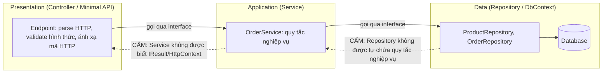

# Kiến trúc phân lớp: Controller — Service — Repository

!!! info "bạn đang ở đây · p6 → node `p6-layered`"
    cần trước: bạn đã hoàn thành capstone trung gian TaskFlow — biết viết Minimal API endpoint, gọi `DbContext` qua EF Core, bảo vệ endpoint bằng JWT (chương p5-capstone). Chương này không dạy lại các kỹ năng đó, mà dạy cách **tổ chức lại** chỗ đặt chúng khi một file bắt đầu phình to.
    mở khoá: năng lực tách một ứng dụng thành các lớp có ranh giới rõ ràng (Presentation, Application, Data) tuân theo **một luật phụ thuộc duy nhất** — kỹ năng quyết định một dự án có thể test, đổi database, hay đọc hiểu được sau 6 tháng hay không.

> **Mục tiêu (đo được):** sau chương này bạn **áp dụng** được kiến trúc 3 lớp Presentation — Application — Data để tách một endpoint đang gộp validate + query + business logic thành 3 thành phần riêng, **giải thích** được luật phụ thuộc một chiều và chỉ ra hậu quả cụ thể khi vi phạm nó, **phân biệt** được khi nào wrap `DbContext` bằng Repository riêng là cần thiết và khi nào là dư thừa, và **nhận diện** được dấu hiệu một file/class đã tới lúc cần phân lớp.

---

## 0. Đoán nhanh trước khi học

Đoạn code dưới đây là toàn bộ một endpoint, nằm thẳng trong `Program.cs`, không gọi tới bất kỳ class nào khác:

```csharp title="Program.cs (rút gọn, chỉ để suy luận)"
// test:skip đoạn trích rút gọn chỉ để suy luận, không phải chương trình đầy đủ
app.MapPost("/orders", async (CreateOrderDto dto, AppDbContext db) =>
{
    if (dto.Quantity <= 0)
        return Results.BadRequest("Dữ liệu không hợp lệ");

    var product = await db.Products.FindAsync(dto.ProductId);
    if (product is null) return Results.NotFound("Sản phẩm không tồn tại");
    if (product.Stock < dto.Quantity) return Results.BadRequest("Không đủ hàng trong kho");

    var order = new Order { ProductId = dto.ProductId, Quantity = dto.Quantity, Total = product.Price * dto.Quantity };
    product.Stock -= dto.Quantity;
    db.Orders.Add(order);
    await db.SaveChangesAsync();

    return Results.Created($"/orders/{order.Id}", order);
});
```

Giả sử team muốn viết một unit test kiểm tra đúng quy tắc "không cho tạo đơn nếu kho không đủ hàng" — **không** khởi động web server, **không** cần PostgreSQL thật. Có viết được test đó cho đoạn code trên không, và vì sao?

??? note "Đáp án"
    Không viết được (theo nghĩa unit test cô lập, nhanh). Quy tắc nghiệp vụ ("kho không đủ thì chặn") đang **dính chặt** vào một lambda nhận `AppDbContext` — để test được, bạn buộc phải khởi động toàn bộ pipeline HTTP (`WebApplicationFactory`) hoặc có một database thật để `FindAsync`/`SaveChangesAsync` chạy. Đây chính là vấn đề chương này giải quyết: tách quy tắc nghiệp vụ ra khỏi endpoint để nó có thể được gọi và test độc lập, không phụ thuộc HTTP hay database thật.

---

## 1. Vì sao không nên viết toàn bộ logic trong một file

**Định nghĩa (một câu):** Một endpoint (hoặc một file `Program.cs`) **gộp lớp** (mixed concerns) nghĩa là nó tự làm luôn cả ba việc khác nhau về bản chất trong cùng một khối code — đọc/parse HTTP, kiểm tra quy tắc nghiệp vụ, và truy vấn database — khiến không có ranh giới nào để thay đổi, kiểm thử, hay tái sử dụng riêng từng phần.

Nhìn lại đúng đoạn code ở mục 0 — 13 dòng nhưng đang làm **ba việc hoàn toàn khác nhau**:

```csharp title="Program.cs (đánh số lại 3 việc bị gộp)"
// test:skip minh hoa 3 concern bi gom trong 1 khoi, khong phai chuong trinh day du
app.MapPost("/orders", async (CreateOrderDto dto, AppDbContext db) =>
{
    // (1) VALIDATE — kiểm tra hình thức dữ liệu đầu vào
    if (dto.Quantity <= 0)
        return Results.BadRequest("Dữ liệu không hợp lệ");

    // (2) QUERY — chạm database
    var product = await db.Products.FindAsync(dto.ProductId);
    if (product is null) return Results.NotFound("Sản phẩm không tồn tại");

    // (3) BUSINESS LOGIC — quy tắc nghiệp vụ: kho phải đủ, tính tổng tiền, trừ kho
    if (product.Stock < dto.Quantity) return Results.BadRequest("Không đủ hàng trong kho");
    var order = new Order { ProductId = dto.ProductId, Quantity = dto.Quantity, Total = product.Price * dto.Quantity };
    product.Stock -= dto.Quantity;

    // (2) QUERY — chạm database lần nữa
    db.Orders.Add(order);
    await db.SaveChangesAsync();

    return Results.Created($"/orders/{order.Id}", order);
});
```

**Ba hậu quả cụ thể khi để nguyên như vậy, khi dự án lớn lên:**

- **Khó test:** như câu đố ở mục 0 — muốn test riêng quy tắc "kho không đủ thì chặn", bạn buộc phải kéo theo cả HTTP pipeline và database thật, vì quy tắc đó không tồn tại như một đơn vị code độc lập, gọi được riêng.
- **Khó đổi database:** giả sử công ty quyết định đổi PostgreSQL sang một dịch vụ khác (hoặc thêm cache Redis trước khi query), bạn phải tìm và sửa **từng endpoint** có gọi `db.Products.FindAsync(...)` rải rác khắp `Program.cs` — không có một chỗ duy nhất để sửa.
- **Khó đọc:** một reviewer mới join team mở endpoint này lên, phải đọc lẫn cả cú pháp Minimal API, quy tắc nghiệp vụ, và câu lệnh EF Core cùng lúc — không thể chỉ hỏi "endpoint này làm gì" mà nhận câu trả lời ngắn, phải đọc hết 15-80 dòng để hiểu toàn bộ luồng.

Ở quy mô một endpoint 13 dòng, vấn đề còn nhẹ. Nhưng hình dung một endpoint thật có validate phức tạp hơn, vài quy tắc nghiệp vụ (giảm giá, giới hạn số lượng theo hạng khách hàng, gửi email xác nhận...), và vài lượt query — con số thực tế thường leo tới **60–80 dòng cho một endpoint duy nhất**, tất cả ba việc trên trộn lẫn không ranh giới. Thử hình dung phân bổ thô của 80 dòng đó: khoảng 15 dòng validate hình thức (kiểm tra null, độ dài, định dạng email...), khoảng 35 dòng quy tắc nghiệp vụ (tính giảm giá theo hạng khách hàng, kiểm tra giới hạn số lượng, quyết định có gửi email hay không), và khoảng 30 dòng câu lệnh EF Core (2-3 lượt query, cập nhật, `SaveChangesAsync`) — ba phần này không có ranh giới nào tách biệt trong cùng một lambda, một người đọc muốn tìm đúng 35 dòng nghiệp vụ vẫn phải lướt qua toàn bộ 80 dòng. Đây chính là lúc kiến trúc phân lớp trở nên cần thiết, không phải là "làm cho đẹp" — mà để **có chỗ đặt riêng** cho từng loại thay đổi.

**Nếu dùng sai — hậu quả cụ thể:** một dự án giữ style "mọi thứ trong Program.cs" tới khi có 40 endpoint sẽ có một file dài hàng nghìn dòng — git diff của một pull request nhỏ (sửa một quy tắc nghiệp vụ) hiện ra giữa một biển code không liên quan, review chậm và dễ bỏ sót lỗi vì reviewer không thể tập trung vào đúng phần thay đổi.

Ba dấu hiệu cụ thể cho biết một file/class đã tới lúc cần phân lớp, không cần đợi tới 80 dòng mới nhận ra:

1. Bạn viết một unit test cho một quy tắc nghiệp vụ, nhưng phải khởi động cả `WebApplicationFactory` hoặc kết nối database thật chỉ để test một điều kiện `if` đơn giản.
2. Cùng một đoạn kiểm tra/tính toán xuất hiện y hệt (hoặc gần y hệt, chỉ đổi vài biến) ở hai endpoint khác nhau — dấu hiệu rõ nhất của việc thiếu một Service chung để cả hai gọi tới.
3. Muốn trả lời câu hỏi "endpoint này làm gì về nghiệp vụ" bạn phải đọc toàn bộ thân hàm, không có một tên phương thức nào tóm tắt lại ý nghĩa nghiệp vụ đó (ví dụ không có gì giống `CreateOrderAsync`, chỉ có một khối `if`/query/`if` nối tiếp).

---

## 2. Lớp Presentation (Controller/Minimal API endpoint) — chỉ làm gì

**Định nghĩa (một câu):** Lớp Presentation là lớp **ngoài cùng**, tiếp xúc trực tiếp với HTTP — công việc DUY NHẤT của nó là nhận request, parse/validate hình thức dữ liệu đầu vào, gọi đúng một phương thức ở lớp Application, rồi ánh xạ kết quả trả về thành đúng mã HTTP (`200`, `201`, `400`, `404`...) — nó **không** biết gì về quy tắc nghiệp vụ, và **không** biết gì về EF Core/database.

Ví dụ tối thiểu, độc lập, minh hoạ đúng một endpoint Minimal API chỉ làm việc của Presentation — nhận input, validate hình thức, gọi một service qua DI, trả HTTP đúng mã:

```csharp title="Program.cs"
// test:compile Presentation toi thieu: endpoint chi lam HTTP, khong biet nghiep vu/database
var builder = WebApplication.CreateBuilder(args);
builder.Services.AddSingleton<IGreetingService, GreetingService>();

var app = builder.Build();

// Presentation: parse route param, validate hinh thuc, goi Application, tra HTTP.
app.MapGet("/greet/{name}", (string name, IGreetingService service) =>
{
    // Validate HÌNH THỨC (không phải quy tắc nghiệp vụ) — chỉ kiểm tra input có hợp lệ để gọi tiếp không.
    if (string.IsNullOrWhiteSpace(name))
        return Results.BadRequest("Tên không được để trống");

    var message = service.BuildGreeting(name); // gọi Application, không tự tính toán ở đây
    return Results.Ok(message);
});

app.Run();

public interface IGreetingService
{
    string BuildGreeting(string name);
}

public sealed class GreetingService : IGreetingService
{
    public string BuildGreeting(string name) => $"Xin chào, {name}!";
}
```

Điểm mấu chốt: endpoint này **không** biết `BuildGreeting` tính toán ra sao — nó chỉ biết gọi đúng interface và nhận về một chuỗi. Nếu ngày mai `BuildGreeting` đổi logic (thêm lời chào theo giờ trong ngày), endpoint này **không cần sửa một dòng nào**.

**Nếu dùng sai — hậu quả cụ thể:** nếu bạn để endpoint tự viết quy tắc nghiệp vụ (ví dụ tự tính giảm giá ngay trong lambda), khi có thêm một cách gọi khác tới cùng quy tắc đó (ví dụ một background job cũng cần tính giảm giá định kỳ), bạn phải **copy-paste** logic đó sang chỗ mới — vì nó chưa từng tồn tại như một đơn vị gọi được độc lập, chỉ "kẹt" trong đúng một endpoint.

Một hệ quả tích cực khác của việc endpoint chỉ gọi Application qua interface: **nhiều endpoint khác nhau có thể gọi cùng một Service**, mà không đâu phải viết lại quy tắc nghiệp vụ. Ví dụ, giả sử hệ thống cần cả một endpoint HTTP `POST /greet/{name}` và một lệnh CLI (dòng lệnh) đều cần "xây lời chào" theo đúng cùng một quy tắc — cả hai chỉ cần gọi `IGreetingService.BuildGreeting(name)`, không ai cần biết cách cài đặt bên trong nó ra sao:

```csharp title="Program.cs (minh hoạ 2 lối gọi khác nhau tới CÙNG một Service)"
// test:skip minh hoa 2 endpoint/loi vao khac nhau cung goi 1 Service, khong phai chuong trinh day du
app.MapGet("/greet/{name}", (string name, IGreetingService svc) => svc.BuildGreeting(name));
app.MapGet("/greet-upper/{name}", (string name, IGreetingService svc) => svc.BuildGreeting(name).ToUpper());
```

Cả hai endpoint dùng lại đúng một `IGreetingService`, không endpoint nào tự viết lại logic xây câu chào — đây chính là lợi ích cụ thể của việc tách Application ra khỏi Presentation, không phải một lợi ích lý thuyết trừu tượng.

---

## 3. Lớp Application/Service chứa business logic

**Định nghĩa (một câu):** Lớp Application (thường đặt tên `...Service`) chứa **quy tắc nghiệp vụ thật** của hệ thống — những "luật" mà nếu sai, hậu quả là dữ liệu sai hoặc tiền sai (ví dụ "không cho đặt hàng nếu kho không đủ") — nó gọi xuống lớp Data để lấy/lưu dữ liệu, nhưng **không** biết gì về HTTP (không có `Results.Ok`, không có `[FromBody]`).

Bây giờ tách lại chính ví dụ xấu ở mục 1 — kéo phần "(3) BUSINESS LOGIC" ra một `OrderService` riêng:

```csharp title="OrderService.cs"
// test:compile Application/Service: business logic tach khoi endpoint, khong biet HTTP
// Product/Order/IProductRepository/IOrderRepository: định nghĩa đầy đủ ở mục 4 (Data/Repository) — rút gọn lại đây chỉ để khối này tự biên dịch độc lập.
public sealed class Product
{
    public int Id { get; set; }
    public decimal Price { get; set; }
    public int Stock { get; set; }
}

public sealed class Order
{
    public int Id { get; set; }
    public int ProductId { get; set; }
    public int Quantity { get; set; }
    public decimal Total { get; set; }
}

public interface IProductRepository
{
    Task<Product?> FindByIdAsync(int id);
}

public interface IOrderRepository
{
    Task AddAsync(Order order);
}

public interface IOrderService
{
    Task<Order> CreateOrderAsync(int productId, int quantity);
}

public sealed class OrderService(IProductRepository products, IOrderRepository orders) : IOrderService
{
    // Chữ ký phương thức không có gì liên quan HTTP — nhận tham số thuần, trả Order hoặc ném exception.
    public async Task<Order> CreateOrderAsync(int productId, int quantity)
    {
        var product = await products.FindByIdAsync(productId)
            ?? throw new KeyNotFoundException("Sản phẩm không tồn tại");

        // ĐÂY là quy tắc nghiệp vụ thật — lý do OrderService tồn tại.
        if (product.Stock < quantity)
            throw new InvalidOperationException("Không đủ hàng trong kho");

        var order = new Order
        {
            ProductId = productId,
            Quantity = quantity,
            Total = product.Price * quantity
        };

        product.Stock -= quantity;
        await orders.AddAsync(order);
        return order;
    }
}
```

So với bản gốc ở mục 1, quy tắc "kho không đủ thì chặn" giờ nằm **đúng một chỗ**, gọi được độc lập — trả lời trực tiếp câu đố ở mục 0:

```csharp title="OrderServiceTests.cs"
// test:skip vi du unit test minh hoa, can package ngoai xUnit + Moq/NSubstitute khong co san trong dotnet new web
[Fact]
public async Task CreateOrderAsync_KhoKhongDu_NemInvalidOperationException()
{
    // Arrange: fake repository trả sản phẩm còn 2 trong kho — không cần database thật.
    var productRepo = new FakeProductRepository(stock: 2);
    var orderRepo = new FakeOrderRepository();
    var service = new OrderService(productRepo, orderRepo);

    // Act + Assert: gọi trực tiếp phương thức, không HTTP, không SQL.
    await Assert.ThrowsAsync<InvalidOperationException>(
        () => service.CreateOrderAsync(productId: 1, quantity: 5));
}
```

Test này chạy trong vài milli-giây, không mở kết nối mạng hay database — điều **không thể** làm được với bản gốc ở mục 0, vì quy tắc nghiệp vụ ở đó dính chặt vào `AppDbContext` thật bên trong một lambda endpoint.

**Nếu dùng sai — hậu quả cụ thể:** nếu bạn để `OrderService` gọi thẳng `HttpContext` hoặc trả về `IResult`/`Results.BadRequest(...)`, bạn đã làm rò lớp Presentation vào Application — service này giờ không gọi được từ nơi khác không có HTTP (ví dụ một background job xử lý đơn hàng định kỳ), và không test được mà không giả lập HTTP context.

---

## 4. Lớp Data/Repository truy cập dữ liệu

**Định nghĩa (một câu):** Lớp Data là lớp **trong cùng**, công việc duy nhất của nó là đọc/ghi dữ liệu bền (database, file, API ngoài...) — nó không biết gì về HTTP, và không tự chứa quy tắc nghiệp vụ (không tự quyết "kho có đủ không", chỉ trả dữ liệu thô hoặc lưu dữ liệu được đưa vào).

Tiếp tục ví dụ trên — `IProductRepository`/`IOrderRepository` mà `OrderService` gọi ở mục 3, cài đặt bằng EF Core:

```csharp title="ProductRepository.cs"
// test:compile Data/Repository: chi doc/ghi du lieu, khong tu quyet dinh nghiep vu
// Product/Order/AppDbContext: định nghĩa đầy đủ ở mục 4 (ghép 3 lớp) — rút gọn lại đây chỉ để khối này tự biên dịch độc lập.
using Microsoft.EntityFrameworkCore;

public sealed class Product
{
    public int Id { get; set; }
    public decimal Price { get; set; }
    public int Stock { get; set; }
}

public sealed class Order
{
    public int Id { get; set; }
    public int ProductId { get; set; }
    public int Quantity { get; set; }
    public decimal Total { get; set; }
}

public sealed class AppDbContext(DbContextOptions<AppDbContext> options) : DbContext(options)
{
    public DbSet<Product> Products => Set<Product>();
    public DbSet<Order> Orders => Set<Order>();
}

public interface IProductRepository
{
    Task<Product?> FindByIdAsync(int id);
}

public sealed class ProductRepository(AppDbContext db) : IProductRepository
{
    // Chỉ truy vấn — KHÔNG tự kiểm tra "đủ hàng hay không" ở đây, đó là việc của Service.
    public Task<Product?> FindByIdAsync(int id) => db.Products.FindAsync(id).AsTask();
}

public sealed class OrderRepository(AppDbContext db) : IOrderRepository
{
    public async Task AddAsync(Order order)
    {
        db.Orders.Add(order);
        await db.SaveChangesAsync(); // chỉ lưu — không tự tính Total, đó việc của Service.
    }
}

public interface IOrderRepository
{
    Task AddAsync(Order order);
}
```

Ghép cả ba lớp lại thành một app hoàn chỉnh, đăng ký DI đúng thứ tự — đây là bản đã tách của đúng endpoint xấu ở mục 0:

```csharp title="Program.cs"
// test:compile ghep 3 lop hoan chinh: Presentation goi Application goi Data
using Microsoft.EntityFrameworkCore;
var builder = WebApplication.CreateBuilder(args);

builder.Services.AddDbContext<AppDbContext>(o => o.UseInMemoryDatabase("orders-demo"));
builder.Services.AddScoped<IProductRepository, ProductRepository>();
builder.Services.AddScoped<IOrderRepository, OrderRepository>();
builder.Services.AddScoped<IOrderService, OrderService>();

var app = builder.Build();

// Presentation: CHỈ parse input, gọi Application, ánh xạ kết quả -> HTTP.
app.MapPost("/orders", async (CreateOrderDto dto, IOrderService service) =>
{
    if (dto.Quantity <= 0)
        return Results.BadRequest("Số lượng phải lớn hơn 0");

    try
    {
        var order = await service.CreateOrderAsync(dto.ProductId, dto.Quantity);
        return Results.Created($"/orders/{order.Id}", order);
    }
    catch (KeyNotFoundException ex)
    {
        return Results.NotFound(ex.Message);
    }
    catch (InvalidOperationException ex)
    {
        return Results.BadRequest(ex.Message);
    }
});

app.Run();

public sealed record CreateOrderDto(int ProductId, int Quantity);

public sealed class Product
{
    public int Id { get; set; }
    public decimal Price { get; set; }
    public int Stock { get; set; }
}

public sealed class Order
{
    public int Id { get; set; }
    public int ProductId { get; set; }
    public int Quantity { get; set; }
    public decimal Total { get; set; }
}

public sealed class AppDbContext(DbContextOptions<AppDbContext> options) : DbContext(options)
{
    public DbSet<Product> Products => Set<Product>();
    public DbSet<Order> Orders => Set<Order>();
}

// Application: business logic (giống mục 3, nhắc lại ở đây để cả file compile độc lập).
public interface IOrderService
{
    Task<Order> CreateOrderAsync(int productId, int quantity);
}

public sealed class OrderService(IProductRepository products, IOrderRepository orders) : IOrderService
{
    public async Task<Order> CreateOrderAsync(int productId, int quantity)
    {
        var product = await products.FindByIdAsync(productId)
            ?? throw new KeyNotFoundException("Sản phẩm không tồn tại");

        if (product.Stock < quantity)
            throw new InvalidOperationException("Không đủ hàng trong kho");

        var order = new Order
        {
            ProductId = productId,
            Quantity = quantity,
            Total = product.Price * quantity
        };

        product.Stock -= quantity;
        await orders.AddAsync(order);
        return order;
    }
}

// Data: repository (giống mục 4, nhắc lại ở đây để cả file compile độc lập).
public interface IProductRepository
{
    Task<Product?> FindByIdAsync(int id);
}

public sealed class ProductRepository(AppDbContext db) : IProductRepository
{
    public Task<Product?> FindByIdAsync(int id) => db.Products.FindAsync(id).AsTask();
}

public interface IOrderRepository
{
    Task AddAsync(Order order);
}

public sealed class OrderRepository(AppDbContext db) : IOrderRepository
{
    public async Task AddAsync(Order order)
    {
        db.Orders.Add(order);
        await db.SaveChangesAsync();
    }
}
```

So với bản gốc 13 dòng gộp cả 3 việc, endpoint giờ chỉ còn đúng việc của Presentation: validate hình thức, gọi Application, ánh xạ exception thành mã HTTP. Business logic nằm trong `OrderService`, test được độc lập như mục 3 đã chứng minh. Truy cập dữ liệu nằm trong `ProductRepository`/`OrderRepository`, đổi được sang database khác mà không sửa `OrderService` hay endpoint.

**Nếu dùng sai — hậu quả cụ thể:** nếu `ProductRepository` tự thêm điều kiện nghiệp vụ vào câu query (ví dụ tự lọc `.Where(p => p.Stock > 0)` để "tiện"), `OrderService` không còn kiểm soát được toàn bộ quy tắc nghiệp vụ ở một chỗ — một sản phẩm hết hàng có thể "biến mất" khỏi kết quả tìm kiếm ở một chỗ gọi khác mà không ai chủ đích muốn vậy, vì quy tắc đó bị giấu trong tầng data thay vì tầng service nơi mọi người tìm tới khi đọc logic nghiệp vụ.

Một chi tiết dễ bỏ sót khi tách `ProductRepository`/`OrderRepository` thành hai class riêng như ví dụ trên: cả hai vẫn dùng **chung một `AppDbContext` instance** (được inject với lifetime `Scoped` — tồn tại đúng trong phạm vi một request). Nhờ vậy, `product.Stock -= quantity` (sửa qua `ProductRepository`) và `db.Orders.Add(order)` (thêm qua `OrderRepository`) vẫn nằm trong đúng **một transaction ngầm** khi `SaveChangesAsync()` được gọi — EF Core tự theo dõi (tracking) mọi thay đổi trên cùng `DbContext`, dù chúng được thực hiện từ hai Repository khác nhau. Nếu bạn vô tình tạo hai `AppDbContext` riêng biệt cho hai Repository (ví dụ đăng ký sai lifetime), hai thay đổi trên sẽ không còn nằm cùng một transaction — có thể lưu được `Order` mới nhưng lại không trừ đúng `Stock`, hoặc ngược lại, nếu có lỗi giữa hai lượt lưu.

---

## 5. Luật phụ thuộc: chỉ trỏ một chiều

**Định nghĩa (một câu):** Luật phụ thuộc (dependency rule) nghĩa là lớp ngoài **được phép** gọi/biết lớp trong (Presentation → Application → Data), nhưng lớp trong **tuyệt đối không được** gọi ngược lại hoặc biết gì về lớp ngoài (Data không được biết `HttpContext`, Application không được biết `IResult`).

Sơ đồ kiến trúc 3 lớp hoàn chỉnh, cùng hướng phụ thuộc DUY NHẤT được phép:



**Vi phạm cụ thể và hệ quả — ví dụ 1 (Data biết Presentation):**

```csharp title="ProductRepository.cs (VI PHẠM luật phụ thuộc)"
// test:skip minh hoa vi pham, khong phai code nen dung
public sealed class ProductRepository(AppDbContext db) : IProductRepository
{
    public async Task<IResult> FindByIdAsync(int id) // SAI: Repository trả về IResult (khái niệm HTTP)
    {
        var product = await db.Products.FindAsync(id);
        return product is null ? Results.NotFound() : Results.Ok(product); // SAI: Data tự quyết mã HTTP
    }
}
```

Hệ quả cụ thể: `OrderService` giờ buộc phải xử lý một `IResult` thay vì một `Product?` thuần — nếu ngày mai bạn muốn gọi `OrderService` từ một background job (không có HTTP context nào cả, ví dụ xử lý đơn hàng tồn đọng mỗi đêm), `OrderService` vẫn phải tự "unwrap" `IResult` ra dữ liệu thật, một việc vô nghĩa vì job đó không cần và không có khái niệm HTTP status code. Lớp Data đã "rò" một khái niệm thuộc lớp ngoài (`IResult` là khái niệm ASP.NET Core/HTTP) vào một nơi phải hoạt động độc lập với HTTP.

**Vi phạm cụ thể và hệ quả — ví dụ 2 (Application gọi ngược Presentation):**

```csharp title="OrderService.cs (VI PHẠM luật phụ thuộc)"
// test:skip minh hoa vi pham, khong phai code nen dung
public sealed class OrderService(IProductRepository products, IHttpContextAccessor httpContext) : IOrderService
{
    public async Task<Order> CreateOrderAsync(int productId, int quantity)
    {
        // SAI: Service tự đọc thẳng từ HttpContext thay vì nhận tham số đã parse sẵn từ Presentation.
        var userId = httpContext.HttpContext!.User.FindFirst("sub")!.Value;
        // ...
    }
}
```

Hệ quả cụ thể: bạn không còn viết được unit test cho `OrderService` như mục 3 đã làm — mọi test giờ phải giả lập (`mock`) cả `IHttpContextAccessor` và toàn bộ `HttpContext.User`, chỉ để test một quy tắc nghiệp vụ đơn giản không hề "thuộc về" HTTP. `userId` là dữ liệu **Presentation nên tự trích xuất** từ token và **truyền vào** như một tham số thuần (`int userId`), không phải để Service tự đi lấy.

**Nếu dùng sai — hậu quả cụ thể (tổng quát):** một khi luật phụ thuộc bị vi phạm ở vài chỗ, ranh giới giữa 3 lớp dần biến mất — sau vài tháng, đổi một thứ nhỏ ở lớp Data (ví dụ đổi tên một property) lại kéo theo lỗi build ở lớp Presentation ở một endpoint hoàn toàn không liên quan, vì các lớp đã "dính" chặt vào nhau theo nhiều hướng không kiểm soát được.

---

## 6. Khi nào KHÔNG nên wrap Repository riêng — cạnh Application gọi trực tiếp DbContext

**Định nghĩa (một câu):** Với EF Core, `DbContext`/`DbSet<T>` **đã là** một dạng Unit-of-Work + Repository-like abstraction có sẵn (bạn đã có thể đổi database provider — PostgreSQL, SQL Server, SQLite — chỉ bằng đổi một dòng `UseNpgsql`/`UseSqlServer` mà không sửa code gọi `DbSet<T>`) — viết thêm một lớp `Repository` riêng bọc quanh `DbSet<T>` chỉ thật sự có giá trị khi bạn cần **gom logic query phức tạp dùng lại ở nhiều nơi**, không phải mặc định "phải có Repository vì đó là best practice".

Ví dụ khi Repository là **thừa** — chỉ là một lớp bọc mỏng, không thêm giá trị:

```csharp title="ProductRepository.cs (THỪA — chỉ chuyển tiếp 1-1, không gom logic gì)"
// test:compile vi du repository THUA - chi forward 1-1 sang DbSet, khong gom logic
// Product/AppDbContext: định nghĩa đầy đủ ở mục 4 — rút gọn lại đây chỉ để khối này tự biên dịch độc lập.
using Microsoft.EntityFrameworkCore;

public sealed class Product
{
    public int Id { get; set; }
    public decimal Price { get; set; }
    public int Stock { get; set; }
}

public sealed class AppDbContext(DbContextOptions<AppDbContext> options) : DbContext(options)
{
    public DbSet<Product> Products => Set<Product>();
}

public interface IProductRepository
{
    Task<Product?> FindByIdAsync(int id);
}

public sealed class ProductRepository(AppDbContext db) : IProductRepository
{
    // Không làm gì khác ngoài gọi thẳng DbSet<T> — thêm một lớp gián tiếp không lợi ích gì.
    public Task<Product?> FindByIdAsync(int id) => db.Products.FindAsync(id).AsTask();
}
```

`OrderService` gọi trực tiếp `AppDbContext` cho trường hợp này hoàn toàn tương đương về khả năng test (bạn vẫn test được `OrderService` bằng `AppDbContext` chạy trên **InMemory provider** hoặc SQLite in-memory — không cần PostgreSQL thật), nhưng ít code hơn, ít gián tiếp hơn:

```csharp title="OrderService.cs (goi truc tiep DbContext, khong qua Repository rieng)"
// test:compile Service goi truc tiep DbContext - hop ly khi khong co logic query phuc tap can dung lai
// Product/Order/AppDbContext/IOrderService: định nghĩa đầy đủ ở mục 3-4 — rút gọn lại đây chỉ để khối này tự biên dịch độc lập.
using Microsoft.EntityFrameworkCore;

public sealed class Product
{
    public int Id { get; set; }
    public decimal Price { get; set; }
    public int Stock { get; set; }
}

public sealed class Order
{
    public int Id { get; set; }
    public int ProductId { get; set; }
    public int Quantity { get; set; }
    public decimal Total { get; set; }
}

public sealed class AppDbContext(DbContextOptions<AppDbContext> options) : DbContext(options)
{
    public DbSet<Product> Products => Set<Product>();
    public DbSet<Order> Orders => Set<Order>();
}

public interface IOrderService
{
    Task<Order> CreateOrderAsync(int productId, int quantity);
}

public sealed class OrderService(AppDbContext db) : IOrderService
{
    public async Task<Order> CreateOrderAsync(int productId, int quantity)
    {
        var product = await db.Products.FindAsync(productId)
            ?? throw new KeyNotFoundException("Sản phẩm không tồn tại");

        if (product.Stock < quantity)
            throw new InvalidOperationException("Không đủ hàng trong kho");

        var order = new Order { ProductId = productId, Quantity = quantity, Total = product.Price * quantity };
        product.Stock -= quantity;

        db.Orders.Add(order);
        await db.SaveChangesAsync();
        return order;
    }
}
```

**Khi nào Repository riêng THẬT SỰ đáng viết:** khi cùng một câu query phức tạp (nhiều `.Include()`, `.Where()` lồng nhau, phân trang, lọc theo nhiều tiêu chí) được **gọi lặp lại ở nhiều Service khác nhau** — ví dụ `GetActiveProductsWithLowStockAsync()` cần dùng ở cả `OrderService` và một `InventoryReportService` khác. Gom nó vào một Repository giúp sửa một chỗ, áp dụng mọi nơi, thay vì copy-paste cùng một chuỗi LINQ dài ở nhiều Service.

**Cũng đừng nhầm với việc "cần Repository để test được":** lý do đúng để test được không phải là "có Repository" — mà là **inject qua interface** (dù là `IProductRepository` hay thẳng `AppDbContext` qua constructor) thay vì tự `new AppDbContext(...)` bên trong Service. `AppDbContext` chạy trên **InMemory provider** của EF Core hoàn toàn đủ để unit test `OrderService` ở ví dụ trên, không cần thêm một lớp Repository chỉ để "cho dễ test".

**Nếu dùng sai (over-engineering) — hậu quả cụ thể:** một dự án tạo `IXxxRepository` cho **mọi** entity ngay từ đầu, mỗi Repository chỉ có 2-3 phương thức forward thẳng 1-1 tới `DbSet<T>` (`GetById`, `GetAll`, `Add`) — kết quả là gấp đôi số file (interface + class) cho mỗi entity, mỗi lần cần một query mới lại phải sửa 2 chỗ (thêm phương thức vào interface, rồi cài đặt ở class), mà không hề tăng khả năng test hay khả năng đổi database so với gọi `DbContext` trực tiếp — vì EF Core đã cho khả năng đó miễn phí. Đây là chi phí thật (nhiều file, nhiều gián tiếp) đổi lấy lợi ích ảo.

---

## 7. So sánh các mức tổ chức code, và tổ chức file/thư mục thực tế

Sau khi đã có đủ 6 khái niệm ở trên (Presentation, Application, Data, luật phụ thuộc, khi nào Repository là thừa), giờ mới đến lúc so sánh — đặt cạnh nhau **4 mức tổ chức code** khác nhau cho cùng một bài toán (endpoint tạo đơn hàng), theo đúng thứ tự độ phức tạp tăng dần:

| Mức tổ chức | Số lớp/file cho 1 nghiệp vụ | Test được nghiệp vụ không cần HTTP/DB thật? | Đổi database có sửa Service không? | Phù hợp khi nào |
|---|---|---|---|---|
| **Gộp hết trong `Program.cs`** (mục 1) | 1 lambda | Không | Có (sửa thẳng trong lambda) | Prototype, demo nhanh, script dùng một lần |
| **3-layer, Service gọi thẳng `DbContext`** (mục 6) | 2 (endpoint + Service) | Có (qua EF Core InMemory provider) | Không (chỉ đổi provider ở `Program.cs`) | Phần lớn ứng dụng thật, CRUD vừa phải, KHÔNG có query phức tạp dùng lại nhiều nơi |
| **3-layer đầy đủ, có Repository riêng** (mục 2-5) | 3 (endpoint + Service + Repository) | Có | Không | Có query phức tạp dùng lại ở nhiều Service, hoặc team có chuẩn bắt buộc mock toàn bộ data access khi test |
| **Clean/Onion Architecture** (mức 4, chưa học ở chương này) | 4+ (endpoint + Service + Domain + Infrastructure) | Có, và còn chặt hơn — entity tự kiểm tra dữ liệu của chính nó thay vì để Service kiểm tra hộ | Không | Domain phức tạp thật sự, nhiều quy tắc nghiệp vụ liên quan chặt giữa các entity |

Nhìn cột "Số lớp/file" tăng dần từ trái sang phải — đây chính là **chi phí** phải trả để đổi lấy khả năng test/thay đổi tốt hơn. Sai lầm thường gặp nhất không phải là chọn mức 1 (ai cũng biết mức 1 chỉ hợp prototype) — mà là **nhảy thẳng lên mức 3 hoặc 4 cho một bài toán chỉ cần mức 2**, trả chi phí cao hơn cần thiết mà không nhận lại lợi ích tương xứng. Đây đúng là nội dung mục 6 đã cảnh báo, nhắc lại ở đây để thấy rõ vị trí của nó trong toàn cảnh 4 mức. Mức 4 (Clean/Onion Architecture) mới chỉ điểm tên ở đây để thấy vị trí trên thang chi phí — phần DEEP DIVE ở cuối chương giải thích chi tiết nó là gì và khi nào đáng leo tới.

Về tổ chức thư mục thực tế cho một project ASP.NET Core theo 3-layer (mức 2 hoặc 3 ở bảng trên), cấu trúc phổ biến nhất **không** tách thành 3 project/assembly riêng (điều đó thuộc về Clean Architecture, dùng khi có nhiều lý do buộc phải cứng hoá ranh giới bằng biên dịch) — mà tách theo **thư mục trong cùng một project**:

```text title="Cấu trúc thư mục 3-layer trong 1 project (ASP.NET Core)"
MyApp/
├── Program.cs                     # Presentation: khai báo endpoint, đăng ký DI
├── Endpoints/
│   └── OrderEndpoints.cs          # Presentation: nhóm endpoint theo domain, tách khỏi Program.cs khi nhiều
├── Services/
│   ├── IOrderService.cs           # Application: interface (hợp đồng nghiệp vụ)
│   └── OrderService.cs            # Application: cài đặt quy tắc nghiệp vụ
├── Repositories/
│   ├── IOrderRepository.cs        # Data: interface (chỉ cần khi có query phức tạp dùng lại)
│   └── OrderRepository.cs         # Data: cài đặt truy cập EF Core
├── Data/
│   └── AppDbContext.cs            # Data: DbContext, cấu hình EF Core
└── Models/
    ├── Order.cs                   # Entity — dữ liệu, dùng chung cho Application + Data
    └── CreateOrderDto.cs          # DTO — hình dạng dữ liệu HTTP, chỉ Presentation biết
```

Điểm cần lưu ý về `Order` (entity) và `CreateOrderDto` (DTO) — hai khái niệm dễ nhầm: **entity** là hình dạng dữ liệu mà Application và Data cùng hiểu và dùng chung (tương ứng bảng trong database qua EF Core); **DTO** (Data Transfer Object) là hình dạng dữ liệu **chỉ riêng cho một request/response HTTP cụ thể** — Presentation nhận DTO từ client, chuyển đổi (map) thành lời gọi tới Application bằng tham số thuần hoặc entity, không truyền thẳng DTO xuống Application. Lý do: DTO có thể đổi hình dạng theo từng version API (`CreateOrderDtoV1`, `CreateOrderDtoV2`) mà không kéo theo phải đổi entity hay quy tắc nghiệp vụ.

**Nếu dùng sai — hậu quả cụ thể:** nếu `OrderService.CreateOrderAsync` nhận thẳng `CreateOrderDto` làm tham số (thay vì `int productId, int quantity` thuần như mục 3-4 đã làm), Application giờ phụ thuộc vào một khái niệm thuộc Presentation (DTO thường nằm cùng tầng với endpoint, đại diện hình dạng request HTTP) — nếu có thêm một cách gọi `CreateOrderAsync` khác không qua HTTP (ví dụ import đơn hàng từ file Excel bằng một console command), bạn buộc phải tạo một `CreateOrderDto` giả chỉ để gọi được Service, dù command đó chẳng liên quan gì tới HTTP.

---

## 8. Vì sao Service/Repository khai báo qua interface, không phải class cụ thể

**Định nghĩa (một câu):** Đăng ký và inject Service/Repository qua **interface** (`IOrderService` thay vì `OrderService` trực tiếp) nghĩa là lớp gọi (Presentation gọi Application, Application gọi Data) chỉ biết **hợp đồng** (chữ ký phương thức), không biết **cách cài đặt cụ thể** — nhờ vậy bạn thay được cài đặt thật bằng một cài đặt giả (fake/mock) khi test, mà không cần sửa code của lớp gọi.

Nhìn lại chính đoạn test đã viết ở mục 3 — điều làm nó chạy được mà **không cần** PostgreSQL thật chính là hai dòng `FakeProductRepository`/`FakeOrderRepository`. Đây là cách những fake đó hoạt động, đặt cạnh cài đặt EF Core thật để thấy rõ cả hai đều thoả mãn cùng một interface:

```csharp title="FakeProductRepository.cs"
// test:compile minh hoa: 2 cai dat khac nhau cua CUNG MOT interface IProductRepository
// Product/AppDbContext: định nghĩa đầy đủ ở mục 4 — rút gọn lại đây chỉ để khối này tự biên dịch độc lập.
using Microsoft.EntityFrameworkCore;

public sealed class Product
{
    public int Id { get; set; }
    public decimal Price { get; set; }
    public int Stock { get; set; }
}

public sealed class AppDbContext(DbContextOptions<AppDbContext> options) : DbContext(options)
{
    public DbSet<Product> Products => Set<Product>();
}

public interface IProductRepository
{
    Task<Product?> FindByIdAsync(int id);
}

// Cài đặt THẬT — dùng ở Program.cs khi chạy app thật, chạm PostgreSQL/EF Core.
public sealed class ProductRepository(AppDbContext db) : IProductRepository
{
    public Task<Product?> FindByIdAsync(int id) => db.Products.FindAsync(id).AsTask();
}

// Cài đặt GIẢ — chỉ dùng trong test, không chạm database nào cả, trả dữ liệu định trước.
public sealed class FakeProductRepository(int stock) : IProductRepository
{
    public Task<Product?> FindByIdAsync(int id) =>
        Task.FromResult<Product?>(new Product { Id = id, Price = 100_000m, Stock = stock });
}
```

`OrderService` (mục 3) nhận `IProductRepository products` qua constructor — nó **không quan tâm** đang cầm cài đặt thật hay giả, chỉ gọi `products.FindByIdAsync(...)` đúng như hợp đồng interface quy định. Ở `Program.cs` khi chạy app thật, bạn đăng ký DI trỏ tới cài đặt thật:

```csharp title="Program.cs (đăng ký DI)"
// test:skip minh hoa dang ky DI, khong phai chuong trinh day du
builder.Services.AddScoped<IProductRepository, ProductRepository>(); // THẬT — dùng khi chạy app
```

Còn trong test, bạn tự `new FakeProductRepository(stock: 2)` — không qua DI container, không cần `Program.cs` biết gì về việc này cả. Đây chính là kỹ thuật gọi là **Dependency Injection cho phép Dependency Inversion** (mục "DEEP DIVE" ở cuối bài nói kỹ hơn về Dependency Inversion ở mức kiến trúc): lớp gọi (`OrderService`) phụ thuộc vào một **interface trừu tượng**, không phụ thuộc vào một cài đặt cụ thể — cài đặt cụ thể nào được "cắm vào" là quyết định của nơi khác (DI container ở runtime, hoặc bạn tự `new` trong test).

**Nếu dùng sai — hậu quả cụ thể:** nếu `OrderService` nhận thẳng `ProductRepository products` (class cụ thể, không qua interface) trong constructor, để test bạn buộc phải tạo được một `ProductRepository` thật — nhưng `ProductRepository` yêu cầu một `AppDbContext` thật trong constructor của nó, kéo theo bạn lại cần cấu hình một `DbContextOptions` (dù chỉ để chạy InMemory provider). Interface cắt đứt hoàn toàn "dây xích" phụ thuộc đó — `FakeProductRepository` không cần biết gì về `AppDbContext`.

**Khi nào không cần interface — tránh over-engineering:** nếu một class chỉ có **đúng một** cài đặt duy nhất, không bao giờ có lý do để thay bằng cài đặt khác (kể cả trong test — ví dụ một class tiện ích thuần tính toán, không có I/O, không cần fake), thêm interface cho nó (`ICalculator` cho một `Calculator` không chạm I/O gì cả) chỉ tạo thêm một file và một tầng gián tiếp không giải quyết vấn đề gì — bạn có thể test trực tiếp `Calculator` bằng cách `new Calculator()`, không cần interface. Interface chỉ đáng có khi thật sự tồn tại (hoặc rất có khả năng sẽ tồn tại) nhiều hơn một cài đặt.

---

## Cạm bẫy & thực chiến

- **Wrap Repository quanh `DbSet<T>` cho mọi entity mà không có logic query phức tạp dùng lại:** nhân đôi số file, thêm một tầng gián tiếp không giúp ích cho test lẫn khả năng đổi database (EF Core đã cho cả hai miễn phí qua `DbContext`) — xem lại mục 6.
- **Để Repository tự chứa quy tắc nghiệp vụ** (ví dụ tự lọc `.Where(p => p.Stock > 0)` "cho tiện"): Service mất kiểm soát quy tắc nghiệp vụ ở một chỗ duy nhất, dữ liệu "biến mất" khỏi kết quả ở nơi gọi khác mà không ai chủ đích muốn vậy.
- **Service trả về hoặc nhận `IResult`/`HttpContext`:** rò khái niệm HTTP vào lớp Application — Service không gọi được từ nơi không có HTTP (background job, console command) mà không phải "unwrap" vô nghĩa.
- **Endpoint tự viết business logic phức tạp thay vì gọi Service:** logic đó không tồn tại như một đơn vị gọi được độc lập — khi cần dùng lại ở một nơi khác (job định kỳ, một endpoint khác), buộc phải copy-paste.
- **Áp dụng CQRS cho một CRUD đơn giản chỉ vì "kiến trúc chuẩn":** CQRS (tách hẳn model đọc và model ghi) chỉ đáng giá khi model đọc và model ghi thật sự khác biệt đáng kể (ví dụ báo cáo tổng hợp phức tạp đọc vs lệnh ghi đơn giản) — dùng nó cho một `CreateOrder`/`GetOrder` bình thường chỉ thêm độ phức tạp (thêm class Command, Query, Handler cho mỗi hành động) mà không giải quyết vấn đề thật nào.
- **Nhầm Singleton pattern (GoF) với Singleton lifetime (DI container):** `builder.Services.AddSingleton<T>()` chỉ khai báo "container tạo một instance dùng chung cho toàn ứng dụng" — khác hoàn toàn với Singleton pattern cổ điển (tự code `private static Instance` + constructor `private`) mà kiến trúc phân lớp trong chương này không đụng tới; đừng lẫn hai khái niệm khi nói về "singleton" trong ngữ cảnh DI.
- **Tạo interface cho mọi class "cho chắc", kể cả class chỉ có đúng một cài đặt và không chạm I/O:** thêm file, thêm một tầng gián tiếp phải đọc qua mỗi khi truy vết code, mà không mang lại khả năng test hay thay thế nào thật sự — interface chỉ đáng có khi tồn tại (hoặc rất có khả năng sẽ có) nhiều hơn một cài đặt.

---

## Bài tập

**Bài 1 (giàn giáo):** Đoạn endpoint dưới đây gộp cả validate, query, và business logic (kiểm tra tuổi tối thiểu 18 mới được đăng ký). Hãy tách thành 3 lớp: Presentation (endpoint), Application (`IRegistrationService`), Data (`IUserRepository`).

```csharp title="Program.cs"
// test:skip bai tap 1 - endpoint gop 3 concern, can tach
app.MapPost("/register", async (RegisterDto dto, AppDbContext db) =>
{
    if (string.IsNullOrWhiteSpace(dto.Email)) return Results.BadRequest("Thiếu email");

    var existing = await db.Users.FirstOrDefaultAsync(u => u.Email == dto.Email);
    if (existing is not null) return Results.BadRequest("Email đã tồn tại");

    if (dto.Age < 18) return Results.BadRequest("Phải đủ 18 tuổi");

    var user = new User { Email = dto.Email, Age = dto.Age };
    db.Users.Add(user);
    await db.SaveChangesAsync();
    return Results.Created($"/users/{user.Id}", user);
});
```

??? success "Lời giải + vì sao"
    ```csharp title="Program.cs + RegistrationService.cs"
    // test:compile bai tap 1 - da tach 3 lop
    using Microsoft.EntityFrameworkCore;
    var builder = WebApplication.CreateBuilder(args);
    builder.Services.AddDbContext<AppDbContext>(o => o.UseInMemoryDatabase("register-demo"));
    builder.Services.AddScoped<IUserRepository, UserRepository>();
    builder.Services.AddScoped<IRegistrationService, RegistrationService>();

    var app = builder.Build();

    // Presentation: chỉ validate hình thức + ánh xạ exception -> HTTP.
    app.MapPost("/register", async (RegisterDto dto, IRegistrationService service) =>
    {
        if (string.IsNullOrWhiteSpace(dto.Email))
            return Results.BadRequest("Thiếu email");

        try
        {
            var user = await service.RegisterAsync(dto.Email, dto.Age);
            return Results.Created($"/users/{user.Id}", user);
        }
        catch (InvalidOperationException ex)
        {
            return Results.BadRequest(ex.Message);
        }
    });

    app.Run();

    public sealed record RegisterDto(string Email, int Age);

    public sealed class User
    {
        public int Id { get; set; }
        public string Email { get; set; } = "";
        public int Age { get; set; }
    }

    public sealed class AppDbContext(DbContextOptions<AppDbContext> options) : DbContext(options)
    {
        public DbSet<User> Users => Set<User>();
    }

    public interface IUserRepository
    {
        Task<User?> FindByEmailAsync(string email);
        Task AddAsync(User user);
    }

    public sealed class UserRepository(AppDbContext db) : IUserRepository
    {
        public Task<User?> FindByEmailAsync(string email) =>
            db.Users.FirstOrDefaultAsync(u => u.Email == email);

        public async Task AddAsync(User user)
        {
            db.Users.Add(user);
            await db.SaveChangesAsync();
        }
    }

    public interface IRegistrationService
    {
        Task<User> RegisterAsync(string email, int age);
    }

    // Application: 2 quy tắc nghiệp vụ thật — email không trùng, tuổi >= 18.
    public sealed class RegistrationService(IUserRepository users) : IRegistrationService
    {
        public async Task<User> RegisterAsync(string email, int age)
        {
            var existing = await users.FindByEmailAsync(email);
            if (existing is not null)
                throw new InvalidOperationException("Email đã tồn tại");

            if (age < 18)
                throw new InvalidOperationException("Phải đủ 18 tuổi");

            var user = new User { Email = email, Age = age };
            await users.AddAsync(user);
            return user;
        }
    }
    ```

    **Vì sao:** hai quy tắc nghiệp vụ ("email không trùng", "đủ 18 tuổi") giờ nằm trong `RegistrationService`, gọi được và test được độc lập không cần HTTP. `UserRepository` chỉ đọc/ghi, không tự quyết định gì. Endpoint chỉ còn validate hình thức (`Email` không trống) và ánh xạ `InvalidOperationException` thành `400`.

**Bài 2 (thiết kế):** Team bạn có một entity `Product` chỉ cần 2 phương thức truy vấn cực đơn giản (`GetByIdAsync`, `GetAllAsync`), không có query phức tạp nào, không dùng lại ở nơi thứ hai. Một đồng nghiệp đề xuất tạo `IProductRepository` + `ProductRepository` "để chuẩn kiến trúc". Bạn đồng ý hay phản đối, và lý do dựa trên nguyên tắc nào ở chương này?

??? success "Lời giải + vì sao"
    **Phản đối** (hoặc ít nhất đặt câu hỏi trước khi làm theo). Dựa trên mục 6: `DbContext`/`DbSet<T>` của EF Core đã là một Repository-like abstraction có sẵn — viết thêm `IProductRepository` chỉ có giá trị thật khi cần **gom logic query phức tạp dùng lại ở nhiều Service**. Với đúng 2 phương thức forward thẳng 1-1 (`GetByIdAsync` gọi `db.Products.FindAsync`, `GetAllAsync` gọi `db.Products.ToListAsync()`), Repository này chỉ là một lớp bọc mỏng — thêm 2 file (interface + class), thêm một tầng gián tiếp phải maintain, mà không tăng khả năng test (đã test được qua EF Core InMemory provider) hay khả năng đổi database (đã đổi được qua đổi provider). Nếu về sau xuất hiện một query phức tạp thật (ví dụ lọc theo nhiều điều kiện, dùng lại ở báo cáo), lúc đó thêm Repository là hợp lý — không phải bây giờ.

---

## Tự kiểm tra

1. Kể tên 3 lớp trong kiến trúc Presentation — Application — Data, và công việc chính của mỗi lớp trong đúng một câu.

    ??? note "Đáp án"
        Presentation: nhận/parse HTTP, validate hình thức, ánh xạ kết quả thành mã HTTP. Application (Service): chứa quy tắc nghiệp vụ thật, không biết gì về HTTP. Data (Repository/DbContext): đọc/ghi dữ liệu bền, không tự quyết định quy tắc nghiệp vụ.

2. Luật phụ thuộc trong kiến trúc phân lớp quy định điều gì, theo đúng một chiều nào?

    ??? note "Đáp án"
        Lớp ngoài được gọi lớp trong: Presentation → Application → Data. Lớp trong tuyệt đối không được gọi ngược lại hoặc biết gì về lớp ngoài (ví dụ Data không được biết `HttpContext`, Application không được trả `IResult`).

3. Vì sao đoạn code gộp validate + query + business logic trong một endpoint lại khó viết unit test, dù về mặt chức năng nó vẫn chạy đúng?

    ??? note "Đáp án"
        Vì quy tắc nghiệp vụ không tồn tại như một đơn vị gọi được độc lập — nó dính chặt vào `DbContext`/HTTP pipeline bên trong lambda endpoint, nên test nó buộc phải kéo theo cả HTTP và database thật, thay vì gọi trực tiếp một phương thức thuần.

4. Với EF Core, vì sao wrap thêm một lớp Repository quanh `DbSet<T>` thường là dư thừa? Khi nào thì Repository riêng THẬT SỰ có giá trị?

    ??? note "Đáp án"
        Dư thừa vì `DbContext`/`DbSet<T>` đã là một Unit-of-Work + Repository-like abstraction có sẵn — đã cho khả năng test (qua InMemory provider) và đổi database (đổi provider) miễn phí. Repository riêng có giá trị khi cần gom logic query phức tạp, dùng lại ở nhiều Service khác nhau — tránh copy-paste cùng chuỗi LINQ dài ở nhiều nơi.

5. Cho ví dụ cụ thể một vi phạm luật phụ thuộc ở lớp Data, và hậu quả thực tế của nó.

    ??? note "Đáp án"
        Ví dụ: `ProductRepository` trả về `IResult` (`Results.Ok`/`Results.NotFound`) thay vì trả `Product?` thuần. Hậu quả: `OrderService` buộc phải xử lý `IResult` — nếu gọi `OrderService` từ nơi không có HTTP (background job), phải "unwrap" `IResult` một cách vô nghĩa vì nơi đó không có khái niệm mã HTTP.

6. CQRS đáng dùng khi nào, và vì sao dùng nó cho một CRUD đơn giản là over-engineering?

    ??? note "Đáp án"
        Đáng dùng khi model đọc và model ghi thật sự khác biệt đáng kể (ví dụ báo cáo phức tạp đọc vs lệnh ghi đơn giản). Với CRUD đơn giản, tách riêng Command/Query/Handler cho mỗi hành động chỉ thêm nhiều class và độ phức tạp mà không giải quyết vấn đề thật nào — một Service với vài phương thức đơn giản là đủ.

7. Singleton pattern (GoF) khác Singleton lifetime (DI container, `AddSingleton<T>()`) ở điểm nào?

    ??? note "Đáp án"
        Singleton pattern là một pattern cổ điển tự code (constructor `private`, thuộc tính tĩnh `Instance` tự quản việc chỉ tạo một instance trong toàn bộ tiến trình). Singleton lifetime chỉ là một cấu hình cho DI container biết "tạo một instance dùng chung cho toàn ứng dụng" — không có `private static Instance`, không tự quản gì, chỉ là một lựa chọn lifetime trong ba lựa chọn (Singleton/Scoped/Transient) của DI.

8. Nếu Service tự đọc `HttpContext.User` trực tiếp thay vì nhận `userId` qua tham số từ Presentation, hậu quả cụ thể là gì khi viết unit test cho Service đó?

    ??? note "Đáp án"
        Mọi unit test cho Service đó buộc phải giả lập (`mock`) cả `IHttpContextAccessor` và toàn bộ `HttpContext.User` chỉ để test một quy tắc nghiệp vụ không liên quan gì đến HTTP — tăng độ phức tạp test không cần thiết, và Service không gọi được từ nơi không có HTTP context (ví dụ console command, background job).

9. Vì sao `OrderService` nhận `IProductRepository products` (interface) qua constructor thay vì nhận thẳng `ProductRepository products` (class cụ thể) lại giúp test dễ hơn? Cho một ví dụ khi việc tạo interface là KHÔNG cần thiết.

    ??? note "Đáp án"
        Nhận qua interface nghĩa là `OrderService` chỉ biết hợp đồng (chữ ký phương thức), không biết cách cài đặt cụ thể — trong test, bạn thay bằng một `FakeProductRepository` tự viết, không cần `AppDbContext` thật hay bất kỳ cấu hình database nào. Nếu nhận thẳng class `ProductRepository`, test buộc phải tạo được một `ProductRepository` thật, kéo theo phải có `AppDbContext` hợp lệ. Ví dụ không cần interface: một class tiện ích thuần tính toán, không I/O, chỉ có đúng một cài đặt duy nhất (ví dụ `Calculator` cộng trừ số) — test trực tiếp bằng `new Calculator()` là đủ, không cần `ICalculator`.

---

??? abstract "DEEP DIVE: Clean Architecture / Onion Architecture — khi 3 lớp chưa đủ"
    Kiến trúc 3 lớp trong chương này (Presentation — Application — Data) là mô hình tối thiểu, đủ dùng cho phần lớn ứng dụng vừa và nhỏ. Với hệ thống lớn hơn, có domain phức tạp thật sự (nhiều entity, nhiều quy tắc nghiệp vụ liên quan tới nhau), một biến thể phổ biến hơn là **Clean Architecture** (hoặc Onion Architecture) — thêm một lớp **Domain** nằm ở giữa, trong cùng, chứa entity + quy tắc nghiệp vụ **thuần** (không phụ thuộc bất kỳ framework nào, kể cả EF Core), và đảo hướng phụ thuộc của Data: Data (Infrastructure) giờ phụ thuộc vào Domain (implement interface do Domain định nghĩa), không phải Domain phụ thuộc Data — gọi là **Dependency Inversion** ở mức kiến trúc.

    Sự khác biệt cốt lõi: ở 3-layer thường (chương này), `OrderService` (Application) trực tiếp định nghĩa và implement gọi tới `IOrderRepository`, còn Data implement interface đó. Ở Clean Architecture, interface `IOrderRepository` di chuyển vào lớp Domain (không phải Application), và cả Application lẫn Infrastructure đều phụ thuộc vào Domain — Domain trở thành lớp duy nhất không phụ thuộc bất kỳ ai khác trong toàn hệ thống.

    Ranh giới khi nào cần leo thêm một tầng Domain: nếu logic nghiệp vụ của bạn phức tạp tới mức entity cần tự bảo vệ **tính đúng đắn của chính nó** (ví dụ `Order` tự chứa method `AddItem()` từ chối thêm item khi order đã `Completed`, không cho phép bất kỳ ai từ ngoài set trực tiếp field), Domain-centric design (Clean/Onion/DDD) đáng đầu tư. Với phần lớn CRUD nghiệp vụ vừa phải — 3 lớp Presentation/Application/Data ở chương này là đủ, thêm Domain layer riêng lúc đó lại chính là ví dụ over-engineering mục 6 đã cảnh báo.

    Một hướng tổ chức khác, không mâu thuẫn với 3-layer mà là cách **sắp xếp file** khác đi, là **Vertical Slice Architecture**: thay vì gom tất cả Service vào thư mục `Services/`, tất cả Repository vào `Repositories/` (tổ chức theo **tầng kỹ thuật**, gọi là "horizontal slicing"), bạn gom mọi thứ liên quan tới **một nghiệp vụ cụ thể** vào cùng một thư mục — ví dụ `Features/CreateOrder/` chứa cả endpoint, Service, và (nếu cần) Repository chỉ dùng cho nghiệp vụ tạo đơn hàng, nằm cạnh nhau. Luật phụ thuộc một chiều (mục 5) vẫn giữ nguyên **trong mỗi slice** — Vertical Slice không xoá bỏ khái niệm Presentation/Application/Data, chỉ đổi cách bạn duyệt thư mục để tìm code: "mọi thứ về nghiệp vụ X nằm ở một chỗ" thay vì "mọi Service nằm ở một chỗ, mọi Repository nằm ở một chỗ khác". Cách này thường hợp với hệ thống có rất nhiều nghiệp vụ độc lập, ít chia sẻ logic giữa các nghiệp vụ — ngược lại, nếu nhiều nghiệp vụ dùng chung khá nhiều Service/Repository, horizontal slicing (chương này dùng) vẫn dễ theo dõi hơn.

**Tiếp theo →** [P6 · Repository & Unit of Work](repository-unit-of-work.md)
