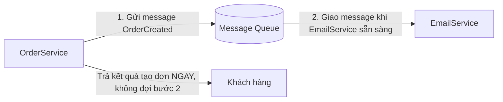

# Message Queue & Event-Driven cơ bản

!!! info "bạn đang ở đây · p6 → node `p6-messaging` · kiến trúc/pattern"
    **cần trước:** DDD cơ bản — vì message queue thường dùng để phát tán một **sự kiện nghiệp vụ** (ví dụ `OrderCreated`) đã xảy ra bên trong một Aggregate, sang các phần khác của hệ thống.
    **mở khoá:** nhận diện đúng lúc nào giao tiếp đồng bộ (gọi trực tiếp) giữa hai service gây ra vấn đề thật, và lúc nào thêm một message queue vào kiến trúc chỉ là làm phức tạp thêm hạ tầng không cần thiết.

> **Mục tiêu (đo được):** sau chương này bạn **giải thích** được vấn đề cụ thể mà message queue giải quyết (service gọi trực tiếp lẫn nhau qua HTTP đồng bộ, một service down kéo sập service khác); **phân biệt** được Point-to-point và Publish/Subscribe dựa trên số lượng người nhận một message; **so sánh** được RabbitMQ (self-host) với Azure Service Bus (managed cloud) ở mức khái niệm; và **quyết định** được khi nào thêm message queue vào hệ thống là hợp lý, khi nào là over-engineering cho một hệ thống nhỏ, giao tiếp đơn giản.

---

## 0. Đoán nhanh trước khi đọc

Trước khi xem đáp án, hãy tự trả lời (desirable difficulty — đoán sai vẫn giúp nhớ lâu hơn):

1. Nếu service A gọi trực tiếp service B qua HTTP, và B đang down — điều gì xảy ra với A?
2. Message queue có cần cả hai bên (người gửi và người nhận) phải online cùng lúc không?
3. Một message chỉ nên có **một** người nhận xử lý — đây là Point-to-point hay Publish/Subscribe?
4. RabbitMQ và Azure Service Bus, cái nào là dịch vụ bạn phải tự cài đặt và vận hành server, cái nào là dịch vụ cloud có sẵn (managed)?
5. Một ứng dụng nội bộ nhỏ, chỉ có một service duy nhất, chưa cần tách microservice — có cần thêm message queue không?

??? note "Đáp án"
    1. **A cũng fail hoặc phải chờ timeout** — vì A gọi B theo kiểu đồng bộ (đợi B trả lời), B down đồng nghĩa A không thể hoàn tất request của nó, dù bản thân A không có lỗi gì.
    2. **Không** — đây chính là lợi ích cốt lõi của message queue: người gửi gửi xong là xong, người nhận có thể xử lý sau, không cần online ngay lúc gửi.
    3. **Point-to-point** — đúng nghĩa "một message, một người nhận xử lý", dù có nhiều consumer đang lắng nghe, chỉ một trong số đó nhận được message đó.
    4. **RabbitMQ** tự cài đặt/vận hành server (self-host); **Azure Service Bus** là dịch vụ cloud có sẵn, Microsoft vận hành hạ tầng (managed).
    5. **Không cần** — một service duy nhất giao tiếp nội bộ trong cùng tiến trình không có vấn đề "service down kéo sập service khác" mà message queue giải quyết; thêm queue ở đây chỉ tăng độ phức tạp hạ tầng không cần thiết.

---

## 1. Vấn đề cụ thể: gọi trực tiếp đồng bộ giữa hai service

**Bối cảnh:** giả sử bạn có `OrderService` xử lý việc tạo đơn hàng, và `EmailService` chịu trách nhiệm gửi email xác nhận. Cách làm tự nhiên nhất khi mới tách hai service: `OrderService` gọi trực tiếp `EmailService` qua HTTP ngay trong lúc xử lý request tạo đơn.

```csharp title="C#"
// test:compile Web SDK trần — minh hoạ gọi trực tiếp ĐỒNG BỘ giữa hai service qua HTTP
using System.Net.Http;
using System.Net.Http.Json;

public class OrderService
{
    private readonly HttpClient _httpClient;

    public OrderService(HttpClient httpClient) => _httpClient = httpClient;

    public async Task<int> CreateOrderAsync(int customerId, decimal total)
    {
        // 1. Lưu đơn hàng vào database (giả lập, luôn thành công ở đây)
        var orderId = 1;

        // 2. Gọi TRỰC TIẾP sang EmailService, ĐỢI nó trả lời xong mới tiếp tục.
        //    Nếu EmailService down hoặc chậm, dòng này BLOCK toàn bộ request tạo đơn.
        var response = await _httpClient.PostAsJsonAsync(
            "http://email-service/api/send-confirmation",
            new { OrderId = orderId, CustomerId = customerId, Total = total });

        response.EnsureSuccessStatusCode(); // ném exception nếu EmailService lỗi/down

        return orderId;
    }
}
```

**Vấn đề xuất hiện dần khi hệ thống lớn lên:**

- **`EmailService` down thì `OrderService` cũng fail theo:** khách hàng bấm "Đặt hàng", đơn hàng thực ra đã lưu thành công vào database ở bước 1, nhưng vì bước 2 (gọi `EmailService`) ném exception do service đó đang down/deploy lại, toàn bộ request `CreateOrderAsync` **fail theo**, trả lỗi 500 về cho khách hàng — dù việc gửi email xác nhận **không hề liên quan** đến việc đơn hàng có được tạo thành công hay không.
- **Nếu thử "sửa" bằng cách retry thủ công:** một cách vá tạm là bọc `try/catch` quanh lời gọi `EmailService`, rồi tự viết logic retry (thử lại 3 lần, đợi vài giây mỗi lần) ngay trong `OrderService`. Nhưng retry đồng bộ nghĩa là request tạo đơn của khách hàng phải **đợi** hết 3 lần retry (có thể vài chục giây) trước khi biết kết quả — trải nghiệm người dùng tệ, và logic retry này phải viết lại **ở mọi nơi** `OrderService` gọi ra ngoài (không chỉ `EmailService`, mà còn `InventoryService`, `LoyaltyPointService`... nếu có).
- **Hệ quả rõ nhất:** `OrderService` (nghiệp vụ lõi: tạo đơn hàng) bị **ràng buộc chặt (tightly coupled)** vào tình trạng hoạt động của `EmailService` (nghiệp vụ phụ: gửi thông báo) — một service không quan trọng bằng lại có khả năng làm sập một service quan trọng hơn, chỉ vì cách gọi là đồng bộ và đợi kết quả ngay.

**Điều gì xảy ra khi dùng sai trong thực tế (log lỗi thật):**

```text title="Lỗi thực tế khi EmailService down kéo theo OrderService fail"
System.Net.Http.HttpRequestException: Connection refused (email-service:80)
   at OrderService.CreateOrderAsync(Int32 customerId, Decimal total)
--> Request tạo đơn trả về HTTP 500, dù bản thân đơn hàng ĐÃ lưu thành công vào database
    ở bước 1 — khách hàng thấy lỗi, có thể bấm đặt hàng lại, tạo ra ĐƠN TRÙNG.
```

Đây chính là dấu hiệu rõ nhất: một lỗi ở service phụ (gửi email) đã lan sang và phá hỏng luồng nghiệp vụ chính (tạo đơn), thậm chí còn gây tác dụng phụ tệ hơn (đơn trùng do khách hàng thử lại).

---

## 2. Message Queue là gì

**Định nghĩa (một câu, giả định bạn chưa biết khái niệm này):** Message Queue là một **service trung gian** nhận message từ người gửi và **giữ lại** message đó cho đến khi người nhận sẵn sàng lấy và xử lý — người gửi gửi xong là coi như hoàn tất công việc của mình, **không cần đợi người nhận online ngay lúc đó** hay xử lý xong ngay lúc đó.

**Áp đúng vào vấn đề ở mục 1:** thay vì `OrderService` gọi trực tiếp `EmailService`, nó chỉ cần **đặt một message** vào queue (ví dụ `"OrderCreated: OrderId=1, CustomerId=7"`), rồi hoàn tất request ngay — không quan tâm `EmailService` có đang online hay không tại thời điểm đó.



Ba đặc điểm cốt lõi cần nắm:

- **Người gửi (producer) không cần biết người nhận (consumer) là ai, có đang chạy hay không** — nó chỉ cần biết địa chỉ của queue.
- **Queue giữ message lại** nếu chưa có ai nhận (ví dụ `EmailService` đang deploy lại, restart) — khi `EmailService` chạy lại, nó lấy message đang chờ trong queue để xử lý tiếp, **không mất message**. Để đảm bảo "không mất message" này, hầu hết message queue thực tế theo cơ chế gọi là **"at-least-once delivery"** (giao ít nhất một lần): queue chỉ xoá message khỏi hàng đợi **sau khi** consumer xác nhận đã xử lý xong (gọi là "ack" — acknowledgement); nếu consumer crash giữa lúc xử lý, chưa kịp ack, queue sẽ **giao lại** message đó cho một consumer khác (hoặc cùng consumer khi nó chạy lại) — nghĩa là **đôi khi** một message có thể bị xử lý **hai lần** dù không có gì sai, chỉ vì consumer restart đúng lúc chưa ack xong.
- **Người gửi không đợi kết quả xử lý** — đây gọi là giao tiếp **bất đồng bộ (asynchronous)**, khác hẳn cách gọi HTTP trực tiếp ở mục 1 (đồng bộ, phải đợi).

**Điều gì xảy ra khi hiểu sai bản chất "bất đồng bộ" này:** nếu một dev vẫn viết code kiểu `var result = await queue.SendAndWaitForReplyAsync(message)` — tức là gửi message rồi **đứng chờ** người nhận xử lý xong mới tiếp tục — thì toàn bộ lợi ích của message queue (không phụ thuộc vào việc người nhận có online ngay không) **biến mất hoàn toàn**, vì người gửi lại quay về trạng thái "phải đợi", giống hệt vấn đề gọi HTTP trực tiếp ở mục 1, chỉ là đổi tên công nghệ.

**Ví dụ tối thiểu, độc lập, chạy được** — mô phỏng đúng hành vi cốt lõi của một message queue (giữ message lại, giao khi consumer sẵn sàng, người gửi không đợi) bằng `System.Threading.Channels` (một cấu trúc hàng đợi bất đồng bộ có sẵn trong BCL — không phải RabbitMQ/Azure Service Bus thật, nhưng minh hoạ đúng bản chất "hàng đợi trung gian" mà không cần cài hạ tầng ngoài):

```csharp title="C#"
// test:run
using System;
using System.Threading.Channels;
using System.Threading.Tasks;

public static class Program
{
    public static async Task Main()
    {
        // Channel đóng vai trò "Message Queue" trong bộ nhớ — người gửi ghi vào, người nhận đọc ra,
        // hai bên không cần chạy cùng lúc (ở đây minh hoạ tuần tự để log rõ ràng, nhưng về nguyên tắc
        // consumer có thể chạy TRỄ hơn producer, giống EmailService xử lý sau OrderService).
        var queue = Channel.CreateUnbounded<string>();

        // ---------- PRODUCER: gửi message rồi XONG NGAY, không đợi ai xử lý ----------
        async Task ProducerAsync()
        {
            await queue.Writer.WriteAsync("OrderCreated: OrderId=1, CustomerId=7");
            Console.WriteLine("[OrderService] Đã gửi message vào queue — hoàn tất request NGAY.");
            queue.Writer.Complete(); // báo hiệu không còn message nào gửi tiếp
        }

        // ---------- CONSUMER: lấy message ra và xử lý, KHÔNG bị Producer chờ ----------
        async Task ConsumerAsync()
        {
            await foreach (var message in queue.Reader.ReadAllAsync())
            {
                Console.WriteLine($"[EmailService] Nhận được message: \"{message}\" -> đang gửi email...");
                await Task.Delay(50); // giả lập việc gửi email tốn thời gian
                Console.WriteLine("[EmailService] Đã gửi email xác nhận.");
            }
        }

        await ProducerAsync();
        await ConsumerAsync();
    }
}
```

```text title="Kết quả"
[OrderService] Đã gửi message vào queue — hoàn tất request NGAY.
[EmailService] Nhận được message: "OrderCreated: OrderId=1, CustomerId=7" -> đang gửi email...
[EmailService] Đã gửi email xác nhận.
```

Quan sát mấu chốt: `ProducerAsync` **không hề gọi** bất kỳ hàm nào của `ConsumerAsync` — nó chỉ ghi vào `queue.Writer` rồi log "hoàn tất request NGAY" và kết thúc. Việc "gửi email" (`ConsumerAsync`) xảy ra **hoàn toàn độc lập**, có thể chạy chậm hơn, chạy sau, hoặc (trong hệ thống thật) chạy trên một tiến trình/service khác hẳn — đúng bản chất bất đồng bộ đã định nghĩa ở trên. Đây chỉ là mô phỏng để thấy rõ luồng dữ liệu; RabbitMQ/Azure Service Bus (mục 8) làm việc này qua mạng, giữa nhiều tiến trình/máy chủ khác nhau, có thêm cơ chế bền (persist message ra đĩa) để không mất message khi restart.

---

## 3. Point-to-point: một message, một người nhận

**Định nghĩa (một câu, giả định bạn chưa biết khái niệm này):** Point-to-point là kiểu giao tiếp qua queue trong đó **mỗi message chỉ được đúng một người nhận (consumer) lấy và xử lý**, dù có nhiều consumer cùng đang lắng nghe trên queue đó — message không bị xử lý trùng hai lần.

**Ví dụ tình huống cụ thể:** `OrderService` gửi message `"OrderCreated: OrderId=1"` vào một queue tên `order-emails`. Có **3 instance** của `EmailService` đang chạy cùng lúc (để chịu tải cao) và cùng lắng nghe queue này. Với Point-to-point, chỉ **một trong ba instance** đó nhận và gửi email — hai instance còn lại **không** nhận được message đó nữa.

```mermaid title="Point-to-point: nhiều consumer lắng nghe, chỉ một nhận mỗi message"
graph LR
    P[OrderService] -->|gửi 1 message| Q[("Queue: order-emails")]
    Q -->|message CHỈ đi tới 1 trong 3| C1[EmailService instance 1]
    Q -.->|không nhận message này| C2[EmailService instance 2]
    Q -.->|không nhận message này| C3[EmailService instance 3]
```

**Lợi ích trực tiếp cho vấn đề ở mục 1:** nếu bạn chạy nhiều instance `EmailService` để tăng khả năng chịu tải, Point-to-point tự động **chia việc** — mỗi message chỉ tốn công một instance xử lý, không có instance nào gửi trùng email cho cùng một đơn hàng.

**Điều gì xảy ra khi hiểu sai — tưởng mọi consumer đều nhận được message:** nếu một dev thiết kế nhầm, tưởng cả 3 instance `EmailService` đều nhận được cùng một message `"OrderCreated: OrderId=1"`, họ sẽ không viết logic chống trùng — kết quả thực tế với Point-to-point là **mỗi message chỉ tới một nơi**, nên nếu logic nghiệp vụ lại cần "tất cả các bên đều phải biết" (ví dụ vừa cần gửi email, vừa cần cập nhật kho hàng cho cùng một sự kiện `OrderCreated`), Point-to-point **không đáp ứng được** — đây chính là lúc cần mục 4.

---

## 4. Publish/Subscribe: một message, nhiều người nhận

**Định nghĩa (một câu, giả định bạn chưa biết khái niệm này):** Publish/Subscribe (viết tắt Pub/Sub) là kiểu giao tiếp trong đó **một message được gửi đi (publish) sẽ được giao tới TẤT CẢ các bên đã đăng ký nhận (subscribe)** — không phải chỉ một, khác hẳn Point-to-point ở mục 3.

**Ví dụ tình huống cụ thể — nối lại đúng nhu cầu vừa nêu ở cuối mục 3:** khi một đơn hàng được tạo, hệ thống cần **cả ba việc** xảy ra độc lập: gửi email xác nhận, trừ kho hàng, và cộng điểm tích lũy cho khách hàng. Với Pub/Sub, `OrderService` chỉ **publish một lần** sự kiện `OrderCreated`, và cả ba service (`EmailService`, `InventoryService`, `LoyaltyPointService`) đều **cùng nhận được** bản sao của sự kiện đó.

```mermaid title="Publish/Subscribe: một sự kiện, nhiều subscriber cùng nhận"
graph LR
    P[OrderService] -->|publish 1 lần| T(["Topic: OrderCreated"])
    T -->|nhận bản sao| S1[EmailService]
    T -->|nhận bản sao| S2[InventoryService]
    T -->|nhận bản sao| S3[LoyaltyPointService]
```

**So sánh Point-to-point vs Publish/Subscribe — chỉ đưa ra SAU khi đã hiểu riêng từng khái niệm ở mục 3 và mục 4:**

| Khía cạnh | Point-to-point | Publish/Subscribe |
|-----------|-----------------|---------------------|
| Số người nhận xử lý mỗi message | Đúng 1, dù có nhiều consumer lắng nghe | Tất cả subscriber đã đăng ký |
| Mục đích chính | Chia tải công việc giữa nhiều instance của CÙNG một loại consumer | Thông báo một sự kiện cho NHIỀU loại consumer khác nhau, độc lập |
| Ví dụ đúng ngữ cảnh | 3 instance `EmailService` chia nhau xử lý hàng loạt email cần gửi | 1 sự kiện `OrderCreated` cần cả `EmailService`, `InventoryService`, `LoyaltyPointService` biết |

**Điều gì xảy ra khi dùng sai — dùng Point-to-point cho nhu cầu cần Pub/Sub:** nếu `OrderService` gửi message `OrderCreated` vào một Point-to-point queue mà cả `EmailService` và `InventoryService` cùng lắng nghe, theo đúng bản chất Point-to-point ở mục 3, **chỉ một trong hai** service đó nhận được message — ví dụ `EmailService` nhận được và gửi email, nhưng `InventoryService` **không hề biết** đơn hàng vừa được tạo, kho hàng không bị trừ, dẫn tới bán vượt tồn kho. Đây là lỗi thiết kế phổ biến: chọn nhầm Point-to-point cho một nhu cầu thực chất cần Pub/Sub (nhiều bên độc lập cùng cần biết một sự kiện).

---

## 5. Competing Consumers: dùng Point-to-point để tự động chia tải

**Vấn đề cụ thể:** giả sử `EmailService` chỉ chạy **một** instance, và hệ thống đang trong đợt sale lớn — hàng chục nghìn message `OrderCreated` được gửi vào queue mỗi phút. Một instance duy nhất xử lý tuần tự, message dồn ứ trong queue ngày càng nhiều, khách hàng có thể chờ hàng giờ mới nhận được email xác nhận — dù bản thân việc "gửi một email" chỉ tốn vài trăm milliseconds.

```text title="Vấn đề: một consumer duy nhất không xử lý kịp lượng message dồn ứ"
Queue "order-emails" có 50,000 message đang chờ.
EmailService (1 instance) xử lý ~10 message/giây.
--> Cần 50,000 / 10 = 5,000 giây (~83 phút) để xử lý hết -> khách hàng chờ quá lâu.
```

**Định nghĩa (một câu, giả định bạn chưa biết khái niệm này):** Competing Consumers là một cách áp dụng Point-to-point (mục 3) trong đó bạn **chạy nhiều instance của cùng một consumer**, cho tất cả cùng lắng nghe **một** queue — các instance này "cạnh tranh" nhau lấy message tiếp theo, message queue tự động chia đều công việc cho instance nào đang rảnh, không cần bạn tự viết logic chia việc.

```mermaid title="Competing Consumers: nhiều instance chia nhau xử lý cùng một queue"
graph LR
    Q[("Queue: order-emails · 50,000 message")] -->|instance nào rảnh, lấy tiếp| C1[EmailService instance 1]
    Q -->|instance nào rảnh, lấy tiếp| C2[EmailService instance 2]
    Q -->|instance nào rảnh, lấy tiếp| C3[EmailService instance 3]
    Q -->|instance nào rảnh, lấy tiếp| C4[EmailService instance 4]
```

**Ví dụ tối thiểu, độc lập, chạy được** — mô phỏng đúng cơ chế "nhiều consumer cạnh tranh lấy từ một queue" bằng `Channel` (nối lại kỹ thuật đã dùng ở mục 2, giờ có **nhiều** task đọc cùng một `Reader`):

```csharp title="C#"
// test:run
using System;
using System.Threading.Channels;
using System.Threading.Tasks;

public static class Program
{
    public static async Task Main()
    {
        var queue = Channel.CreateUnbounded<int>();

        // Producer: gửi 6 "đơn hàng" vào queue, xong ngay, không quan tâm ai xử lý.
        for (var orderId = 1; orderId <= 6; orderId++)
            await queue.Writer.WriteAsync(orderId);
        queue.Writer.Complete();

        // 3 "instance" EmailService CÙNG lắng nghe MỘT queue -> Competing Consumers.
        // Mỗi message CHỈ được đúng một trong ba instance lấy (đúng bản chất Point-to-point, mục 3),
        // và việc CHIA VIỆC diễn ra tự động: instance nào rảnh trước sẽ lấy message tiếp theo.
        async Task ConsumerAsync(int instanceId)
        {
            await foreach (var orderId in queue.Reader.ReadAllAsync())
            {
                Console.WriteLine($"[Instance {instanceId}] Xử lý email cho đơn #{orderId}");
                await Task.Delay(10);
            }
        }

        await Task.WhenAll(ConsumerAsync(1), ConsumerAsync(2), ConsumerAsync(3));
        Console.WriteLine("Đã xử lý xong toàn bộ 6 đơn hàng, chia việc cho 3 instance.");
    }
}
```

```text title="Kết quả (thứ tự instance nhận message có thể khác nhau mỗi lần chạy, do chạy song song)"
[Instance 1] Xử lý email cho đơn #1
[Instance 2] Xử lý email cho đơn #2
[Instance 3] Xử lý email cho đơn #3
[Instance 1] Xử lý email cho đơn #4
[Instance 2] Xử lý email cho đơn #5
[Instance 3] Xử lý email cho đơn #6
Đã xử lý xong toàn bộ 6 đơn hàng, chia việc cho 3 instance.
```

Quan sát mấu chốt: **không có dòng code nào** trong ví dụ trên chỉ định "instance 1 xử lý đơn #1, #4; instance 2 xử lý đơn #2, #5" — việc chia việc này là **tự động**, do cả ba `ConsumerAsync` cùng đọc từ một `queue.Reader`, và cơ chế của `Channel` (cũng như RabbitMQ/Azure Service Bus thật ở mục 8) tự đảm bảo mỗi message chỉ được một consumer lấy, ai rảnh trước lấy trước.

**Điều gì xảy ra khi dùng sai — tưởng phải tự viết logic chia việc:** một cách làm sai phổ biến là thấy cần nhiều instance xử lý, nên tự đánh số `OrderId % 3` để "phân công" cứng: instance 1 xử lý đơn có `OrderId % 3 == 0`, instance 2 xử lý `== 1`, v.v. Cách này **không cần thiết** khi đã dùng đúng Competing Consumers qua Point-to-point — bản thân queue đã tự chia việc theo tốc độ xử lý thực tế của từng instance; tự chia cứng theo công thức còn có nhược điểm là nếu instance 1 xử lý chậm hơn (do máy yếu hơn), nó vẫn bị gán đúng 1/3 số message, gây mất cân bằng tải thay vì để queue tự điều phối theo ai rảnh trước.

**Khi nào KHÔNG cần Competing Consumers:** nếu khối lượng message nhỏ, một instance xử lý đủ nhanh (không có dấu hiệu dồn ứ như ví dụ đầu mục này), chạy thêm nhiều instance chỉ để "phòng khi tải tăng" là tốn thêm chi phí hạ tầng (nhiều tiến trình/container đang chạy) mà chưa giải quyết vấn đề gì có thật — nên bắt đầu với một instance, chỉ scale thêm khi đã đo được dấu hiệu dồn ứ thực tế (queue length tăng liên tục, độ trễ xử lý tăng).

---

## 6. Message contract: người gửi và người nhận phải thống nhất hình dạng dữ liệu

**Vấn đề cụ thể nếu không thống nhất hình dạng message:** khác với gọi HTTP trực tiếp (mục 1), nơi client và server thường dùng chung một OpenAPI/Swagger spec để biết chính xác hình dạng request/response, message queue **không tự động ép** người gửi và người nhận phải khớp hình dạng dữ liệu — `OrderService` có thể gửi một chuỗi JSON theo hình dạng bất kỳ, và nếu `EmailService` (được viết bởi một team khác, có thể bằng ngôn ngữ khác) đọc sai tên field hoặc sai kiểu dữ liệu, nó sẽ crash hoặc đọc dữ liệu sai mà không ai phát hiện ngay lúc gửi.

```csharp title="C#"
// test:run
using System;
using System.Text.Json;

public static class Program
{
    public static void Main()
    {
        // Producer gửi message dưới dạng object ẩn danh -> JSON, KHÔNG có hợp đồng (contract) rõ ràng.
        var message = new { OrderId = 1, CustomerId = 7, Amount = 250000 };
        var json = JsonSerializer.Serialize(message);
        Console.WriteLine($"Producer gửi: {json}");

        // Consumer (viết sau, bởi người khác) đoán sai tên field "Amount" thành "Total" —
        // KHÔNG có gì ở tầng message queue báo lỗi việc này ngay lúc gửi.
        var parsed = JsonSerializer.Deserialize<JsonElement>(json);
        var hasTotal = parsed.TryGetProperty("Total", out var totalValue);
        Console.WriteLine($"Consumer tìm field 'Total': {(hasTotal ? totalValue.ToString() : "KHÔNG TỒN TẠI -> đọc ra giá trị mặc định/lỗi ngầm")}");
    }
}
```

```text title="Kết quả"
Producer gửi: {"OrderId":1,"CustomerId":7,"Amount":250000}
Consumer tìm field 'Total': KHÔNG TỒN TẠI -> đọc ra giá trị mặc định/lỗi ngầm
```

**Định nghĩa (một câu, giả định bạn chưa biết khái niệm này):** Message contract là một **hình dạng dữ liệu được thống nhất trước** (thường là một class/record C# dùng chung, hoặc một schema JSON có version) giữa người gửi và người nhận, để cả hai bên luôn hiểu đúng và giống nhau về field nào tồn tại, kiểu dữ liệu là gì — giải quyết đúng vấn đề "đoán sai tên field" ở ví dụ trên.

```csharp title="C#"
// test:run
using System;
using System.Text.Json;

// Message contract — record dùng CHUNG giữa producer và consumer, có thể đặt trong một
// project/package "Contracts" riêng mà cả hai bên cùng tham chiếu, để compiler báo lỗi
// NGAY nếu một bên đổi field mà bên kia chưa cập nhật (thay vì lỗi ngầm lúc runtime).
public record OrderCreatedEvent(int OrderId, int CustomerId, decimal Amount);

public static class Program
{
    public static void Main()
    {
        var @event = new OrderCreatedEvent(OrderId: 1, CustomerId: 7, Amount: 250000m);
        var json = JsonSerializer.Serialize(@event);
        Console.WriteLine($"Producer gửi: {json}");

        // Consumer deserialize THẲNG về đúng contract -> nếu field không khớp, LỖI RÕ RÀNG
        // (giá trị null/exception) NGAY LÚC TEST, không phải lỗi ngầm khi đọc JsonElement thủ công.
        var received = JsonSerializer.Deserialize<OrderCreatedEvent>(json)!;
        Console.WriteLine($"Consumer nhận đúng: OrderId={received.OrderId}, Amount={received.Amount:N0}");
    }
}
```

```text title="Kết quả"
Producer gửi: {"OrderId":1,"CustomerId":7,"Amount":250000}
Consumer nhận đúng: OrderId=1, Amount=250,000
```

**Cạm bẫy thực chiến khi đổi contract:** nếu `OrderService` đổi field `Amount` thành `TotalAmount` để "rõ nghĩa hơn", nhưng `EmailService` (đã deploy từ trước, chưa cập nhật) vẫn còn dùng contract cũ, message mới gửi tới sẽ có `TotalAmount` mà consumer cũ tìm `Amount` — không tìm thấy, đọc ra giá trị mặc định (`0` cho `decimal`) một cách **âm thầm**, không có exception nào cả nếu contract được đọc qua `JsonElement` thay vì record cụ thể. Đây là lý do khi đổi message contract trong hệ thống đã chạy production, cần theo nguyên tắc **thêm field mới, không đổi tên/xoá field cũ ngay** (tương tự việc không nên phá vỡ backward compatibility của một API HTTP đã có client đang dùng).

---

## 7. Dead Letter Queue: xử lý message không thể xử lý được

**Vấn đề cụ thể:** giả sử `EmailService` nhận một message `OrderCreatedEvent` nhưng địa chỉ email của khách hàng bị sai định dạng — mỗi lần consumer xử lý message này đều ném exception. Với "at-least-once delivery" (đã nhắc ở mục 2), hành vi mặc định của nhiều message queue là **giao lại message đó** cho consumer thử lại — nếu consumer luôn crash trên message này, nó sẽ bị giao đi giao lại **vô hạn lần**, chiếm tài nguyên xử lý mà không bao giờ thành công, đồng thời có thể **chặn** các message hợp lệ khác đang chờ xử lý sau nó trong cùng queue.

```text title="Vấn đề: một message lỗi bị retry vô hạn, chặn message khác"
Message #1 (email sai định dạng) -> Consumer xử lý -> LỖI -> Queue giao lại
Message #1 (lần 2) -> Consumer xử lý -> LỖI -> Queue giao lại
Message #1 (lần 3, 4, 5... vô hạn) -> LỖI -> LỖI -> LỖI...
Message #2 (email hợp lệ, đang chờ SAU Message #1) -> BỊ CHẶN, chưa được xử lý
```

**Định nghĩa (một câu, giả định bạn chưa biết khái niệm này):** Dead Letter Queue (DLQ) là một **queue phụ riêng** mà message queue tự động chuyển message vào, sau khi message đó đã được giao lại thất bại **quá một số lần giới hạn** (ví dụ 5 lần) — mục đích là lấy message lỗi ra khỏi luồng xử lý chính, để nó không tiếp tục chặn hoặc làm tốn tài nguyên retry vô hạn, đồng thời vẫn **giữ lại** message đó để dev xem xét/xử lý thủ công sau.

```mermaid title="Dead Letter Queue: message lỗi được đưa ra khỏi luồng chính sau N lần retry"
graph LR
    Q[("Queue chính: order-emails")] -->|thử xử lý| C[EmailService]
    C -->|lỗi lần 1-4, giao lại| Q
    C -->|lỗi lần 5, VƯỢT giới hạn retry| D[("Dead Letter Queue")]
    D -->|xem xét thủ công| DEV[Dev/Ops kiểm tra sau]
```

**Ứng dụng đúng vào ví dụ ở mục 1–2:** nếu `EmailService` cấu hình DLQ với giới hạn retry là 5 lần, message với email sai định dạng sẽ được thử lại tối đa 5 lần rồi **tự động chuyển** vào DLQ — các message hợp lệ khác trong queue `order-emails` (ví dụ email của các khách hàng khác) **tiếp tục được xử lý bình thường**, không bị message lỗi này chặn lại.

**Khi nào KHÔNG cần cấu hình DLQ riêng:** nếu hệ thống dùng message queue ở quy mô rất nhỏ, số lượng message ít, và có thể chấp nhận **giám sát thủ công bằng log** (mỗi lần consumer lỗi, ghi log đầy đủ, dev xem log để xử lý) — cấu hình DLQ riêng biệt (một queue phụ, quy tắc chuyển tiếp, cơ chế xem xét định kỳ) có thể là dư thừa cho giai đoạn đầu. DLQ đáng cấu hình khi khối lượng message đủ lớn để việc **không có** nó thực sự gây tắc nghẽn queue chính, hoặc khi nghiệp vụ đủ quan trọng để không thể bỏ lỡ việc một message bị lỗi âm thầm biến mất sau khi retry hết.

---

## 8. Hai lựa chọn phổ biến trong .NET: RabbitMQ và Azure Service Bus

**Định nghĩa mức giới thiệu (không cần code chạy được ở mục chọn công nghệ này — cú pháp gọi API cụ thể của từng SDK không phải trọng tâm "core"):** RabbitMQ và Azure Service Bus đều là **phần mềm message queue** hỗ trợ cả Point-to-point (mục 3) và Publish/Subscribe (mục 4), nhưng khác nhau cơ bản ở **ai vận hành hạ tầng**.

- **RabbitMQ — self-host (tự cài đặt và vận hành):** là phần mềm mã nguồn mở, bạn tự cài lên server của mình (hoặc container Docker), tự chịu trách nhiệm vận hành, backup, nâng cấp, mở rộng khi tải tăng. Đổi lại, bạn có toàn quyền kiểm soát, không phụ thuộc nhà cung cấp cloud cụ thể, và không tốn chi phí theo mức sử dụng của dịch vụ cloud (chỉ tốn chi phí server bạn tự thuê/tự có).
- **Azure Service Bus — managed cloud (dịch vụ quản lý sẵn):** là dịch vụ do Microsoft vận hành trên Azure — bạn không cần cài đặt hay quản lý server nào cả, chỉ cần tạo resource qua Azure Portal/CLI và trả tiền theo mức sử dụng (số message, băng thông). Đổi lại, bạn phụ thuộc vào hạ tầng Azure, và chi phí có thể tăng theo lượng dùng.

```text title="So sánh nhanh — chỉ ở mức khái niệm, không cần nhớ chi tiết cấu hình"
RabbitMQ (self-host)              Azure Service Bus (managed cloud)
- Tự cài, tự vận hành server      - Microsoft vận hành, bạn chỉ dùng
- Kiểm soát toàn bộ hạ tầng       - Không cần quan tâm hạ tầng bên dưới
- Chi phí: server + công vận hành - Chi phí: theo mức sử dụng dịch vụ
- Phù hợp: cần tự chủ hạ tầng,    - Phù hợp: đã dùng Azure, muốn giảm
  đa cloud/on-premise               việc vận hành, tích hợp sẵn với .NET/Azure
```

**Điều gì xảy ra khi chọn nhầm ngữ cảnh:** một team nhỏ, chưa có ai chuyên vận hành hạ tầng, nếu chọn RabbitMQ self-host sẽ phải tự học cách cấu hình cluster, giám sát, xử lý khi node chết — những việc mà Azure Service Bus **đã làm sẵn**. Ngược lại, một tổ chức đã có sẵn hạ tầng self-host, muốn tránh phụ thuộc vào một nhà cung cấp cloud cụ thể (ví dụ vì lý do bảo mật, quy định dữ liệu phải nằm on-premise), ép dùng Azure Service Bus sẽ tạo ra ràng buộc không cần thiết vào Azure. Không có lựa chọn nào "luôn đúng" — quyết định phụ thuộc vào việc **ai sẽ vận hành** hạ tầng và tổ chức đã đầu tư vào cloud nào.

**Hình dạng API — chỉ để thấy cả hai đều cài đặt đúng khái niệm Publish/Subscribe (mục 4) theo cách rất giống nhau ở tầng code, khác nhau chủ yếu ở cấu hình kết nối:**

```csharp title="C#"
// test:skip cần package RabbitMQ.Client (NuGet) ngoài Web SDK trần — chỉ minh hoạ hình dạng API
using RabbitMQ.Client;
using System.Text;
using System.Text.Json;

public class RabbitMqOrderPublisher
{
    private readonly IModel _channel; // "channel" là khái niệm riêng của RabbitMQ, không phải HTTP channel

    public RabbitMqOrderPublisher(IModel channel) => _channel = channel;

    public void PublishOrderCreated(OrderCreatedEvent orderEvent)
    {
        // Publish vào một "exchange" kiểu fanout -> đúng bản chất Publish/Subscribe (mục 4):
        // MỌI queue đã bind vào exchange này đều nhận được bản sao của message.
        var body = Encoding.UTF8.GetBytes(JsonSerializer.Serialize(orderEvent));
        _channel.BasicPublish(exchange: "order-events", routingKey: "", body: body);
    }
}

public record OrderCreatedEvent(int OrderId, int CustomerId, decimal Amount);
```

```csharp title="C#"
// test:skip cần package Azure.Messaging.ServiceBus (NuGet) ngoài Web SDK trần — chỉ minh hoạ hình dạng API
using Azure.Messaging.ServiceBus;
using System.Text.Json;

public class ServiceBusOrderPublisher
{
    private readonly ServiceBusSender _sender;

    public ServiceBusOrderPublisher(ServiceBusSender sender) => _sender = sender;

    public async Task PublishOrderCreatedAsync(OrderCreatedEvent orderEvent)
    {
        // Publish vào một "topic" -> đúng bản chất Publish/Subscribe (mục 4):
        // MỌI subscription đã đăng ký trên topic này đều nhận được bản sao của message.
        var message = new ServiceBusMessage(JsonSerializer.Serialize(orderEvent));
        await _sender.SendMessageAsync(message);
    }
}

public record OrderCreatedEvent(int OrderId, int CustomerId, decimal Amount);
```

Quan sát: cả hai đoạn code **giống nhau về bản chất** — cả hai đều gửi một object đã serialize thành message tới một điểm trung tâm (`exchange` ở RabbitMQ, `topic` ở Azure Service Bus) để phân phối theo kiểu Pub/Sub. Khác biệt thực sự không nằm ở tầng khái niệm (mục 2–4 áp dụng như nhau cho cả hai), mà nằm ở việc **thiết lập kết nối** (`IModel`/`IConnection` của RabbitMQ cần chuỗi kết nối tới server bạn tự host; `ServiceBusClient` của Azure cần connection string tới resource Azure) và **ai vận hành** server đứng sau đoạn code này (đúng như đã nêu ở phần định nghĩa mức giới thiệu).

---

## 9. CẢNH BÁO OVER-ENGINEERING: khi nào KHÔNG cần message queue

Đây là điểm quan trọng nhất của chương này — message queue là hạ tầng thêm vào hệ thống, và giống mọi pattern kiến trúc khác, nó **rất dễ bị áp dụng dù chưa cần**.

**Ví dụ cụ thể — khi KHÔNG nên dùng message queue:** một ứng dụng nội bộ nhỏ, chỉ có **một** service duy nhất (chưa tách microservice), xử lý nghiệp vụ quản lý nhân viên. Khi tạo nhân viên mới, cần ghi log vào bảng `AuditLog` trong cùng database.

```csharp title="C#"
// test:compile Web SDK trần — giao tiếp ĐƠN GIẢN trong CÙNG MỘT tiến trình, KHÔNG cần message queue
public class EmployeeService
{
    private readonly AuditLogWriter _auditLogWriter;

    public EmployeeService(AuditLogWriter auditLogWriter) => _auditLogWriter = auditLogWriter;

    public void CreateEmployee(string name)
    {
        // 1. Lưu nhân viên (giả lập)
        // 2. Ghi audit log — gọi TRỰC TIẾP trong cùng tiến trình, không qua HTTP, không qua service khác.
        _auditLogWriter.Write($"Tạo nhân viên mới: {name}");

        // Nếu thêm message queue ở đây (publish "EmployeeCreated" event, có một consumer
        // riêng lắng nghe để ghi AuditLog), bạn sẽ phải: cài đặt/thuê hạ tầng queue, viết
        // thêm consumer, xử lý trường hợp message bị mất/trùng, theo dõi độ trễ xử lý —
        // TẤT CẢ chỉ để làm việc mà một lời gọi method trực tiếp (như trên) đã làm xong
        // trong vài microsecond, KHÔNG có rủi ro "AuditLogWriter down làm sập EmployeeService"
        // vì cả hai đang chạy TRONG CÙNG MỘT tiến trình, không phải hai service riêng.
    }
}
```

**Dấu hiệu nhận biết message queue đang thừa (checklist tự hỏi trước khi thêm vào kiến trúc):**

- Đây có phải giao tiếp **giữa hai service thật sự tách rời** (deploy riêng, có thể down độc lập với nhau), hay chỉ là hai class/method trong cùng một tiến trình?
- Có cần **latency thấp, biết kết quả ngay** (đồng bộ) hay việc xử lý có thể trễ vài giây/vài phút mà không ảnh hưởng nghiệp vụ (bất đồng bộ được)?
- Quy mô hệ thống có đủ lớn để việc "một service down kéo sập service khác" (vấn đề ở mục 1) là rủi ro thật, hay đây là một dự án nhỏ, ít traffic, chưa cần độ sẵn sàng cao?

Nếu câu trả lời cho câu 1 là "không" (cùng một tiến trình), hoặc câu 2 là "cần đồng bộ ngay", hoặc câu 3 là "dự án nhỏ, chưa cần" — thêm message queue vào đây chỉ tạo thêm **một thành phần hạ tầng phải cài đặt, vận hành, giám sát, và một nguồn lỗi mới** (message bị mất, message bị trùng, độ trễ xử lý) mà không giải quyết vấn đề gì có thật — đây chính là **over-engineering**.

**Ngược lại — khi message queue đáng giá:** đúng như ví dụ `OrderService`/`EmailService` ở mục 1, khi hai service **thật sự tách rời** (deploy độc lập, có thể một cái down mà cái khác vẫn phải hoạt động được), và việc xử lý phía nhận **không cần đồng bộ ngay** (gửi email chậm vài giây không ảnh hưởng gì đến việc đơn hàng đã tạo thành công) — message queue giúp loại bỏ đúng sự ràng buộc chặt đã gây vấn đề ở mục 1.

**Liên hệ với một quyết định kiến trúc lớn hơn:** message queue chỉ thật sự cần thiết khi hệ thống đã (hoặc đang) **tách thành nhiều service độc lập** (microservice, hoặc ít nhất một vài tiến trình tách rời gọi nhau). Nếu ứng dụng của bạn vẫn là một **monolith** (một tiến trình, một lần deploy) — dù bên trong có tổ chức theo layered architecture hay clean architecture đã học ở các chương trước — thì hầu hết giao tiếp nội bộ vẫn chỉ là gọi method trực tiếp, không có "service khác" nào để tách rời cả; message queue chỉ trở thành nhu cầu thật khi bạn **thật sự** tách một phần chức năng (ví dụ xử lý email, xử lý báo cáo nặng) ra một tiến trình/service riêng, không phải một quyết định nên làm "cho chắc" từ đầu khi hệ thống còn là một monolith duy nhất.

---

## 10. Cạm bẫy & thực chiến

- **Thêm message queue cho giao tiếp trong cùng một tiến trình (đã nhấn ở mục 9):** lỗi phổ biến nhất — thấy message queue "trông chuyên nghiệp, scalable" nên dùng cho cả những việc chỉ là gọi method nội bộ, tạo ra độ phức tạp hạ tầng không cần thiết cho một vấn đề chưa từng xảy ra.
- **Nhầm giao tiếp bất đồng bộ với "không cần quan tâm kết quả":** nhiều người tưởng dùng message queue nghĩa là "gửi rồi quên", nhưng nếu nghiệp vụ **cần biết** việc xử lý có thành công hay không (ví dụ thanh toán thất bại phải báo ngay cho khách hàng), bất đồng bộ hoàn toàn không phù hợp — trường hợp này vẫn cần gọi đồng bộ hoặc một luồng phản hồi ngược (callback/webhook), không phải "cứ có queue là đúng".
- **Chọn nhầm Point-to-point cho nhu cầu Pub/Sub, hoặc ngược lại (đã nhấn ở mục 3–4):** dùng Point-to-point khi cần nhiều service độc lập cùng biết một sự kiện sẽ làm rơi mất thông báo cho các service còn lại; dùng Pub/Sub khi chỉ cần chia tải cho nhiều instance của cùng một consumer sẽ khiến mỗi message bị xử lý **trùng nhiều lần** một cách không cần thiết (ví dụ gửi email trùng nhiều lần cho một đơn hàng).
- **Quên rằng message có thể bị xử lý trùng (không idempotent):** hầu hết message queue thực tế đảm bảo "at-least-once delivery" (giao ít nhất một lần) — nghĩa là **đôi khi** một message có thể được giao hai lần (do lỗi mạng, consumer restart giữa lúc xử lý). Nếu consumer không viết theo kiểu idempotent (xử lý trùng nhiều lần vẫn ra kết quả đúng, ví dụ kiểm tra `OrderId` đã gửi email chưa trước khi gửi), hệ thống sẽ gửi email trùng, trừ kho hai lần, cộng điểm tích lũy hai lần cho cùng một sự kiện.
- **Tưởng RabbitMQ/Azure Service Bus là bắt buộc phải chọn một, không có lựa chọn khác:** hai cái này chỉ là **hai ví dụ phổ biến** trong .NET (mục 8) — còn nhiều lựa chọn khác (Kafka, AWS SQS/SNS, Google Pub/Sub...), việc chọn công nghệ nào phụ thuộc vào hạ tầng cloud tổ chức đang dùng, không phải cứ học .NET là buộc phải theo đúng hai cái này.
- **Không cấu hình Dead Letter Queue cho nghiệp vụ quan trọng (đã nhấn ở mục 7):** để message lỗi bị retry vô hạn hoặc biến mất âm thầm sau khi hết số lần retry mặc định của hạ tầng, không ai biết một message quan trọng (ví dụ thông báo thanh toán) đã "chết" mà không được xử lý.
- **Đổi message contract mà không giữ khả năng tương thích ngược (đã nhấn ở mục 6):** đổi tên/xoá field trong message khi đã có consumer cũ đang chạy production khiến consumer đó đọc sai dữ liệu một cách âm thầm (giá trị mặc định thay vì lỗi rõ ràng) — nên ưu tiên thêm field mới, giữ field cũ, giống nguyên tắc không phá vỡ backward compatibility của API HTTP.
- **Chạy nhiều instance Competing Consumers khi chưa có dấu hiệu dồn ứ thực tế (đã nhấn ở mục 5):** scale consumer "phòng trước" khi khối lượng message còn nhỏ chỉ tốn thêm chi phí hạ tầng (nhiều tiến trình chạy) mà không giải quyết vấn đề nào có thật — chỉ nên scale khi đã đo được queue length tăng liên tục hoặc độ trễ xử lý tăng rõ ràng.

---

## 11. Bài tập

**Bài 1 — Nhận diện over-engineering.** Một ứng dụng web nội bộ nhỏ, một service duy nhất, phục vụ 20 người dùng trong công ty. Khi người dùng đổi mật khẩu, cần gửi một dòng log vào file log trên cùng server. Một đồng nghiệp đề xuất: "Nên publish một event `PasswordChanged` qua RabbitMQ, có một consumer riêng lắng nghe để ghi log, cho chuẩn kiến trúc event-driven." Bạn đồng ý hay phản đối? Dựa vào checklist ở mục 9.

??? success "Lời giải + vì sao"
    **Phản đối.** Áp checklist mục 9:
    - Đây có phải giao tiếp giữa hai service tách rời? Không — ghi log vào file trên cùng server là một lời gọi hàm/method trong cùng tiến trình, không có "service B" nào tách rời để có thể down độc lập.
    - Có cần bất đồng bộ vì lý do gì đặc biệt? Không — ghi một dòng log là việc cực nhanh, không có lý do gì phải trì hoãn qua queue.
    - Quy mô hệ thống có đủ lớn để cần độ sẵn sàng cao? Không — 20 người dùng nội bộ, một service duy nhất.

    Cả ba câu trả lời đều "không" → thêm RabbitMQ ở đây là over-engineering rõ ràng: phải cài đặt, vận hành thêm một hạ tầng (RabbitMQ server), viết thêm consumer, xử lý rủi ro message bị mất/trùng — chỉ để thay cho một lời gọi `logger.LogInformation(...)` đơn giản đã đủ.

**Bài 2 — Chọn đúng Point-to-point hay Publish/Subscribe.** Hệ thống thương mại điện tử có nghiệp vụ: khi một đơn hàng bị hủy (`OrderCancelled`), cần (a) hoàn tiền qua `PaymentService`, (b) hoàn lại số lượng vào kho qua `InventoryService`, và (c) gửi email thông báo hủy đơn qua `EmailService` — cả ba việc này **độc lập với nhau**, đều cần xảy ra khi có một đơn hàng bị hủy. Đồng thời, `EmailService` được chạy 5 instance để chịu tải cao trong các đợt sale. Vẽ nhanh (bằng lời) luồng message nên thiết kế thế nào, dùng đúng khái niệm Point-to-point/Publish-Subscribe ở mục 3–4.

??? success "Lời giải + vì sao"
    Cần **kết hợp cả hai**, đúng hai tầng khác nhau của vấn đề:

    - **Tầng 1 — Publish/Subscribe cho sự kiện `OrderCancelled`:** `OrderService` publish (mục 4) sự kiện này một lần, và cả ba service `PaymentService`, `InventoryService`, `EmailService` đều **subscribe** để cùng nhận được — vì đây là ba nghiệp vụ độc lập, mỗi bên đều cần biết sự kiện xảy ra, giống ví dụ `OrderCreated` ở mục 4, không phải chỉ một trong ba được xử lý.
    - **Tầng 2 — Point-to-point trong nội bộ nhánh `EmailService`:** khi `EmailService` (5 instance) nhận được sự kiện `OrderCancelled` (đã qua Pub/Sub ở tầng 1), việc phân phối message đó tới **một trong 5 instance** để gửi email (không phải cả 5 instance cùng gửi trùng email) lại đúng bản chất Point-to-point ở mục 3 — chia tải giữa các instance của cùng một loại consumer.

    Điểm mấu chốt: Pub/Sub quyết định **loại consumer nào** nhận được sự kiện (ba loại: Payment, Inventory, Email); Point-to-point quyết định **instance nào trong cùng loại** xử lý mỗi message — hai khái niệm giải quyết hai vấn đề khác nhau, không loại trừ nhau.

**Bài 3 — Message contract và Dead Letter Queue.** Team bạn đang vận hành `InventoryService` nhận message `StockReservedEvent` từ `OrderService` qua message queue, xử lý vài nghìn message mỗi ngày. Gần đây có báo cáo: một số đơn hàng "biến mất", không thấy trừ kho, nhưng cũng không có lỗi nào hiện rõ trong log ứng dụng. Team cũng phát hiện `OrderService` mới đổi tên field `ProductSku` thành `Sku` tuần trước, còn `InventoryService` chưa deploy bản cập nhật đọc field mới. Dựa trên mục 6 và mục 7, hãy giải thích (a) nguyên nhân có khả năng cao nhất, và (b) một cải tiến hạ tầng giúp phát hiện lỗi này nhanh hơn lần sau.

??? success "Lời giải + vì sao"
    **(a) Nguyên nhân có khả năng cao nhất — vi phạm message contract (mục 6):** `OrderService` đổi `ProductSku` thành `Sku` nhưng `InventoryService` chưa cập nhật — nếu `InventoryService` đọc message qua kiểu dữ liệu lỏng (ví dụ `JsonElement`/`dynamic`) thay vì deserialize thẳng về một record contract cụ thể, việc tìm field `ProductSku` sẽ **không throw exception**, chỉ đọc ra giá trị mặc định (null/rỗng) một cách âm thầm — đúng vấn đề đã minh hoạ ở mục 6. Hệ quả: message vẫn được xử lý "thành công" (không lỗi), nhưng với dữ liệu sai (thiếu SKU sản phẩm), nên kho không bị trừ đúng mà cũng chẳng có log lỗi nào — khớp với hiện tượng "biến mất, không có lỗi rõ".

    **(b) Cải tiến hạ tầng đề xuất:**
    - Đổi cách đọc message trong `InventoryService` sang deserialize thẳng về **record contract cụ thể** (như ví dụ mục 6) thay vì `JsonElement` — nếu field bắt buộc bị thiếu, nên chủ động validate và **throw exception rõ ràng** ngay khi phát hiện thiếu field quan trọng, thay vì để giá trị mặc định lọt qua.
    - Cấu hình **Dead Letter Queue (mục 7)** cho queue này — nếu `InventoryService` được sửa để throw exception khi thiếu field bắt buộc, các message lỗi (như các message có field `Sku` mới mà code cũ không đọc được) sẽ tự động rơi vào DLQ sau vài lần retry thất bại, giúp team **thấy ngay** có bao nhiêu message đang lỗi, thay vì phải chờ báo cáo "đơn hàng biến mất" từ người dùng nhiều ngày sau.

---

## Tự kiểm tra

1. Nêu lại vấn đề cụ thể ở mục 1: điều gì xảy ra với `OrderService` khi nó gọi trực tiếp `EmailService` qua HTTP và `EmailService` đang down?
2. Message Queue giải quyết vấn đề đó bằng cách nào — nêu đúng một câu định nghĩa.
3. Phân biệt Point-to-point và Publish/Subscribe dựa trên tiêu chí số lượng người nhận mỗi message.
4. Nêu một ví dụ (không lấy lại ví dụ trong bài) cần Publish/Subscribe, không phải Point-to-point.
5. Competing Consumers là gì, và nó dựa trên Point-to-point hay Publish/Subscribe?
6. RabbitMQ và Azure Service Bus khác nhau cơ bản ở điểm gì?
7. Message contract là gì, và vì sao đọc message qua `JsonElement`/`dynamic` thay vì một record cụ thể lại nguy hiểm hơn?
8. Dead Letter Queue giải quyết vấn đề gì? Nêu hệ quả cụ thể nếu KHÔNG có DLQ khi một message luôn gây lỗi ở consumer.
9. Nêu một ví dụ cụ thể mà thêm message queue vào hệ thống là over-engineering.
10. "At-least-once delivery" là gì, và vì sao nó buộc consumer phải viết theo kiểu idempotent?

??? note "Đáp án"
    1. Vì `OrderService` gọi **đồng bộ** (đợi kết quả), khi `EmailService` down, lời gọi đó ném exception, làm toàn bộ request tạo đơn của `OrderService` **fail theo** — dù đơn hàng đã lưu thành công vào database, và việc gửi email không liên quan gì đến việc tạo đơn có thành công hay không.
    2. Message Queue là một service trung gian nhận message từ người gửi và giữ lại cho đến khi người nhận sẵn sàng xử lý — người gửi không cần đợi người nhận online ngay lúc đó.
    3. Point-to-point: mỗi message chỉ được **đúng một** consumer nhận và xử lý, dù có nhiều consumer đang lắng nghe. Publish/Subscribe: mỗi message được giao tới **tất cả** subscriber đã đăng ký.
    4. Ví dụ hợp lệ: khi một tài khoản người dùng bị khóa (`AccountLocked`), cần đồng thời gửi email thông báo, ghi vào hệ thống audit bảo mật, và thông báo cho hệ thống chống gian lận (fraud detection) — ba việc độc lập, đều cần biết sự kiện, giống cấu trúc `OrderCreated` ở mục 4.
    5. Competing Consumers là cách chạy nhiều instance của cùng một consumer, cùng lắng nghe một queue, để tự động chia tải — mỗi message vẫn chỉ được một instance xử lý. Nó dựa trên **Point-to-point** (mục 3), không phải Publish/Subscribe, vì nếu là Pub/Sub, mọi instance sẽ nhận trùng cùng một message.
    6. RabbitMQ là phần mềm self-host — bạn tự cài đặt, vận hành, chịu trách nhiệm hạ tầng. Azure Service Bus là dịch vụ managed cloud — Microsoft vận hành hạ tầng, bạn chỉ dùng và trả tiền theo mức sử dụng.
    7. Message contract là hình dạng dữ liệu được thống nhất trước giữa người gửi và người nhận (thường là một record/class dùng chung). Đọc message qua `JsonElement`/`dynamic` nguy hiểm hơn vì nếu tên field không khớp, code không throw lỗi — nó chỉ đọc ra giá trị mặc định (null/rỗng) một cách âm thầm; deserialize thẳng về một record cụ thể giúp lỗi lộ ra ngay khi field bắt buộc thiếu/sai kiểu.
    8. Dead Letter Queue giải quyết vấn đề message lỗi bị retry vô hạn lần, chiếm tài nguyên xử lý và có thể chặn các message hợp lệ khác đang chờ sau nó trong cùng queue. Nếu không có DLQ, một message luôn gây lỗi sẽ tiếp tục được giao lại (hoặc bị hạ tầng âm thầm loại bỏ tùy cấu hình), không ai biết message đó đã "chết" mà chưa được xử lý.
    9. Ví dụ hợp lệ: một ứng dụng một service duy nhất, quy mô nhỏ, cần ghi log hoặc gọi một method nội bộ trong cùng tiến trình — thêm message queue ở đây chỉ tạo thêm hạ tầng phải vận hành, không giải quyết vấn đề "service down kéo sập service khác" vì không có hai service tách rời nào cả.
    10. "At-least-once delivery" là cam kết message queue giao message **ít nhất một lần**, nhưng đôi khi (do lỗi mạng, consumer restart giữa lúc xử lý) một message có thể bị giao **hai lần**. Vì vậy consumer phải viết idempotent — xử lý trùng nhiều lần vẫn ra kết quả đúng (ví dụ kiểm tra đã xử lý `OrderId` này chưa trước khi gửi email) — nếu không, hệ thống sẽ có tác dụng phụ trùng lặp (gửi email hai lần, trừ kho hai lần).

---

??? abstract "DEEP DIVE — Outbox pattern: tránh mất message khi lưu database và gửi message không cùng một transaction"
    **Vấn đề nâng cao chưa nhắc ở mục 1–2:** trong ví dụ mục 1, giả sử bạn đã chuyển sang dùng message queue đúng cách — `OrderService` (1) lưu đơn hàng vào database, rồi (2) gửi message `OrderCreated` vào queue. Nhưng đây là **hai hành động riêng biệt, không nằm trong cùng một transaction**: nếu server crash **giữa** bước (1) và (2) — đơn hàng đã lưu vào database, nhưng message chưa kịp gửi vào queue — thì `EmailService` **không bao giờ biết** đơn hàng này tồn tại, dù đơn hàng vẫn nằm trong database.

    ```text title="Vấn đề: lưu DB và gửi message không đồng bộ với nhau"
    1. INSERT Order vào database -> THÀNH CÔNG
    2. [SERVER CRASH Ở ĐÂY]
    3. Publish "OrderCreated" vào queue -> KHÔNG BAO GIỜ XẢY RA
    --> Đơn hàng tồn tại trong DB, nhưng EmailService/InventoryService không hề biết.
    ```

    **Outbox pattern giải quyết bằng cách:** thay vì gửi message trực tiếp vào queue ở bước 2, ghi message đó vào **một bảng riêng trong CÙNG database, CÙNG transaction** với việc lưu đơn hàng — gọi là bảng `OutboxMessages`. Vì cùng transaction, hai việc "lưu đơn hàng" và "ghi message chờ gửi" **luôn cùng thành công hoặc cùng thất bại**, không thể xảy ra crash giữa chừng làm mất một trong hai.

    ```csharp title="C#"
    // test:skip cần package Microsoft.EntityFrameworkCore (NuGet) ngoài Web SDK trần — chỉ minh hoạ hình dạng API
    using Microsoft.EntityFrameworkCore;

    public class OrderEntity
    {
        public int Id { get; set; }
        public int CustomerId { get; set; }
    }

    public class OutboxMessage
    {
        public int Id { get; set; }
        public string EventType { get; set; } = "";
        public string Payload { get; set; } = "";
        public bool Processed { get; set; }
    }

    public class AppDbContext : DbContext
    {
        public AppDbContext(DbContextOptions<AppDbContext> options) : base(options) { }
        public DbSet<OrderEntity> Orders => Set<OrderEntity>();
        public DbSet<OutboxMessage> OutboxMessages => Set<OutboxMessage>();
    }

    public class OrderService
    {
        private readonly AppDbContext _db;
        public OrderService(AppDbContext db) => _db = db;

        public async Task<int> CreateOrderAsync(int customerId)
        {
            var order = new OrderEntity { CustomerId = customerId };
            _db.Orders.Add(order);

            // Ghi message vào bảng Outbox — CÙNG DbContext, CÙNG transaction với việc lưu Order.
            _db.OutboxMessages.Add(new OutboxMessage
            {
                EventType = "OrderCreated",
                Payload = $"[\"orderId={order.Id}\",\"customerId={customerId}\"]",
                Processed = false
            });

            // MỘT lần SaveChangesAsync duy nhất -> cả Order và OutboxMessage cùng thành công
            // hoặc cùng rollback, không thể chỉ một trong hai xảy ra.
            await _db.SaveChangesAsync();
            return order.Id;
        }
    }

    // Một tiến trình nền RIÊNG (chạy định kỳ, ví dụ mỗi giây) đọc các OutboxMessage
    // chưa Processed, publish THẬT vào message queue, rồi đánh dấu Processed = true.
    // Nếu publish thất bại, message vẫn còn trong bảng Outbox để lần sau thử lại —
    // không bị mất, vì dữ liệu đã nằm an toàn trong database từ bước SaveChangesAsync ở trên.
    ```

    **Ranh giới — khi nào cần Outbox pattern, khi nào không:** Outbox pattern chỉ đáng thêm khi việc **mất một message** (do crash đúng lúc giữa hai bước) là rủi ro thật sự quan trọng với nghiệp vụ (ví dụ đơn hàng, thanh toán — mất thông báo có thể gây thất thoát tiền hoặc trải nghiệm khách hàng tệ). Với những sự kiện ít quan trọng hơn (ví dụ log thống kê, thông báo không bắt buộc), khả năng mất một message hiếm khi xảy ra (crash đúng lúc giữa hai bước là tình huống hiếm) có thể **chấp nhận được**, và thêm cả một bảng Outbox + tiến trình nền riêng chỉ để phòng một rủi ro nhỏ, hiếm gặp, ít hậu quả — lại là một dạng over-engineering khác, đúng tinh thần đã nhấn ở mục 9: luôn cân đo rủi ro thật so với chi phí hạ tầng phải trả thêm.

Tiếp theo -> saga pattern và giao dịch phân tán trong hệ thống hướng sự kiện
