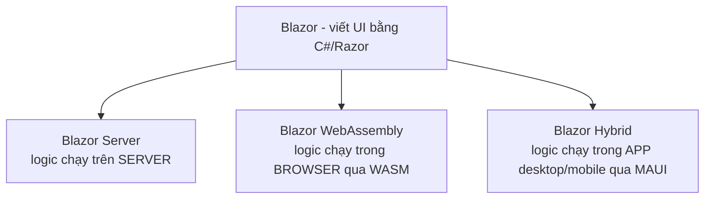
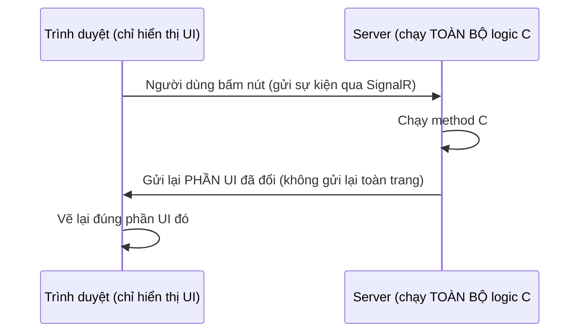
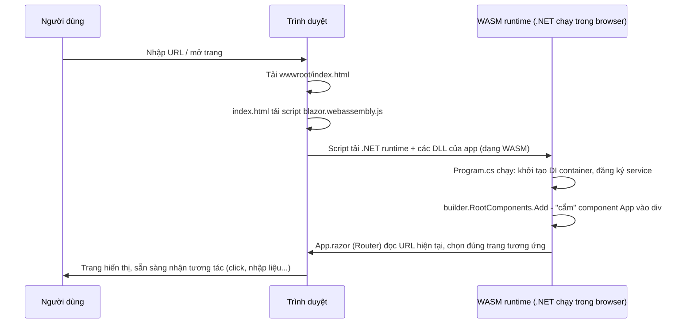

# Blazor là gì: Server vs WebAssembly vs Hybrid

!!! info "bạn đang ở đây · p7 → node `p7-overview` · Blazor/frontend"
    **cần trước:** bạn đã biết HTML/CSS cơ bản và C# từ P1 — chương này **không** giả định bạn đã từng học JavaScript hay bất kỳ framework frontend nào (React, Vue, Angular...). Nếu bạn chưa biết Blazor là gì, đây đúng là chỗ bắt đầu.
    **mở khoá:** hiểu vấn đề gốc Blazor giải quyết, phân biệt được 3 hosting model (Server/WebAssembly/Hybrid), và đọc được cấu trúc một dự án Blazor WebAssembly tối thiểu trước khi viết component đầu tiên ở chương sau.

> **Mục tiêu (đo được):** sau chương này bạn **giải thích** được vấn đề cụ thể Blazor giải quyết (team backend .NET phải học thêm JavaScript/framework riêng để làm frontend); **phân biệt** được Blazor Server, Blazor WebAssembly và Blazor Hybrid dựa trên nơi logic thực thi và cách UI được cập nhật; **nhận diện** được cấu trúc file tối thiểu của một dự án Blazor WebAssembly (`wwwroot`, `Program.cs`, `App.razor`, `_Imports.razor`); và **mô tả** được trình tự các bước xảy ra khi trình duyệt tải một trang Blazor WebAssembly lần đầu.

---

## 0. Đoán nhanh trước khi đọc

Trước khi xem đáp án, hãy tự trả lời (desirable difficulty — đoán sai vẫn giúp nhớ lâu hơn):

1. Blazor cho phép bạn viết UI web bằng ngôn ngữ nào, thay cho JavaScript?
2. Blazor Server chạy logic ứng dụng ở đâu — trên máy trình duyệt của người dùng, hay trên server?
3. Blazor WebAssembly có cần kết nối mạng liên tục để hoạt động sau khi đã tải xong không?
4. Blazor Server có thể chạy offline (không có mạng) không?
5. Blazor Hybrid dùng để xây loại ứng dụng nào — trang web công khai, hay app desktop/mobile?
6. Giữa Blazor Server và Blazor WebAssembly, cái nào tải trang lần đầu nhẹ hơn?
7. File nào trong dự án Blazor WebAssembly chứa điểm khởi động của ứng dụng, tương đương `Program.cs` bạn đã biết ở Web API?

??? note "Đáp án"
    1. **C#** (kết hợp với cú pháp Razor, một cú pháp trộn HTML và C#) — thay cho JavaScript.
    2. **Trên server** — Blazor Server chạy toàn bộ logic ứng dụng trên server, chỉ gửi phần thay đổi của UI về trình duyệt.
    3. **Không** — sau khi đã tải xong toàn bộ app và .NET runtime về trình duyệt, Blazor WebAssembly chạy hoàn toàn phía client, không cần server (trừ khi ứng dụng gọi API riêng để lấy dữ liệu).
    4. **Không** — Blazor Server bắt buộc phải có kết nối mạng liên tục (qua SignalR) để hoạt động, vì logic và trạng thái đang chạy trên server, mất kết nối là mất khả năng tương tác.
    5. **App desktop/mobile** — Blazor Hybrid dùng trong ứng dụng desktop (Windows, macOS) hoặc mobile (Android, iOS) thông qua .NET MAUI, không phải chạy trong trình duyệt như hai loại trên.
    6. **Blazor Server** — vì nó không cần tải cả .NET runtime xuống trình duyệt, chỉ tải một lượng HTML/CSS/JS nhỏ; Blazor WebAssembly phải tải thêm .NET runtime + DLL app nên nặng hơn ở lần đầu.
    7. **`Program.cs`** — đây là file chứa điểm khởi động, nơi khai báo builder, đăng ký service vào DI container, và chỉ định component gốc sẽ render vào đâu, đúng vai trò tương đương `Program.cs` của một Web API.

---

## 1. Vấn đề cụ thể: team backend .NET phải học thêm một ngôn ngữ/framework riêng để làm frontend

**Bối cảnh:** giả sử bạn là một lập trình viên đã thành thạo C# và ASP.NET Core (đã học qua P1–P6: model, EF Core, Web API, bảo mật, kiến trúc). Sản phẩm bạn đang xây cần một trang web cho người dùng tương tác — click nút, nhập form, thấy dữ liệu cập nhật ngay không cần load lại trang. Theo cách làm truyền thống (trước khi có Blazor), để làm được điều này bạn **phải** học thêm một hệ sinh thái hoàn toàn khác:

```text title="Chi phí chuyển ngữ cảnh khi KHÔNG có Blazor"
Backend (đã biết): C#, ASP.NET Core, Entity Framework Core, LINQ...
                          |
                          | -- cần thêm một stack HOÀN TOÀN KHÁC để làm frontend --
                          v
Frontend (phải học thêm): JavaScript/TypeScript, một trong React/Vue/Angular,
                           npm/webpack/Vite, JSX hoặc template syntax riêng,
                           cách quản lý state riêng của framework đó (Redux, Pinia...)
```

**Vấn đề không chỉ là "phải học thêm một ngôn ngữ".** Nó kéo theo hàng loạt chi phí cụ thể:

- **Hai bộ tư duy khác nhau cho cùng một sản phẩm:** C# là ngôn ngữ có kiểu tĩnh (statically typed), biên dịch trước khi chạy; JavaScript (không dùng TypeScript) là ngôn ngữ kiểu động, lỗi có thể chỉ xuất hiện lúc runtime. Một dev quen viết C# sẽ mất thời gian làm quen lại với việc "chương trình chạy được nhưng có thể sai âm thầm" — thứ mà compiler C# thường bắt được ngay.
- **Không tái dùng được code giữa backend và frontend:** một class C# `OrderValidator` viết ở backend để validate đơn hàng **không thể** gọi trực tiếp từ JavaScript ở frontend — phải viết lại logic validate y hệt bằng JavaScript (hoặc TypeScript) ở phía client, dẫn tới hai nơi giữ hai bản logic có thể lệch nhau theo thời gian.
- **Cần tuyển/đào tạo riêng vai trò "frontend developer":** với một team nhỏ chỉ có vài dev .NET, việc bắt buộc phải có người thành thạo React/Vue/Angular riêng làm tăng chi phí nhân sự, hoặc bắt mỗi dev backend phải tự học thêm một hệ sinh thái npm/webpack phức tạp chỉ để làm UI.
- **Hai bộ công cụ build/deploy khác nhau cho cùng một sản phẩm:** backend .NET dùng `dotnet build`/`dotnet publish`, quản lý package qua NuGet; một frontend JavaScript riêng cần thêm `npm install`/`npm run build`, quản lý package qua `package.json`, và thường cần một pipeline CI/CD **riêng** cho phần frontend (build ra file JS/CSS tĩnh) trước khi gộp lại với backend để deploy — tăng thêm số bước, số công cụ, số điểm có thể lỗi trong quy trình phát hành sản phẩm.

**Ví dụ cụ thể chi phí thời gian (minh hoạ mức độ, không phải số liệu tuyệt đối):** một dev .NET có kinh nghiệm 2 năm với C#/ASP.NET Core, nếu phải học đủ để tự làm frontend production-ready bằng React (JSX, hook, quản lý state, styling, tooling build) thường cần **vài tuần đến vài tháng** làm quen, tuỳ độ phức tạp UI cần làm — trong khi với Blazor, cùng một dev có thể bắt đầu viết component tương tác được **trong vài giờ đến vài ngày**, vì cú pháp Razor và tư duy component không đòi hỏi học lại ngôn ngữ lập trình, chỉ cần học thêm một số directive mới (`@onclick`, `@bind`...) sẽ được giới thiệu ở chương sau — đây chính là "chi phí chuyển ngữ cảnh" cụ thể mà Blazor loại bỏ.

**Định nghĩa Blazor (một câu, giả định bạn chưa biết khái niệm này):** Blazor là một **framework của .NET** cho phép bạn viết UI web bằng **C# và Razor** (cú pháp trộn HTML với C#) thay cho JavaScript, và ứng dụng chạy trên **.NET runtime** (không phải Node.js hay trình duyệt engine JavaScript thuần) — nghĩa là một dev đã biết C#/ASP.NET Core có thể viết frontend mà **không cần** học React/Vue/Angular hay cú pháp JavaScript.

```razor title="DemoBoDem.razor"
@* Ví dụ tối thiểu, độc lập: một component Blazor hiển thị số lần bấm nút.
   Toàn bộ logic viết bằng C# trong @code{}, không có một dòng JavaScript nào. *@
<h3>Số lần đã bấm: @soLanBam</h3>
<button @onclick="TangSoLan">Bấm vào đây</button>

@code {
    private int soLanBam = 0;

    private void TangSoLan()
    {
        soLanBam++; // logic C# thuần, chạy trên .NET runtime, không phải JS
    }
}
```

Quan sát mấu chốt: `@onclick="TangSoLan"` gắn một **method C#** (`TangSoLan`) vào sự kiện click của nút — không phải một hàm JavaScript. Khi người dùng bấm nút, Blazor tự động gọi lại method C# đó, cập nhật biến `soLanBam`, rồi tự vẽ lại phần `<h3>` có chứa `@soLanBam` — toàn bộ vòng lặp "bấm nút → chạy logic → cập nhật UI" xảy ra mà bạn chưa viết bất kỳ dòng JavaScript nào.

**Vì sao đây không chỉ là "cú pháp lạ" mà là một mô hình lập trình khác hẳn:** với HTML/CSS/JavaScript truyền thống bạn đã biết, để làm được đúng ví dụ trên (đếm số lần bấm và cập nhật chữ trên màn hình), bạn cần viết tối thiểu ba việc riêng biệt bằng JavaScript: (1) lấy tham chiếu tới thẻ `<h3>` bằng `document.querySelector` hoặc tương tự, (2) gắn sự kiện `addEventListener('click', ...)` vào nút, và (3) trong hàm xử lý, tự tay gọi `element.textContent = ...` để cập nhật lại nội dung hiển thị. Với Blazor, bạn **chỉ viết logic** (`soLanBam++`) — việc "tìm đúng phần DOM cần cập nhật và ghi lại nội dung mới" do Blazor tự làm thông qua một cơ chế gọi là **render tree diffing** (so sánh cây UI cũ và mới, chỉ cập nhật phần khác biệt), bạn không cần tự viết dòng nào cho việc đó.

**Điều gì xảy ra khi hiểu sai — tưởng phải tự cập nhật DOM như JavaScript:** nếu một dev mới học Blazor vẫn giữ tư duy JavaScript, cố tình tự gọi `IJSRuntime` để tự tay sửa nội dung `<h3>` sau khi tăng `soLanBam` (ví dụ gọi `InvokeVoidAsync("document.querySelector('h3').textContent = ...")`), họ đang làm **thừa** một việc Blazor đã tự động làm — và tệ hơn, việc tự sửa DOM bằng JavaScript bên ngoài có thể làm Blazor "mất đồng bộ" giữa cây UI nó đang theo dõi trong bộ nhớ và DOM thật trên trình duyệt, dẫn tới các lần render sau hiển thị sai giá trị (Blazor ghi đè lại theo trạng thái nó nhớ, không phải theo DOM đã bị sửa tay).

**Ví dụ tối thiểu thứ hai — trộn HTML và biểu thức C# ngay trong nội dung hiển thị (không phải xử lý sự kiện):** ví dụ trên đã cho thấy `@onclick`, còn đây là cách một biểu thức C# (`@bienSo`, `@(...)`) được chèn thẳng vào HTML để hiển thị giá trị tính toán, không cần một dòng JavaScript hay một hàm build/template riêng nào:

```razor title="DemoTinhThue.razor"
@* Component tối thiểu khác: chỉ minh hoạ việc CHÈN kết quả một biểu thức C#
   ngay trong HTML - không có sự kiện, không có form, để tách bạch với ví dụ trên. *@
<p>Giá gốc: @giaGoc VNĐ</p>
<p>Thuế (10%): @(giaGoc * 0.1m) VNĐ</p>
<p>Tổng cộng: @(giaGoc * 1.1m) VNĐ</p>

@code {
    private decimal giaGoc = 100000m; // logic C# thuần, không phải chuỗi template JS
}
```

Quan sát: cú pháp `@bienSo` (biến đơn) và `@(bieuThuc)` (biểu thức phức tạp hơn, cần đặt trong dấu ngoặc) đều là cách Razor **chèn giá trị C#** vào giữa HTML thông thường — hoàn toàn khác với việc trong JavaScript bạn phải tự nối chuỗi (`"Giá gốc: " + giaGoc + " VNĐ"`) hoặc dùng một cú pháp template riêng của framework (như JSX của React). Đây chỉ là ví dụ minh hoạ cú pháp trộn HTML/C#; cách dùng data binding hai chiều đầy đủ (`@bind`) và các directive khác sẽ học chi tiết ở chương "component cơ bản" kế tiếp — chương này chỉ cần bạn nhận ra **hình dạng chung** của một file `.razor`.

---

## 2. Ba hosting model: nơi logic chạy và cách UI được cập nhật khác nhau thế nào

Blazor không chỉ có **một** cách chạy — cùng một cú pháp component (`.razor`, `@code{}`, `@onclick`...) có thể được **host** (lưu trú/thực thi) theo 3 cách khác nhau, tuỳ vào việc bạn cần gì: tải trang nhanh, chạy offline được, hay đóng gói thành app desktop. Mục 2–4 sẽ định nghĩa và cho tình huống dùng riêng của **từng** loại trước khi so sánh ở mục 5.



**Vì sao "hosting model" là từ đúng để gọi ba lựa chọn này, không phải "phiên bản" hay "ngôn ngữ khác nhau":** cả ba đều dùng **cùng một cú pháp Razor**, cùng khái niệm component, cùng cách viết `@code{}` — không có chuyện "học Blazor Server" và "học Blazor WebAssembly" là hai kỹ năng tách biệt hoàn toàn cần học lại từ đầu. Sự khác biệt chỉ nằm ở **nơi đoạn code C# đó thực thi** (server, trình duyệt qua WASM, hay tiến trình app native) và **cách UI được đồng bộ về phía người dùng** (qua SignalR, tự vẽ lại trong trình duyệt, hay tự vẽ lại trong app native) — đây chính là lý do gọi là "hosting model" (mô hình lưu trú/vận hành), không phải "phiên bản Blazor khác nhau".

**Vì sao cần học cả 3, dù chương sau chỉ dùng 1 (WebAssembly):** trong công việc thực tế, quyết định hosting model thường là quyết định **đầu tiên và khó đổi nhất** của một dự án Blazor (đã nhấn chi tiết ở mục 10) — một dev chỉ biết mỗi Blazor WebAssembly có thể vô tình đề xuất sai công nghệ khi gặp một yêu cầu thực ra phù hợp hơn với Server hoặc Hybrid. Việc chương này dùng WebAssembly cho các ví dụ tiếp theo (mục 7–8) chỉ vì lý do sư phạm (chạy độc lập, dễ minh hoạ, không cần cấu hình SignalR) — không có nghĩa WebAssembly luôn là lựa chọn đúng cho mọi dự án thật.

---

## 3. Blazor Server: logic chạy trên server, UI đồng bộ qua SignalR

**Định nghĩa (một câu, giả định bạn chưa biết khái niệm này):** Blazor Server là hosting model trong đó **toàn bộ logic ứng dụng chạy trên server** — trình duyệt chỉ hiển thị UI và gửi sự kiện (click, nhập liệu) về server qua một kết nối **SignalR** liên tục, server xử lý xong rồi gửi lại đúng phần UI cần thay đổi (không phải toàn trang) cho trình duyệt vẽ lại.



**Tình huống nên dùng Blazor Server:** một ứng dụng nội bộ công ty (ví dụ dashboard quản lý nhân viên), người dùng luôn có mạng nội bộ ổn định, và bạn muốn trang **tải lần đầu rất nhanh** — vì trình duyệt chỉ cần tải một lượng HTML/CSS/JS nhỏ (không cần tải cả .NET runtime), phần nặng (logic C#) đã chạy sẵn trên server.

**Ưu điểm cụ thể:** tải trang lần đầu nhanh (không phải tải .NET runtime xuống máy người dùng); toàn bộ code C# chạy trên server nên **không** lộ mã nguồn nghiệp vụ ra trình duyệt (người dùng không thể mở DevTools xem logic xử lý).

**Nhược điểm cụ thể — và điều gì xảy ra khi dùng sai ngữ cảnh:** nếu bạn triển khai Blazor Server cho một ứng dụng mà người dùng dùng ở nơi mạng chập chờn (ví dụ nhân viên bán hàng dùng tablet di chuyển ngoài trời, sóng 4G yếu), mất kết nối SignalR dù chỉ vài giây sẽ khiến toàn bộ trang **ngừng phản hồi** — nút bấm không còn hoạt động, vì máy chủ không nhận được sự kiện và trình duyệt không nhận được UI cập nhật. Trình duyệt thường hiện thông báo dạng:

```text title="Hành vi thực tế khi mất kết nối SignalR trong Blazor Server"
Attempting to reconnect to the server...
--> Toàn bộ trang bị PHỦ một lớp overlay mờ, mọi nút bấm/input KHÔNG còn phản hồi
    cho đến khi kết nối SignalR được thiết lập lại (hoặc người dùng phải tải lại trang).
```

Đây chính là lý do Blazor Server **không phù hợp** với ứng dụng cần chạy offline hoặc cho người dùng ở khu vực mạng không ổn định.

**Độ trễ (latency) người dùng cảm nhận được cho MỖI lần tương tác:** vì mỗi lần bấm nút phải đi một vòng "trình duyệt → server → trình duyệt" qua mạng, người dùng luôn cảm nhận một khoảng trễ nhỏ (thường vài chục đến vài trăm milliseconds tuỳ khoảng cách mạng) cho **mỗi** hành động, khác với việc xử lý ngay tại chỗ. Với mạng nội bộ tốc độ cao, độ trễ này gần như không nhận ra; nhưng với người dùng ở xa server (ví dụ server đặt tại một trung tâm dữ liệu, người dùng ở một khu vực địa lý khác), độ trễ này có thể đủ lớn để cảm nhận được sự "khác một nhịp" giữa lúc bấm và lúc UI phản hồi.

```text title="Độ trễ tương tác - Blazor Server so với chạy client-side"
Blazor Server:      Bấm nút -> gửi qua mạng tới server -> xử lý -> gửi UI mới về qua mạng
                     -> có độ trễ mạng CHO MỖI lần tương tác, dù nhỏ.
Blazor WebAssembly: Bấm nút -> xử lý NGAY trong trình duyệt -> UI cập nhật ngay
                     -> không có độ trễ mạng cho việc XỬ LÝ UI (chỉ có khi gọi API riêng).
```

**Khái niệm "circuit" — mỗi phiên làm việc là một kết nối riêng biệt:** trong Blazor Server, mỗi khi một người dùng mở trang, server tạo ra một **circuit** (một phiên làm việc SignalR riêng, gắn với đúng người dùng đó, giữ trạng thái UI hiện tại của họ). Nếu người dùng mở app trên hai tab trình duyệt khác nhau, đó là **hai circuit riêng biệt**, dù cùng một người, cùng một tài khoản đăng nhập — mỗi tab có trạng thái UI của riêng nó trên server, độc lập với tab kia. Khi người dùng đóng tab hoặc mất kết nối quá lâu (vượt quá thời gian chờ mặc định để reconnect), server sẽ **giải phóng** circuit đó (xoá trạng thái UI khỏi bộ nhớ) để không giữ tài nguyên mãi cho một phiên không còn ai dùng.

**Chi phí server cần cân nhắc:** vì mỗi người dùng đang mở một trang Blazor Server đều chiếm một **kết nối SignalR còn sống** trên server (kèm theo trạng thái UI của riêng người đó được giữ trong bộ nhớ server để biết "render tree hiện tại đang là gì" nhằm tính ra phần khác biệt cần gửi về), số lượng người dùng đồng thời tăng lên đồng nghĩa **bộ nhớ và tài nguyên server** cũng tăng theo tương ứng — khác với một trang API/HTML tĩnh thông thường (gần như không giữ trạng thái riêng cho từng người dùng giữa các request). Đây là lý do Blazor Server phù hợp hơn với số lượng người dùng đồng thời có thể dự đoán được (ví dụ ứng dụng nội bộ vài trăm nhân viên) hơn là một trang public có thể đột ngột có hàng chục nghìn người truy cập cùng lúc.

```text title="Hình dung chi phí bộ nhớ server tăng theo số người dùng đồng thời (Blazor Server)"
10 người dùng đang mở trang    -> server giữ 10 kết nối SignalR + 10 bản trạng thái UI
10,000 người dùng đang mở trang -> server giữ 10,000 kết nối SignalR + 10,000 bản trạng thái UI
--> Cần lập kế hoạch hạ tầng server (RAM, số instance) DỰA TRÊN số người dùng đồng thời dự kiến,
    không chỉ dựa trên lưu lượng request như một Web API thông thường.
```

---

## 4. Blazor WebAssembly: toàn bộ app + .NET runtime tải xuống browser, chạy hoàn toàn client-side

**Định nghĩa (một câu, giả định bạn chưa biết khái niệm này):** Blazor WebAssembly (viết tắt WASM) là hosting model trong đó **toàn bộ ứng dụng của bạn cùng với một bản .NET runtime thu nhỏ được tải xuống trình duyệt** (qua công nghệ WebAssembly — một định dạng mã máy trình duyệt hiểu được, không phải JavaScript), và sau khi tải xong, ứng dụng **chạy hoàn toàn trong trình duyệt**, không cần gửi request nào về server để xử lý logic (server chỉ cần thiết nếu app của bạn gọi API riêng để lấy/lưu dữ liệu).

```mermaid title="Blazor WebAssembly - tải một lần, chạy hoàn toàn client-side"
sequenceDiagram
    participant B as Trình duyệt
    participant S as Web server (chỉ phục vụ file tĩnh)
    B->>S: Tải trang lần đầu (HTML + .NET runtime + DLL app dạng WASM)
    S->>B: Trả về toàn bộ file cần thiết
    Note over B: Từ đây, .NET runtime đã chạy TRONG trình duyệt
    B->>B: Người dùng bấm nút -> method C# chạy NGAY trong browser, KHÔNG gửi request về server
    B->>B: UI cập nhật ngay, không cần chờ mạng
```

**Tình huống nên dùng Blazor WebAssembly:** một ứng dụng public trên internet mà bạn muốn người dùng vẫn tương tác được (ít nhất với dữ liệu đã tải) khi mạng chập chờn, hoặc một Progressive Web App (PWA) có thể cài lên máy và mở lại mà không cần mạng để hiển thị UI cơ bản.

**Ưu điểm cụ thể:** sau khi đã tải xong lần đầu, ứng dụng **chạy offline được** đối với phần logic UI thuần (không cần gọi API); giảm tải cho server vì server không còn phải chạy logic UI cho từng người dùng — server (nếu có) chỉ đóng vai trò một Web API bình thường.

**Nhược điểm cụ thể — và điều gì xảy ra khi dùng sai ngữ cảnh:** nếu bạn triển khai Blazor WebAssembly cho một trang mà người dùng chỉ ghé xem một lần rồi rời đi ngay (ví dụ landing page marketing), họ phải **chờ tải xuống** toàn bộ .NET runtime + DLL ứng dụng (dung lượng ban đầu thường vài MB, dù có cơ chế cache cho lần sau) trước khi trang tương tác được — với mạng chậm, người dùng có thể thấy trang trắng vài giây, tệ hơn nhiều so với một trang HTML/JavaScript nhỏ tải gần như ngay lập tức. Đây là đánh đổi ngược lại với Blazor Server ở mục 3: WASM tải lần đầu **nặng hơn**, đổi lại **không cần mạng liên tục** sau đó.

```text title="Đánh đổi cụ thể: tải lần đầu nặng hơn Blazor Server"
Blazor Server:      tải lần đầu NHẸ (chỉ UI nhỏ)  | nhưng CẦN mạng liên tục để dùng được
Blazor WebAssembly: tải lần đầu NẶNG HƠN (cả .NET runtime) | nhưng chạy OFFLINE được sau đó
```

**Vì sao server "nhẹ tải" hơn khi dùng WebAssembly:** một khi ứng dụng đã tải xong xuống trình duyệt, mọi lần bấm nút/tương tác đều **không cần gửi gì về server** để xử lý UI — server (nếu ứng dụng có gọi API) chỉ nhận đúng các request lấy/lưu dữ liệu thật (giống một Web API bình thường bạn đã học ở P3), không còn phải giữ trạng thái UI hay kết nối SignalR riêng cho từng người dùng như Blazor Server ở mục 3. Điều này khiến việc mở rộng quy mô (scale) cho nhiều người dùng đồng thời **đơn giản hơn** — server chỉ cần xử lý các request API rời rạc, không phải giữ hàng nghìn kết nối sống liên tục.

**Điều gì xảy ra khi hiểu sai — tưởng Blazor WebAssembly không cần server bao giờ:** một dev mới học có thể hiểu nhầm "chạy hoàn toàn client-side" nghĩa là ứng dụng **không cần server nào cả** trong mọi trường hợp. Điều này chỉ đúng cho ứng dụng thuần túy tính toán/hiển thị (ví dụ máy tính đổi đơn vị, ghi chú cá nhân lưu trong trình duyệt). Ngay khi ứng dụng cần lưu dữ liệu dùng chung nhiều người, xác thực người dùng, hoặc gọi tới một cơ sở dữ liệu — vẫn cần một **Web API server-side riêng** để Blazor WebAssembly gọi tới (qua `HttpClient`, giống cách bạn đã gọi API ở P3), server đó chỉ đơn giản là **không chạy logic UI** nữa, không phải "không có server nào tồn tại".

```text title="Web server phục vụ file tĩnh KHÔNG giống Web API xử lý logic nghiệp vụ"
Web server cho Blazor WebAssembly: chỉ trả về file TĨNH (index.html, .wasm, .dll)
                                    -> không chạy logic nghiệp vụ nào của app
Web API riêng (nếu app cần):        nhận request từ HttpClient trong trình duyệt,
                                    xử lý logic nghiệp vụ, đọc/ghi database
--> Hai vai trò KHÁC NHAU, có thể là hai dự án ASP.NET Core riêng, hoặc cùng một dự án
    cấu hình phục vụ cả hai (nhưng logic vẫn tách biệt rõ theo vai trò).
```

**Loại server nào đủ để "host" một dự án Blazor WebAssembly đã publish:** vì server chỉ cần trả file tĩnh (HTML/CSS/JS/WASM/DLL), bạn **không** cần một server ASP.NET Core chạy .NET để host một app Blazor WebAssembly đã build/publish xong — bất kỳ static file host nào cũng đủ: một Nginx đơn giản, GitHub Pages, Azure Static Web Apps, hay thậm chí một thư mục được phục vụ qua CDN. Đây là điểm khác biệt then chốt với Blazor Server (mục 3), nơi **bắt buộc** phải có một tiến trình ASP.NET Core đang chạy liên tục (để duy trì circuit/SignalR) — không thể host Blazor Server trên một static file host thông thường.

```text title="Yêu cầu hạ tầng để HOST (không phải để PHÁT TRIỂN) mỗi hosting model"
Blazor Server:      BẮT BUỘC một server ASP.NET Core đang CHẠY LIÊN TỤC (giữ circuit/SignalR)
Blazor WebAssembly: CHỈ CẦN một static file host (Nginx, CDN, GitHub Pages...) - không cần .NET
                     chạy trên server để host phần UI (Web API riêng, nếu có, là chuyện khác)
```

**Kích thước tải xuống thực tế và cách giảm nhẹ:** dung lượng cần tải cho lần đầu phụ thuộc vào số lượng thư viện/package ứng dụng dùng — một app tối thiểu (không thêm thư viện ngoài) thường tải vài MB, nhưng con số này tăng lên nếu bạn tham chiếu thêm nhiều NuGet package. .NET có một số kỹ thuật giảm nhẹ (nằm ngoài phạm vi "core" của chương này, chỉ cần biết chúng tồn tại): "trimming" (loại bỏ code không dùng tới khỏi bản build cuối) và "AOT compilation" (biên dịch trước sang mã máy thay vì để runtime dịch lúc chạy, đổi lại thời gian build lâu hơn). Việc quyết định có cần áp dụng các kỹ thuật này hay không chỉ nên đặt ra **sau khi** đã đo được kích thước tải xuống thực tế là vấn đề gây khó chịu cho người dùng — không nên tối ưu trước khi có số liệu thật.

---

## 5. Blazor Hybrid: dùng trong app desktop/mobile qua .NET MAUI, không phải web

**Định nghĩa (một câu, giả định bạn chưa biết khái niệm này):** Blazor Hybrid là cách nhúng component Blazor (`.razor`, cùng cú pháp bạn viết cho web) vào **bên trong một ứng dụng desktop (Windows, macOS) hoặc mobile (Android, iOS) được xây bằng .NET MAUI** — component chạy trong một khung nhìn web nhúng (`BlazorWebView`) ngay trong ứng dụng gốc (native app), **không** chạy trong trình duyệt như hai loại ở mục 3–4, và không cần người dùng mở browser để dùng.

```mermaid title="Blazor Hybrid - component Blazor chạy trong app desktop/mobile qua MAUI"
graph LR
    App["Ứng dụng MAUI (desktop/mobile, cài đặt như app bình thường)"]
    App --> WebView["BlazorWebView (khung nhìn web NHÚNG trong app)"]
    WebView --> Comp["Component .razor - CHẠY TRỰC TIẾP trên máy người dùng,<br/>logic C# chạy native, không qua trình duyệt ngoài"]
```

**Tình huống nên dùng Blazor Hybrid:** bạn đã có sẵn các component Blazor viết cho web (ví dụ từ một dự án Blazor WebAssembly khác), và muốn **tái dùng** phần lớn UI đó để đóng gói thành một app desktop cài trên Windows/macOS, hoặc app mobile trên điện thoại, mà không cần viết lại UI bằng công nghệ native riêng của từng nền tảng (WPF cho Windows, SwiftUI cho macOS/iOS...).

**Điểm khác biệt cốt lõi so với Server/WebAssembly:** Blazor Hybrid **không phải một trang web** — người dùng không mở trình duyệt và nhập URL để dùng; họ mở một ứng dụng đã cài trên máy/điện thoại, giống Word hay một app mobile bình thường, chỉ khác là bên trong app đó, phần UI được vẽ bằng công nghệ Blazor thay vì UI native của nền tảng.

**Vì sao Blazor Hybrid vẫn có thể truy cập được API/tài nguyên của thiết bị (camera, GPS, file hệ thống):** vì component Blazor Hybrid chạy **ngay trong tiến trình ứng dụng MAUI native**, không bị "giam" trong một trình duyệt như Server/WebAssembly, nó có thể gọi trực tiếp các API của .NET MAUI để truy cập camera, cảm biến GPS, hệ thống file của thiết bị — những thứ mà một trang web thông thường trong trình duyệt (Server/WebAssembly) chỉ truy cập được qua các API giới hạn của trình duyệt (nếu trình duyệt cho phép, và thường cần người dùng cấp quyền qua hộp thoại riêng của trình duyệt).

**Điều gì xảy ra khi hiểu sai — tưởng Blazor Hybrid là một cách deploy web khác:** nếu một dev nghĩ Blazor Hybrid chỉ là "Blazor WebAssembly nhưng nhanh hơn" và cố gắng host nó qua một địa chỉ web (URL) để nhiều người dùng truy cập từ xa, họ sẽ thấy vô nghĩa — Blazor Hybrid được đóng gói và phân phối như một **ứng dụng cài đặt** (installer `.exe`/`.msi` cho Windows, hoặc app từ App Store/Play Store cho mobile), không có khái niệm "một địa chỉ web nhiều người cùng truy cập" giống Server/WebAssembly. Mỗi người dùng cần tự cài app đó lên máy/điện thoại của họ.

**Khi nào KHÔNG nên chọn Blazor Hybrid dù đang cần app desktop/mobile:** nếu nhóm phát triển **chưa từng** viết component Blazor nào trước đó, và mục tiêu chỉ là làm một app desktop/mobile đơn giản, việc học cả .NET MAUI (cách đóng gói, publish app, cấu hình từng nền tảng) **cộng thêm** Blazor/Razor cùng lúc có thể là gánh nặng học tập không cần thiết — một công nghệ UI native đơn giản hơn (ví dụ WinForms cho một tool nội bộ Windows-only) có thể nhanh hơn để hoàn thành. Blazor Hybrid đáng giá nhất khi bạn **đã có sẵn** một bộ component Blazor (từ dự án WebAssembly/Server khác) và muốn tái dùng, tiết kiệm công viết lại UI.

**Hình dạng code khai báo `BlazorWebView` trong một trang MAUI (chỉ để thấy component `.razor` được "gắn" vào app native thế nào, không cần nhớ cú pháp MAUI chi tiết):**

```text title="MainPage.xaml (rút gọn) - khai báo BlazorWebView trong app MAUI"
<ContentPage>
    <BlazorWebView HostPage="wwwroot/index.html">
        <BlazorWebView.RootComponents>
            <!-- Chính component Routes (tương tự App.razor ở mục 7) được "gắn"
                 vào khung nhìn BlazorWebView này -->
            <RootComponent Selector="#app" ComponentType="{x:Type local:Routes}" />
        </BlazorWebView.RootComponents>
    </BlazorWebView>
</ContentPage>
```

Quan sát: cú pháp khai báo `RootComponent Selector="#app"` ở đây **giống hệt về bản chất** với `builder.RootComponents.Add<App>("#app")` đã học ở mục 7 cho Blazor WebAssembly — cả hai đều là cách "cắm" một component gốc vào một điểm neo trong HTML (`#app`). Đây chính là điểm khiến việc học Blazor Hybrid **dễ dàng hơn nhiều** nếu bạn đã quen Blazor WebAssembly/Server trước — phần lõi Razor/component không đổi, chỉ đổi cách nó được host (từ trình duyệt độc lập sang một khung nhìn nhúng trong app MAUI).

**So sánh nhanh cấu trúc dự án Blazor Hybrid (MAUI) với Blazor WebAssembly (mục 7) — chỉ để thấy phần lõi không đổi:**

| Khía cạnh | Blazor WebAssembly (mục 7) | Blazor Hybrid (MAUI) |
|-----------|------------------------------|-------------------------|
| File chứa component `.razor` | Cùng dự án, thư mục `Pages/`, `Shared/`... | Giống hệt — cùng cú pháp `.razor`, thường đặt trong một project "RazorClassLibrary" dùng chung |
| Nơi "cắm" component gốc | `Program.cs` gọi `builder.RootComponents.Add<App>("#app")` | File `.xaml` của MAUI khai báo `<RootComponent Selector="#app" ... />` |
| Nơi chạy logic C# | Trình duyệt, qua .NET WASM runtime | Trực tiếp trong tiến trình app MAUI, qua .NET runtime native của nền tảng |
| Đóng gói/phân phối | File tĩnh trên một web server (mục 4) | Installer/app store riêng cho từng nền tảng (Windows, Android, iOS...) |

---

## 6. So sánh 3 hosting model — chỉ đưa ra SAU khi đã hiểu riêng từng loại ở mục 3–5

| Khía cạnh | Blazor Server | Blazor WebAssembly | Blazor Hybrid |
|-----------|----------------|----------------------|----------------|
| Logic chạy ở đâu | Trên server | Trong trình duyệt (qua WASM) | Trong app desktop/mobile (qua MAUI) |
| Cách UI cập nhật | Server gửi diff UI qua SignalR | Browser tự vẽ lại, không cần server | App tự vẽ lại, không cần server |
| Cần mạng liên tục? | **Có** — mất kết nối là mất tương tác | Không, sau khi đã tải xong lần đầu | Không — chạy như app native trên máy |
| Tải lần đầu | Nhẹ (chỉ UI nhỏ) | Nặng hơn (cả .NET runtime) | Không áp dụng — cài như app, không "tải trang" |
| Chạy trong | Trình duyệt, cần server đang chạy | Trình duyệt, không cần server (trừ khi gọi API) | Ứng dụng desktop/mobile đã cài, không cần trình duyệt ngoài |
| Bảo mật mã nguồn C# | Cao — code chỉ chạy trên server, không tải xuống máy người dùng | Thấp hơn — toàn bộ DLL tải xuống trình duyệt, có thể decompile lại | Cao — code chạy native trong app đã cài, không phát tán qua URL công khai |
| Chi phí hạ tầng server khi tăng người dùng đồng thời | Tăng theo số kết nối SignalR + trạng thái UI giữ trong bộ nhớ (mục 3) | Gần như không đổi — server chỉ trả file tĩnh/API rời rạc (mục 4) | Không áp dụng — mỗi máy người dùng tự chạy, không dùng chung server |
| Ví dụ phù hợp | Dashboard nội bộ, mạng ổn định | App public cần dùng được khi mạng chập chờn/offline | Đóng gói UI Blazor có sẵn thành app Windows/macOS/mobile |

**Điều gì xảy ra khi chọn nhầm hosting model:** một team chọn Blazor Server cho một ứng dụng mobile-first mà người dùng thường xuyên ở vùng sóng yếu sẽ nhận vô số báo cáo "app bị đứng, nút không bấm được" — đúng hệ quả đã nêu ở mục 3, vì bản chất Blazor Server phụ thuộc kết nối liên tục. Ngược lại, một team chọn Blazor WebAssembly cho một trang nội bộ chỉ dùng trong mạng LAN công ty, tải nhanh không quan trọng bằng bảo mật mã nguồn, sẽ vô tình để lộ toàn bộ DLL ứng dụng (có thể decompile để xem lại code C#) xuống máy mọi nhân viên — điều Blazor Server (mục 3) tránh được vì logic không rời khỏi server.

**Câu hỏi quyết định nhanh (checklist) trước khi chọn hosting model cho một dự án mới:**

- Người dùng của bạn có mạng ổn định, liên tục trong suốt thời gian dùng app không? Nếu **có** và bảo mật mã nguồn quan trọng hơn tốc độ tải lần đầu -> nghiêng về **Blazor Server**.
- Người dùng có thể ở nơi mạng chập chờn, hoặc cần dùng được một phần khi mất mạng không? Nếu **có** -> nghiêng về **Blazor WebAssembly**.
- Sản phẩm cuối cùng có phải là một ứng dụng cài đặt trên máy/điện thoại (không mở qua trình duyệt) không? Nếu **có** -> nghiêng về **Blazor Hybrid**.
- Số lượng người dùng đồng thời có thể tăng đột biến, khó dự đoán không? Nếu **có** -> Blazor WebAssembly thường dễ mở rộng hơn Blazor Server, vì không giữ trạng thái/kết nối riêng cho từng người dùng trên server (đã nêu ở mục 3–4).

Không có câu trả lời nào là "luôn đúng cho mọi dự án" — checklist này chỉ giúp bạn áp đúng đặc điểm đã học ở mục 3–5 vào một tình huống cụ thể, thay vì chọn theo cảm tính hoặc theo công nghệ "nghe có vẻ mới hơn".

**Ví dụ áp checklist vào một tình huống cụ thể — hệ thống quản lý ca làm việc nội bộ:** một công ty sản xuất có 200 nhân viên văn phòng, tất cả dùng máy tính nối mạng LAN nội bộ ổn định, cần một hệ thống xem/đăng ký ca làm việc. Áp checklist: (1) mạng ổn định, liên tục — có; (2) không cần dùng offline — không cần WebAssembly; (3) không cần đóng gói app cài đặt riêng — không cần Hybrid; (4) số người dùng đồng thời cố định, dễ dự đoán (tối đa 200) — không cần lo ngại chi phí scale của Server. Kết luận: **Blazor Server** là lựa chọn phù hợp nhất, vì tận dụng đúng ưu điểm (tải nhanh, bảo mật mã nguồn) mà không vướng nhược điểm (cần mạng liên tục, chi phí scale) trong đúng ngữ cảnh này.

---

## 7. Cấu trúc dự án Blazor WebAssembly tối thiểu

Từ chương sau, các ví dụ sẽ dùng Blazor WebAssembly (phù hợp học vì chạy độc lập, không cần cấu hình SignalR/server). Trước khi viết component đầu tiên, cần nhận diện đúng vai trò của từng file trong một dự án Blazor WebAssembly tối thiểu (tạo bằng `dotnet new blazorwasm`):

```text title="Cấu trúc dự án Blazor WebAssembly tối thiểu"
MyBlazorApp/
├── wwwroot/          <- thư mục chứa file TĨNH (index.html, CSS, ảnh, font...)
│   └── index.html    <- trang HTML gốc DUY NHẤT mà trình duyệt tải đầu tiên
├── Program.cs         <- điểm khởi động app, cấu hình DI container
├── App.razor          <- component GỐC, định nghĩa routing (điều hướng URL -> trang nào)
└── _Imports.razor     <- danh sách using dùng CHUNG cho mọi component trong thư mục
```

Mỗi file, một câu vai trò:

- **`wwwroot/`** là thư mục chứa mọi **file tĩnh** (không do C# sinh ra lúc chạy) — HTML gốc, CSS, hình ảnh, font — được trình duyệt tải trực tiếp giống một trang web HTML/CSS thông thường bạn đã biết.
- **`wwwroot/index.html`** là **trang HTML duy nhất** mà trình duyệt thực sự tải khi người dùng vào ứng dụng — nó chứa một thẻ `<div id="app">...</div>` rỗng ban đầu, nơi Blazor sẽ "cắm" (render) toàn bộ UI của component gốc vào sau khi .NET runtime tải xong; nó cũng là nơi khai báo script tải WASM runtime (`_framework/blazor.webassembly.js`).
- **`Program.cs`** là **điểm khởi động** của ứng dụng — nơi bạn khai báo `WebAssemblyHostBuilder`, đăng ký các service vào DI container (giống `Program.cs` của một ASP.NET Core Web API bạn đã học ở P3), và chỉ định component gốc (`App`) sẽ được render vào đâu trong `index.html`.
- **`App.razor`** là **component gốc** của toàn bộ ứng dụng — nó chứa `<Router>`, thành phần chịu trách nhiệm đọc URL hiện tại trên trình duyệt và quyết định **component/trang nào** (page) sẽ được hiển thị tương ứng, tương tự khái niệm routing bạn đã biết ở Web API (P3) nhưng áp dụng cho việc hiển thị UI thay vì trả JSON.
- **`_Imports.razor`** là file chứa danh sách `@using` (tương đương `using` trong C#) được áp dụng **chung** cho mọi file `.razor` nằm trong cùng thư mục (và thư mục con) — tránh phải lặp lại cùng một danh sách `@using` ở đầu mỗi component.

**Cấu trúc đầy đủ hơn (những gì `dotnet new blazorwasm` thực tế sinh ra, ngoài 4 file tối thiểu ở trên) — chỉ liệt kê tên và vai trò một câu, chi tiết cách viết component sẽ học ở chương sau:**

```text title="Cấu trúc dự án Blazor WebAssembly đầy đủ hơn (dotnet new blazorwasm sinh ra)"
MyBlazorApp/
├── wwwroot/
│   ├── index.html        <- đã giải thích ở trên
│   ├── css/
│   │   └── app.css        <- CSS TĨNH áp dụng cho toàn app, viết như CSS thông thường
│   ├── sample-data/        <- (nếu có) dữ liệu mẫu tĩnh dạng JSON để demo
│   └── favicon.ico         <- icon hiển thị trên tab trình duyệt, giống mọi trang web khác
├── Pages/
│   ├── Home.razor          <- một TRANG cụ thể, có khai báo "@page "/"" ở đầu file
│   └── Counter.razor       <- một trang khác, ví dụ "@page "/counter""
├── Shared/
│   ├── MainLayout.razor    <- LAYOUT dùng chung (khung sườn: menu, header) cho nhiều trang
│   └── NavMenu.razor       <- component menu điều hướng, dùng lại trong MainLayout
├── Program.cs
├── App.razor
├── _Imports.razor
└── MyBlazorApp.csproj      <- file cấu hình project (giống .csproj của một project C# bất kỳ)
```

- **`Pages/`** là thư mục chứa các component được đánh dấu là một **trang** (khai báo `@page "/duong-dan"` ở đầu file) — đây là những component mà `Router` (trong `App.razor`) có thể "tìm thấy" khi so khớp URL, khác với component thường (không có `@page`) chỉ dùng để lồng vào bên trong một trang khác.
- **`Shared/`** là thư mục theo quy ước (convention) chứa các component **dùng chung** giữa nhiều trang — ví dụ khung layout (menu, header, footer) được áp dụng cho mọi trang, tránh phải lặp lại code HTML khung sườn ở từng file `Pages/*.razor`.
- **`wwwroot/css/app.css`** là ví dụ cụ thể cho việc `wwwroot/` không chỉ chứa `index.html` — mọi CSS/hình ảnh/font tĩnh khác của app đều nằm trong các thư mục con của `wwwroot/`, viết đúng theo cú pháp CSS thông thường bạn đã biết, không có gì đặc biệt của Blazor ở đây.
- **`MyBlazorApp.csproj`** là file cấu hình project — quy định SDK nào được dùng để build (`Microsoft.NET.Sdk.BlazorWebAssembly` cho loại dự án này), phiên bản .NET target, danh sách NuGet package tham chiếu — đúng vai trò tương đương file `.csproj` của bất kỳ project C# nào bạn đã biết từ P1, chỉ khác giá trị thuộc tính `Sdk` ở đầu file.

**Điều gì xảy ra khi hiểu sai — tưởng mọi file `.razor` trong `Pages/` đều tự động là một "trang":** chỉ file `.razor` có khai báo `@page "/duong-dan"` ở dòng đầu tiên mới được `Router` coi là một trang có thể điều hướng tới qua URL. Một file `.razor` nằm trong `Pages/` nhưng **không** có `@page` (ví dụ một component con dùng lại nhiều nơi) sẽ **không** xuất hiện khi gõ bất kỳ URL nào — nó chỉ hoạt động khi được một component khác **nhúng vào** (giống thẻ HTML tự viết, ví dụ `<TenComponent />`), không phải khi truy cập trực tiếp qua địa chỉ web. Vị trí đặt file trong thư mục `Pages/` chỉ là **quy ước tổ chức code**, không tự động quyết định nó có phải một trang hay không — quyết định đó nằm ở việc có khai báo `@page` hay không.

```csharp title="Program.cs"
// test:skip cần dự án Blazor WASM riêng (dotnet new blazorwasm), không compile trong dotnet new web
var builder = WebAssemblyHostBuilder.CreateDefault(args);

// Chỉ định component App (trong App.razor) được "cắm" vào thẻ <div id="app"> của index.html
builder.RootComponents.Add<App>("#app");

// Đăng ký service vào DI container - giống cách bạn đã đăng ký service ở Program.cs
// của Web API (P3), nhưng ở đây service này chạy TRONG trình duyệt, không phải server.
builder.Services.AddScoped(sp => new HttpClient
{
    BaseAddress = new Uri(builder.HostEnvironment.BaseAddress)
});

await builder.Build().RunAsync();
```

**Điều gì xảy ra khi dùng sai — thiếu dòng `builder.RootComponents.Add<App>("#app")`:** nếu dòng này bị xoá hoặc chỉ định sai selector CSS (ví dụ `"#khong-ton-tai"` không khớp `id` nào trong `index.html`), ứng dụng vẫn build và chạy thành công (không có lỗi biên dịch), nhưng trình duyệt sẽ hiển thị **trang trắng hoàn toàn** — vì Blazor không biết phải "cắm" component `App` vào đâu trong HTML, dù .NET runtime đã tải và chạy xong. Đây là lỗi runtime im lặng, không phải lỗi build, nên dễ khiến người mới học tưởng nhầm là "code sai" khi thực ra chỉ là thiếu điểm neo DOM.

**Nhìn cụ thể vào bên trong `App.razor` — component gốc thật sự chứa gì:**

```razor title="App.razor"
@* Component gốc mặc định do "dotnet new blazorwasm" sinh ra - đã rút gọn phần không cốt lõi. *@
<Router AppAssembly="@typeof(App).Assembly">
    <Found Context="routeData">
        @* Nếu URL khớp một trang (@page "...") đã khai báo -> hiển thị đúng trang đó *@
        <RouteView RouteData="@routeData" />
    </Found>
    <NotFound>
        @* Nếu URL KHÔNG khớp trang nào -> hiển thị nội dung này *@
        <p>Không tìm thấy trang này.</p>
    </NotFound>
</Router>
```

Quan sát: `<Router>` là thành phần **duy nhất** cần hiểu ở mức tổng quan trong chương này — nó quét toàn bộ assembly (`AppAssembly="@typeof(App).Assembly"`) để tìm mọi component có khai báo `@page "/duong-dan"` ở đầu file, rồi so khớp với URL hiện tại trên trình duyệt. Nếu khớp, hiển thị đúng component đó (nhánh `<Found>`); nếu không khớp bất kỳ trang nào, hiển thị nội dung dự phòng (nhánh `<NotFound>`) — tương tự khái niệm route không khớp trả về 404 mà bạn đã biết ở Web API (P3), nhưng ở đây kết quả là một đoạn UI thay vì một mã trạng thái HTTP.

**Nhìn cụ thể vào bên trong `_Imports.razor`:**

```razor title="_Imports.razor"
@* Danh sách @using áp dụng cho MỌI file .razor trong cùng thư mục và thư mục con.
   Không có @code{} ở đây - file này CHỈ chứa khai báo using, không chứa logic. *@
@using System.Net.Http
@using Microsoft.AspNetCore.Components.Web
@using MyBlazorApp
```

Nếu không có `_Imports.razor`, mỗi file `.razor` muốn dùng một kiểu nằm trong namespace `System.Net.Http` (ví dụ) sẽ phải tự viết `@using System.Net.Http` riêng ở đầu file đó — giống việc phải lặp lại `using System.Net.Http;` ở đầu **mọi** file `.cs` trong một project C# thông thường nếu không có `global using` (tính năng bạn đã biết từ các phiên bản C# gần đây). `_Imports.razor` chính là cách làm tương đương của `global using` nhưng áp dụng riêng cho các file `.razor`.

**So sánh nhanh với cấu trúc `Program.cs` bạn đã biết ở P3 (Web API):** cả hai đều bắt đầu bằng việc tạo một "builder" (`WebApplicationBuilder` ở Web API, `WebAssemblyHostBuilder` ở đây), đăng ký service vào DI container theo đúng cách bạn đã học (`builder.Services.AddXxx(...)`), rồi build và chạy ứng dụng ở dòng cuối. Điểm khác biệt cốt lõi: Web API build ra một `WebApplication` chạy trên server, lắng nghe HTTP request; còn ở đây, `builder.Build()` tạo ra một `WebAssemblyHost` chạy **ngay trong trình duyệt**, không lắng nghe cổng mạng nào cả — vì không có khái niệm "request HTTP gửi tới ứng dụng" theo nghĩa server, chỉ có sự kiện UI (click, nhập liệu) xảy ra trực tiếp trong trình duyệt.

**Vai trò của `wwwroot/index.html` nhìn từ góc "ai chạy trước, ai chạy sau":** trình tự đúng luôn là index.html được tải và **hiển thị trước tiên** (dù lúc đó `<div id="app">` còn trống), sau đó mới đến việc tải .NET runtime, rồi mới tới việc `App` được "cắm" vào div đó. Đây là lý do khi mở một trang Blazor WebAssembly lần đầu, bạn thường thấy một khoảng trắng hoặc một màn hình loading ngắn (nếu `index.html` có thêm HTML/CSS tạm để hiển thị lúc đang tải, ví dụ chữ "Loading...") trước khi UI thật của app xuất hiện — đây là hành vi **bình thường**, không phải lỗi, phản ánh đúng thứ tự tải đã mô tả ở mục 8.

```html title="index.html (rút gọn, chỉ phần liên quan)"
<!-- Đây là HTML thuần, không phải Razor - trình duyệt hiểu ngay không cần .NET runtime -->
<div id="app">
    <!-- Nội dung tạm hiển thị TRONG LÚC đang tải .NET runtime, ví dụ: -->
    <p>Đang tải ứng dụng...</p>
</div>

<!-- Script này bắt đầu quá trình tải .NET runtime + DLL app dạng WASM -->
<script src="_framework/blazor.webassembly.js"></script>
```

Khi .NET runtime tải xong và `App` được "cắm" vào `div#app` (theo đúng dòng `builder.RootComponents.Add<App>("#app")` ở `Program.cs`), toàn bộ nội dung tạm (`<p>Đang tải ứng dụng...</p>`) bị **thay thế hoàn toàn** bởi UI thật do `App.razor` (và các component con của nó) render ra.

---

## 8. Lifecycle tổng quát khi tải trang lần đầu trong Blazor WebAssembly

Trình tự sau xảy ra **một lần**, mỗi khi người dùng mở (hoặc tải lại) một trang Blazor WebAssembly:



**Vì sao bước "tải .NET runtime + DLL" (dòng thứ 4) là bước chậm nhất lúc đầu:** khác với Blazor Server (mục 3, không cần tải runtime vì logic chạy sẵn trên server), Blazor WebAssembly **phải** tải một bản .NET runtime (biên dịch sang WASM) xuống máy người dùng trước khi bất kỳ dòng C# nào của app chạy được — đây chính là nguyên nhân của nhược điểm "tải lần đầu nặng hơn" đã nêu ở mục 4. Trình duyệt thường cache lại các file này (qua Service Worker nếu app cấu hình PWA), nên **lần tải sau** (khi đã có cache) nhanh hơn đáng kể so với lần đầu.

```text title="Lần đầu vs lần sau - vai trò của cache trình duyệt"
Lần đầu mở app:  tải HTML + toàn bộ .NET runtime (~vài MB) + DLL app -> chậm hơn
Lần sau mở lại:  trình duyệt lấy .NET runtime + DLL từ CACHE (đã lưu từ lần trước)
                 -> chỉ cần kiểm tra file có đổi phiên bản không -> nhanh hơn đáng kể
```

**Danh sách file cụ thể thường thấy trong tab Network của DevTools khi mở một app Blazor WebAssembly lần đầu (giúp bạn nhận diện đúng từng bước của sơ đồ trên khi debug thực tế):**

```text title="Ví dụ các request thực tế khi tải trang Blazor WebAssembly lần đầu (rút gọn)"
GET /index.html                          200 OK   (bước 2 trong sơ đồ)
GET /_framework/blazor.webassembly.js     200 OK   (bước 3 trong sơ đồ - script khởi động)
GET /_framework/blazor.boot.json          200 OK   (danh sách file .NET runtime + DLL cần tải)
GET /_framework/dotnet.wasm                200 OK   (bản .NET runtime dạng WebAssembly, file NẶNG NHẤT)
GET /_framework/MyBlazorApp.dll            200 OK   (DLL chứa code C# của chính app bạn viết)
GET /_framework/System.Private.CoreLib.dll 200 OK   (một trong các DLL thuộc BCL mà .NET runtime cần)
... (nhiều DLL khác của BCL, tuỳ app dùng bao nhiêu API của .NET)
```

Nếu debug một app Blazor WebAssembly bị "trang trắng" hoặc tải chậm bất thường, đây chính là nơi cần nhìn vào đầu tiên: bất kỳ dòng nào trong danh sách trên trả về mã lỗi (404, 500) thay vì `200 OK` đều là dấu hiệu .NET runtime chưa tải đủ để chạy — khớp đúng loại lỗi đã nêu ở Bài 2 (mục "Bài tập").

**Vì sao "lifecycle tải trang lần đầu" ở đây khác hẳn khái niệm "một request" bạn đã học ở Web API (P3):** với Web API, mỗi request HTTP là một vòng đời **độc lập, ngắn** — server nhận request, xử lý, trả response, xong. Với Blazor WebAssembly, "tải trang lần đầu" (mục 8) chỉ xảy ra **một lần** khi người dùng mở/tải lại trang; sau đó, ứng dụng **tiếp tục chạy liên tục** trong trình duyệt như một tiến trình sống (giống một ứng dụng desktop đang mở), xử lý nhiều sự kiện UI (click, nhập liệu, chuyển trang nội bộ qua `Router`) mà **không** tải lại toàn bộ trang hay lặp lại lifecycle ở mục 8 cho mỗi lần tương tác — chỉ khi người dùng **tải lại trình duyệt** (refresh) hoàn toàn, trình tự ở mục 8 mới chạy lại từ đầu.

**Điều gì xảy ra khi hiểu sai — tưởng mỗi lần chuyển trang trong app là một "lần tải trang" mới:** nếu một dev quen tư duy website truyền thống (mỗi link là một trang HTML mới tải từ server) áp dụng vào Blazor WebAssembly, họ có thể lo lắng sai rằng chuyển từ trang "Danh sách sản phẩm" sang "Chi tiết sản phẩm" trong app sẽ lặp lại toàn bộ trình tự nặng ở mục 8 (tải lại .NET runtime...). Trên thực tế, `Router` trong `App.razor` xử lý việc chuyển trang **ngay trong bộ nhớ trình duyệt** (không tải lại `index.html`, không tải lại .NET runtime) — đây chính là lý do Blazor WebAssembly (và Server) mang lại cảm giác chuyển trang "mượt, tức thì" giống ứng dụng desktop, khác hẳn việc bấm link trên một website HTML truyền thống khiến cả trang phải tải lại từ đầu.

---

## 9. Blazor so với các framework JavaScript phổ biến — mức khái niệm

Mục này quay lại đúng vấn đề đã nêu ở mục 1 (chi phí chuyển ngữ cảnh), nhưng đặt cạnh cụ thể các framework JS phổ biến để bạn hình dung rõ hơn Blazor **thay thế vai trò gì**, không phải để học cách viết code bằng các framework đó.

**Vai trò tương đương — mọi framework này đều giải quyết cùng một vấn đề chung (hiển thị UI động, cập nhật khi dữ liệu đổi), chỉ khác ngôn ngữ và cách triển khai.** Mỗi framework có tên riêng cho kỹ thuật cập nhật UI của nó — trước khi vào bảng, định nghĩa ngắn từng cái: **Virtual DOM diffing** (React tự dựng một bản sao nhẹ của DOM trong bộ nhớ, so sánh bản cũ/mới rồi chỉ áp thay đổi thật vào DOM); **Reactive data binding** (Vue theo dõi trực tiếp việc đọc/ghi trên object dữ liệu, tự biết ngay khi nào cần vẽ lại UI liên quan); **Change detection** (Angular quét lại cây component theo định kỳ để tìm phần dữ liệu đã đổi, rồi cập nhật UI tương ứng). Cả ba đều là biến thể của cùng ý tưởng với "render tree diffing" của Blazor đã học ở mục 1 — chỉ khác cơ chế phát hiện thay đổi.

| Framework | Ngôn ngữ chính | Chạy trên | Cách cập nhật UI khi dữ liệu đổi |
|-----------|------------------|-----------|-------------------------------------|
| **Blazor** (WebAssembly) | C#/Razor | .NET runtime biên dịch sang WASM, chạy trong trình duyệt | Render tree diffing (đã nhắc ở mục 1) — Blazor tự so sánh và chỉ cập nhật phần UI thay đổi |
| **React** | JavaScript/TypeScript (JSX) | JavaScript engine của trình duyệt (V8...) | Virtual DOM diffing — khái niệm tương tự render tree diffing của Blazor, nhưng viết bằng JS |
| **Vue** | JavaScript/TypeScript (template riêng) | JavaScript engine của trình duyệt | Reactive data binding — theo dõi biến đổi trực tiếp trên object dữ liệu, tự cập nhật UI liên quan |
| **Angular** | TypeScript | JavaScript engine của trình duyệt (TypeScript biên dịch ra JS) | Change detection — Angular quét cây component định kỳ để tìm phần dữ liệu đã đổi |

**Điểm giống nhau cốt lõi (giúp bạn không cảm thấy Blazor "hoàn toàn khác biệt, khó tiếp cận"):** cả bốn đều theo mô hình **component-based** — chia UI thành các đơn vị nhỏ, độc lập, có thể lồng nhau (component chứa component con), mỗi component tự quản lý một phần trạng thái (state) và tự vẽ lại khi trạng thái đó đổi. Nếu trong tương lai bạn cần đọc hoặc làm việc với code React/Vue/Angular của một team khác, khái niệm "component", "props" (Blazor gọi là `[Parameter]`, sẽ học ở chương sau), "state cục bộ" đều có khái niệm tương đương — không phải học lại từ đầu tư duy component, chỉ cần học lại **cú pháp**.

**Điểm khác nhau quan trọng nhất cho quyết định công nghệ:** với một team đã có sẵn nhân sự .NET (đúng bối cảnh mục 1), Blazor loại bỏ hoàn toàn nhu cầu học cú pháp JSX/template riêng, hệ sinh thái npm/webpack/Vite, và cho phép **chia sẻ trực tiếp code C#** (model, logic validate...) giữa backend và frontend trong cùng một solution — điều React/Vue/Angular không làm được vì chúng luôn cần một ngôn ngữ khác (JS/TS) ở tầng frontend, dù backend có viết bằng C# hay không.

```csharp title="OrderModel.cs"
// test:run
using System;

// Class C# NÀY có thể nằm trong một project "Shared" dùng chung -
// được Web API (backend, P3) VÀ Blazor WebAssembly (frontend) cùng tham chiếu.
public class OrderModel
{
    public int Quantity { get; set; }
    public decimal UnitPrice { get; set; }

    // Logic validate viết MỘT LẦN, dùng lại ở CẢ HAI phía - không cần viết lại bằng JavaScript.
    public bool IsValid() => Quantity > 0 && UnitPrice > 0;

    public decimal GetTotal() => Quantity * UnitPrice;
}

public static class Program
{
    public static void Main()
    {
        var order = new OrderModel { Quantity = 3, UnitPrice = 50000m };
        Console.WriteLine($"Hợp lệ: {order.IsValid()}, Tổng tiền: {order.GetTotal():N0}");
    }
}
```

```text title="Kết quả"
Hợp lệ: True, Tổng tiền: 150,000
```

Quan sát: `OrderModel` ở đây là ví dụ minh hoạ độc lập, chạy được ngay trong BCL thuần — nhưng ý tưởng cốt lõi là class này (và method `IsValid()`) có thể được **cả** một Web API backend (P3) và **cả** một component Blazor WebAssembly cùng tham chiếu và gọi, vì cả hai đều chạy trên .NET runtime, hiểu cùng một ngôn ngữ C#. Với React/Vue/Angular, logic `IsValid()` này phải được **viết lại bằng JavaScript/TypeScript** ở phía frontend — đúng vấn đề "không tái dùng được code" đã nêu ở mục 1.

**Khi nào Blazor KHÔNG phải lựa chọn phù hợp dù bạn là team .NET:** nếu sản phẩm cần một hệ sinh thái UI component có sẵn cực lớn, được cộng đồng JS duy trì liên tục (nhiều thư viện UI, nhiều lập trình viên frontend trên thị trường tuyển dụng quen React hơn Blazor), hoặc cần tối ưu hiệu năng tải trang ở mức cực cao cho một sản phẩm public quy mô lớn (nơi từng KB tải xuống đều quan trọng) — React/Vue/Angular vẫn có ưu thế về độ trưởng thành của hệ sinh thái và cộng đồng, dù Blazor đã thu hẹp khoảng cách này đáng kể qua các phiên bản .NET gần đây. Quyết định chọn Blazor hay một framework JS không chỉ dựa vào "team biết C#" — còn phải cân nhắc nguồn nhân lực frontend có sẵn trên thị trường và mức độ phức tạp UI thực tế sản phẩm cần.

---

## 10. Chi phí đổi hosting model sau khi đã chọn — vì sao quyết định này nên làm sớm

Phần này không giới thiệu khái niệm mới, mà làm rõ một hệ quả thực tế thường bị đánh giá thấp: chuyển đổi giữa 3 hosting model **không đơn giản như đổi một dòng cấu hình**.

**Vấn đề cụ thể khi đổi từ Blazor Server sang Blazor WebAssembly (hoặc ngược lại) giữa dự án:** hai hosting model này có **mô hình lập trình khác nhau** ở một vài điểm quan trọng dù cú pháp component (`.razor`, `@code{}`) giống nhau:

- **Truy cập tài nguyên server:** trong Blazor Server, vì code C# chạy **trên server**, component có thể gọi trực tiếp một service đọc database (ví dụ `DbContext` của Entity Framework Core, đã học ở P2) ngay trong component, không cần qua một lớp Web API riêng. Trong Blazor WebAssembly, vì code chạy **trong trình duyệt**, component **không thể** gọi trực tiếp `DbContext` (trình duyệt không thể mở kết nối trực tiếp tới database) — buộc phải có một Web API riêng ở giữa, và component gọi qua `HttpClient`.

```text title="Khác biệt buộc phải sửa code khi đổi hosting model Server -> WebAssembly"
Blazor Server (code cũ):
    var orders = await _dbContext.Orders.ToListAsync();  // gọi TRỰC TIẾP database

Blazor WebAssembly (phải sửa lại thành):
    var orders = await _httpClient.GetFromJsonAsync<List<Order>>("/api/orders");
    // KHÔNG thể gọi _dbContext trực tiếp - phải có sẵn một Web API endpoint /api/orders
    // chạy trên server, component chỉ gọi HTTP tới đó.
```

- **Bí mật cấu hình (connection string, API key):** trong Blazor Server, các giá trị nhạy cảm này nằm trong `appsettings.json` **trên server**, không bao giờ rời khỏi server. Nếu đổi sang Blazor WebAssembly mà không tách các giá trị này ra một Web API riêng, dev mới có thể vô tình để lộ connection string/API key **ngay trong mã nguồn tải xuống trình duyệt** — một lỗi bảo mật nghiêm trọng, vì như đã nêu ở mục 6, toàn bộ DLL của WebAssembly có thể bị decompile lại.

**Hệ quả cụ thể nếu quyết định hosting model bị đổi muộn (sau khi đã viết hàng chục component):** team phải **viết lại** toàn bộ phần truy cập dữ liệu (từ gọi trực tiếp service sang gọi API qua `HttpClient`), thiết kế và triển khai thêm một tầng Web API hoàn toàn mới (nếu trước đó chưa có), và kiểm tra lại từng component xem có vô tình đặt logic/cấu hình nhạy cảm nào cần chuyển ra khỏi phần chạy client-side hay không — đây là lý do quyết định hosting model (dựa trên checklist ở mục 6) nên được làm **sớm nhất có thể**, lý tưởng là trước khi viết component đầu tiên, không phải sau khi dự án đã chạy được vài tháng.

**Ngoại lệ giúp giảm chi phí đổi sau này:** nếu ngay từ đầu bạn thiết kế theo nguyên tắc **tách sẵn một tầng Web API** cho mọi truy cập dữ liệu (dù đang chạy Blazor Server và về lý thuyết có thể gọi `DbContext` trực tiếp), việc đổi sang Blazor WebAssembly sau này chỉ cần đổi phần **gọi** (từ gọi service nội bộ sang gọi `HttpClient` tới đúng Web API đã có sẵn), không cần thiết kế lại toàn bộ luồng dữ liệu — đây chính là lý do nhiều dự án Blazor Server production vẫn chủ động tách một tầng Web API riêng ngay từ đầu, dù không bắt buộc về mặt kỹ thuật.

**Chi phí đổi sang/từ Blazor Hybrid cũng đáng cân nhắc riêng:** nếu team đã viết component cho Blazor Server hoặc WebAssembly, muốn tái dùng cho Blazor Hybrid (mục 5), phần **hiển thị UI** (`.razor`) thường tái dùng được gần như nguyên vẹn — nhưng phần **truy cập tài nguyên thiết bị** (camera, GPS, hệ thống file, đã nhắc ở mục 5) chỉ hoạt động đúng trong Hybrid, không hoạt động (hoặc hoạt động khác) nếu component đó chạy lại trong Server/WebAssembly thuần — nghĩa là nếu bạn muốn **một bộ component dùng chung cho cả web và app native**, cần tách riêng phần logic gọi tài nguyên thiết bị ra một interface, có hai cách triển khai khác nhau tuỳ hosting model, thay vì gọi trực tiếp API MAUI ngay trong component dùng chung.

```text title="Tổng hợp nhanh: cần sửa gì khi đổi hosting model (áp dụng cả 3 chiều)"
Server -> WebAssembly:  viết lại truy cập dữ liệu qua HttpClient, tách connection string ra API riêng
WebAssembly -> Server:  có thể ĐƠN GIẢN HOÁ lại (gọi DbContext trực tiếp), nhưng mất khả năng offline
Bất kỳ -> Hybrid:       UI (.razor) tái dùng được, nhưng logic truy cập thiết bị (camera/GPS) phải
                        viết riêng qua API MAUI, không dùng lại được từ bản web thuần
```

---

## Cạm bẫy & thực chiến

- **Chọn Blazor Server cho ứng dụng cần chạy offline hoặc dùng ở nơi mạng không ổn định (đã nhấn ở mục 3):** dẫn tới hiện tượng "trang bị đứng, mọi nút bấm không phản hồi" mỗi khi mất kết nối SignalR — đây không phải bug, mà là hệ quả tất yếu của kiến trúc Server.
- **Chọn Blazor WebAssembly cho trang chỉ cần load nhanh, ít tương tác (landing page, trang giới thiệu):** người dùng phải chờ tải cả .NET runtime chỉ để xem một trang tĩnh — trường hợp này một trang HTML/CSS thường (hoặc thậm chí Blazor Server) phù hợp hơn nhiều.
- **Nhầm Blazor Hybrid là "một cách deploy web nhanh hơn" (đã nhấn ở mục 5):** Blazor Hybrid không chạy trong trình duyệt qua URL công khai — nó được đóng gói và cài đặt như một ứng dụng desktop/mobile qua .NET MAUI, không có khái niệm nhiều người cùng truy cập một địa chỉ web.
- **Thiếu hoặc sai `builder.RootComponents.Add<App>("#app")` trong `Program.cs` (đã nhấn ở mục 7):** app build thành công nhưng hiển thị trang trắng lúc runtime — vì Blazor không biết "cắm" UI vào đâu trong `index.html`, đây là lỗi runtime im lặng, không phải lỗi biên dịch.
- **Tưởng mã nguồn C# trong Blazor WebAssembly được giữ bí mật như trên server:** vì toàn bộ DLL của app được tải xuống trình duyệt (mục 4, 8), người dùng có thể mở DevTools hoặc dùng công cụ decompile để xem lại phần lớn logic C# — dữ liệu/logic nhạy cảm (ví dụ tính giá, kiểm tra quyền quan trọng) không nên đặt hoàn toàn ở phía WebAssembly mà phải xác thực lại ở một Web API server-side, giống nguyên tắc "không tin dữ liệu từ client" đã học ở P4.
- **So sánh 3 hosting model chỉ dựa trên "cái nào nhanh hơn" mà quên xét ngữ cảnh mạng/thiết bị của người dùng thật:** không có hosting model nào "luôn tốt nhất" — quyết định đúng phụ thuộc vào việc người dùng có mạng ổn định không (ưu tiên Server), có cần chạy offline không (ưu tiên WebAssembly), hay đây là app cài đặt trên máy/điện thoại (ưu tiên Hybrid), đúng như đã phân tích riêng ở mục 3–5 trước khi so sánh ở mục 6.
- **Đổi hosting model giữa dự án mà không tách sẵn tầng Web API (đã nhấn ở mục 10):** viết component Blazor Server gọi trực tiếp `DbContext`, sau đó muốn đổi sang Blazor WebAssembly để hỗ trợ offline, mới phát hiện phải viết lại toàn bộ tầng truy cập dữ liệu và tự dựng thêm Web API — chi phí này lớn hơn nhiều so với quyết định đúng hosting model từ đầu.
- **Không nhận ra Blazor Server tốn tài nguyên server theo số người dùng đồng thời (đã nhấn ở mục 3):** triển khai Blazor Server cho một sản phẩm public không giới hạn số người dùng, không lập kế hoạch scale server theo số kết nối SignalR đồng thời, dẫn tới server hết bộ nhớ/CPU khi lượng truy cập tăng đột biến — vấn đề này không xảy ra với Blazor WebAssembly vì server chỉ trả file tĩnh/API rời rạc.
- **Chọn Blazor chỉ vì "team biết C#" mà không xét hệ sinh thái UI/nhân lực frontend cần cho sản phẩm (đã nhấn ở mục 9):** với một sản phẩm public quy mô lớn cần rất nhiều thư viện UI có sẵn hoặc cần tuyển nhiều lập trình viên frontend trên thị trường, việc chọn Blazor chỉ vì lý do "đỡ phải học JS" có thể đánh đổi mất lợi thế hệ sinh thái/nhân lực rộng hơn của React/Vue/Angular — quyết định công nghệ nên cân cả hai yếu tố, không chỉ một.
- **Tưởng cứ đặt file `.razor` vào thư mục `Pages/` là tự động thành một trang điều hướng được (đã nhấn ở mục 7):** vị trí thư mục chỉ là quy ước tổ chức code — quyết định thật sự nằm ở việc file đó có khai báo `@page "/duong-dan"` ở đầu hay không; thiếu dòng này, component vẫn build thành công nhưng gõ đúng URL dự kiến sẽ nhận về trang "không tìm thấy" (`<NotFound>` của `Router`, đã nhắc ở mục 7) dù file rõ ràng đã tồn tại trong project.

---

## Bài tập

**Bài 1 — Chọn đúng hosting model.** Một công ty logistics cần một ứng dụng cho nhân viên giao hàng dùng trên điện thoại khi di chuyển ngoài đường, thường xuyên vào vùng mất sóng, cần xem danh sách đơn hàng đã tải trước đó và đánh dấu "đã giao" ngay cả khi không có mạng (dữ liệu sẽ đồng bộ lại khi có mạng trở lại). Bạn chọn hosting model nào trong 3 loại ở mục 3–5? Giải thích dựa trên đặc điểm đã học.

??? success "Lời giải + vì sao"
    **Blazor WebAssembly.** Áp đúng đặc điểm đã nêu ở mục 4: sau khi đã tải xong lần đầu (lúc còn sóng), ứng dụng chạy **hoàn toàn trong trình duyệt/thiết bị**, không cần server để hiển thị danh sách đơn hàng đã tải hoặc xử lý logic đánh dấu "đã giao" — chỉ cần **đồng bộ lại với server** (qua API) khi có mạng trở lại. Blazor Server (mục 3) **không phù hợp** vì nó bắt buộc kết nối liên tục — mất sóng là mất khả năng tương tác hoàn toàn, đúng vấn đề đã nêu ở mục 3. Blazor Hybrid (mục 5) cũng có thể phù hợp nếu công ty muốn đóng gói thành app cài trên điện thoại thay vì mở qua trình duyệt — nhưng nếu chỉ cần một trang web đơn giản không cần đóng gói native, WebAssembly là lựa chọn tối thiểu đủ dùng.

**Bài 2 — Đọc cấu trúc dự án.** Một đồng nghiệp mới học Blazor báo lỗi: "Em tạo dự án `dotnet new blazorwasm`, chạy `dotnet run`, build thành công không có lỗi gì, nhưng mở trình duyệt lên chỉ thấy trang trắng, không có gì hiển thị cả." Dựa vào mục 7, nêu ít nhất hai khả năng nguyên nhân cụ thể và cách kiểm tra.

??? success "Lời giải + vì sao"
    Hai khả năng cụ thể (dựa trên mục 7):

    1. **`Program.cs` thiếu hoặc sai dòng `builder.RootComponents.Add<App>("#app")`:** kiểm tra selector `"#app"` có khớp đúng `id` của thẻ `<div>` trong `wwwroot/index.html` không — build thành công không đồng nghĩa runtime đúng, vì đây là lỗi cấu hình lúc chạy, compiler không kiểm tra được việc "chuỗi selector CSS khớp với DOM thật".
    2. **`wwwroot/index.html` không tải đúng script `blazor.webassembly.js`** (ví dụ đường dẫn script bị sửa nhầm, hoặc file bị xoá) — nên mở DevTools (tab Console/Network) của trình duyệt để xem có lỗi tải file `_framework/blazor.webassembly.js` hoặc các file `.dll`/`.wasm` liên quan không; nếu các file này 404, .NET runtime chưa bao giờ chạy được, nên `App.razor` không có cơ hội render.

    Cách kiểm tra chung: mở DevTools của trình duyệt (F12), xem tab Console có lỗi JavaScript nào không, và tab Network xem các file `.wasm`/`.dll`/`blazor.webassembly.js` có tải thành công (status 200) hay không — đây là bước gỡ lỗi cơ bản cho đúng loại lỗi "build OK nhưng runtime sai" đã nêu ở mục 7.

**Bài 3 — Chi phí đổi hosting model.** Team bạn đã viết một ứng dụng quản lý nội bộ bằng Blazor Server trong 3 tháng, với hầu hết component gọi trực tiếp `DbContext` (Entity Framework Core) để đọc/ghi dữ liệu, không có tầng Web API riêng. Giờ sếp yêu cầu: "Làm thêm một bản cho nhân viên kinh doanh dùng trên điện thoại, cần xem được danh sách khách hàng cả khi đi công tác không có mạng." Dựa vào mục 4 và mục 10, (a) hosting model nào phù hợp cho yêu cầu mới, và (b) khối lượng công việc cụ thể nào team phải làm thêm để đáp ứng, không chỉ đơn giản là "đổi cấu hình project".

??? success "Lời giải + vì sao"
    **(a) Hosting model phù hợp:** Blazor WebAssembly — đúng đặc điểm mục 4, đây là hosting model duy nhất trong 3 loại chạy được (ít nhất phần dữ liệu đã tải) khi không có mạng, đáp ứng đúng yêu cầu "xem được cả khi không có mạng".

    **(b) Khối lượng công việc thực tế (dựa trên mục 10, không chỉ là đổi cấu hình):**
    - Phải **thiết kế và viết mới một tầng Web API** — vì Blazor WebAssembly không thể gọi trực tiếp `DbContext` như Blazor Server đang làm; mọi endpoint (lấy danh sách khách hàng, cập nhật thông tin...) cần được lộ ra qua HTTP.
    - Phải **viết lại phần truy cập dữ liệu** trong các component muốn tái dùng cho bản mobile — từ gọi trực tiếp service/`DbContext` sang gọi `HttpClient` tới đúng Web API vừa tạo.
    - Phải **rà soát lại cấu hình/logic nhạy cảm** (ví dụ connection string, logic tính lương/hoa hồng nếu có) để đảm bảo không vô tình đưa các giá trị này vào phần chạy client-side của bản WebAssembly.
    - Cần thêm cơ chế **lưu tạm dữ liệu ở phía client** (ví dụ trong bộ nhớ trình duyệt/thiết bị) để "xem được khi không có mạng" thực sự hoạt động — tải trang xong không tự động nghĩa là có dữ liệu offline, phải chủ động lưu lại dữ liệu đã tải trước đó.

    Đây chính là ví dụ cụ thể cho hệ quả đã nêu ở mục 10: quyết định hosting model muộn (sau khi đã có sản phẩm Server chạy 3 tháng) buộc phải làm thêm một lượng công việc đáng kể, không phải chỉ đổi một dòng cấu hình.

**Bài 4 — Đọc lifecycle và giải thích hành vi quan sát được.** Một người dùng mở một trang Blazor WebAssembly, thấy màn hình trắng trong khoảng 2 giây, rồi UI xuất hiện đầy đủ và dùng được ngay. Họ bấm liên kết chuyển sang một trang khác trong cùng app — trang mới hiện ra **gần như ngay lập tức**, không có màn hình trắng lần nào nữa. Dựa vào mục 8, giải thích (a) vì sao lần đầu có màn hình trắng 2 giây, và (b) vì sao lần chuyển trang sau đó không lặp lại hiện tượng này.

??? success "Lời giải + vì sao"
    **(a) Vì sao có màn hình trắng 2 giây lúc đầu:** đúng trình tự lifecycle ở mục 8 — trình duyệt phải tải `wwwroot/index.html`, rồi tải script `blazor.webassembly.js`, script này tiếp tục tải **.NET runtime + toàn bộ DLL của app** dạng WASM xuống máy người dùng. Đây là bước chậm nhất (đã nhấn ở mục 8), và trong lúc đang tải, nếu `index.html` không có nội dung tạm nào khác ngoài `<div id="app"></div>` trống, người dùng chỉ thấy màn hình trắng cho tới khi `builder.RootComponents.Add<App>("#app")` chạy xong và `App.razor` được "cắm" vào.

    **(b) Vì sao lần chuyển trang sau không lặp lại:** vì "tải trang lần đầu" (toàn bộ trình tự ở mục 8) chỉ xảy ra **một lần duy nhất** cho mỗi lần mở/tải lại (refresh) trình duyệt. Sau khi .NET WASM runtime đã tải xong và đang chạy, việc chuyển từ trang này sang trang khác **trong cùng app** chỉ là `Router` (trong `App.razor`) đọc URL mới và chọn đúng component tương ứng để hiển thị — hoàn toàn diễn ra **trong bộ nhớ trình duyệt**, không tải lại `index.html`, không tải lại .NET runtime — đúng như đã phân tích ở phần "vì sao lifecycle khác request" cuối mục 8.

---

## Tự kiểm tra

1. Vấn đề cụ thể nào Blazor giải quyết cho một team backend .NET, theo mục 1?
2. Blazor Server chạy logic ứng dụng ở đâu, và UI được cập nhật qua công nghệ gì?
3. Vì sao Blazor Server không phù hợp với ứng dụng mà người dùng thường mất kết nối mạng?
4. Blazor WebAssembly khác Blazor Server ở điểm nào về nơi logic chạy sau khi đã tải trang xong?
5. Nêu một đánh đổi cụ thể (ưu và nhược) của Blazor WebAssembly so với Blazor Server.
6. Blazor Hybrid dùng để xây loại ứng dụng nào, và công nghệ nào đứng sau nó?
7. Trong dự án Blazor WebAssembly tối thiểu, file nào chứa `<div id="app">` mà Blazor sẽ "cắm" UI vào?
8. `App.razor` chịu trách nhiệm chính gì trong một dự án Blazor WebAssembly?
9. Nêu trình tự tổng quát (ít nhất 3 bước) khi trình duyệt tải một trang Blazor WebAssembly lần đầu.
10. Điều gì xảy ra khi `Program.cs` thiếu dòng `builder.RootComponents.Add<App>("#app")`, và đây là lỗi lúc build hay lúc runtime?
11. Vì sao Blazor Server tốn thêm bộ nhớ/tài nguyên server khi số người dùng đồng thời tăng lên, còn Blazor WebAssembly thì gần như không?
12. Nêu một khác biệt cụ thể trong cách viết code truy cập dữ liệu giữa Blazor Server và Blazor WebAssembly, theo mục 10.
13. Điểm giống nhau cốt lõi giữa Blazor và các framework JS như React/Vue/Angular là gì, theo mục 9?
14. Nêu một tình huống mà React/Vue/Angular vẫn có ưu thế hơn Blazor, dù team đã biết C#, theo mục 9.
15. Điều gì quyết định một file `.razor` trong thư mục `Pages/` có được coi là một "trang" (điều hướng được qua URL) hay không, theo mục 7?

??? note "Đáp án"
    1. Blazor giải quyết vấn đề team backend .NET phải học thêm một ngôn ngữ/framework riêng (JavaScript, React/Vue/Angular) để làm frontend — Blazor cho phép viết UI web bằng C#/Razor, chạy trên .NET runtime.
    2. Blazor Server chạy **toàn bộ logic ứng dụng trên server**; UI được cập nhật qua kết nối **SignalR** liên tục, server gửi về phần UI đã thay đổi để trình duyệt vẽ lại.
    3. Vì Blazor Server phụ thuộc kết nối SignalR liên tục để gửi sự kiện lên server và nhận UI cập nhật về — mất kết nối đồng nghĩa mất khả năng tương tác, trang bị "đứng", nút bấm không phản hồi.
    4. Blazor WebAssembly tải toàn bộ app + .NET runtime xuống trình duyệt, sau đó **logic chạy hoàn toàn trong trình duyệt (client-side)**, không cần server để xử lý UI; Blazor Server luôn cần server chạy logic trong suốt quá trình dùng.
    5. Ưu: sau khi tải xong, chạy offline được, không cần mạng liên tục. Nhược: tải lần đầu nặng hơn vì phải tải cả .NET runtime, dễ thấy trang trắng/chậm lúc đầu với mạng yếu.
    6. Blazor Hybrid dùng để xây ứng dụng **desktop (Windows, macOS) hoặc mobile (Android, iOS)**; công nghệ đứng sau là **.NET MAUI**, với component Blazor chạy trong một `BlazorWebView` nhúng trong app.
    7. File `wwwroot/index.html` chứa `<div id="app">` mà Blazor "cắm" UI vào.
    8. `App.razor` là component gốc, chứa `<Router>` chịu trách nhiệm đọc URL hiện tại trên trình duyệt và chọn đúng component/trang tương ứng để hiển thị.
    9. Ví dụ trình tự: (1) trình duyệt tải `wwwroot/index.html`; (2) trang tải script `blazor.webassembly.js`, script này tải .NET runtime + DLL app dạng WASM; (3) `Program.cs` chạy, khởi tạo DI container và "cắm" component `App` vào `div#app`; (4) `App.razor` (Router) đọc URL, chọn trang tương ứng và hiển thị.
    10. App vẫn **build thành công** (không có lỗi biên dịch), nhưng lúc **runtime** trình duyệt hiển thị **trang trắng hoàn toàn** — vì Blazor không biết "cắm" component `App` vào đâu trong `index.html`, dù .NET runtime đã tải và chạy xong; đây là lỗi runtime im lặng, không phải lỗi build.
    11. Vì Blazor Server phải giữ một **kết nối SignalR sống** và một **bản trạng thái UI riêng** cho mỗi người dùng đang mở trang, trong suốt thời gian họ dùng app — số người dùng đồng thời tăng thì số kết nối/trạng thái phải giữ trong bộ nhớ server cũng tăng theo. Blazor WebAssembly không giữ trạng thái riêng nào trên server cho từng người dùng — server (nếu có) chỉ xử lý các request API rời rạc, ngắn, giống một Web API thông thường.
    12. Trong Blazor Server, component có thể gọi **trực tiếp** một service đọc database (ví dụ `DbContext`) ngay trong code C# của component, vì logic chạy trên server. Trong Blazor WebAssembly, component **không thể** gọi trực tiếp `DbContext` (trình duyệt không mở kết nối database được) — phải gọi qua `HttpClient` tới một Web API riêng đang chạy trên server.
    13. Cả Blazor và React/Vue/Angular đều theo mô hình **component-based** — chia UI thành các đơn vị nhỏ, độc lập, có thể lồng nhau, mỗi component tự quản lý một phần trạng thái và tự vẽ lại khi trạng thái đó đổi.
    14. Tình huống hợp lệ: sản phẩm public quy mô lớn cần hệ sinh thái UI component có sẵn cực lớn và cộng đồng frontend rộng, hoặc cần tuyển nhiều lập trình viên frontend trên thị trường (thường quen React/Vue/Angular hơn Blazor) — ở đây React/Vue/Angular vẫn có ưu thế về độ trưởng thành hệ sinh thái, dù team đã biết C#.
    15. Chỉ file `.razor` có khai báo `@page "/duong-dan"` ở đầu file mới được `Router` coi là một trang, điều hướng được qua URL. Vị trí đặt file trong thư mục `Pages/` chỉ là quy ước tổ chức code, không tự động quyết định điều này — một file trong `Pages/` không có `@page` chỉ hoạt động khi được nhúng vào component khác, không truy cập trực tiếp qua URL được.

---

??? abstract "DEEP DIVE — Blazor United (.NET 8+): kết hợp Server và WebAssembly trong CÙNG một ứng dụng"
    **Vấn đề nâng cao chưa nhắc ở mục 2–6:** mục 2–6 trình bày Server và WebAssembly như hai lựa chọn **tách biệt hoàn toàn** — bạn chọn một trong hai cho toàn bộ ứng dụng. Nhưng thực tế nhiều ứng dụng có nhu cầu **hỗn hợp**: một vài trang cần tải cực nhanh và không quan trọng tương tác phức tạp (ví dụ trang chủ, trang giới thiệu — hợp với Server hoặc thậm chí render tĩnh), còn một vài trang khác cần tương tác nhiều, có thể chấp nhận tải chậm hơn một chút để đổi lại chạy mượt phía client (ví dụ trang dashboard phức tạp — hợp với WebAssembly).

    **Blazor United (giới thiệu từ .NET 8, được gọi chính thức là "render mode" linh hoạt) giải quyết bằng cách:** cho phép bạn khai báo **render mode khác nhau cho từng component**, ngay trong cùng một dự án — không cần tạo hai dự án riêng (một Server, một WebAssembly). Mỗi component có thể chỉ định:

    ```text title="Các render mode chính trong Blazor United (.NET 8+)"
    Static Server Side Rendering (mặc định) - render HTML một lần trên server, không tương tác động
    Interactive Server  - giống "Blazor Server" cổ điển ở mục 3 (logic chạy server, qua SignalR)
    Interactive WebAssembly - giống "Blazor WebAssembly" cổ điển ở mục 4 (chạy trong browser)
    Interactive Auto - THỬ tải nhanh qua Server lần đầu, ngầm tải WebAssembly runtime về,
                        rồi TỰ CHUYỂN sang WebAssembly cho các lần tương tác sau
    ```

    Component nào cần tải nhanh, ít tương tác -> giữ mặc định (static). Component nào cần tương tác cao, chấp nhận đánh đổi -> khai báo `@rendermode InteractiveServer` hoặc `@rendermode InteractiveWebAssembly` ngay trong file đó.

    **Ví dụ cụ thể `Interactive Auto` — cố gắng lấy cả hai ưu điểm:** giả sử trang "Chi tiết đơn hàng" cần tương tác cao (bấm nút cập nhật trạng thái, tính lại tổng tiền ngay khi đổi số lượng), nhưng bạn cũng muốn nó tải **nhanh** ngay lần đầu (không muốn người dùng chờ tải .NET WASM runtime trước khi thấy gì). Khai báo `@rendermode InteractiveAuto` cho component này khiến Blazor:

    ```text title="Cách Interactive Auto hoạt động qua các lần mở trang"
    Lần đầu mở trang: dùng kết nối kiểu Server (SignalR) để hiển thị và tương tác NGAY,
                       không phải chờ tải .NET WASM runtime -> cảm giác nhanh như mục 3.
    NGẦM PHÍA SAU: trình duyệt đồng thời tải .NET WASM runtime về (giống mục 4),
                   không làm chậm những gì người dùng đang thấy.
    Lần sau (runtime WASM đã tải xong, có cache): TỰ CHUYỂN sang chạy WebAssembly
                       -> từ lúc này, tương tác chạy hoàn toàn client-side, giống mục 4,
                          không cần gọi về server cho mỗi sự kiện nữa.
    ```

    **Cạm bẫy khi dùng `Interactive Auto` mà không hiểu đúng cơ chế:** một dev có thể tưởng `Interactive Auto` là "best of both worlds" hoàn toàn miễn phí, không đánh đổi gì — thực tế nó vẫn cần **cả hai hạ tầng cùng lúc**: server phải sẵn sàng chạy chế độ Server (SignalR) cho lần đầu, **và** app vẫn phải đóng gói đủ để tải WASM runtime về ngầm phía sau — nghĩa là bạn vẫn phải tuân thủ **cả hai** ràng buộc đã học ở mục 10 (không gọi trực tiếp `DbContext` trong phần code có thể chạy ở chế độ WebAssembly, dù trong phiên đầu nó đang chạy chế độ Server) — nếu component lỡ gọi trực tiếp `DbContext`, nó sẽ chạy tốt ở lần đầu (chế độ Server) nhưng **lỗi ngay** khi tự động chuyển sang WebAssembly ở các lần sau, vì lúc đó code đang chạy trong trình duyệt, không còn quyền truy cập trực tiếp database nữa.

    **Ranh giới — khi nào cần Blazor United, khi nào một hosting model đơn giản là đủ:** với một ứng dụng nhỏ, đồng nhất về nhu cầu (toàn bộ trang đều cần tương tác cao, hoặc toàn bộ đều chỉ cần hiển thị đơn giản), việc thêm Blazor United — với khái niệm "render mode theo từng component", cấu hình phức tạp hơn giữa server/client — là dư thừa, chỉ nên chọn **một** hosting model rõ ràng (mục 3 hoặc mục 4) như đã học trong chương này. Blazor United đáng cân nhắc khi ứng dụng đủ lớn, có **nhiều loại trang với nhu cầu khác nhau rõ rệt** trong cùng một dự án, và nhóm phát triển đã nắm chắc sự khác biệt Server/WebAssembly ở mức cơ bản (đúng nội dung chương này) trước khi trộn chúng lại.

??? abstract "DEEP DIVE — Prerendering: dùng Server để render HTML ban đầu, ngay cả cho một app WebAssembly"
    **Vấn đề nâng cao chưa nhắc ở mục 4 và mục 8:** mục 4 và mục 8 mô tả Blazor WebAssembly như thể trình duyệt luôn thấy một `<div id="app">` **trống** trong lúc chờ .NET runtime tải xong — đúng với dự án `dotnet new blazorwasm` độc lập (standalone). Nhưng nếu dự án Blazor WebAssembly của bạn được host **cùng** với một ASP.NET Core server (gọi là mô hình "ASP.NET Core hosted", khác với standalone thuần tải qua static file host đã nhắc ở mục 4), server đó có thể **render sẵn HTML lần đầu** ngay trên server, gửi về trình duyệt một trang **đã có nội dung** (không phải div trống), rồi mới để .NET WASM runtime tải và "tiếp quản" từ đó.

    ```mermaid title="Prerendering - server render HTML ban đầu trước khi WASM runtime tiếp quản"
    sequenceDiagram
        participant B as Trình duyệt
        participant S as ASP.NET Core server (hosted)
        B->>S: Yêu cầu trang lần đầu
        S->>S: Server chạy component MỘT LẦN, render ra HTML tĩnh có SẴN NỘI DUNG
        S->>B: Trả về HTML đã có nội dung (không phải div rỗng)
        Note over B: Người dùng THẤY nội dung ngay, dù chưa tương tác được
        B->>B: .NET WASM runtime tải xong phía sau, "tiếp quản" lại đúng HTML đó
        Note over B: Từ đây mới bấm nút/tương tác được như Blazor WebAssembly bình thường
    ```

    **Lợi ích cụ thể:** người dùng **thấy nội dung có ý nghĩa ngay** (ví dụ tiêu đề trang, đoạn văn bản, hình ảnh) trong lúc .NET WASM runtime vẫn đang tải phía sau — cải thiện cảm nhận "trang không bị trắng/trống" đã nêu là nhược điểm ở mục 4, đồng thời còn có lợi cho SEO (công cụ tìm kiếm đọc được nội dung HTML thật, không phải một div rỗng chờ JavaScript/WASM chạy).

    **Điều gì xảy ra khi hiểu sai — tưởng prerendering làm ứng dụng tương tác được ngay:** nội dung HTML được prerender chỉ là **hình ảnh tĩnh** của lần render đầu tiên — nút bấm, ô nhập liệu trong phần HTML đó **chưa hoạt động được** cho tới khi .NET WASM runtime tải xong và "tiếp quản" (giống bước cuối trong sơ đồ trên). Nếu người dùng bấm nút ngay trong khoảng vài trăm milliseconds trước khi WASM runtime tải xong, hành động đó sẽ **không có phản hồi gì** — không phải lỗi, mà là khoảng thời gian ngắn giữa "nhìn thấy nội dung" và "có thể tương tác", cần được thiết kế UI cho phù hợp (ví dụ làm mờ nhẹ nút bấm hoặc hiện chỉ báo đang tải trong khoảng thời gian ngắn này).

    **Ranh giới — khi nào cần prerendering:** với một ứng dụng nội bộ, không quan tâm SEO, không cần tối ưu "thời gian thấy nội dung đầu tiên" (ví dụ dashboard quản trị chỉ nhân viên dùng) — prerendering chỉ thêm độ phức tạp hạ tầng (cần một ASP.NET Core server đứng sau, không thể dùng static file host đơn giản như mục 4 đã nêu) mà không mang lại lợi ích tương xứng. Prerendering đáng dùng cho ứng dụng public, cần SEO, hoặc cần cải thiện cảm nhận tốc độ tải cho người dùng lần đầu ghé trang.

**Tiếp theo →** [P7 · Component cơ bản](component-co-ban.md)
