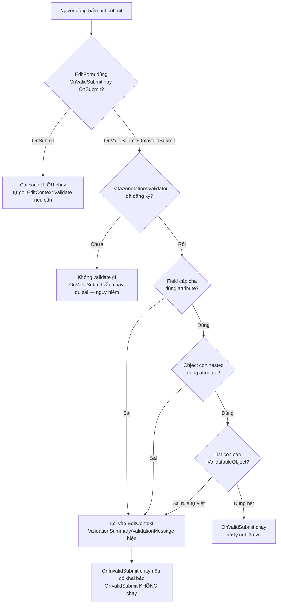

# Forms & Validation trong Blazor: từ nhập liệu tới báo lỗi đúng chỗ

!!! info "bạn đang ở đây · p7 → node `p7-forms`"
    **cần trước:** biết `@bind` hai chiều giữa UI và biến C#, biết viết component `.razor` cơ bản.
    **mở khoá sau bài này:** gọi API để lưu dữ liệu form (JS interop, HttpClient trong Blazor), authentication/authorization state cho form có phân quyền.
    ⏱️ Fast path ~45 phút · Deep dive cuối bài (tuỳ chọn, không bắt buộc).

> **Mục tiêu (đo được):** Sau bài này bạn **dựng** được một `EditForm` tối thiểu gắn với model C#, **sử dụng** được `InputText`/`InputNumber`/`InputSelect` thay cho `<input>` thuần để tự động đồng bộ với `EditContext`, **kích hoạt** được `DataAnnotationsValidator` để tái sử dụng attribute đã học ở P3 ngay trong UI, **hiển thị** được lỗi qua `ValidationSummary`/`ValidationMessage`, **phân biệt** được `OnValidSubmit` với `OnSubmit`, và **thiết kế** được validation cho object lồng nhau trong form.

---

## 0. Đoán nhanh (30 giây)

Bạn có một `<input>` HTML thuần (không phải `InputText` của Blazor) nằm bên trong một `EditForm`, gắn `[Required]` trên property tương ứng trong model. Bạn đoán: khi submit form với ô đó để trống, chuyện gì xảy ra?

??? question "Đáp án (bấm để mở sau khi đã đoán)"
    **Không có lỗi validation nào xuất hiện cho ô đó**, dù property có `[Required]`. Lý do: `<input>` HTML thuần không hề biết `EditContext` của Blazor tồn tại — nó chỉ là một ô nhập liệu DOM bình thường, không tự động ghi giá trị vào field của `EditContext` để hệ thống validation theo dõi. Muốn `EditForm` biết ô này thay đổi và cần validate, phải dùng component tích hợp sẵn như `InputText` (mục 2), hoặc tự viết `@bind` kèm gọi `EditContext.NotifyFieldChanged` thủ công — phức tạp hơn nhiều so với chỉ đổi `<input>` thành `<InputText>`.

---

## 1. EditForm: component quản lý một form và một model

**`EditForm`** là một component có sẵn trong Blazor, bọc quanh nội dung form của bạn, nhận một **model** (object C# chứa dữ liệu form) qua parameter `Model`, và cung cấp một **`EditContext`** ẩn bên trong để theo dõi giá trị các field, trạng thái "đã sửa" (dirty), và kết quả validation — tất cả những việc mà nếu dùng `<form>` HTML thuần bạn phải tự viết code quản lý.

Ví dụ tối thiểu: một form có đúng một field, không có validation, không có gì khác — chỉ để thấy `EditForm` hoạt động ra sao.

```razor title="MinimalForm.razor"
<EditForm Model="_model" OnSubmit="HandleSubmit">
    <InputText @bind-Value="_model.Title" />
    <button type="submit">Lưu</button>
</EditForm>

<p>Đã gửi: @_lastSubmitted</p>

@code {
    private TitleModel _model = new();
    private string _lastSubmitted = "(chưa gửi)";

    private class TitleModel
    {
        public string Title { get; set; } = "";
    }

    private void HandleSubmit()
    {
        _lastSubmitted = _model.Title;
    }
}
```

Ba điều cần thấy ngay ở ví dụ này:

- `Model="_model"` là **bắt buộc** (hoặc thay bằng parameter `EditContext` nếu bạn tự tạo `EditContext` thủ công — hiếm gặp ở mức cơ bản). Không truyền cái nào trong hai thứ này, `EditForm` sẽ ném exception lúc render.
- `OnSubmit` ở đây là callback **chạy vô điều kiện** khi người dùng bấm nút `type="submit"` bên trong form — chưa liên quan gì tới validation (sẽ phân biệt kỹ ở mục 4).
- `EditForm` tự render ra một thẻ `<form>` HTML thật, và tự gọi `preventDefault()` cho hành vi submit mặc định của trình duyệt (tránh trang bị reload) — bạn không cần tự viết JavaScript nào cho việc này.

### Nếu dùng sai

- Quên truyền `Model` (hoặc `EditContext`) cho `EditForm` → ứng dụng ném `InvalidOperationException` với thông báo đại loại "EditForm requires a Model parameter, or an EditContext parameter" ngay khi component render — lỗi runtime, không phải lỗi build, nên chỉ lộ ra khi bạn thực sự mở trang chứa form đó.
- Đổi tham chiếu `Model` sang một object **mới** giữa các lần render (ví dụ gán lại `_model = new TitleModel()` trong `OnParametersSet`) mà không báo cho `EditForm` biết → `EditForm` vẫn giữ `EditContext` cũ gắn với object cũ, dẫn tới validation và binding chạy sai chỗ. Cách đúng nếu cần đổi model là gán `EditContext` mới rõ ràng, không âm thầm đổi `Model`.
- Truyền cả `Model` **và** `EditContext` cùng lúc cho một `EditForm` → ném `InvalidOperationException` ngay lúc render, vì `EditForm` không biết nên dùng cái nào làm nguồn sự thật (source of truth) — hai parameter này loại trừ nhau, chỉ chọn một.

### Vì sao cần EditForm mà không chỉ dùng `<form>` HTML thuần

Câu hỏi tự nhiên của người mới: nếu chỉ cần gửi dữ liệu, sao không viết `<form @onsubmit="HandleSubmit">` thẳng bằng HTML? Câu trả lời nằm ở phần **theo dõi trạng thái** mà `<form>` thuần không có sẵn:

- `EditContext` (ẩn bên trong `EditForm`) theo dõi được field nào đã bị người dùng "chạm vào" (`IsModified`), để bạn có thể ẩn lỗi cho tới khi người dùng thực sự tương tác — tránh hiện lỗi đỏ ngay lúc trang vừa load, trước khi ai gõ gì.
- `EditContext` phát ra sự kiện `OnFieldChanged` và `OnValidationStateChanged` mà các component con (như `ValidationMessage`) lắng nghe để tự cập nhật UI đúng lúc, không cần bạn tự viết code polling hay tự gọi `StateHasChanged()` thủ công ở mọi input.
- Khi có nhiều field, `<form>` thuần buộc bạn tự viết logic tổng hợp lỗi từ nhiều nguồn (attribute, rule tuỳ biến...) thành một danh sách hiển thị — đây chính là việc `DataAnnotationsValidator` + `ValidationSummary` làm sẵn (mục 3).

Nói ngắn: `EditForm` không phải "cách viết form khác" mà là **hạ tầng quản lý trạng thái form** — càng nhiều field, càng nhiều rule, giá trị của nó càng rõ so với tự viết tay bằng `<form>` thuần.

---

## 2. InputText/InputNumber/InputSelect: input tích hợp sẵn, biết nói chuyện với EditContext

**`InputText`, `InputNumber`, `InputSelect`** (và các anh em như `InputCheckbox`, `InputDate`) là các component input có sẵn trong Blazor, mỗi component bọc một loại `<input>`/`<select>` HTML tương ứng, nhưng có thêm khả năng mà `<input>` thuần không có: chúng tự **đăng ký** vào `EditContext` của `EditForm` gần nhất chứa chúng, để khi giá trị thay đổi, `EditContext` biết field nào vừa đổi và có thể chạy validation ngay cho field đó.

Điểm khác biệt cụ thể với `<input>` HTML thuần (đã thấy hậu quả ở mục 0): `<input>` thuần dùng `@bind` bình thường vẫn cập nhật được biến C#, nhưng **không** thông báo cho `EditContext`, nên `ValidationMessage` gắn với field đó sẽ luôn im lặng dù giá trị sai.

Ví dụ tối thiểu, ba loại input phổ biến nhất, không có validation (thêm ở mục 3):

```razor title="TypedInputsForm.razor"
<EditForm Model="_model">
    <p>Tên: <InputText @bind-Value="_model.Name" /></p>
    <p>Tuổi: <InputNumber @bind-Value="_model.Age" /></p>
    <p>Vai trò:
        <InputSelect @bind-Value="_model.Role">
            <option value="dev">Dev</option>
            <option value="qa">QA</option>
        </InputSelect>
    </p>
</EditForm>

<p>Xem trước: @_model.Name / @_model.Age / @_model.Role</p>

@code {
    private PersonModel _model = new();

    private class PersonModel
    {
        public string Name { get; set; } = "";
        public int Age { get; set; }
        public string Role { get; set; } = "dev";
    }
}
```

Ba điều cần chú ý:

- `InputNumber` tự chuyển đổi chuỗi người dùng gõ sang kiểu số (ở đây `int`) — nếu người dùng gõ chữ không phải số, `InputNumber` **tự hiển thị lỗi định dạng** (không cần bạn viết `[Range]` hay validator nào), vì đây là lỗi ép kiểu (type conversion), không phải lỗi nghiệp vụ.
- `InputSelect` cần các thẻ `<option>` con y như `<select>` HTML thuần — Blazor không tự sinh option, bạn vẫn phải viết chúng.
- Tất cả ba component đều dùng cú pháp `@bind-Value`, không phải `@bind` trần — vì tên parameter nhận giá trị của các component này là `Value` (viết hoa, theo quy ước Blazor: `@bind-Value` = bind vào parameter tên `Value`).

### Nếu dùng sai

- Dùng `@bind` (không kèm `-Value`) trên `InputText` → lỗi build cụ thể: component không có parameter tên khớp quy ước mặc định, biên dịch báo không tìm thấy property phù hợp để bind — vì `@bind` trần chỉ hoạt động đúng khi component có đúng parameter tên `Value` (hoặc bạn chỉ định tên khác qua cú pháp mở rộng), và với các `Input*` component chuẩn của Blazor, luôn phải viết rõ `@bind-Value`.
- Trộn `<input>` HTML thuần với `[Required]` trên model rồi mong `ValidationMessage` hoạt động (đã nói ở mục 0) — lỗi hành vi runtime im lặng: không có exception, chỉ là lỗi **không hiện ra** dù dữ liệu sai.
- Đặt `InputText`/`InputNumber`/`InputSelect` **ngoài** phạm vi của bất kỳ `EditForm` nào (ví dụ ngoài cây component của `EditForm`, hay quên bọc trong `EditForm` khi copy-paste từng phần) → ném `InvalidOperationException` lúc render với thông báo đại loại "InputBase requires a cascading parameter of type EditContext" — vì các component `Input*` tìm `EditContext` qua cascading parameter từ `EditForm` cha, không tìm được thì không biết nói chuyện với ai.

### Input nào tương ứng kiểu dữ liệu nào

Một bảng tham chiếu nhanh — không phải so sánh nâng cao, chỉ là tra cứu loại input nào dùng với kiểu C# nào (tất cả đã cùng nằm trong một họ khái niệm vừa giới thiệu, không phải khái niệm mới):

| Component | Kiểu C# tương ứng | Render ra HTML |
|---|---|---|
| `InputText` | `string` | `<input type="text">` |
| `InputNumber` | `int`, `decimal`, `double`, `float`... (và kiểu nullable của chúng) | `<input type="number">` |
| `InputSelect` | `enum`, `string`, hoặc kiểu bất kỳ khớp `value` của `<option>` | `<select>` |
| `InputCheckbox` | `bool` | `<input type="checkbox">` |
| `InputDate` | `DateTime`, `DateOnly` | `<input type="date">` |
| `InputTextArea` | `string` (nhiều dòng) | `<textarea>` |

Điểm chung của cả họ: mọi component này đều kế thừa từ một lớp cơ sở nội bộ tên `InputBase<T>`, nên cách dùng (`@bind-Value`, cần nằm trong `EditForm`) giống nhau cho tất cả — học một, dùng được cả họ.

Một biến thể hay gặp: `InputSelect` bind trực tiếp vào `enum` thay vì `string`, tránh việc tự tay so sánh chuỗi `"dev"`/`"qa"` với rủi ro gõ sai chính tả rồi không phát hiện ra tới lúc chạy:

```razor title="RoleSelect.razor"
<InputSelect @bind-Value="_model.Role">
    <option value="@Role.Developer">Dev</option>
    <option value="@Role.Tester">QA</option>
</InputSelect>

@code {
    private RoleModel _model = new();

    private enum Role { Developer, Tester }

    private class RoleModel
    {
        public Role Role { get; set; } = Role.Developer;
    }
}
```

Blazor tự chuyển đổi giá trị chuỗi của `<option value="...">` sang giá trị `enum` tương ứng khi gán vào `_model.Role` — không cần bạn tự viết `Enum.Parse` thủ công.

---

## 3. DataAnnotationsValidator + ValidationSummary/ValidationMessage: tái dùng attribute từ P3, hiển thị lỗi

Ở P3 (`validation.md`) bạn đã học `[Required]`, `[Range]`, `[EmailAddress]`... là attribute đọc bằng `Validator.TryValidateObject` hoặc bằng `AddValidation()` phía Web API. Trong Blazor, **cùng những attribute đó** dùng lại được nguyên vẹn — không có "DataAnnotations phiên bản Blazor" nào khác, không cần học lại từ đầu.

**`DataAnnotationsValidator`** là một component không có UI riêng, đặt bên trong `EditForm`, có nhiệm vụ **kết nối** `EditContext` với engine Data Annotations: mỗi khi field đổi hoặc submit, nó gọi validator Data Annotations trên model và đẩy kết quả (lỗi nếu có) vào `EditContext`.

**`ValidationSummary`** hiển thị **toàn bộ** danh sách lỗi hiện có trong `EditContext`, thường đặt ở đầu hoặc cuối form. **`ValidationMessage`** hiển thị lỗi của **đúng một field**, đặt ngay cạnh input tương ứng, nhận field qua expression `For="() => _model.Ten"`.

Ví dụ tối thiểu, kết hợp cả ba với một field `[Required]`:

```razor title="RegisterForm.razor"
<EditForm Model="_model" OnValidSubmit="HandleValidSubmit">
    <DataAnnotationsValidator />
    <ValidationSummary />

    <p>
        Email: <InputText @bind-Value="_model.Email" />
        <ValidationMessage For="() => _model.Email" />
    </p>

    <button type="submit">Đăng ký</button>
</EditForm>

<p>@_status</p>

@code {
    private RegisterModel _model = new();
    private string _status = "";

    private class RegisterModel
    {
        [Required(ErrorMessage = "Email là bắt buộc.")]
        [EmailAddress(ErrorMessage = "Email không đúng định dạng.")]
        public string Email { get; set; } = "";
    }

    private void HandleValidSubmit()
    {
        _status = $"Đã đăng ký: {_model.Email}";
    }
}
```

Cần `using System.ComponentModel.DataAnnotations;` ở đầu file — attribute này đến từ đúng namespace bạn đã dùng ở P3, không có gì mới.

Khi người dùng để trống `Email` và bấm "Đăng ký": `ValidationSummary` hiện `"Email là bắt buộc."`, `ValidationMessage` cạnh ô Email cũng hiện đúng thông báo đó (trùng nội dung nhưng ở hai vị trí khác nhau — đây là chủ đích, không phải lỗi lặp), và `HandleValidSubmit` **không chạy** (giải thích kỹ ở mục 4).

Nếu người dùng gõ `"asdf"` (không để trống, nhưng sai định dạng email) rồi bấm submit: `[Required]` qua được (có giá trị), nhưng `[EmailAddress]` báo lỗi — hai attribute trên cùng property được kiểm tra **độc lập**, không phải "chỉ báo lỗi đầu tiên rồi dừng". `ValidationSummary` sẽ hiện đúng thông báo của attribute đang thất bại (`"Email không đúng định dạng."`), không hiện thông báo của `[Required]` vì attribute đó đã qua.

### Nếu dùng sai

- Quên đặt `<DataAnnotationsValidator />` bên trong `EditForm` → attribute `[Required]`, `[EmailAddress]` trên model vẫn nằm đó, code biên dịch bình thường, nhưng **không ai đọc chúng khi chạy** — submit form với dữ liệu sai vẫn đi qua như hợp lệ, `OnValidSubmit` vẫn được gọi. Đây là lỗi câm giống hệt lỗi "quên `AddValidation()`" ở P3, chỉ khác tầng (UI thay vì Web API).
- Đặt `ValidationMessage` với `For` trỏ sai property (ví dụ copy-paste quên đổi tên field) → không có lỗi build (vì đây là expression lambda hợp lệ, chỉ trỏ sai đối tượng theo ý người viết), nhưng lỗi của field A lại hiển thị nhầm ở vị trí cạnh field B, gây khó hiểu cho người dùng cuối.

---

## 4. OnValidSubmit vs OnSubmit: ai chạy khi nào

**`OnValidSubmit`** là callback của `EditForm` **chỉ chạy khi validation đã qua** (không còn lỗi nào trong `EditContext` tại thời điểm submit). **`OnSubmit`** là callback **luôn chạy** mỗi khi submit, bất kể model có hợp lệ hay không — bạn phải tự kiểm tra `EditContext.Validate()` bên trong nếu cần.

Có một callback thứ ba ít dùng hơn, `OnInvalidSubmit`, chạy khi validation **thất bại** — nêu ở đây để đối chiếu, không phải trọng tâm bài.

Quy tắc quan trọng: **chỉ định một trong hai** `OnValidSubmit`/`OnSubmit` (không dùng cả hai cùng lúc trên một `EditForm`) — nếu dùng `OnValidSubmit` (và/hoặc `OnInvalidSubmit`), `EditForm` tự chạy validation trước rồi định tuyến đúng callback; nếu dùng `OnSubmit`, `EditForm` giao toàn quyền cho bạn, không tự validate gì cả.

```razor title="SubmitCompare.razor"
<EditForm Model="_model" OnValidSubmit="HandleValidSubmit">
    <DataAnnotationsValidator />
    <ValidationSummary />
    <InputNumber @bind-Value="_model.Quantity" />
    <button type="submit">Gửi (OnValidSubmit)</button>
</EditForm>

<p>@_log</p>

@code {
    private OrderModel _model = new();
    private string _log = "";

    private class OrderModel
    {
        [Range(1, 100, ErrorMessage = "Số lượng phải từ 1 đến 100.")]
        public int Quantity { get; set; }
    }

    // Chạy CHỈ KHI Quantity hợp lệ (1-100). Nếu Quantity = 0, hàm này không hề được gọi.
    private void HandleValidSubmit()
    {
        _log = $"Đã tạo đơn với số lượng {_model.Quantity}";
    }
}
```

So với việc dùng `OnSubmit` cho đúng model này (minh hoạ khác biệt, không phải cách khuyến nghị cho trường hợp đơn giản này):

```razor title="SubmitManual.razor"
<EditForm EditContext="_editContext" OnSubmit="HandleSubmit">
    <DataAnnotationsValidator />
    <ValidationSummary />
    <InputNumber @bind-Value="_model.Quantity" />
    <button type="submit">Gửi (OnSubmit)</button>
</EditForm>

<p>@_log</p>

@code {
    private OrderModel _model = new();
    private EditContext _editContext = default!;
    private string _log = "";

    protected override void OnInitialized()
    {
        _editContext = new EditContext(_model);
    }

    private class OrderModel
    {
        [Range(1, 100, ErrorMessage = "Số lượng phải từ 1 đến 100.")]
        public int Quantity { get; set; }
    }

    // Chạy VÔ ĐIỀU KIỆN mỗi lần submit — phải tự gọi Validate().
    private void HandleSubmit()
    {
        bool isValid = _editContext.Validate();
        _log = isValid
            ? $"Đã tạo đơn với số lượng {_model.Quantity}"
            : "Có lỗi, chưa tạo đơn (nhưng HandleSubmit vẫn CHẠY tới đây).";
    }
}
```

Điểm cốt lõi cần khắc sâu: với `OnSubmit`, thân hàm `HandleSubmit` **luôn thực thi từ dòng đầu tới dòng cuối** — dòng `bool isValid = _editContext.Validate()` luôn chạy, kể cả khi dữ liệu sai. Với `OnValidSubmit`, nếu dữ liệu sai, `HandleValidSubmit` **không được gọi**, luồng dừng lại ngay tại `EditForm`, không có dòng code nào của bạn chạy.

### Nếu dùng sai

- Dùng `OnSubmit` nhưng **quên** tự gọi `EditContext.Validate()` trong hàm xử lý → dữ liệu sai vẫn đi thẳng vào logic lưu/gửi API, vì `OnSubmit` không tự kiểm tra gì — bug cụ thể: form hiện `[Range(1, 100)]` trên UI (qua `ValidationMessage` nếu bạn có validate field-level lúc gõ) nhưng khi bấm submit, giá trị sai vẫn được xử lý như hợp lệ.
- Gắn cả `OnSubmit` và `OnValidSubmit` cùng lúc trên một `EditForm` → ném `InvalidOperationException` lúc render với thông báo về việc chỉ được chọn một cơ chế submit — đây là lỗi runtime cụ thể, không phải lỗi build, xuất hiện ngay khi trang chứa form được mở.

### Bảng tổng hợp ba callback submit

Sau khi đã thấy `OnValidSubmit` và `OnSubmit` hoạt động riêng lẻ ở trên, đây là bảng tổng hợp cả `OnInvalidSubmit` (đã nêu tên ở đầu mục, giờ mới đủ ngữ cảnh để so sánh):

| Callback | Chạy khi nào | Bạn phải tự validate? | Dùng khi nào |
|---|---|---|---|
| `OnValidSubmit` | Chỉ khi mọi field đều qua Data Annotations | Không — `EditForm` tự kiểm tra trước | Phần lớn form thông thường, muốn tách rõ "xử lý khi đúng" |
| `OnInvalidSubmit` | Chỉ khi có ít nhất một field sai | Không | Cần log riêng lượt submit thất bại, hoặc hiện thông báo tuỳ biến ngoài `ValidationSummary` |
| `OnSubmit` | Luôn luôn, không điều kiện | Có — tự gọi `EditContext.Validate()` | Cần logic submit phức tạp không tách được thành "đúng/sai" đơn giản, ví dụ xác nhận qua nhiều bước |

`OnValidSubmit` và `OnInvalidSubmit` có thể khai báo **cùng lúc** trên một `EditForm` (chúng bổ trợ nhau, không xung đột) — chỉ riêng `OnSubmit` là loại trừ với cả hai còn lại, vì nó đại diện cho chế độ "tự quản lý toàn bộ", không để `EditForm` can thiệp.

---

## 5. Validate nested object trong EditForm

Giống với validation ở tầng Web API (P3, mục 5), `DataAnnotationsValidator` cũng đi sâu vào **object con** bên trong model chính — không cần cấu hình thêm gì để nó tự động kiểm tra attribute trên property của object lồng nhau.

```razor title="OrderWithAddressForm.razor"
<EditForm Model="_model" OnValidSubmit="HandleValidSubmit">
    <DataAnnotationsValidator />
    <ValidationSummary />

    <p>Sản phẩm: <InputText @bind-Value="_model.ProductCode" /></p>
    <p>Đường: <InputText @bind-Value="_model.Address.Street" /></p>
    <p>Thành phố: <InputText @bind-Value="_model.Address.City" /></p>

    <button type="submit">Đặt hàng</button>
</EditForm>

<p>@_log</p>

@code {
    private OrderModel _model = new();
    private string _log = "";

    private class OrderModel
    {
        [Required(ErrorMessage = "Cần chọn sản phẩm.")]
        public string ProductCode { get; set; } = "";

        public AddressModel Address { get; set; } = new();
    }

    private class AddressModel
    {
        [Required(ErrorMessage = "Địa chỉ đường là bắt buộc.")]
        public string Street { get; set; } = "";

        [Required(ErrorMessage = "Thành phố là bắt buộc.")]
        public string City { get; set; } = "";
    }

    private void HandleValidSubmit()
    {
        _log = $"Đơn hàng {_model.ProductCode} giao tới {_model.Address.Street}, {_model.Address.City}";
    }
}
```

Điều cần thấy: `_model.Address` không có attribute nào trên chính property đó (không `[Required]` trên `Address`), nhưng `DataAnnotationsValidator` vẫn tự chui vào bên trong `AddressModel` và validate `Street`/`City` theo attribute của chúng — đúng cơ chế "đi sâu tự động" đã học ở P3, chỉ khác chỗ chạy (UI Blazor thay vì HTTP request).

### Nếu dùng sai

- Khởi tạo `Address` bằng `null!` hoặc để property không có giá trị khởi tạo mặc định (`AddressModel Address { get; set; }` thiếu `= new()`) → khi `InputText @bind-Value="_model.Address.Street"` cố truy cập `Address.Street` lúc render lần đầu, ứng dụng ném `NullReferenceException` ngay tại thời điểm render form — lỗi runtime cụ thể, xảy ra trước khi người dùng kịp gõ gì, vì Blazor cần đọc giá trị hiện tại để hiển thị input, không đợi tới lúc submit.
- Với danh sách lồng nhau (`List<OrderItemModel>` bên trong model), `DataAnnotationsValidator` **mặc định của Blazor cơ bản** không tự validate sâu từng phần tử trong collection giống hệt cơ chế `AddValidation()` phía Web API (P3 mục 5) — hành vi này khác nhau giữa các phiên bản và cấu hình, nên với danh sách lồng nhau phức tạp, cách chắc chắn nhất là tự viết `IValidatableObject` trên model cha để kiểm tra từng phần tử, thay vì tin tưởng validate tự động sẽ chui vào từng item trong list.

### Ví dụ cụ thể: tự validate danh sách bằng IValidatableObject

Vì `DataAnnotationsValidator` không tự chắc chắn chui sâu vào từng phần tử của `List<T>`, đây là cách viết rõ ràng, không phụ thuộc hành vi ngầm định, cho model có danh sách con:

```razor title="BulkOrderForm.razor"
<EditForm Model="_model" OnValidSubmit="HandleValidSubmit">
    <DataAnnotationsValidator />
    <ValidationSummary />

    @for (int i = 0; i < _model.Lines.Count; i++)
    {
        var index = i; // tránh bẫy closure: chụp giá trị i tại đúng vòng lặp này
        <p>
            Sản phẩm @index: <InputText @bind-Value="_model.Lines[index].Sku" />
            Số lượng: <InputNumber @bind-Value="_model.Lines[index].Quantity" />
        </p>
    }

    <button type="submit">Đặt hàng</button>
</EditForm>

<p>@_log</p>

@code {
    private BulkOrderModel _model = new();
    private string _log = "";

    private class BulkOrderModel : IValidatableObject
    {
        public List<OrderLine> Lines { get; set; } = new() { new(), new() };

        // Tự viết logic duyệt từng phần tử, không tin vào validate tự động chui sâu vào List<T>.
        public IEnumerable<ValidationResult> Validate(ValidationContext context)
        {
            for (int i = 0; i < Lines.Count; i++)
            {
                if (string.IsNullOrWhiteSpace(Lines[i].Sku))
                    yield return new ValidationResult(
                        $"Dòng {i + 1}: Sku là bắt buộc.",
                        new[] { nameof(Lines) });

                if (Lines[i].Quantity is < 1 or > 500)
                    yield return new ValidationResult(
                        $"Dòng {i + 1}: số lượng phải từ 1 đến 500.",
                        new[] { nameof(Lines) });
            }
        }
    }

    private class OrderLine
    {
        public string Sku { get; set; } = "";
        public int Quantity { get; set; }
    }

    private void HandleValidSubmit()
    {
        _log = $"Đã đặt {_model.Lines.Count} dòng sản phẩm";
    }
}
```

Điểm cần chú ý: `IValidatableObject.Validate` (interface có sẵn trong BCL, đã dùng ở P3 deep dive cho rule liên-field) chạy **sau** khi các attribute Data Annotations thông thường đã qua, và `DataAnnotationsValidator` trong Blazor cũng tự động gọi nó — không cần đăng ký thêm gì. Đây là lựa chọn nhất quán với cách bạn đã học kiểm tra rule phức tạp ở P3, chỉ đổi nơi chạy từ Web API sang UI component.

### Toàn cảnh: một lần submit đi qua các trạm nào



Điểm mấu chốt của sơ đồ: dù đi theo nhánh `OnSubmit` hay `OnValidSubmit`, **ba tầng kiểm tra** (field cấp cha, object con, danh sách con) đều có thể góp lỗi vào cùng một `EditContext` — `ValidationSummary` không phân biệt lỗi đến từ tầng nào, nó chỉ hiển thị toàn bộ những gì đang có.

---

## Cạm bẫy & thực chiến

!!! warning "Những lỗi hay mắc"
    - **Dùng `<input>` HTML thuần thay vì `InputText`/`InputNumber`/`InputSelect` trong `EditForm`.** `<input>` thuần không đăng ký với `EditContext`, nên `ValidationMessage` cho field đó luôn im lặng dù model có `[Required]` — đã minh hoạ ở mục 0 và mục 2.
    - **Quên `<DataAnnotationsValidator />`.** Attribute vẫn biên dịch được, form vẫn submit được, nhưng không ai kiểm tra gì — lỗi câm nguy hiểm nhất trong chương, giống hệt lỗi quên `AddValidation()` ở P3.
    - **Gắn cả `OnValidSubmit` và `OnSubmit` cùng lúc.** `EditForm` ném exception lúc render vì hai cơ chế xung đột — chỉ chọn một.
    - **Dùng `OnSubmit` mà quên gọi `EditContext.Validate()`.** Dữ liệu sai vẫn chạy tới logic lưu/gửi API vì `OnSubmit` không tự kiểm tra gì thay bạn.
    - **Đổi tham chiếu `Model` giữa các lần render mà không tạo `EditContext` mới rõ ràng.** `EditForm` vẫn giữ trạng thái validation của model cũ, dẫn tới lỗi hiển thị sai hoặc không cập nhật.
    - **Tin rằng nested object luôn tự validate sâu như ở Web API.** Object con (một cấp) thường tự động được kiểm tra, nhưng danh sách lồng nhau (`List<T>` bên trong model) không phải lúc nào cũng được validate sâu tự động trong Blazor cơ bản — cần tự kiểm tra kỹ hoặc dùng `IValidatableObject`, đừng giả định giống hệt Web API.
    - **Không khởi tạo property object con (`Address`, `ShippingInfo`...) với giá trị mặc định.** `InputText @bind-Value="_model.Address.Street"` sẽ ném `NullReferenceException` ngay lúc render nếu `Address` là `null`.
    - **Coi validate ở Blazor là đủ, bỏ qua validate phía server.** Với Blazor WebAssembly, toàn bộ code C# chạy trong browser của người dùng — ai mở devtools cũng có thể bypass, hoặc gọi thẳng API sau lưng UI. `DataAnnotationsValidator` ở Blazor chỉ cải thiện trải nghiệm, không thay thế được validate ở tầng Web API (P3).

---

## Bài tập

### Bài 1 — Có giàn giáo: hoàn thiện form đăng ký sự kiện

Hoàn thiện component dưới đây sao cho: `FullName` bắt buộc, `Seats` phải từ 1 đến 10, form chỉ gọi `HandleValidSubmit` khi cả hai hợp lệ, và lỗi hiển thị đúng cạnh từng field.

```razor title="EventSignup.razor"
<EditForm Model="_model" OnValidSubmit="HandleValidSubmit">
    <!-- TODO 1: thêm component kích hoạt Data Annotations -->

    <p>
        Họ tên: <InputText @bind-Value="_model.FullName" />
        <!-- TODO 2: hiển thị lỗi riêng cho FullName -->
    </p>
    <p>
        Số ghế: <InputNumber @bind-Value="_model.Seats" />
        <!-- TODO 3: hiển thị lỗi riêng cho Seats -->
    </p>

    <button type="submit">Đăng ký</button>
</EditForm>

<p>@_log</p>

@code {
    private EventModel _model = new();
    private string _log = "";

    private class EventModel
    {
        // TODO 4: FullName bắt buộc
        public string FullName { get; set; } = "";

        // TODO 5: Seats từ 1 đến 10
        public int Seats { get; set; }
    }

    private void HandleValidSubmit()
    {
        _log = $"Đã đăng ký {_model.FullName}, {_model.Seats} ghế";
    }
}
```

??? success "Lời giải + giải thích"
    ```razor title="EventSignup.razor"
    <EditForm Model="_model" OnValidSubmit="HandleValidSubmit">
        <DataAnnotationsValidator />

        <p>
            Họ tên: <InputText @bind-Value="_model.FullName" />
            <ValidationMessage For="() => _model.FullName" />
        </p>
        <p>
            Số ghế: <InputNumber @bind-Value="_model.Seats" />
            <ValidationMessage For="() => _model.Seats" />
        </p>

        <button type="submit">Đăng ký</button>
    </EditForm>

    <p>@_log</p>

    @code {
        private EventModel _model = new();
        private string _log = "";

        private class EventModel
        {
            [Required(ErrorMessage = "Họ tên là bắt buộc.")]
            public string FullName { get; set; } = "";

            [Range(1, 10, ErrorMessage = "Số ghế phải từ 1 đến 10.")]
            public int Seats { get; set; }
        }

        private void HandleValidSubmit()
        {
            _log = $"Đã đăng ký {_model.FullName}, {_model.Seats} ghế";
        }
    }
    ```

    - `<DataAnnotationsValidator />` là mảnh ghép bắt buộc, thiếu nó thì `[Required]`/`[Range]` vẫn biên dịch nhưng không ai kiểm tra khi chạy.
    - `ValidationMessage For="() => _model.FullName"` dùng expression lambda trỏ đúng property, không phải chuỗi tên field — sai property ở đây không gây lỗi build, chỉ hiện lỗi nhầm chỗ.
    - `OnValidSubmit` đảm bảo `HandleValidSubmit` chỉ chạy khi cả `FullName` và `Seats` đều hợp lệ cùng lúc.

### Bài 2 — Thiết kế: form đặt phòng có địa chỉ liên hệ lồng nhau

Thiết kế một component `BookingForm.razor` với model gồm: `GuestName` (bắt buộc), `Nights` (1 đến 30), và `Contact` — object con gồm `Phone` (bắt buộc) và `Email` (đúng định dạng email). Yêu cầu: dùng `EditForm` + `DataAnnotationsValidator`, hiển thị lỗi qua `ValidationSummary` (không cần `ValidationMessage` riêng lẻ lần này), và chỉ lưu khi mọi field — cả cấp cha và cấp con — đều hợp lệ.

??? success "Lời giải + giải thích"
    ```razor title="BookingForm.razor"
    <EditForm Model="_model" OnValidSubmit="HandleValidSubmit">
        <DataAnnotationsValidator />
        <ValidationSummary />

        <p>Khách: <InputText @bind-Value="_model.GuestName" /></p>
        <p>Số đêm: <InputNumber @bind-Value="_model.Nights" /></p>
        <p>Điện thoại: <InputText @bind-Value="_model.Contact.Phone" /></p>
        <p>Email: <InputText @bind-Value="_model.Contact.Email" /></p>

        <button type="submit">Đặt phòng</button>
    </EditForm>

    <p>@_log</p>

    @code {
        private BookingModel _model = new();
        private string _log = "";

        private class BookingModel
        {
            [Required(ErrorMessage = "Tên khách là bắt buộc.")]
            public string GuestName { get; set; } = "";

            [Range(1, 30, ErrorMessage = "Số đêm phải từ 1 đến 30.")]
            public int Nights { get; set; }

            public ContactModel Contact { get; set; } = new();
        }

        private class ContactModel
        {
            [Required(ErrorMessage = "Số điện thoại là bắt buộc.")]
            public string Phone { get; set; } = "";

            [EmailAddress(ErrorMessage = "Email không đúng định dạng.")]
            public string Email { get; set; } = "";
        }

        private void HandleValidSubmit()
        {
            _log = $"Đặt phòng cho {_model.GuestName}, {_model.Nights} đêm, liên hệ {_model.Contact.Phone}";
        }
    }
    ```

    - `Contact` được khởi tạo `= new()` ngay trên property — nếu bỏ, `InputText @bind-Value="_model.Contact.Phone"` sẽ ném `NullReferenceException` lúc render, đúng cạm bẫy đã nêu ở mục 5.
    - Không có attribute nào đặt trên property `Contact` chính nó — `DataAnnotationsValidator` tự đi sâu vào `ContactModel` để kiểm tra `Phone`/`Email`.
    - `ValidationSummary` gom tất cả lỗi (cả `GuestName`, `Nights`, và hai field trong `Contact`) vào một danh sách duy nhất, không cần đặt `ValidationMessage` cạnh từng ô.
    - `HandleValidSubmit` chỉ chạy khi **toàn bộ** bốn field — hai ở cấp cha, hai ở cấp con — đều qua validation, vì `OnValidSubmit` chờ kết quả tổng hợp từ toàn `EditContext`, không tách riêng theo cấp.

---

## Tự kiểm tra

1. `EditForm` cần tối thiểu parameter nào để hoạt động, và nếu thiếu thì lỗi gì xảy ra?
2. Vì sao `<input>` HTML thuần gắn `@bind` không hiện lỗi validation dù model có `[Required]`, còn `InputText` thì hiện?
3. Thành phần nào chịu trách nhiệm đọc attribute Data Annotations trên model và đẩy kết quả vào `EditContext`?
4. `OnValidSubmit` và `OnSubmit` khác nhau ở điểm nào khi dữ liệu form không hợp lệ?
5. Nếu gắn cả `OnValidSubmit` và `OnSubmit` cùng lúc trên một `EditForm`, chuyện gì xảy ra?
6. Object con (nested) trong model có cần attribute riêng trên chính property đó để được validate không?
7. Điều gì xảy ra nếu property object con không được khởi tạo (`null`) mà `InputText` lại bind vào field bên trong nó?

??? note "Đáp án"
    1. Cần `Model` (hoặc `EditContext`). Thiếu cả hai, `EditForm` ném `InvalidOperationException` ngay lúc render.
    2. Vì `<input>` thuần không tự đăng ký với `EditContext` của `EditForm`, nên hệ thống validation không biết field đó vừa đổi để kiểm tra; `InputText` (và các `Input*` khác) tự làm việc này.
    3. `DataAnnotationsValidator`, đặt bên trong `EditForm`.
    4. `OnValidSubmit` không được gọi nếu dữ liệu sai (luồng dừng ở `EditForm`); `OnSubmit` vẫn chạy đầy đủ thân hàm bất kể hợp lệ hay không, phải tự gọi `EditContext.Validate()` nếu cần chặn.
    5. `EditForm` ném `InvalidOperationException` lúc render vì hai cơ chế xung đột — chỉ được chọn một.
    6. Không cần — nếu property đó là object phức tạp (không phải kiểu nguyên thuỷ), `DataAnnotationsValidator` tự đi sâu vào bên trong và kiểm tra attribute trên property con.
    7. `InputText` cố đọc giá trị field bên trong object `null` để hiển thị, gây `NullReferenceException` ngay lúc render form, trước cả khi người dùng nhập gì.

---

??? abstract "DEEP DIVE — EditContext thủ công, validate field-level khi gõ, validator tuỳ biến, và CSS trạng thái field"
    **Tạo `EditContext` thủ công để kiểm soát chi tiết hơn:** thay vì để `EditForm` tự tạo `EditContext` ngầm từ `Model`, bạn có thể tự tạo và truyền qua parameter `EditContext` (đã dùng ở ví dụ `OnSubmit` trong mục 4). Cách này cho phép bạn giữ tham chiếu `EditContext` để gọi `Validate()` thủ công, lắng nghe sự kiện `OnFieldChanged`, hoặc chia sẻ cùng một `EditContext` giữa nhiều component con — hữu ích khi form của bạn được ghép từ nhiều component `.razor` con, mỗi component chỉ hiển thị một phần field, nhưng tất cả cần chung một nguồn trạng thái validation.

    ```razor title="SharedEditContext.razor"
    <EditForm EditContext="_editContext" OnValidSubmit="HandleValidSubmit">
        <DataAnnotationsValidator />
        <ContactFieldsSection Model="_model" />
        <button type="submit">Lưu</button>
    </EditForm>

    @code {
        private ContactModel _model = new();
        private EditContext _editContext = default!;

        protected override void OnInitialized()
        {
            _editContext = new EditContext(_model);
            // Lắng nghe mỗi khi validation state đổi, ví dụ để log hoặc bật/tắt nút Lưu.
            _editContext.OnValidationStateChanged += (sender, args) =>
            {
                Console.WriteLine($"Còn lỗi: {!_editContext.Validate()}");
            };
        }

        private class ContactModel
        {
            public string Phone { get; set; } = "";
        }

        private void HandleValidSubmit() { }
    }
    ```

    Lưu ý quan trọng nếu tự tạo `EditContext` kiểu này: bạn phải **huỷ đăng ký** sự kiện (`-=`) trong `Dispose()` nếu component implement `IDisposable`, đúng nguyên tắc chung của mọi sự kiện .NET — quên gỡ đăng ký là một dạng memory leak nhẹ (component cũ vẫn được giữ tham chiếu bởi event của `EditContext` sống lâu hơn nó).

    **Validate ngay khi gõ, không chỉ khi submit:** mặc định, `DataAnnotationsValidator` chạy validate khi field đổi (nhờ `InputText` gọi `EditContext.NotifyFieldChanged`) *và* khi submit — nhưng thời điểm field được coi là "đổi" phụ thuộc modifier `:event` đi kèm cú pháp bind (đã học ở bài binding: mặc định `oninput`/`onchange` tuỳ loại input). Với các `Input*` component (dùng `@bind-Value`, không phải `@bind` trần), modifier này viết là `@bind-Value:event`. Muốn validate "gõ tới đâu báo lỗi tới đó" mượt hơn, có thể kết hợp `@bind-Value:event="oninput"` trên `InputText` để field được coi là đổi ngay mỗi keystroke, thay vì chờ mất focus.

    ```razor title="LiveValidate.razor"
    <EditForm Model="_model">
        <DataAnnotationsValidator />
        <InputText @bind-Value="_model.Email" @bind-Value:event="oninput" />
        <ValidationMessage For="() => _model.Email" />
    </EditForm>

    @code {
        private ContactModel _model = new();
        private class ContactModel
        {
            [EmailAddress(ErrorMessage = "Email không đúng định dạng.")]
            public string Email { get; set; } = "";
        }
    }
    ```

    Đánh đổi cần biết: validate mỗi keystroke tốn nhiều lần re-render hơn (mỗi phím gõ kích hoạt một vòng kiểm tra Data Annotations), với form nhỏ không đáng kể, nhưng với form rất nhiều field cùng bật `oninput`, cân nhắc chỉ áp dụng cho field thật sự cần phản hồi tức thời (ví dụ email, mật khẩu), không áp dụng tràn lan cho mọi field.

    **Validator tuỳ biến thay `DataAnnotationsValidator`:** nếu rule vượt quá khả năng attribute (rule liên-field, rule điều kiện — giống lý do chọn FluentValidation ở P3 mục 4), Blazor cho phép viết một component validator riêng implement cùng interface mà `DataAnnotationsValidator` dùng, gắn `EditContext.OnValidationRequested`/`OnFieldChanged` để tự thêm lỗi vào `ValidationMessageStore`. Đây là cơ chế mở rộng, không bắt buộc cho phần lớn form thực tế — phần lớn trường hợp, `IValidatableObject` trên model (đã dùng ở mục 5 và học từ P3 deep dive) là đủ và đơn giản hơn viết cả một validator component riêng.

    **Vì sao lỗi hiển thị "chậm" đôi khi xảy ra:** với `InputNumber`/`InputDate`, lỗi ép kiểu (ví dụ gõ chữ vào ô số) được `Input*` component tự phát hiện và hiển thị **trước khi** giá trị kịp gán vào property C# — nghĩa là property vẫn giữ giá trị cũ hợp lệ trong khi UI đã hiện lỗi. Đây không phải bug, mà là cơ chế bảo vệ: property C# không bao giờ nhận giá trị "rác" không ép kiểu được, tránh crash ở tầng logic nghiệp vụ phía sau.

    **CSS trạng thái field tự động (`valid`/`invalid`/`modified`):** mỗi `Input*` component tự gắn class CSS vào thẻ HTML tương ứng dựa trên trạng thái hiện tại trong `EditContext` — cụ thể là `valid`, `invalid`, và `modified` (kết hợp được, ví dụ `modified valid`). Bạn không cần tự viết code C# để tô viền đỏ cho field lỗi; chỉ cần định nghĩa CSS nhắm vào class đó:

    ```css title="forms.css"
    .invalid {
        border: 1px solid red;
    }
    .modified.valid {
        border: 1px solid green;
    }
    ```

    Cơ chế này hoạt động vì mỗi lần `EditContext` phát sự kiện đổi trạng thái, `Input*` tự tính lại class CSS và Blazor tự re-render đúng phần DOM cần đổi (nhờ render tree diffing đã học ở chương tổng quan) — không phải tự bạn `@onclick` gán class thủ công.

    **So sánh nhanh với validate phía Web API (P3):** cả hai tầng (`AddValidation()` ở Web API, `DataAnnotationsValidator` ở Blazor) đọc **chung** một bộ attribute Data Annotations trên model — đây là điểm mạnh thiết kế: nếu model DTO dùng lại được ở cả client Blazor và server Web API (ví dụ trong solution full-stack .NET dùng chung project "Shared"), bạn chỉ viết attribute **một lần**, cả UI và API đều tôn trọng cùng rule. Tuy vậy, **không được bỏ qua validate phía server** dù UI đã chặn — lý do giống hệt nguyên tắc "không tin frontend" ở P3: với Blazor Server, request vẫn có thể tới từ kết nối SignalR bị can thiệp; với Blazor WebAssembly, code C# chạy ngay trong browser của người dùng nên **hoàn toàn có thể bị bypass** bằng devtools hoặc gọi API trực tiếp — validate ở Blazor chỉ là trải nghiệm mượt cho người dùng thật, không phải hàng rào bảo mật, giống hệt vai trò của validate JavaScript ở P3.

**Tiếp theo →** [P7 · Quản lý State](state-management.md)
