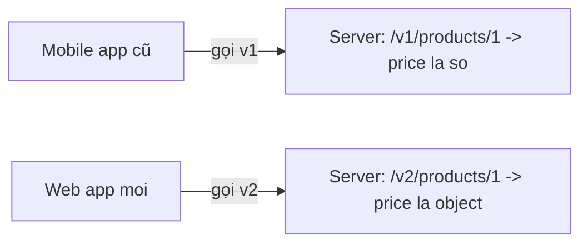

# API Versioning

!!! info "bạn đang ở đây · p8 → node `p8-versioning` · production"
    cần trước: bạn đã biết viết một `BackgroundService` chạy trong vòng đời app (chương background service) — chương này không nhắc lại vòng đời request/response cơ bản, chỉ tập trung vào vấn đề mới: một API **đã có client thật đang dùng** thì không thể sửa tuỳ ý.
    mở khoá: nhận diện đúng lúc nào một thay đổi trên API là breaking change bắt buộc phải lên version mới, và chọn đúng chiến lược versioning (URL, query string, hay header) cho từng ngữ cảnh cụ thể — kỹ năng bắt buộc trước khi một API rời khỏi giai đoạn "chỉ nội bộ dùng" để phục vụ client thật bên ngoài (mobile app, web app của người khác, đối tác B2B).

> **Mục tiêu (đo được):** sau chương này bạn **giải thích** được vì sao sửa trực tiếp một endpoint đang có client dùng có thể làm sập ứng dụng của client đó; **phân biệt** được ba chiến lược versioning (URL, query string, header) dựa trên cách client chỉ định version; **quyết định** được khi nào một thay đổi bắt buộc phải lên version mới (breaking change) và khi nào không cần; và **nhận diện** được vị trí của gói `Asp.Versioning.Http` trong việc triển khai các chiến lược này.

---

## 0. Đoán nhanh trước khi đọc

Trước khi xem đáp án, hãy tự trả lời (đoán sai vẫn giúp nhớ lâu hơn):

1. Đổi tên field `Total` thành `TotalAmount` trong response JSON của một endpoint đang có client dùng — đây có phải breaking change không?
2. Thêm một field mới `DiscountCode` (optional) vào response, giữ nguyên mọi field cũ — đây có phải breaking change không?
3. `/v1/products` và `/v2/products` — đây là chiến lược versioning theo URL, query string, hay header?
4. Chiến lược versioning nào khó nhất để test trực tiếp trên address bar của browser?
5. Nếu một API chưa hề có client nào dùng thật (mới code xong, chưa deploy), đổi cấu trúc response tuỳ ý có cần lên version mới không?

??? note "Đáp án"
    1. **Có** — client cũ code cứng tên field `Total`, đọc field đó ra sẽ nhận `null`/giá trị mặc định một cách âm thầm, hoặc lỗi rõ ràng nếu dùng kiểu strong-type deserialize.
    2. **Không** — field mới là optional, code cũ không biết tới field này vẫn đọc đúng mọi field cũ như trước, không có gì "vỡ".
    3. **URL** — version nằm ngay trong đường dẫn (`/v1/`, `/v2/`).
    4. **Header** — vì browser gõ URL trực tiếp không có cách nào tự thêm header tuỳ ý, phải dùng công cụ như Postman/curl hoặc viết code gọi API.
    5. **Không cần** — versioning tồn tại để bảo vệ client **đã có** đang phụ thuộc vào hình dạng response hiện tại; chưa có client thật thì đổi tuỳ ý không "vỡ" cái gì cả.

---

## 1. Vấn đề gốc: sửa một endpoint đang có client dùng

**Bối cảnh cụ thể:** bạn có endpoint `GET /products/{id}` trả về response sau, đã được một **mobile app cũ** (đã lên App Store/Google Play, người dùng đang cài trên điện thoại, không thể bắt họ cập nhật ngay) gọi và parse:

```text title="Response GỐC mà mobile app cũ đang mong đợi"
{
  "id": 1,
  "name": "Ban phim co",
  "price": 450000
}
```

Mobile app cũ có code Kotlin/Swift đọc thẳng field `price` thành một số (`Double`/`Decimal`) để hiển thị giá lên màn hình.

**Backend team sau đó "cải tiến" endpoint này** — đổi `price` (một số đơn giản) thành một object có cấu trúc, để hỗ trợ đa tiền tệ:

```text title="Response MỚI sau khi backend đổi cấu trúc — KHÔNG hỏi ý client cũ"
{
  "id": 1,
  "name": "Ban phim co",
  "price": { "amount": 450000, "currency": "VND" }
}
```

**Điều gì xảy ra khi dùng sai/thiếu versioning (hậu quả cụ thể):** mobile app cũ vẫn gọi đúng `GET /products/{id}` như trước (nó không biết backend đã đổi), nhận về response mới, cố đọc `price` thành một số như code cũ đã viết — nhưng `price` giờ là một **object**, không phải số. Kết quả: app **crash ngay tại màn hình chi tiết sản phẩm** cho toàn bộ người dùng đang chạy phiên bản app cũ, ngay sau khi backend deploy, không cần chờ người dùng làm gì cả.

```text title="Lỗi thực tế phía mobile app (giả lập log crash)"
FATAL EXCEPTION: main
com.google.gson.JsonSyntaxException: Expected a double but was BEGIN_OBJECT
    at ProductDetailActivity.parsePrice(ProductDetailActivity.kt:42)
--> Toàn bộ user đang dùng app version cũ KHÔNG THỂ xem chi tiết sản phẩm nào nữa,
    dù backend không hề có ý định "phá" app cũ — chỉ đổi cấu trúc 1 field.
```

Đây chính là vấn đề gốc mà API versioning giải quyết: **một endpoint, nhiều "hình dạng response" khác nhau cần tồn tại đồng thời**, để client cũ (không thể sửa ngay, hoặc không thể ép cập nhật ngay) tiếp tục nhận được hình dạng nó hiểu, còn client mới nhận được hình dạng mới hơn — thay vì chỉ có **một** hình dạng duy nhất, ai gọi cũng nhận cùng một thứ.

**Vì sao đây không chỉ là lỗi kỹ thuật, mà còn là chi phí kinh doanh thật:** một app crash hàng loạt như ví dụ trên không chỉ là một dòng exception trong log — người dùng thật sự đang cầm điện thoại, cố xem chi tiết một sản phẩm để quyết định mua, gặp app crash sẽ **thoát ứng dụng ngay**, có thể không quay lại nữa (mất một đơn hàng, hoặc tệ hơn, mất luôn người dùng đó). Nếu ứng dụng có hàng chục nghìn người dùng đang chạy phiên bản app cũ (thực tế phổ biến — không phải ai cũng cập nhật app ngay khi có bản mới), một thay đổi "chỉ đổi cấu trúc 1 field" có thể gây ra hàng chục nghìn lượt crash **trong vài phút sau khi deploy**, kèm theo một làn sóng đánh giá 1 sao trên App Store/Google Play (vì với người dùng, "app bị lỗi" — họ không biết và không cần biết nguyên nhân là backend đổi API). Khắc phục sau đó cũng không nhanh: sửa lại backend có thể làm ngay, nhưng **người dùng đã cài app cũ vẫn tiếp tục crash** cho tới khi họ tự cập nhật app — một vòng lặp mà chỉ API versioning (giữ v1 sống cho họ) mới cắt đứt được ngay lập tức, không cần chờ.

---

## 2. API Versioning là gì

**Định nghĩa (một câu, giả định bạn chưa biết khái niệm này):** API Versioning là cách **đánh số/nhãn cho một phiên bản cụ thể của API**, để nhiều phiên bản (với cấu trúc request/response khác nhau) có thể **cùng chạy song song** trên một server, và mỗi client tự chọn version nào nó muốn gọi — thay vì server chỉ có một hình dạng API duy nhất, buộc mọi client phải theo.

**Áp đúng vào vấn đề ở mục 1:** thay vì đổi thẳng `GET /products/{id}` (làm vỡ mobile app cũ), backend giữ nguyên một phiên bản có `price` là số (gọi là "v1"), và tạo **thêm** một phiên bản mới có `price` là object đa tiền tệ (gọi là "v2") — cả hai cùng chạy, mobile app cũ tiếp tục gọi v1 như trước (không đổi gì cả phía nó), còn client mới (ví dụ web app mới viết) gọi v2 để có tính năng đa tiền tệ.



Ba đặc điểm cốt lõi cần nắm trước khi đi vào từng chiến lược cụ thể:

- **Client chủ động chọn version** — server không tự đoán, client phải **nói rõ** mình muốn gọi version nào (qua URL, qua query string, hay qua header — ba cách sẽ học ở mục 3–5).
- **Nhiều version cùng tồn tại trên một server, không phải version cũ bị xoá ngay khi có version mới** — v1 vẫn chạy được cho tới khi backend team quyết định "ngừng hỗ trợ" (deprecate) sau một khoảng thời gian đủ dài để client cũ có cơ hội cập nhật.
- **Versioning là hợp đồng về hình dạng dữ liệu (request/response), không phải về logic nghiệp vụ bên trong** — v1 và v2 có thể dùng chung một database, chung một logic tính giá, chỉ khác nhau ở cách **trình bày** dữ liệu ra ngoài.

**Điều gì xảy ra khi hiểu sai — tưởng versioning là đổi tên route tuỳ ý:** nếu một dev chỉ đổi route từ `/products` sang `/products-v2-new` mà không giữ lại `/products` (v1) hoạt động như cũ, thì bản chất đây **không phải** versioning đúng nghĩa — đây là **xoá** endpoint cũ và thay bằng endpoint mới, client cũ vẫn gọi `/products` cũ sẽ nhận lỗi `404 Not Found` ngay, hậu quả giống hệt mục 1 (crash/lỗi hàng loạt), chỉ khác ở dạng lỗi (404 thay vì lỗi parse JSON).

**Versioning không phải cách duy nhất để tránh vỡ client cũ — có một chiến lược thay thế đáng biết trước khi đi sâu vào cách triển khai versioning:** thay vì tạo hẳn một version mới, một endpoint có thể được thiết kế theo nguyên tắc **chỉ mở rộng (additive-only)** — mọi thay đổi trong tương lai chỉ **thêm** field mới, **không bao giờ** xoá/đổi kiểu field cũ. Với endpoint ở mục 1, nếu ngay từ đầu backend thiết kế `price` là một object (`{ "amount": 450000, "currency": "VND" }`) thay vì một số đơn thuần, thì việc "hỗ trợ đa tiền tệ" sau này sẽ **không bao giờ** cần đổi kiểu dữ liệu — chỉ cần API luôn tuân thủ đúng "hợp đồng mở rộng" đó từ ngày đầu.

```text title="So sánh: thiết kế mở rộng từ đầu (additive-only) vs phải versioning vì thiết kế ban đầu quá đơn giản"
Thiết kế BAN ĐẦU đơn giản (mục 1)      Thiết kế MỞ RỘNG từ đầu (additive-only)
"price": 450000                        "price": { "amount": 450000, "currency": "VND" }
-> sau này cần đa tiền tệ PHẢI          -> sau này cần thêm currency khác CHỈ CẦN thêm field
   đổi kiểu dữ liệu -> BREAKING            optional (vd "displayPrice") -> KHÔNG breaking
   -> buộc phải tạo v2 (mục 3-7)
```

**Đây không phải lý do để bỏ qua versioning — chỉ là một cách giảm số lần cần dùng đến nó:** additive-only chỉ ngăn được breaking change **nếu đoán đúng trước** hình dạng dữ liệu sẽ cần trong tương lai (ở ví dụ trên, phải đoán trước là sẽ cần đa tiền tệ) — thực tế không ai đoán đúng mọi thay đổi tương lai, và một số breaking change (ví dụ đổi hẳn logic nghiệp vụ khiến một field không còn ý nghĩa gì) không thể tránh chỉ bằng thiết kế cẩn thận từ đầu. Vì vậy additive-only là một **thói quen thiết kế tốt** (giảm tần suất breaking change), còn API versioning (mục 3 trở đi) vẫn là cơ chế **bắt buộc phải có** cho những breaking change không thể tránh được bằng thiết kế trước.

**Ví dụ tối thiểu, độc lập, chạy được** — mô phỏng đúng bản chất "hai hình dạng response cùng tồn tại, được chọn dựa trên một tham số version" bằng một hàm C# thuần (chưa cần web thật, chỉ để thấy rõ cơ chế trước khi gắn vào route ở mục 3):

```csharp title="C#"
// test:run
using System;
using System.Text.Json;

public static class Program
{
    // Hàm này đóng vai trò "server" tối giản: nhận vào version, TRẢ VỀ đúng hình dạng
    // response tương ứng — đây chính là ý tưởng lõi của mọi chiến lược versioning,
    // bất kể version được đọc từ URL, query string, hay header (mục 3-5).
    public static string HandleGetProduct(int version)
    {
        return version switch
        {
            1 => JsonSerializer.Serialize(new { Id = 1, Name = "Ban phim co", Price = 450000 }),
            2 => JsonSerializer.Serialize(new
            {
                Id = 1,
                Name = "Ban phim co",
                Price = new { Amount = 450000, Currency = "VND" }
            }),
            _ => throw new ArgumentOutOfRangeException(nameof(version), $"Version {version} khong ton tai")
        };
    }

    public static void Main()
    {
        Console.WriteLine($"Mobile app cu goi version=1: {HandleGetProduct(1)}");
        Console.WriteLine($"Web app moi goi version=2:   {HandleGetProduct(2)} ");
    }
}
```

```text title="Kết quả"
Mobile app cu goi version=1: {"Id":1,"Name":"Ban phim co","Price":450000}
Web app moi goi version=2:   {"Id":1,"Name":"Ban phim co","Price":{"Amount":450000,"Currency":"VND"} }
```

Quan sát mấu chốt: **cùng một "endpoint"** (hàm `HandleGetProduct`) nhưng trả về hai hình dạng dữ liệu khác nhau hoàn toàn dựa trên tham số `version` truyền vào — mobile app cũ (gọi với `version=1`) không hề bị ảnh hưởng bởi việc thêm nhánh `version=2`. Ba mục tiếp theo chỉ khác nhau ở **client truyền `version` bằng cách nào** (URL, query string, hay header) tới server thật — cơ chế "chọn hình dạng theo version" bên trong vẫn giống hệt ví dụ này.

---

## 3. Chiến lược 1 — URL Path Versioning

**Định nghĩa (một câu, giả định bạn chưa biết khái niệm này):** URL Path Versioning là cách đưa số version **ngay vào đường dẫn** của endpoint (ví dụ `/v1/products`, `/v2/products`), để mỗi version có một URL riêng biệt, hoàn toàn khác nhau về mặt định tuyến (routing).

```text title="Ví dụ URL Path Versioning — áp đúng vào vấn đề ở mục 1"
GET /v1/products/1   -> { "id": 1, "name": "Ban phim co", "price": 450000 }
GET /v2/products/1   -> { "id": 1, "name": "Ban phim co", "price": { "amount": 450000, "currency": "VND" } }
```

Mobile app cũ tiếp tục gọi đúng `/v1/products/1` như code nó đã viết từ đầu — không hề biết `/v2/products/1` tồn tại, không hề bị ảnh hưởng gì bởi việc backend thêm v2.

**Ưu điểm:**

- **Rõ ràng nhất khi đọc:** chỉ nhìn URL là biết ngay đang gọi version nào, không cần đọc thêm header hay query string.
- **Dễ cache:** các hệ thống cache (CDN, reverse proxy, browser cache) coi hai URL khác nhau (`/v1/...` và `/v2/...`) là hai resource hoàn toàn khác nhau một cách tự nhiên — không cần cấu hình gì đặc biệt để cache đúng theo version.
- **Test trực tiếp trên browser dễ nhất:** chỉ cần gõ URL khác nhau lên address bar, không cần công cụ hỗ trợ thêm.

**Nhược điểm:**

- **URL "không đẹp" theo nghĩa REST thuần:** về lý thuyết REST, một resource (ví dụ "sản phẩm số 1") nên có **một** địa chỉ (URI) duy nhất đại diện cho nó; URL Path Versioning tạo ra hai địa chỉ (`/v1/products/1` và `/v2/products/1`) cho cùng một khái niệm sản phẩm, chỉ khác cách trình bày dữ liệu — đây bị xem là "không thuần REST" trong một số quan điểm thiết kế.
- **Đổi version nghĩa là đổi URL client phải gọi:** nếu client muốn chuyển từ v1 sang v2, nó phải sửa **URL** đang gọi, không chỉ đổi một tham số nhỏ.

**Ví dụ tối thiểu, độc lập, chạy được** — cài đúng URL Path Versioning bằng Minimal API thuần (không cần gói `Asp.Versioning.Http` cho trường hợp đơn giản chỉ 2 version cố định; gói ngoài ở mục 7 hữu ích hơn khi số version tăng lên và cần cơ chế báo lỗi/khám phá version tự động):

```csharp title="Program.cs"
// test:compile Web SDK trần — hai route riêng biệt theo path, KHÔNG cần package ngoài
var builder = WebApplication.CreateBuilder(args);
var app = builder.Build();

// v1: route riêng, price là số — mobile app cũ gọi route này
app.MapGet("/v1/products/{id:int}", (int id) =>
    new { Id = id, Name = "Ban phim co", Price = 450000 });

// v2: route riêng, price là object đa tiền tệ — client mới gọi route này
app.MapGet("/v2/products/{id:int}", (int id) =>
    new { Id = id, Name = "Ban phim co", Price = new { Amount = 450000, Currency = "VND" } });

app.Run();
```

Hai route này là hai đường dẫn hoàn toàn độc lập trong bảng định tuyến của ASP.NET Core — không có cơ chế "version" đặc biệt nào ở tầng framework, chỉ đơn giản là hai chuỗi route khác nhau (`/v1/products/{id}` và `/v2/products/{id}`) trỏ tới hai handler khác nhau. Đây là lý do URL Path Versioning **có thể** cài đặt được mà không cần bất kỳ gói ngoài nào — bản chất nó chỉ là định tuyến thông thường, gói `Asp.Versioning.Http` (mục 7) chỉ giúp *quản lý* nhiều version gọn hơn khi số lượng tăng lên (validate version hợp lệ, gộp route theo mẫu `/v{version}`, tự trả lỗi rõ ràng cho version không tồn tại).

---

## 4. Chiến lược 2 — Query String Versioning

**Định nghĩa (một câu, giả định bạn chưa biết khái niệm này):** Query String Versioning là cách chỉ định version qua một **tham số trong query string** của URL (ví dụ `?api-version=2`), giữ nguyên đường dẫn gốc (`/products`) không đổi giữa các version.

```text title="Ví dụ Query String Versioning — cùng đường dẫn /products, khác tham số"
GET /products/1?api-version=1   -> { "id": 1, "name": "Ban phim co", "price": 450000 }
GET /products/1?api-version=2   -> { "id": 1, "name": "Ban phim co", "price": { "amount": 450000, "currency": "VND" } }
```

**Ưu điểm:**

- **Giữ nguyên đường dẫn gốc:** resource "sản phẩm số 1" luôn có một đường dẫn duy nhất `/products/1`, version chỉ là một tham số bổ sung — gần với quan điểm "một resource, một URI" của REST hơn URL Path Versioning.
- **Dễ test trực tiếp trên browser:** vẫn chỉ cần gõ lên address bar (khác URL Path Versioning ở chỗ chỉ cần thêm `?api-version=...` vào cuối, không cần đổi cấu trúc đường dẫn).
- **Dễ đổi version khi thử nghiệm:** client có thể thử nhiều version chỉ bằng cách đổi một tham số ngắn ở cuối URL, không phải sửa cấu trúc đường dẫn.

**Nhược điểm:**

- **Khó cache đúng hơn URL Path Versioning:** một số hệ thống cache mặc định coi query string chỉ là "tham số phụ", không phải một phần định danh resource — nếu cache không được cấu hình để phân biệt theo `api-version`, nó có thể **trả sai** response của version khác cho một request có version khác đi (cache trả nhầm response v1 cho request đang hỏi v2, hoặc ngược lại).
- **Dễ bị quên/rơi rớt khi client tự dựng URL thủ công:** nếu code phía client nối chuỗi URL bằng tay và quên nối thêm `?api-version=...`, request sẽ rơi về version mặc định của server (nếu server có định nghĩa mặc định) một cách âm thầm, không có lỗi rõ ràng nào báo "bạn quên chỉ định version".

**Ví dụ tối thiểu, độc lập, chạy được** — cài đúng Query String Versioning bằng Minimal API thuần, đọc tham số `api-version` trực tiếp từ `HttpContext.Request.Query` (không cần gói ngoài cho ví dụ đơn giản này):

```csharp title="Program.cs"
// test:compile Web SDK trần — đọc query string thủ công để chọn hình dạng response
var builder = WebApplication.CreateBuilder(args);
var app = builder.Build();

// MỘT route duy nhất /products/{id} — khác URL Path Versioning ở mục 3, đường dẫn KHÔNG đổi.
app.MapGet("/products/{id:int}", (int id, HttpContext http) =>
{
    // Đọc tham số "api-version" từ query string; nếu client quên truyền, mặc định về "1"
    // (giữ đúng hành vi hiện tại, giống nguyên tắc AssumeDefaultVersionWhenUnspecified ở mục 7).
    var version = http.Request.Query["api-version"].FirstOrDefault() ?? "1";

    return version switch
    {
        "1" => Results.Ok(new { Id = id, Name = "Ban phim co", Price = 450000 }),
        "2" => Results.Ok(new { Id = id, Name = "Ban phim co", Price = new { Amount = 450000, Currency = "VND" } }),
        _ => Results.BadRequest($"Version '{version}' khong duoc ho tro")
    };
});

app.Run();
```

Quan sát: route chỉ có **một** khai báo (`/products/{id}`), khác hẳn mục 3 (hai route riêng `/v1/...` và `/v2/...`) — việc phân nhánh hình dạng response xảy ra **bên trong** handler, dựa trên giá trị đọc được từ query string, đúng bản chất "giữ nguyên đường dẫn gốc" đã nêu ở phần ưu điểm.

---

## 5. Chiến lược 3 — Header Versioning

**Định nghĩa (một câu, giả định bạn chưa biết khái niệm này):** Header Versioning là cách chỉ định version qua một **HTTP header riêng** trong request (ví dụ header tuỳ chỉnh `X-Api-Version: 2`), giữ nguyên cả đường dẫn **và** query string không đổi giữa các version.

```text title="Ví dụ Header Versioning — cùng URL /products/1, version nằm trong header"
GET /products/1
X-Api-Version: 1
-> { "id": 1, "name": "Ban phim co", "price": 450000 }

GET /products/1
X-Api-Version: 2
-> { "id": 1, "name": "Ban phim co", "price": { "amount": 450000, "currency": "VND" } }
```

**Ưu điểm:**

- **URL sạch nhất:** đường dẫn và query string hoàn toàn không mang thông tin version — nhìn URL, không ai biết (và không cần biết) đang có bao nhiêu version tồn tại; đúng nhất với quan điểm "một resource, một URI duy nhất" của REST.
- **Không ảnh hưởng gì đến cấu hình cache dựa trên URL:** vì URL giống nhau hoàn toàn giữa các version, không có nguy cơ "URL trông giống nhau nhưng thực ra khác resource" như query string versioning.

**Nhược điểm:**

- **Khó test trực tiếp trên browser:** gõ URL lên address bar của browser **không có cách nào** tự thêm một header tuỳ chỉnh — muốn test phải dùng công cụ như Postman, curl, hoặc viết code gọi API thật; đây là nhược điểm lớn nhất khi demo nhanh hoặc debug thủ công.
- **Dễ bị bỏ quên hơn URL/query string:** vì header không hiện ra trực tiếp trên URL, một dev mới join team dễ quên phải gửi header này, hoặc không biết nó tồn tại nếu chỉ nhìn URL trong tài liệu.

**Ví dụ tối thiểu, độc lập, chạy được** — cài đúng Header Versioning bằng Minimal API thuần, đọc header tuỳ chỉnh `X-Api-Version` (không cần gói ngoài cho ví dụ đơn giản này):

```csharp title="Program.cs"
// test:compile Web SDK trần — đọc header tuỳ chỉnh để chọn hình dạng response
var builder = WebApplication.CreateBuilder(args);
var app = builder.Build();

// Giống mục 4: MỘT route duy nhất, URL không mang thông tin version nào cả.
app.MapGet("/products/{id:int}", (int id, HttpContext http) =>
{
    // Đọc header "X-Api-Version"; nếu client không gửi, mặc định về "1".
    var version = http.Request.Headers["X-Api-Version"].FirstOrDefault() ?? "1";

    return version switch
    {
        "1" => Results.Ok(new { Id = id, Name = "Ban phim co", Price = 450000 }),
        "2" => Results.Ok(new { Id = id, Name = "Ban phim co", Price = new { Amount = 450000, Currency = "VND" } }),
        _ => Results.BadRequest($"Version '{version}' khong duoc ho tro")
    };
});

app.Run();
```

So với ví dụ ở mục 4, chỉ có **một dòng khác biệt thật sự quan trọng**: đọc từ `http.Request.Headers["X-Api-Version"]` thay vì `http.Request.Query["api-version"]` — mọi logic phân nhánh hình dạng response phía sau giữ nguyên. Đây củng cố đúng nhận xét ở mục 2: versioning là vấn đề "client báo hiệu version bằng cách nào", không phải vấn đề "logic nghiệp vụ bên trong đổi khác nhau" giữa các chiến lược.

---

## 6. So sánh ba chiến lược — chỉ đưa ra SAU khi đã hiểu riêng từng cái

| Khía cạnh | URL Path (`/v1/products`) | Query String (`?api-version=2`) | Header (`X-Api-Version: 2`) |
|-----------|---------------------------|----------------------------------|-------------------------------|
| Version nằm ở đâu | Trong đường dẫn | Trong tham số URL | Trong HTTP header |
| Đường dẫn resource có đổi giữa version? | Có (`/v1/...` khác `/v2/...`) | Không | Không |
| Test trực tiếp trên browser | Dễ nhất | Dễ | Khó — cần công cụ hỗ trợ |
| Dễ cache theo URL | Tự nhiên nhất | Cần cấu hình thêm | Không liên quan (URL giống nhau) |
| Độ "sạch" của URL | URL có số version, "không đẹp" | Có thêm tham số | Sạch nhất |
| Rủi ro quên chỉ định version | Thấp (URL rõ, không gõ đúng route thì 404) | Trung bình (dễ quên nối query string) | Cao (header không hiện trên URL, dễ bỏ sót) |

**Không có chiến lược nào "luôn đúng":** lựa chọn phụ thuộc vào việc ai là client chính (mobile app cố định URL sẵn trong code thường hợp với URL Path; đối tác bên thứ ba viết SDK có thể quản lý header dễ dàng nên Header Versioning không phải trở ngại lớn) và mức độ cần cache theo version qua CDN/reverse proxy (URL Path thắng rõ nếu cache là ưu tiên).

---

## 7. Gói Asp.Versioning.Http trong .NET

**Định nghĩa (một câu, giả định bạn chưa biết khái niệm này):** `Asp.Versioning.Http` là một **gói NuGet ngoài** (không có sẵn trong Web SDK trần) cung cấp sẵn cơ chế đọc version từ URL/query string/header và định tuyến request đến đúng phiên bản endpoint tương ứng, thay vì bạn phải tự viết logic parse version bằng tay ở mỗi endpoint.

```csharp title="C#"
// test:skip cần package Asp.Versioning.Http (NuGet) ngoài Web SDK trần — chỉ minh hoạ hình dạng API
using Asp.Versioning;
using Asp.Versioning.Builder;

var builder = WebApplication.CreateBuilder(args);
builder.Services.AddApiVersioning(options =>
{
    // Nếu client không chỉ định version, dùng version 1.0 làm mặc định —
    // giúp client cũ (viết trước khi có versioning) không bị vỡ ngay.
    options.DefaultApiVersion = new ApiVersion(1, 0);
    options.AssumeDefaultVersionWhenUnspecified = true;

    // Đọc version từ URL segment (vd /v1/products) — đổi sang QueryStringApiVersionReader()
    // hoặc HeaderApiVersionReader("X-Api-Version") nếu chọn chiến lược mục 4 hoặc 5.
    options.ApiVersionReader = new UrlSegmentApiVersionReader();
});

var app = builder.Build();

var versionSet = app.NewApiVersionSet()
    .HasApiVersion(new ApiVersion(1, 0))
    .HasApiVersion(new ApiVersion(2, 0))
    .ReportApiVersions()
    .Build();

var products = app.MapGroup("/v{version:apiVersion}/products").WithApiVersionSet(versionSet);

// v1: price là số đơn giản — đúng hình dạng client cũ (mobile app ở mục 1) đang mong đợi
products.MapGet("/{id}", (int id) => new { Id = id, Name = "Ban phim co", Price = 450000 })
        .MapToApiVersion(1.0);

// v2: price là object đa tiền tệ — hình dạng mới, chỉ client MỚI gọi tới
products.MapGet("/{id}", (int id) => new
        {
            Id = id,
            Name = "Ban phim co",
            Price = new { Amount = 450000, Currency = "VND" }
        })
        .MapToApiVersion(2.0);

app.Run();
```

Quan sát mấu chốt: cả hai endpoint cùng khớp route `/v{version:apiVersion}/products/{id}`, nhưng `MapToApiVersion` quyết định request có `version=1.0` chạy vào handler nào, request có `version=2.0` chạy vào handler nào — gói này lo phần "định tuyến theo version", bạn chỉ cần viết đúng logic cho mỗi version. Đổi `UrlSegmentApiVersionReader()` thành `HeaderApiVersionReader("X-Api-Version")` là chuyển sang chiến lược Header Versioning (mục 5) mà không cần đổi cấu trúc route `MapGroup`/`MapToApiVersion` bên dưới.

**Điều gì xảy ra khi không dùng gói này và tự viết tay:** một cách làm thay thế là tự đọc `HttpContext.Request.RouteValues["version"]` hoặc header trong từng endpoint, rồi `if/else` để trả hình dạng khác nhau — cách này **hoạt động được** với 2 version, nhưng khi có 4-5 version cùng tồn tại (thực tế phổ biến với API đã chạy production nhiều năm), logic `if/else` lặp lại ở mọi endpoint trở nên rối, dễ quên cập nhật khi thêm version mới, và không có cơ chế báo lỗi rõ ràng khi client gọi một version không tồn tại (`Asp.Versioning.Http` tự trả `400 Bad Request` với thông báo rõ version nào được hỗ trợ, nếu cấu hình `ReportApiVersions()`).

**Đi chi tiết một chút vào hai dòng cấu hình quan trọng nhất, để không dùng như "cấu hình thần chú" mà không hiểu vì sao cần:**

- `options.DefaultApiVersion = new ApiVersion(1, 0)` kết hợp với `options.AssumeDefaultVersionWhenUnspecified = true`: hai dòng này đúng nguyên tắc đã nêu ở mục 2 (client cũ không hề biết versioning tồn tại) — nếu một request tới mà **không chỉ định version nào cả** (ví dụ một client viết trước khi API có versioning), gói này sẽ **tự coi** request đó là đang gọi version `1.0`, thay vì trả lỗi "thiếu version". Nếu quên set `AssumeDefaultVersionWhenUnspecified = true`, mọi request không chỉ định version sẽ bị **từ chối** ngay (`400 Bad Request`), kể cả client cũ chưa từng biết khái niệm version — đây là lỗi cấu hình phổ biến khi mới thêm versioning vào một API đã chạy production.
- `app.NewApiVersionSet().HasApiVersion(...).ReportApiVersions()`: dòng `ReportApiVersions()` khiến server tự thêm header `api-supported-versions` vào **mọi** response, liệt kê tất cả version còn được hỗ trợ — đây là cách client (nếu có đọc header) tự phát hiện được có version mới hơn đang tồn tại, không cần tra tài liệu riêng.

```text title="Response mẫu khi gọi /v1/products/1 với ReportApiVersions() đã bật"
HTTP/1.1 200 OK
api-supported-versions: 1.0, 2.0
Content-Type: application/json

{"id":1,"name":"Ban phim co","price":450000}
```

**Điều gì xảy ra khi client gọi một version không tồn tại (ví dụ `/v9/products/1`):** với `Asp.Versioning.Http` đã cấu hình đúng, request này **không** rơi vào version mặc định một cách âm thầm — gói tự nhận diện `9.0` không nằm trong danh sách đã khai báo (`HasApiVersion(1,0)`, `HasApiVersion(2,0)`), trả về `400 Bad Request` kèm thông báo rõ ràng version nào được hỗ trợ, giúp client debug ngay được lỗi (thường là gõ sai version) mà không cần đọc log server.

**Liên hệ với tài liệu API (OpenAPI/Swagger):** khi có nhiều version cùng chạy, tài liệu API cũng cần tách theo version — gói `Asp.Versioning.Http` tích hợp được với thư viện sinh OpenAPI (ví dụ `Microsoft.AspNetCore.OpenApi` hoặc Swashbuckle) để mỗi version có một trang tài liệu riêng (ví dụ `/swagger/v1/swagger.json` và `/swagger/v2/swagger.json`), tránh việc trộn lẫn field của cả hai hình dạng response vào cùng một trang tài liệu duy nhất khiến người đọc (hoặc chính client) không biết field nào thuộc version nào. Đây là lý do khi một API đã có nhiều version, việc quản lý tài liệu thường tốn công hơn quản lý code — code chỉ cần đúng logic, còn tài liệu phải phản ánh đúng và rõ ràng sự khác biệt giữa các version cho người đọc bên ngoài.

---

## 8. Nguyên tắc: khi nào PHẢI lên version mới, khi nào không cần

Đây là quyết định quan trọng nhất của chương này — không phải **mọi** thay đổi trên API đều cần version mới, và lên version mới cho những thay đổi không cần thiết tạo ra chi phí bảo trì thừa (phải duy trì nhiều version song song lâu hơn cần thiết).

**PHẢI lên version mới (breaking change) — ba dấu hiệu cụ thể:**

- **Xoá một field khỏi response mà client cũ đang đọc:** client cũ có code đọc field đó, field biến mất khiến code đọc ra `null`/giá trị mặc định một cách âm thầm (nếu deserialize kiểu lỏng), hoặc ném exception rõ ràng (nếu deserialize kiểu chặt, ví dụ field bắt buộc trong một record C#).
- **Đổi kiểu dữ liệu của một field đã tồn tại:** đúng như ví dụ ở mục 1 — `price` từ số (`450000`) đổi thành object (`{ "amount": 450000, "currency": "VND" }`). Client cũ code cứng kiểu dữ liệu cũ (số) sẽ lỗi parse ngay khi nhận kiểu mới (object), bất kể tên field vẫn giữ nguyên là `price`.
- **Đổi tên field mà không giữ lại field cũ:** ví dụ đổi `Total` thành `TotalAmount` rồi xoá hẳn `Total`. Về bản chất đây là một dạng "xoá field" (field cũ không còn tồn tại) cộng thêm một field mới — client cũ tìm `Total` theo đúng tên nó đã code, không thấy, hậu quả giống hệt trường hợp xoá field ở trên (đọc ra giá trị mặc định âm thầm, hoặc lỗi rõ ràng nếu deserialize kiểu chặt).

```csharp title="C#"
// test:run
using System;

// Minh hoạ ĐÚNG nguyên tắc breaking change bằng cách kiểm tra hai record đại diện
// cho "hình dạng response" — không cần chạy web thật để thấy rõ sự khác biệt kiểu dữ liệu.
public record ProductV1(int Id, string Name, decimal Price);          // Price là SỐ
public record ProductV2(int Id, string Name, PriceInfo Price);         // Price là OBJECT — đổi KIỂU
public record PriceInfo(decimal Amount, string Currency);

public static class Program
{
    public static void Main()
    {
        var v1 = new ProductV1(1, "Ban phim co", 450000m);
        var v2 = new ProductV2(1, "Ban phim co", new PriceInfo(450000m, "VND"));

        // v1.Price là decimal -> client cũ cộng/trừ/format trực tiếp được.
        Console.WriteLine($"v1.Price (decimal): {v1.Price:N0}");

        // v2.Price là PriceInfo -> client cũ (mong đợi decimal) sẽ KHÔNG thể gán/parse được,
        // đây chính là breaking change: đổi KIỂU dữ liệu của field đã tồn tại.
        Console.WriteLine($"v2.Price (object): {v2.Price.Amount:N0} {v2.Price.Currency}");
    }
}
```

```text title="Kết quả"
v1.Price (decimal): 450,000
v2.Price (object): 450,000 VND
```

**KHÔNG cần lên version mới (không breaking) — hai dấu hiệu cụ thể:**

- **Thêm field mới, optional, không đổi/xoá field cũ nào:** ví dụ thêm `DiscountCode` (có thể `null`) vào response `ProductV1` ở trên. Client cũ code từ trước khi field này tồn tại **không biết** và **không cần biết** field này có mặt — nó vẫn đọc đúng `Id`, `Name`, `Price` như trước, hoàn toàn không bị ảnh hưởng.
- **Đổi logic nghiệp vụ bên trong nhưng hình dạng response giữ nguyên:** ví dụ sửa lại công thức tính thuế trong `TotalPrice`, nhưng response vẫn trả về field `TotalPrice` đúng tên, đúng kiểu số như trước — client cũ vẫn đọc đúng field, đúng kiểu, chỉ giá trị tính ra khác. Đây là thay đổi nghiệp vụ hợp lệ, không phải vấn đề mà versioning giải quyết (versioning chỉ bảo vệ **hình dạng** dữ liệu, không bảo vệ **giá trị** dữ liệu).

```csharp title="C#"
// test:run
using System;
using System.Text.Json;

public static class Program
{
    public static void Main()
    {
        // Response THÊM field mới "discountCode" (optional) -> KHÔNG breaking.
        var json = """{"id":1,"name":"Ban phim co","price":450000,"discountCode":"SALE10"}""";

        // Client CŨ deserialize về record CHỈ có 3 field ban đầu -> field lạ "discountCode"
        // bị JsonSerializer BỎ QUA một cách an toàn (mặc định), không ném lỗi, không vỡ gì cả.
        var oldClientView = JsonSerializer.Deserialize<OldProductShape>(json)!;
        Console.WriteLine($"Client cũ đọc đúng: Id={oldClientView.Id}, Name={oldClientView.Name}, Price={oldClientView.Price:N0}");
        Console.WriteLine("Client cũ hoàn toàn không biết field 'discountCode' tồn tại -> không lỗi.");
    }
}

public record OldProductShape(int Id, string Name, decimal Price); // KHÔNG có DiscountCode
```

```text title="Kết quả"
Client cũ đọc đúng: Id=1, Name=Ban phim co, Price=450,000
Client cũ hoàn toàn không biết field 'discountCode' tồn tại -> không lỗi.
```

**Bảng quyết định nhanh — chỉ đưa ra SAU khi đã hiểu riêng hai trường hợp trên:**

| Thay đổi | Breaking? | Cần version mới? |
|----------|-----------|-------------------|
| Xoá field khỏi response | Có | Có |
| Đổi kiểu dữ liệu của field đã có | Có | Có |
| Đổi tên field (mà không giữ field cũ) | Có — client cũ tìm tên cũ, không thấy | Có |
| Thêm field mới, optional | Không | Không |
| Đổi logic nghiệp vụ bên trong nhưng response hình dạng giữ nguyên | Không (với client) | Không |

**Điều gì xảy ra khi lên version mới cho một thay đổi KHÔNG breaking (over-engineering ngược):** nếu team cứ thêm field optional là lại tạo `/v3/products`, hệ thống sẽ tích tụ rất nhiều version chỉ khác nhau vài field không ai bắt buộc phải đọc — chi phí bảo trì (test, tài liệu, giữ nhiều nhánh code) tăng lên không cần thiết, trong khi bản chất client cũ **vẫn gọi v1/v2 hiện tại được, không hề vỡ**. Nguyên tắc đúng: chỉ tạo version mới khi thật sự có breaking change (bảng trên), còn lại cứ thêm field optional vào version hiện tại.

---

## 9. Số version: nguyên đơn giản (v1, v2) hay major.minor (1.0, 1.1)

**Vấn đề cụ thể nếu chỉ dùng một số nguyên duy nhất cho version:** giả sử API chỉ đánh version bằng số nguyên (`v1`, `v2`). Team thêm field `DiscountCode` (optional, không breaking theo mục 8) vào response — vì không breaking, đúng nguyên tắc mục 8 là **không cần** tạo `v3` cho việc này. Nhưng nếu team muốn client biết rõ "response hiện tại đã có thêm field mới này, dù vẫn đang gọi v1 như cũ" (ví dụ để cập nhật tài liệu, hoặc để một số client tò mò kiểm tra xem tính năng mới đã có chưa), số nguyên đơn thuần (`v1`) không có cách nào phân biệt "v1 hôm nay" với "v1 cách đây 6 tháng, trước khi có `DiscountCode`".

**Định nghĩa (một câu, giả định bạn chưa biết khái niệm này):** Major.minor versioning là cách đánh version bằng **hai số** (ví dụ `1.0`, `1.1`, `2.0`) trong đó số **major** (số đầu) chỉ tăng khi có breaking change (đúng bảng quyết định ở mục 8), còn số **minor** (số sau) tăng khi có thay đổi không breaking (thêm field optional, sửa lỗi nhỏ không đổi hình dạng response) — client chỉ cần quan tâm số **major** để biết mình có bị ảnh hưởng breaking change hay không, còn số minor chỉ mang tính thông tin.

```text title="Ví dụ major.minor áp đúng vào ví dụ DiscountCode ở trên"
v1.0 -> { "id": 1, "name": "...", "price": 450000 }
v1.1 -> { "id": 1, "name": "...", "price": 450000, "discountCode": "SALE10" }   -- KHÔNG breaking, chỉ tăng minor
v2.0 -> { "id": 1, "name": "...", "price": { "amount": 450000, "currency": "VND" } }  -- BREAKING, tăng major
```

Đoạn code ở mục 7 (`new ApiVersion(1, 0)`, `new ApiVersion(2, 0)`) thực chất đã dùng đúng kiểu major.minor này — hai tham số của `ApiVersion` là major và minor, `Asp.Versioning.Http` hỗ trợ sẵn cách đánh số này, không chỉ số nguyên đơn giản.

**Điều gì xảy ra khi hiểu sai — coi số minor cũng cần client "chọn" như major:** nếu một hệ thống bắt client phải chỉ định chính xác cả major **và** minor (ví dụ client phải gọi đúng `v1.1`, không được chỉ gọi `v1`), thì mỗi lần backend tăng minor (thêm field optional, vốn không breaking) sẽ **buộc mọi client cũ đổi code gọi API** — điều này đi ngược đúng mục đích của minor version: cho phép thay đổi không breaking mà **không cần** client làm gì cả. Cách dùng đúng là client chỉ cần chỉ định major (`v1`), server tự phục vụ minor mới nhất tương ứng.

**Khi nào KHÔNG cần major.minor, chỉ cần số nguyên đơn giản:** nếu API có ít client, đội ngũ backend và các bên tiêu thụ API giao tiếp trực tiếp thường xuyên (không cần cơ chế tự động phân biệt "đã có field X chưa" qua số version), dùng số nguyên đơn giản (`v1`, `v2`) như xuyên suốt chương này là đủ — major.minor chỉ đáng thêm phức tạp khi số lượng client đủ lớn, đủ đa dạng để việc phân biệt chi tiết từng thay đổi nhỏ (qua số minor) thực sự có giá trị thông tin cho họ.

---

## 10. Vòng đời một version cũ: deprecate rồi mới xoá, không xoá ngay

**Vấn đề cụ thể nếu xoá version cũ ngay khi có version mới:** giả sử `/v2/products` vừa deploy xong, đáp ứng đúng nhu cầu đa tiền tệ. Một cách làm sai phổ biến là xoá `/v1/products` **ngay lập tức** trong cùng lần deploy đó, với lý do "v2 đã thay thế v1 rồi, không cần giữ v1 nữa". Vấn đề: mobile app cũ (ví dụ mục 1) không cập nhật ngay — người dùng phải tự vào store bấm cập nhật, và không phải ai cũng làm ngay, có người dùng bản cũ hàng tháng. Xoá `/v1/products` ngay lập tức khiến toàn bộ nhóm người dùng đó nhận `404 Not Found` **ngay từ lần gọi API tiếp theo**, dù bản thân họ không làm gì sai.

```text title="Hậu quả cụ thể khi xoá version cũ quá sớm"
DELETE route /v1/products/{id} khỏi server (deploy lúc 09:00)
09:01 - Mobile app cũ (chưa cập nhật) gọi GET /v1/products/1
      -> HTTP 404 Not Found
      -> Toàn bộ user chưa cập nhật app KHÔNG THỂ xem sản phẩm nào nữa,
         dù trước đó API vẫn chạy bình thường với họ.
```

**Định nghĩa (một câu, giả định bạn chưa biết khái niệm này):** Deprecation (khai báo lỗi thời) là bước **thông báo trước** rằng một version sẽ bị ngừng hỗ trợ trong tương lai (kèm một mốc thời gian cụ thể), trong khi version đó **vẫn tiếp tục chạy bình thường** cho tới đúng mốc đó — khác hẳn việc xoá ngay, deprecation cho client cũ một khoảng thời gian xác định để chủ động cập nhật trước khi version đó thật sự biến mất.

Một cách thông báo phổ biến là trả kèm HTTP header `Sunset` (một tiêu chuẩn IETF, chỉ ngày version sẽ ngừng hoạt động) và `Deprecation` trong mọi response của version đang bị deprecate — client (nếu có đọc header) biết trước để lên kế hoạch chuyển sang version mới, không bị bất ngờ:

```csharp title="Program.cs"
// test:compile Web SDK trần — thêm header thông báo deprecation vào response của v1
var builder = WebApplication.CreateBuilder(args);
var app = builder.Build();

app.MapGet("/v1/products/{id:int}", (int id, HttpContext http) =>
{
    // Thông báo cho client: version này sẽ ngừng hoạt động sau ngày cụ thể.
    // Client có đọc header này hay không là tuỳ client -- đây chỉ là THÔNG BÁO,
    // không phải cơ chế chặn; v1 vẫn trả lời bình thường cho tới đúng ngày Sunset.
    http.Response.Headers["Deprecation"] = "true";
    http.Response.Headers["Sunset"] = "Wed, 01 Oct 2026 00:00:00 GMT";
    http.Response.Headers["Link"] = "</v2/products/{id}>; rel=\"successor-version\"";

    return Results.Ok(new { Id = id, Name = "Ban phim co", Price = 450000 });
});

app.Run();
```

**Ba mốc thời gian cần phân biệt rõ trong vòng đời một version:**

```mermaid title="Vòng đời version: deprecate truoc, xoa sau, co khoang cach thoi gian ro rang"
graph LR
    A["v1 hoat dong binh thuong"] --> B["v1 duoc DEPRECATE - van chay, co header Sunset canh bao"]
    B --> C["Toi ngay Sunset da cong bo"]
    C --> D["v1 THAT SU bi xoa - client chua cap nhat nhan 404"]
```

- **Đang hoạt động bình thường:** version chạy đúng như thiết kế, chưa có thông báo gì đặc biệt.
- **Đã deprecate nhưng chưa xoá:** version vẫn trả lời request bình thường, chỉ **thêm** header cảnh báo (`Deprecation`, `Sunset`) — đây là giai đoạn quan trọng nhất, cho client thời gian phản ứng.
- **Đã xoá (sau ngày Sunset):** version thật sự ngừng hoạt động, trả `404`/`410 Gone` — nhưng đây là hậu quả đã được **báo trước**, không phải bất ngờ.

**Điều gì xảy ra khi hiểu sai — coi header `Sunset` là cơ chế tự động ngăn request:** một số dev tưởng chỉ cần thêm header `Sunset` là hệ thống tự động chặn request sau ngày đó — thực tế đây **chỉ là một header thông báo bằng văn bản** (metadata), không có bất kỳ hành vi tự động nào của framework dựa trên giá trị header này. Muốn version thật sự ngừng hoạt động đúng ngày, dev vẫn phải tự xoá route đó khỏi code (hoặc thêm middleware chặn thủ công) khi tới ngày đã công bố — header `Sunset` chỉ giúp **client** (nếu nó có đọc header) biết trước, hoàn toàn không tự vận hành phía server.

**Nguyên tắc chọn khoảng thời gian deprecate hợp lý:** không có một con số "đúng cho mọi trường hợp" — API dùng nội bộ trong một công ty (dễ ép mọi client cập nhật cùng lúc) có thể chọn khoảng thời gian ngắn (vài tuần); API public cho hàng nghìn đối tác bên ngoài (không kiểm soát được lịch cập nhật của họ) thường cần khoảng thời gian dài hơn (nhiều tháng đến một năm), kèm việc theo dõi log xem còn bao nhiêu request thực tế vẫn gọi version cũ trước khi quyết định xoá thật.

---

## 11. Theo dõi việc dùng version cũ trước khi xoá — không đoán, phải đo

**Vấn đề cụ thể nếu chỉ dựa vào "đã deprecate đủ lâu" mà không đo thực tế:** mục 10 nói cần cho client thời gian phản ứng trước khi xoá version cũ — nhưng "đủ lâu" là bao lâu? Nếu chỉ dựa vào cảm giác (ví dụ "3 tháng chắc là đủ rồi"), có hai rủi ro đối lập: xoá quá sớm khi vẫn còn client thật đang gọi (vỡ client, đúng vấn đề mục 10), hoặc giữ version cũ quá lâu dù không còn ai gọi (tốn công bảo trì một thứ không ai cần).

**Định nghĩa (một câu, giả định bạn chưa biết khái niệm này):** Theo dõi việc dùng version (version usage tracking) là việc **ghi log mỗi lần một version cụ thể được gọi**, để có dữ liệu thật (không phải ước lượng) về việc còn bao nhiêu request, từ những client nào, đang gọi một version sắp bị xoá — quyết định "đã an toàn để xoá chưa" dựa trên số liệu này, không dựa trên cảm giác.

```csharp title="C#"
// test:run
using System;
using System.Collections.Generic;

// Minh hoạ ĐÚNG ý tưởng "đo, không đoán" bằng một bộ đếm request theo version trong bộ nhớ —
// hệ thống thật sẽ ghi vào log tập trung (structured logging) hoặc hệ thống metrics
// (đã học ở chương logging/observability), nhưng bản chất "đếm request theo version" giống nhau.
public class VersionUsageTracker
{
    private readonly Dictionary<string, int> _callCounts = new();

    public void RecordCall(string version)
    {
        _callCounts[version] = _callCounts.GetValueOrDefault(version) + 1;
    }

    public IReadOnlyDictionary<string, int> Snapshot() => _callCounts;
}

public static class Program
{
    public static void Main()
    {
        var tracker = new VersionUsageTracker();

        // Giả lập 7 request tới, đa số đã chuyển sang v2, còn một vài request cũ vẫn gọi v1.
        var incomingRequests = new[] { "v2", "v2", "v1", "v2", "v2", "v1", "v2" };
        foreach (var version in incomingRequests)
            tracker.RecordCall(version);

        Console.WriteLine("Số lượt gọi theo version trong khoảng thời gian theo dõi:");
        foreach (var (version, count) in tracker.Snapshot())
            Console.WriteLine($"  {version}: {count} lượt gọi");

        var v1Count = tracker.Snapshot().GetValueOrDefault("v1");
        Console.WriteLine(v1Count > 0
            ? $"CHƯA an toàn để xoá v1 — vẫn còn {v1Count} lượt gọi thực tế."
            : "An toàn để xoá v1 — không còn lượt gọi nào trong khoảng thời gian theo dõi.");
    }
}
```

```text title="Kết quả"
Số lượt gọi theo version trong khoảng thời gian theo dõi:
  v2: 5 lượt gọi
  v1: 2 lượt gọi
CHƯA an toàn để xoá v1 — vẫn còn 2 lượt gọi thực tế.
```

**Áp đúng vào quyết định xoá version ở mục 10:** nếu tới đúng ngày `Sunset` đã công bố nhưng số liệu như trên vẫn cho thấy `v1` còn lượt gọi thực tế (dù đã giảm nhiều so với trước), quyết định đúng là **liên hệ trực tiếp** với các client còn gọi v1 (nếu biết được ai đang gọi, ví dụ qua API key) hoặc **gia hạn thêm** ngày Sunset, thay vì xoá đúng lịch mà chấp nhận làm vỡ những request đó.

**Điều gì xảy ra khi xoá dựa trên cảm giác thay vì số liệu:** nếu quyết định "chắc không ai còn dùng v1 nữa" chỉ dựa vào việc đã deprecate 6 tháng (không kiểm tra log thật), có thể xoá nhầm một version vẫn đang được một đối tác B2B quan trọng gọi hàng ngày nhưng chưa từng thông báo họ vẫn dùng — hậu quả là đối tác đó phát hiện lỗi **sau khi** version đã bị xoá, không có cơ hội chuẩn bị trước, dù về nguyên tắc quy trình deprecate (mục 10) đã được tuân thủ đúng thời gian.

---

## 12. Cạm bẫy & thực chiến

- **Đổi kiểu dữ liệu field mà tưởng "chỉ là refactor nhỏ" (đã nhấn ở mục 1, 8):** đây là lỗi phổ biến nhất — dev nghĩ đổi `price` từ số thành object là "cải tiến", không nhận ra đây là breaking change thật sự, làm vỡ mọi client cũ đang code cứng kiểu dữ liệu cũ.
- **Xoá field cũ ngay khi thêm field mới thay thế, không giữ lại cả hai:** ví dụ đổi tên `Total` thành `TotalAmount` rồi xoá `Total` luôn trong version hiện tại (không tạo version mới) — client cũ tìm `Total`, không thấy, đọc ra giá trị mặc định âm thầm nếu dùng kiểu đọc lỏng (`JsonElement`/`dynamic`), hoặc lỗi rõ ràng nếu dùng kiểu chặt.
- **Không đặt version mặc định (`AssumeDefaultVersionWhenUnspecified`) khi mới thêm versioning vào một API đã chạy production:** nếu API đã có client cũ gọi mà **chưa hề** gửi thông tin version (vì trước đó chưa có versioning), thêm versioning mà bắt buộc phải chỉ định version ngay sẽ làm toàn bộ client cũ nhận lỗi ngay lập tức — cần đặt version mặc định trùng với hành vi hiện tại để không vỡ client đang chạy.
- **Bỏ version cũ quá sớm mà chưa chắc mọi client đã cập nhật:** xoá hẳn `/v1/products` ngay khi `/v2/products` deploy xong, dù chưa xác nhận được toàn bộ client cũ (ví dụ mobile app cũ ở mục 1) đã chuyển sang v2 — hậu quả giống hệt việc chưa từng có versioning: client cũ nhận `404 Not Found`.
- **Trộn lẫn nhiều chiến lược versioning không nhất quán trong cùng một API:** một số endpoint dùng URL Path (`/v1/products`), một số khác lại dùng query string (`?api-version=1`) — gây khó hiểu cho người tiêu thụ API, tài liệu phải giải thích ngoại lệ cho từng endpoint thay vì một quy tắc chung áp dụng toàn bộ.
- **Coi versioning là thứ nên thêm "cho chắc" ngay từ ngày đầu, dù chưa có client thật nào:** nếu API còn đang trong giai đoạn phát triển nội bộ, chưa deploy cho client thật nào dùng, thêm cơ chế versioning đầy đủ (nhiều route, nhiều handler cho mỗi version) là công sức bỏ ra cho một vấn đề chưa tồn tại — nên thêm versioning **khi** API bắt đầu có client thật cần bảo vệ khỏi breaking change, không phải trước đó.
- **Tưởng header `Sunset`/`Deprecation` tự động chặn request sau một ngày nào đó (đã nhấn ở mục 10):** đây chỉ là metadata thông báo bằng văn bản — server vẫn phải tự xoá route/thêm middleware chặn thủ công đúng lúc, framework không tự "hết hạn" một endpoint chỉ vì có header này trong response.
- **Xoá version cũ chỉ dựa vào ngày đã công bố, không kiểm tra log traffic thực tế:** nếu tới đúng ngày Sunset đã công bố nhưng log vẫn cho thấy một lượng đáng kể request đang gọi version cũ (một số đối tác B2B có vòng đời deploy chậm hơn dự kiến), xoá đúng ngày theo lịch mà không xác minh traffic có thể làm vỡ những client vẫn đang phụ thuộc — nên coi ngày Sunset là mốc **dự kiến**, xác nhận lại bằng dữ liệu traffic thật trước khi xoá hẳn.
- **Bắt client chỉ định cả major và minor thay vì chỉ major (đã nhấn ở mục 9):** nếu hệ thống yêu cầu client gọi đúng `v1.1` thay vì chỉ `v1`, mỗi lần backend tăng minor (một thay đổi vốn không breaking) lại buộc mọi client cũ phải sửa code gọi API — đi ngược đúng mục đích của minor version là cho phép thay đổi không breaking mà không cần client làm gì cả.

---

## 13. Bài tập

**Bài 1 — Nhận diện breaking change.** Cho bốn thay đổi sau trên endpoint `GET /orders/{id}` đang có client thật sử dụng, xác định thay đổi nào PHẢI lên version mới, thay đổi nào không cần, dựa vào bảng quyết định ở mục 8:

  a. Thêm field `ShippingEta` (optional, có thể null) vào response.
  b. Đổi field `Status` từ kiểu string (`"Pending"`, `"Shipped"`) thành kiểu số nguyên (`0`, `1`).
  c. Xoá field `LegacyOrderCode` (không còn ai dùng theo log thực tế, nhưng vẫn tồn tại trong response).
  d. Đổi logic tính `TotalPrice` bên trong (sửa công thức tính thuế), nhưng response vẫn trả về field `TotalPrice` là số như trước, chỉ khác giá trị tính ra.

??? success "Lời giải + vì sao"
    - **a. Không cần version mới.** Field mới, optional — client cũ không đọc field này, không bị ảnh hưởng (đúng dòng "Thêm field mới, optional" trong bảng mục 8).
    - **b. PHẢI lên version mới.** Đổi kiểu dữ liệu của field đã tồn tại (string sang số) — client cũ code cứng kiểu string sẽ lỗi parse hoặc so sánh sai khi nhận số (đúng dòng "Đổi kiểu dữ liệu của field đã có").
    - **c. PHẢI lên version mới, dù có vẻ "không ai dùng".** Xoá field khỏi response luôn là breaking change về mặt **hợp đồng dữ liệu** (contract), bất kể log thực tế cho thấy ít người dùng — log chỉ là ước lượng, không đảm bảo **không còn client nào** đọc field đó; nguyên tắc an toàn là coi xoá field là breaking, trừ khi có cách xác nhận chắc chắn 100% (ví dụ hợp đồng với đối tác xác nhận đã ngừng dùng).
    - **d. Không cần version mới.** Đây là thay đổi **logic nghiệp vụ bên trong**, hình dạng response (field `TotalPrice`, kiểu số) giữ nguyên hoàn toàn — client cũ vẫn đọc đúng field, đúng kiểu như trước, chỉ là giá trị tính ra khác (đây là thay đổi nghiệp vụ hợp lệ, không phải vấn đề mà API versioning giải quyết).

**Bài 2 — Chọn chiến lược versioning.** Một công ty có hai nhóm client cho API của họ: (1) một mobile app đã phát hành, không thể ép người dùng cập nhật ngay, và team mobile muốn nhìn ngay trong code URL nào đang gọi version nào; (2) một đối tác B2B tích hợp qua SDK do chính đối tác viết, có khả năng tuỳ chỉnh header dễ dàng, và công ty muốn giữ URL sản phẩm (`/orders/{id}`) là duy nhất, không đổi theo version để dễ cache qua CDN. Đề xuất chiến lược versioning phù hợp cho mỗi nhóm, dựa vào bảng so sánh mục 6.

??? success "Lời giải + vì sao"
    - **Nhóm (1) — mobile app:** phù hợp với **URL Path Versioning**. Team mobile ưu tiên nhìn rõ version ngay trong URL (đúng ưu điểm "rõ ràng nhất khi đọc" ở mục 3), và mobile app không có nhu cầu cache qua CDN theo kiểu web thông thường — sự rõ ràng khi debug quan trọng hơn việc URL "đẹp" theo REST thuần.
    - **Nhóm (2) — đối tác B2B:** phù hợp với **Header Versioning**. Công ty ưu tiên giữ URL `/orders/{id}` duy nhất để cache hiệu quả qua CDN (đúng ưu điểm "không ảnh hưởng cấu hình cache dựa trên URL" ở mục 5), và đối tác B2B viết SDK riêng có khả năng tự thêm header — nhược điểm "khó test trên browser" của Header Versioning không phải vấn đề lớn vì đối tác gọi qua SDK, không gọi tay qua address bar.
    - Đây là ví dụ cho thấy **không có chiến lược "tốt nhất" tuyệt đối** — quyết định dựa vào ai là client và ưu tiên nào (dễ đọc debug vs. dễ cache) quan trọng hơn trong ngữ cảnh cụ thể.
    - Một biến thể khác của bài này: nếu công ty có **cả hai** nhóm client cùng gọi **cùng một** endpoint (không phải hai endpoint khác nhau), họ vẫn có thể dùng một chiến lược duy nhất cho toàn bộ endpoint đó (ví dụ chọn Header Versioning cho tất cả) — việc "chọn chiến lược theo nhóm client" ở lời giải trên chỉ hợp lý khi **có thể** phục vụ hai nhóm qua hai cách triển khai riêng biệt (ví dụ hai bộ route/gateway khác nhau phía trước cùng một backend); nếu bắt buộc phải dùng chung một cơ chế, nguyên tắc ở mục 6 (nhất quán trong toàn API, tránh trộn nhiều chiến lược — đã nhấn ở mục 12) vẫn ưu tiên hơn việc tối ưu riêng cho từng nhóm.

**Bài 3 — Vòng đời deprecate đúng thứ tự.** Team backend vừa hoàn thành `/v2/orders`, đáp ứng đầy đủ nhu cầu mới. Một thành viên đề xuất: "Xoá `/v1/orders` ngay trong lần deploy này luôn cho gọn, đỡ phải maintain hai version." Dựa vào mục 10, hãy chỉ ra vấn đề trong đề xuất này và đề xuất thứ tự các bước nên làm.

??? success "Lời giải + vì sao"
    **Vấn đề:** xoá `/v1/orders` ngay lập tức bỏ qua hoàn toàn giai đoạn "đã deprecate nhưng chưa xoá" ở mục 10 — bất kỳ client nào chưa chuyển sang `/v2/orders` (có thể không phải do họ chậm chạp, mà đơn giản là chưa kịp lên kế hoạch, hoặc là đối tác B2B với chu kỳ deploy riêng của họ) sẽ nhận `404 Not Found` ngay lập tức, không có cảnh báo trước.

    **Thứ tự đúng nên làm:**
    1. Deploy `/v2/orders` chạy song song với `/v1/orders` (cả hai cùng hoạt động).
    2. Thêm header `Deprecation: true` và `Sunset: <ngày cụ thể trong tương lai>` vào response của `/v1/orders`, thông báo cho client biết trước.
    3. Theo dõi log traffic gọi `/v1/orders` theo thời gian, xác nhận traffic giảm dần khi client tự cập nhật.
    4. Chỉ xoá thật `/v1/orders` sau khi đã qua ngày Sunset **và** xác nhận traffic gọi nó đã về gần 0 (hoặc chấp nhận rủi ro đã thông báo đủ rõ, đủ lâu).

    Bỏ qua bước 2-3 (thông báo trước, xác nhận traffic) chính là vấn đề của đề xuất "xoá ngay cho gọn".

---

## 14. Tự kiểm tra

1. Vì sao đổi trực tiếp một endpoint đang có client thật dùng (không qua versioning) có thể làm crash ứng dụng của client đó?
2. Nêu định nghĩa một câu của URL Path Versioning, kèm ví dụ URL.
3. Nêu định nghĩa một câu của Query String Versioning, kèm ví dụ URL.
4. Nêu định nghĩa một câu của Header Versioning, kèm ví dụ.
5. Vì sao Header Versioning khó test trực tiếp trên address bar của browser hơn hai chiến lược còn lại?
6. Thêm một field mới optional vào response có phải breaking change không? Vì sao?
7. Đổi kiểu dữ liệu của một field đã tồn tại (ví dụ từ số sang object) có phải breaking change không? Vì sao?
8. Gói `Asp.Versioning.Http` giải quyết vấn đề gì so với việc tự viết `if/else` đọc version bằng tay ở mỗi endpoint?
9. Header `Sunset` trong response có tự động chặn request sau ngày ghi trong header đó không? Vì sao?
10. Vì sao xoá một version cũ ngay trong cùng lần deploy version mới (không qua giai đoạn deprecate) có thể gây lỗi cho client, dù bản thân version mới hoàn toàn không có bug?
11. Trong major.minor versioning, số nào (major hay minor) client cần chỉ định để biết chắc mình không bị ảnh hưởng bởi breaking change?
12. Vì sao chỉ dựa vào "đã deprecate đủ lâu theo cảm giác" mà không đo lượt gọi thực tế lại rủi ro khi quyết định xoá một version cũ?

??? note "Đáp án"
    1. Client cũ đã viết code cố định dựa trên hình dạng response cũ (tên field, kiểu dữ liệu); đổi trực tiếp response khiến code đó đọc sai dữ liệu (parse lỗi, hoặc đọc ra giá trị mặc định âm thầm), có thể gây crash ngay khi client cũ gọi lại endpoint đó.
    2. URL Path Versioning đưa số version vào đường dẫn, ví dụ `/v1/products` và `/v2/products` là hai đường dẫn khác nhau cho hai version.
    3. Query String Versioning chỉ định version qua tham số trong URL, ví dụ `/products?api-version=2`, giữ nguyên đường dẫn gốc `/products`.
    4. Header Versioning chỉ định version qua một HTTP header riêng, ví dụ gửi header `X-Api-Version: 2` trong request, URL không đổi gì cả.
    5. Vì browser gõ URL trực tiếp lên address bar không có cách nào tự thêm một header tuỳ chỉnh vào request — phải dùng công cụ như Postman/curl hoặc code gọi API để gửi kèm header.
    6. Không — vì client cũ (viết trước khi field đó tồn tại) không đọc field này, không bị ảnh hưởng gì; các field cũ nó vẫn đọc đúng như trước.
    7. Có — client cũ code cứng kiểu dữ liệu cũ (ví dụ mong đợi số) sẽ lỗi parse hoặc đọc sai khi nhận kiểu mới (ví dụ object), dù tên field vẫn giữ nguyên.
    8. Nó tự động đọc version từ URL/query string/header và định tuyến request tới đúng handler tương ứng, tự trả lỗi rõ ràng khi client gọi version không tồn tại — thay vì phải viết `if/else` lặp lại ở mọi endpoint, dễ rối và dễ quên cập nhật khi có nhiều version.
    9. Không — `Sunset` chỉ là metadata thông báo bằng văn bản trong response; server vẫn phải tự xoá route hoặc thêm middleware chặn thủ công đúng lúc, framework không tự động "hết hạn" endpoint dựa trên giá trị header này.
    10. Vì một số client chưa cập nhật sang version mới (chưa kịp lên kế hoạch, hoặc có chu kỳ deploy riêng chậm hơn) vẫn đang gọi version cũ; xoá ngay khiến những client đó nhận `404 Not Found` ngay lập tức, không có thời gian chuẩn bị — đây là lý do cần giai đoạn deprecate (mục 10) trước khi xoá thật.
    11. Chỉ cần **major** — số minor tăng lên khi có thay đổi không breaking (client không cần làm gì, server tự phục vụ minor mới nhất tương ứng với major client đã chỉ định); chỉ khi major tăng mới có breaking change ảnh hưởng tới client.
    12. Vì "đủ lâu" chỉ là ước lượng, không đảm bảo *không còn* client nào gọi version cũ — có thể vẫn còn client thật (ví dụ đối tác B2B) đang gọi mà không ai biết, xoá dựa trên cảm giác thay vì số liệu lượt gọi thực tế có thể làm vỡ những client đó ngay khi version bị xoá, dù quy trình deprecate về mặt thời gian đã tuân thủ đúng.

---

??? abstract "Deep dive: vì sao versioning không giải quyết được hết mọi vấn đề tương thích"
    API versioning bảo vệ được client khỏi thay đổi **hình dạng dữ liệu** (field bị xoá, đổi kiểu) — nhưng không tự động bảo vệ khỏi thay đổi **hành vi nghiệp vụ** mà không đổi hình dạng response. Ví dụ: nếu `GET /orders/{id}` ở v1 luôn trả về đơn hàng kể cả khi đã bị xoá (soft-delete), nhưng sau đó backend đổi hành vi để trả `404` cho đơn đã xoá — response vẫn đúng "hình dạng" JSON như trước (không thêm/xoá/đổi kiểu field nào), nên về mặt kỹ thuật đây **không phải** breaking change theo định nghĩa ở mục 8, nhưng vẫn có thể làm client cũ gặp lỗi bất ngờ (mong đợi luôn có response, giờ nhận `404`). Đây là lý do các API lớn (ví dụ Stripe) publish thêm "changelog hành vi" riêng biệt với version số, và một số tổ chức áp dụng nguyên tắc "versioning theo ngày" (date-based versioning, ví dụ mỗi thay đổi hành vi được gắn một ngày cụ thể, client chỉ định ngày muốn dùng) để bao quát cả trường hợp thay đổi hành vi không đổi hình dạng dữ liệu — nội dung này vượt phạm vi "core" của chương này, chỉ nêu ra để bạn biết giới hạn thật của URL/query string/header versioning: chúng giải quyết đúng vấn đề hình dạng dữ liệu (mục 1), không giải quyết mọi loại thay đổi hành vi có thể ảnh hưởng client cũ.

    Một giới hạn khác đáng biết: versioning bảo vệ được **hợp đồng dữ liệu giữa server và client**, nhưng không giải quyết vấn đề đồng bộ nhiều **service nội bộ** cùng gọi lẫn nhau qua nhiều version khác nhau trong một hệ thống microservice — nếu `ServiceA` gọi `ServiceB` qua `/v1/orders` trong khi `ServiceC` (một service khác) đã chuyển sang gọi `/v2/orders`, hệ thống vẫn hoạt động đúng (mỗi service gọi version nó hiểu), nhưng đội ngũ vận hành phải theo dõi **nhiều bảng version** đang chạy đồng thời giữa các service nội bộ, không chỉ giữa server và client bên ngoài — độ phức tạp vận hành này tăng theo số lượng service, và là một trong những lý do các tổ chức lớn giới hạn số version được phép "sống" đồng thời (ví dụ chỉ tối đa 2 major version cùng lúc), thay vì để version cũ tồn tại vô thời hạn chỉ vì chưa ai ép buộc xoá.

**Tóm tắt toàn chương, để mang theo khi thiết kế API thật:** một API chỉ cần versioning khi nó đã có (hoặc sắp có) client thật không thể ép cập nhật đồng thời với backend (mục 1); versioning nghĩa là nhiều hình dạng response cùng sống song song, client chủ động chọn version qua URL/query string/header (mục 2-6); breaking change (xoá field, đổi kiểu dữ liệu) bắt buộc phải lên version mới, còn thêm field optional thì không (mục 8); và một version cũ cần được deprecate — thông báo trước, đo lượt gọi thực tế — trước khi thật sự bị xoá (mục 10-11), không phải xoá ngay khi có version mới thay thế.

Tiếp theo -> resilience patterns nâng cao
