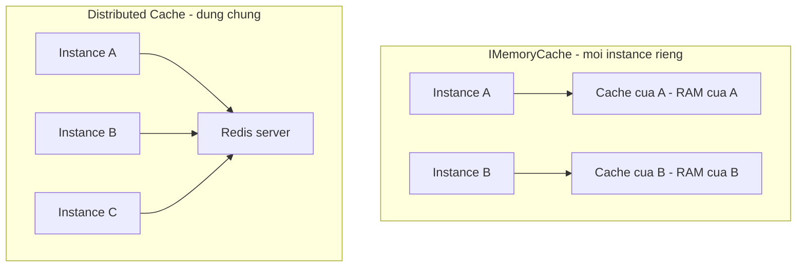
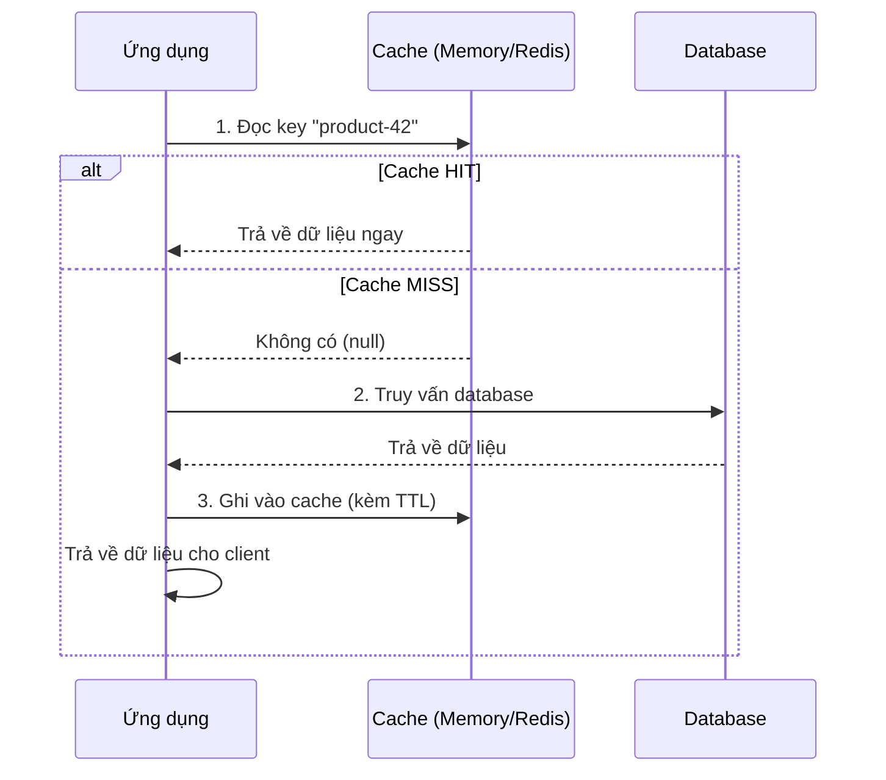

# Caching: `IMemoryCache` & Distributed Cache

!!! info "Bạn đang ở đây"
    **cần trước:** đã build và deploy xong một ứng dụng ASP.NET Core hoàn chỉnh (routing, DI, EF Core, deploy container) — biết cách một endpoint gọi database qua `DbContext`.
    **mở khoá:** giảm tải database khi ứng dụng có nhiều instance (scale-out), hiểu vì sao cache "biến mất" sau khi restart hoặc "không đồng bộ" giữa các instance, và nền tảng để đọc các chương resilience/observability nâng cao hơn.

> **Mục tiêu:** **Áp dụng** đúng `IMemoryCache` để cache kết quả truy vấn trong tiến trình, **phân biệt** được cache trong tiến trình với distributed cache (Redis) và giải thích vì sao chọn sai gây lỗi dữ liệu không đồng bộ giữa các instance, **mô tả** được cache-aside pattern qua sơ đồ luồng, và **nhận diện** được các tình huống cache invalidation gây hiển thị dữ liệu cũ (stale) cho người dùng.

---

## 0. Đoán nhanh trước khi học

Một API có endpoint `GET /products/{id}` đọc từ database. Đội vận hành đo thấy mỗi lần gọi endpoint này tốn **180ms** (query một bảng `Products` có index đầy đủ, nhưng bảng lớn và join thêm bảng giá). Endpoint này bị gọi **200 lần/giây**, và dữ liệu sản phẩm chỉ thay đổi vài lần mỗi ngày (do nhân viên kho cập nhật giá).

Đội thêm một dòng `services.AddMemoryCache()` và cache kết quả theo `id` trong 60 giây. Sau khi deploy, độ trễ trung bình của endpoint giảm từ 180ms xuống **dưới 1ms** cho các lần gọi trúng cache.

Vài tuần sau, đội scale ứng dụng ra **3 instance** chạy song song sau một load balancer để chịu tải cao hơn. Ngay sau đó, một nhân viên kho báo cáo: cập nhật giá sản phẩm trên trang quản trị (gọi tới instance A) xong, nhưng khách hàng ở trang mua hàng (load balancer định tuyến tới instance B hoặc C) vẫn thấy **giá cũ** suốt gần một phút.

??? question "Đoán trước, đáp án ở dưới"
    Gợi ý: `IMemoryCache` lưu dữ liệu ở đâu — trong RAM của tiến trình .NET đang chạy, hay ở một nơi tách biệt mà mọi instance cùng thấy?

??? note "Đáp án"
    `IMemoryCache` lưu cache **trong bộ nhớ (RAM) của chính tiến trình ứng dụng đang chạy nó** — mỗi instance có một vùng nhớ cache **hoàn toàn riêng biệt**, không liên quan gì tới instance khác. Khi nhân viên kho cập nhật giá qua instance A, code chạy trên instance A xoá/cập nhật cache **của instance A**. Nhưng instance B và instance C hoàn toàn không biết chuyện đó xảy ra — cache của chúng vẫn giữ giá trị cũ cho tới khi tự hết hạn (hết TTL 60 giây đã đặt). Đây chính xác là vấn đề mục 2 gọi tên: **`IMemoryCache` không dùng chung được giữa nhiều instance**. Mục 3 giới thiệu **distributed cache** — giải pháp cho đúng tình huống này.

---

## 1. Vấn đề gốc: truy vấn database lặp lại cho cùng một kết quả

**Định nghĩa:** Caching (bộ nhớ đệm) là kỹ thuật lưu lại **kết quả** của một phép tính hoặc truy vấn tốn thời gian, để lần sau cần **đúng kết quả đó**, ứng dụng đọc lại từ nơi lưu tạm (nhanh) thay vì tính/truy vấn lại từ đầu (chậm).

Hãy nhìn con số cụ thể ở tình huống mục 0 mà chưa có cache:

```text title="Thời gian phản hồi TRƯỚC khi có cache"
Request 1: SELECT ... FROM Products JOIN Prices ... WHERE Id = 42   -> 180ms
Request 2: SELECT ... FROM Products JOIN Prices ... WHERE Id = 42   -> 180ms  (giống hệt request 1)
Request 3: SELECT ... FROM Products JOIN Prices ... WHERE Id = 42   -> 180ms  (giống hệt request 1)
...
200 request/giây, tất cả hỏi id=42 -> 200 lần chạy CÙNG MỘT truy vấn CÙNG MỘT kết quả mỗi giây.
```

Vấn đề không phải là truy vấn *sai* — nó trả về đúng kết quả mỗi lần. Vấn đề là **lãng phí**: database phải làm lại đúng một công việc hàng trăm lần mỗi giây, dù kết quả không đổi trong nhiều phút hoặc nhiều giờ. Dưới tải cao, đây là nguyên nhân phổ biến khiến database trở thành **nút nghẽn** (bottleneck) của toàn hệ thống — không phải vì logic sai, mà vì không có gì ngăn việc lặp lại công việc không cần thiết.

Đây cũng là vấn đề về **chi phí hạ tầng**, không chỉ tốc độ. Database (đặc biệt là các dịch vụ database quản lý — managed database — tính phí theo tài nguyên tiêu thụ) thường là phần **đắt nhất** để scale trong một hệ thống: thêm một instance ứng dụng ASP.NET Core (stateless, không giữ dữ liệu) thường rẻ và nhanh; thêm khả năng chịu tải cho database (nâng cấp cấu hình, thêm read replica) thường đắt hơn nhiều và mất nhiều thời gian hơn để triển khai. Một truy vấn tốn 180ms lặp lại 200 lần/giây không chỉ làm chậm người dùng — nó buộc đội vận hành phải trả tiền cho một database mạnh hơn mức cần thiết, trong khi phần lớn "công việc" đó là lặp lại y hệt nhau. Caching, khi áp dụng đúng key và đúng dữ liệu, cắt giảm trực tiếp phần tải lặp lại này mà không cần thay đổi gì ở tầng database.

Sau khi thêm cache (mục 2 sẽ chỉ cách làm cụ thể), cùng tình huống:

```text title="Thời gian phản hồi SAU khi có cache (TTL 60 giây)"
Request 1 (giây 0):  KHÔNG có trong cache -> hỏi database -> 180ms -> LƯU vào cache
Request 2 (giây 0):  CÓ trong cache       -> đọc RAM      -> <1ms
Request 3 (giây 1):  CÓ trong cache       -> đọc RAM      -> <1ms
...
Request N (giây 60): cache HẾT HẠN        -> hỏi database -> 180ms -> LƯU lại vào cache
```

Chỉ **một** trong hàng nghìn request thực sự chạm tới database mỗi 60 giây; toàn bộ số còn lại đọc thẳng từ RAM. Đây là lý do caching là một trong những kỹ thuật tối ưu hiệu năng có tỷ lệ lợi ích/công sức cao nhất — nhưng (mục 0 đã cho thấy) nó cũng có thể gây lỗi tinh vi nếu chọn sai loại cache hoặc quên xử lý dữ liệu cũ. Mục 2 bắt đầu với loại cache đơn giản nhất: cache ngay trong tiến trình ứng dụng.

---

## 2. `IMemoryCache`: cache trong tiến trình của chính ứng dụng

**Định nghĩa:** `IMemoryCache` là một service có sẵn trong ASP.NET Core, lưu cặp key-value trực tiếp trong **bộ nhớ RAM của tiến trình .NET đang chạy** — đọc/ghi cực nhanh (không qua mạng, không qua ổ đĩa), nhưng dữ liệu chỉ sống được trong đúng tiến trình đó.

Đăng ký bằng `AddMemoryCache()`, sau đó tiêm `IMemoryCache` vào nơi cần dùng:

```csharp title="Program.cs"
// test:compile dang ky IMemoryCache va dung Set/TryGetValue truc tiep
using Microsoft.Extensions.Caching.Memory;

var builder = WebApplication.CreateBuilder(args);

// Dang ky: them IMemoryCache vao DI container.
builder.Services.AddMemoryCache();

var app = builder.Build();

app.MapGet("/products/{id:int}", (int id, IMemoryCache cache) =>
{
    var cacheKey = $"product-{id}";

    // TryGetValue: kiem tra key co trong cache khong, KHONG nem exception neu thieu.
    if (cache.TryGetValue(cacheKey, out Product? cached))
    {
        return Results.Ok(cached);
    }

    // Khong co trong cache -> gia lap "hoi database" (chuong nay khong noi EF Core de tap trung vao cache).
    var fromDatabase = new Product(id, $"San pham #{id}", 99.99m);

    // Set: luu vao cache, kem thoi gian het han (TTL) 60 giay.
    cache.Set(cacheKey, fromDatabase, TimeSpan.FromSeconds(60));

    return Results.Ok(fromDatabase);
});

app.Run();

sealed record Product(int Id, string Name, decimal Price);
```

`TryGetValue` trả về `true`/`false` và **không** ném exception nếu key chưa tồn tại — khác với việc đọc `Dictionary` bằng chỉ số (`dict[key]`) sẽ ném `KeyNotFoundException`. Đây là API được thiết kế đúng cho tình huống "có thể có, có thể không" của cache.

Cách gọn hơn — gộp "kiểm tra + tính + lưu" thành một lời gọi duy nhất bằng `GetOrCreateAsync`:

```csharp title="Program.cs"
// test:compile GetOrCreateAsync - gop kiem tra + tinh + luu cache thanh 1 loi goi
using Microsoft.Extensions.Caching.Memory;

var builder = WebApplication.CreateBuilder(args);

builder.Services.AddMemoryCache();

var app = builder.Build();

app.MapGet("/products/{id:int}", async (int id, IMemoryCache cache) =>
{
    var cacheKey = $"product-{id}";

    // GetOrCreateAsync: neu key CO trong cache -> tra ve ngay, KHONG chay lambda ben trong.
    // Neu key CHUA CO -> chay lambda (mo phong hoi database), luu ket qua, roi tra ve.
    var product = await cache.GetOrCreateAsync(cacheKey, async entry =>
    {
        entry.AbsoluteExpirationRelativeToNow = TimeSpan.FromSeconds(60);

        // Mo phong do tre khi hoi database (chuong nay khong noi EF Core de tap trung vao cache).
        await Task.Delay(1);
        return new Product(id, $"San pham #{id}", 99.99m);
    });

    return Results.Ok(product);
});

app.Run();

sealed record Product(int Id, string Name, decimal Price);
```

Lambda bên trong `GetOrCreateAsync` **chỉ chạy khi key chưa có trong cache** — nếu đã có, `GetOrCreateAsync` trả ngay giá trị cũ mà không chạy lại lambda (nên không "hỏi database" lần nữa). `entry.AbsoluteExpirationRelativeToNow` đặt thời gian hết hạn tính từ lúc lưu.

**Điều gì xảy ra khi dùng sai:** nếu bạn **quên đặt thời gian hết hạn** (không gọi `TimeSpan` nào trong `Set`, và không đặt `entry.AbsoluteExpirationRelativeToNow`/`SlidingExpiration` trong `GetOrCreateAsync`), entry sẽ **sống mãi trong RAM** cho tới khi ứng dụng restart hoặc hệ thống chủ động xoá (`Remove`) — với dữ liệu thay đổi liên tục (ví dụ số lượng hàng trong kho), người dùng có thể thấy dữ liệu cũ **vô thời hạn**, và nếu cache key sinh ra không giới hạn (ví dụ cache theo mỗi `userId` trong một hệ thống triệu người dùng), bộ nhớ RAM của tiến trình tăng dần không kiểm soát, cuối cùng gây `OutOfMemoryException` hoặc container bị hệ điều hành/orchestrator (ví dụ Kubernetes) **kill** vì vượt giới hạn memory đã cấp phát.

Một điểm dễ nhầm giữa hai cách viết trên: nếu bạn dùng cách `TryGetValue` + `Set` thủ công (cách đầu tiên) trong một endpoint bị gọi **đồng thời** bởi nhiều request cùng lúc (ví dụ 50 request/giây cùng hỏi `product-42` khi cache vừa hết hạn), **nhiều request có thể cùng thấy `TryGetValue` trả về `false`** trước khi bất kỳ request nào kịp gọi `Set` — dẫn tới nhiều request cùng "hỏi database" cho cùng một key, dù về logic chỉ cần một request làm việc đó là đủ. `GetOrCreateAsync` (cách thứ hai) **không** tự động giải quyết hoàn toàn vấn đề này (nó không có khoá toàn cục theo key), nhưng vì gộp kiểm tra và tạo giá trị vào một lời gọi duy nhất, nó giảm khoảng thời gian "cửa sổ hở" (race window) giữa kiểm tra và ghi so với viết tay hai bước riêng — mục DEEP DIVE ở cuối bài giải thích thêm về vấn đề này dưới tên gọi "cache stampede", khi số request đồng thời lớn hơn nhiều (hàng nghìn/giây).

---

## 3. Phân biệt: `IMemoryCache` mất khi restart, không dùng chung được giữa nhiều instance

**Định nghĩa:** "Cache trong tiến trình" (in-process cache, như `IMemoryCache`) nghĩa là dữ liệu cache tồn tại **bên trong không gian nhớ của một tiến trình .NET cụ thể** — khi tiến trình đó dừng (restart, deploy, crash) hoặc khi có một tiến trình **khác** đang chạy song song, dữ liệu cache đó không tồn tại/không nhìn thấy được ở nơi khác.

Hai hệ quả cụ thể, cả hai đều đã xuất hiện ở mục 0:

**Hệ quả 1 — mất cache khi restart.** Mọi entry đang có trong `IMemoryCache` nằm trong RAM của tiến trình. Khi bạn deploy phiên bản mới (dừng tiến trình cũ, khởi động tiến trình mới) hoặc tiến trình crash và được orchestrator khởi động lại, toàn bộ cache **biến mất hoàn toàn** — không có gì được lưu lại, không có cách "khôi phục" cache cũ. Request đầu tiên sau restart luôn phải hỏi lại database (giống request đầu tiên ở mục 1), dù trước đó cache đang "đầy" và nhanh.

**Hệ quả 2 — không đồng bộ giữa nhiều instance.** Đây là đúng tình huống mục 0:

```text title="Vi du cu the: 2 instance chay load-balance, cung dung IMemoryCache"
Load balancer phan phoi request luan phien giua Instance A va Instance B.

12:00:00  Khach hang goi GET /products/42 -> route toi Instance A
          Instance A: KHONG co trong cache -> hoi DB -> luu vao cache CUA RIENG A -> tra ve gia 100k

12:00:01  Nhan vien kho sua gia san pham 42 thanh 150k qua Instance A
          Instance A: cap nhat DB, XOA cache CUA RIENG A cho key "product-42"

12:00:02  Khach hang khac goi GET /products/42 -> route toi Instance B
          Instance B: cache CUA RIENG B CHUA TUNG BI XOA (B khong biet A vua xoa gi)
                      -> neu B da tung cache gia 100k truoc do -> TRA VE GIA CU 100k

Ket qua: khach hang thay gia SAI (100k) trong khi DB thuc te da la 150k,
cho toi khi cache cua Instance B tu het han theo TTL.
```

`IMemoryCache` của instance A và instance B là **hai vùng RAM hoàn toàn tách biệt** — không có cơ chế nào để một instance "báo" cho instance khác biết là cache cần xoá. Đây không phải lỗi của `IMemoryCache` (nó làm đúng chức năng "cache trong tiến trình" của nó) — đây là lỗi **chọn sai loại cache** cho một hệ thống chạy nhiều instance. Mục 4 giới thiệu loại cache được thiết kế đúng cho tình huống này.

Hệ quả 1 và hệ quả 2 thường **cộng dồn** trong một tình huống vận hành phổ biến: **rolling deployment** (triển khai phiên bản mới lần lượt từng instance, không dừng toàn bộ hệ thống cùng lúc, để tránh downtime). Ví dụ với 3 instance A, B, C đang chạy phiên bản cũ, quy trình rolling deployment thường là: dừng và khởi động lại A với phiên bản mới, đợi A sẵn sàng, rồi mới làm tương tự với B, rồi C. Trong suốt quá trình này:

```text title="Vi du cu the: rolling deployment lam cache 'nguoi' (cold) lech nhau giua cac instance"
Truoc deploy: A, B, C deu dang co cache "am" (warm) - da cache san hau het san pham pho bien.

Buoc 1: Dung A, khoi dong lai A voi phien ban moi.
        -> Cache CUA A bi xoa trang (tien trinh moi = RAM moi = cache rong).
        -> B va C VAN giu cache am cua chung (chua bi dung).

Buoc 2 (ngay sau buoc 1): Load balancer van gui 1/3 luu luong toi A.
        -> MOI request toi A deu la cache miss (vi A moi khoi dong, cache rong)
        -> A phai hoi lai database cho TUNG san pham pho bien, du B/C van dang cache san.
        -> Trong vai chuc giay/vai phut, A co do tre CAO HON B/C ro rang cho CUNG mot san pham.
```

Đây không phải là lỗi (dữ liệu vẫn đúng — chỉ là chậm hơn tạm thời), nhưng là một hệ quả trực tiếp của việc mỗi instance tự quản lý cache riêng: sau mỗi lần rolling deployment, **luôn có một khoảng thời gian** một hoặc nhiều instance có cache "nguội" (cold, vừa khởi động, chưa có gì trong cache) trong khi các instance khác vẫn "ấm" (warm). Nếu dùng `IDistributedCache` (mục 4), vấn đề này biến mất hoàn toàn — cache nằm ở Redis, tách biệt hoàn toàn khỏi vòng đời của từng instance ứng dụng, nên instance A vừa khởi động lại vẫn đọc được cache "ấm" mà B/C đã tạo ra từ trước.

---

## 4. Distributed cache: cache ở một nơi dùng chung cho nhiều instance

**Định nghĩa:** Distributed cache (cache phân tán) là cache được lưu ở một **server riêng biệt** (tách khỏi tiến trình ứng dụng), qua mạng — mọi instance của ứng dụng, dù chạy trên máy/container nào, đều đọc/ghi vào **cùng một nơi lưu trữ đó**, nên khi một instance cập nhật hoặc xoá cache, mọi instance khác lập tức thấy thay đổi.

Redis là lựa chọn distributed cache phổ biến nhất trong hệ sinh thái .NET. Sơ đồ dưới so sánh trực quan hai kiến trúc:



Trong ASP.NET Core, `IDistributedCache` là interface trừu tượng cho mọi distributed cache (Redis là một trong các cách triển khai cụ thể). Đăng ký Redis qua gói `StackExchange.Redis` (gói ngoài — chương này minh hoạ khái niệm bằng `test:skip`, vì cần cả package ngoài lẫn một server Redis thật đang chạy để build/run được):

```csharp title="Program.cs"
// test:skip minh hoa IDistributedCache voi Redis - can package ngoai StackExchange.Redis (Microsoft.Extensions.Caching.StackExchangeRedis)
// VA mot Redis server thuc dang chay - khong co san trong `dotnet new web` tran
using Microsoft.Extensions.Caching.Distributed;
using System.Text.Json;

var builder = WebApplication.CreateBuilder(args);

// Dang ky IDistributedCache, trien khai bang Redis, ket noi toi mot server Redis rieng.
builder.Services.AddStackExchangeRedisCache(options =>
{
    options.Configuration = "localhost:6379"; // dia chi server Redis (co the la mot may/container khac)
});

var app = builder.Build();

app.MapGet("/products/{id:int}", async (int id, IDistributedCache cache) =>
{
    var cacheKey = $"product-{id}";

    // GetStringAsync: doc tu Redis qua mang (khong phai doc RAM cua tien trinh nay).
    var cachedJson = await cache.GetStringAsync(cacheKey);
    if (cachedJson is not null)
    {
        var cached = JsonSerializer.Deserialize<Product>(cachedJson);
        return Results.Ok(cached);
    }

    // Mo phong "hoi database" (chuong nay khong noi EF Core de tap trung vao cache).
    var fromDatabase = new Product(id, $"San pham #{id}", 99.99m);

    var options = new DistributedCacheEntryOptions
    {
        AbsoluteExpirationRelativeToNow = TimeSpan.FromSeconds(60)
    };

    // SetStringAsync: ghi qua mang vao Redis - MOI instance khac cung doc duoc ngay gia tri nay.
    await cache.SetStringAsync(cacheKey, JsonSerializer.Serialize(fromDatabase), options);

    return Results.Ok(fromDatabase);
});

app.Run();

sealed record Product(int Id, string Name, decimal Price);
```

Khác biệt cốt lõi so với `IMemoryCache`: `IDistributedCache` chỉ làm việc với `string`/`byte[]` (phải tự serialize/deserialize, ví dụ qua `JsonSerializer`), và mọi lời gọi `GetStringAsync`/`SetStringAsync` đi **qua mạng** tới server Redis — chậm hơn đọc RAM trực tiếp (thường vẫn chỉ vài millisecond, nhưng không phải "gần như 0" như `IMemoryCache`), đổi lại toàn bộ instance dùng chung một nguồn sự thật.

**Điều gì xảy ra khi dùng sai:** nếu bạn tưởng `IDistributedCache` hoạt động giống `IMemoryCache` (có thể lưu trực tiếp object C# mà không serialize), code sẽ **không compile** — `IDistributedCache` không có overload `Set(string, object)` như `IMemoryCache`, chỉ có `SetAsync(string, byte[])`/`SetStringAsync(string, string)`. Ngược lại, nếu chọn `IDistributedCache` khi ứng dụng của bạn **chỉ chạy một instance duy nhất** (không scale-out), bạn chịu thêm độ trễ mạng và thêm một hệ thống phải vận hành/giám sát (Redis server) mà không có lợi ích gì — mục 3 và mục này chính là để giúp bạn chọn đúng loại cache theo đúng kiến trúc thật của ứng dụng.

Một cạm bẫy vận hành khác đáng biết trước: `AddStackExchangeRedisCache` đăng ký và quản lý **một** kết nối dùng chung (tương tự cách `IHttpClientFactory` quản lý pool handler ở chương gọi API bên ngoài) — bạn **không** tự tạo kết nối Redis mới ở mỗi request. Nếu server Redis tạm thời không kết nối được (mạng chập chờn, Redis đang restart), mọi lời gọi `GetStringAsync`/`SetStringAsync` sẽ ném exception (kiểu `RedisConnectionException` từ thư viện `StackExchange.Redis`) — nếu code không có phương án dự phòng (fallback), toàn bộ endpoint sập theo Redis dù database vẫn hoạt động bình thường. Vì lý do này, hệ thống production thường bọc lời gọi cache trong `try/catch`, xử lý lỗi kết nối cache như một tín hiệu "bỏ qua cache lần này, hỏi thẳng database" thay vì để lỗi cache làm sập cả endpoint — cấu hình retry/timeout chi tiết hơn cho tình huống này là nội dung của chương resilience patterns.

---

## 5. Cache-aside pattern: đọc cache trước, database chỉ khi cần

**Định nghĩa:** Cache-aside (còn gọi là lazy loading) là một khuôn mẫu (pattern) truy cập dữ liệu, trong đó ứng dụng luôn **đọc cache trước**; nếu cache có dữ liệu (cache hit) thì dùng ngay, nếu không (cache miss) mới truy vấn database, rồi **ghi kết quả vào cache** trước khi trả về — để lần đọc kế tiếp với cùng key sẽ hit cache.

Cả hai ví dụ ở mục 2 (`IMemoryCache`) và mục 4 (`IDistributedCache`) đều đã áp dụng đúng cache-aside pattern mà không gọi tên nó — sơ đồ dưới mô tả tường minh luồng chung:



Tên gọi "cache-aside" xuất phát từ việc **ứng dụng** (không phải database, không phải một lớp trung gian tự động) chịu trách nhiệm điều phối toàn bộ luồng này — cache "đứng bên cạnh" (aside) database, và chính code của bạn quyết định khi nào đọc cache, khi nào hỏi database, khi nào ghi lại vào cache. Đây khác với các pattern khác như "write-through" (ghi đồng thời vào cache và database mỗi lần cập nhật) — chương này chỉ tập trung vào cache-aside vì đây là pattern phổ biến nhất và đơn giản nhất để áp dụng đúng trước khi học các biến thể phức tạp hơn.

Cache-aside trả lời đúng câu hỏi "khi nào cache được **tạo**" (lúc cache miss, ngay sau khi hỏi database) — nhưng tự nó **không** trả lời câu hỏi "khi nào cache bị **xoá/cập nhật** khi dữ liệu gốc đổi". Đây là lý do dù đã áp dụng đúng cache-aside ở mục 2 và mục 4, tình huống mục 0 (giá hiển thị sai sau khi cập nhật) vẫn xảy ra — cache-aside chỉ mô tả luồng **đọc**, còn xử lý luồng **ghi/cập nhật** đúng cách là một vấn đề riêng, gọi là cache invalidation, mục 6 đi sâu vào đúng vấn đề này.

Để thấy rõ hiệu ứng của cache-aside trên số lần thực sự "chạm" tới nguồn dữ liệu gốc, ví dụ độc lập dưới đây mô phỏng một "database" bằng biến đếm số lần bị gọi, rồi gọi cùng một key nhiều lần qua `IMemoryCache`:

```csharp title="Program.cs"
// test:compile mo phong cache-aside doc lap - dem so lan THAT SU cham vao "database" (build trong web project de co san Microsoft.Extensions.Caching.Memory)
using Microsoft.Extensions.Caching.Memory;

var cache = new MemoryCache(new MemoryCacheOptions());
var databaseHitCount = 0;

string ReadThroughCache(string key)
{
    if (cache.TryGetValue(key, out string? cached))
    {
        return cached!;
    }

    // Mo phong database: tang bien dem MOI KHI thuc su "hoi" toi day (cache miss).
    databaseHitCount++;
    var fromDatabase = $"gia-tri-cua-{key}";
    cache.Set(key, fromDatabase, TimeSpan.FromSeconds(60));
    return fromDatabase;
}

// Goi 5 lan LIEN TIEP cung mot key "product-42" - mo phong 5 request toi cung endpoint.
for (var i = 0; i < 5; i++)
{
    var result = ReadThroughCache("product-42");
    Console.WriteLine($"Lan goi {i + 1}: {result}");
}

Console.WriteLine($"Tong so lan THAT SU hoi database: {databaseHitCount}");
```

```text title="Output"
Lan goi 1: gia-tri-cua-product-42
Lan goi 2: gia-tri-cua-product-42
Lan goi 3: gia-tri-cua-product-42
Lan goi 4: gia-tri-cua-product-42
Lan goi 5: gia-tri-cua-product-42
Tong so lan THAT SU hoi database: 1
```

Cả 5 lần gọi đều trả về đúng kết quả, nhưng `databaseHitCount` chỉ tăng lên **1** — đúng con số minh hoạ cho lợi ích đã tính ở mục 1 (chỉ một request thực sự chạm database, phần còn lại đọc từ cache). Nếu xoá dòng `cache.Set(...)` (quên bước "ghi lại vào cache" của cache-aside), `databaseHitCount` sẽ tăng lên 5 — đúng bằng số lần gọi, vì không có gì được lưu lại giữa các lần gọi.

**Điều gì xảy ra khi dùng sai:** nếu code **ghi vào cache trước khi xác nhận** truy vấn database thành công (ví dụ ghi cache trong một `try` nhưng đặt trước lệnh gọi database, hoặc cache một kết quả `null`/lỗi mà không kiểm tra), request sau đó sẽ đọc cache và nhận **dữ liệu rác hoặc null** trong suốt thời gian TTL còn lại, thay vì thử lại database — đây là lỗi tinh vi vì nó chỉ lộ ra khi request đầu tiên (request tạo cache) gặp lỗi tạm thời (ví dụ database timeout thoáng qua), và ảnh hưởng của nó kéo dài đúng bằng thời gian TTL đã đặt.

---

## 6. Cache invalidation: vấn đề khó — khi nào xoá/cập nhật cache cũ

**Định nghĩa:** Cache invalidation là việc **chủ động xoá hoặc cập nhật** một entry trong cache khi dữ liệu gốc (trong database) đã thay đổi, để tránh cache tiếp tục trả về giá trị **cũ** (stale) — đây được xem là một trong những vấn đề khó nhất của kỹ thuật phần mềm vì không có một câu trả lời đúng cho mọi tình huống: xoá quá sớm làm mất lợi ích của cache (lại phải hỏi database liên tục), xoá quá muộn làm người dùng thấy dữ liệu sai.

Quay lại đúng ví dụ ở mục 0 và mục 3 — nhân viên kho cập nhật giá sản phẩm 42 từ 100k thành 150k:

```text title="Vi du cu the: du lieu stale hien thi sai cho user"
12:00:00  Cache dang giu: "product-42" = { Price: 100000 }  (con 45 giay nua het han TTL 60s)
12:00:01  Nhan vien kho: UPDATE Products SET Price = 150000 WHERE Id = 42   (chi sua DATABASE)
12:00:01  ... code KHONG xoa cache "product-42" ...
12:00:05  Khach hang xem san pham 42 -> doc TU CACHE -> thay gia 100000 (SAI, DB da la 150000)
12:00:45  Cache het han TTL -> lan doc ke tiep moi hoi lai DB -> tu day moi thay gia dung 150000
```

Trong 44 giây, khách hàng thấy **giá sai** — không phải vì code cache có lỗi kỹ thuật (nó hoạt động đúng như thiết kế: giữ dữ liệu tới khi hết TTL), mà vì **không ai chủ động báo cho cache biết dữ liệu gốc đã đổi**. Đây chính là cache invalidation: endpoint cập nhật giá phải chủ động gọi `cache.Remove("product-42")` (với `IMemoryCache`) hoặc `cache.RemoveAsync("product-42")` (với `IDistributedCache`) **ngay sau khi** cập nhật database thành công, để lần đọc kế tiếp buộc phải hỏi lại database và lấy giá mới.

Sửa đúng endpoint cập nhật giá ở ví dụ mục 0/mục 3 bằng cách thêm invalidation chủ động:

```csharp title="Program.cs"
// test:compile invalidation chu dong - xoa cache ngay sau khi cap nhat database thanh cong
using Microsoft.Extensions.Caching.Memory;

var builder = WebApplication.CreateBuilder(args);
builder.Services.AddMemoryCache();

var app = builder.Build();

app.MapPut("/products/{id:int}/price", (int id, decimal newPrice, IMemoryCache cache) =>
{
    // Mo phong cap nhat database (chuong nay khong noi EF Core de tap trung vao cache).
    var updated = new Product(id, $"San pham #{id}", newPrice);

    // CHI xoa cache SAU KHI da chac chan cap nhat database thanh cong.
    // Neu xoa TRUOC ma cap nhat database that bai, request sau se hoi lai DB va thay du lieu CU
    // (khong sai, nhung mat tac dung cache mot lan) - it nguy hiem hon xoa QUA MUON hoac QUEN xoa.
    cache.Remove($"product-{id}");

    return Results.Ok(updated);
});

app.Run();

sealed record Product(int Id, string Name, decimal Price);
```

Ngay sau khi `PUT` này chạy, lần gọi `GET /products/42` kế tiếp sẽ **cache miss** (vì key đã bị xoá) và buộc phải hỏi lại "database", đảm bảo trả về giá mới — đúng luồng cache-aside đã mô tả ở mục 5, chỉ khác là lần này cache bị xoá chủ động thay vì tự hết hạn theo TTL.

Hai chiến lược thường gặp để giảm mức độ nghiêm trọng của vấn đề này:

- **TTL ngắn hơn:** đánh đổi hiệu năng (hỏi database thường xuyên hơn) để lấy dữ liệu mới hơn. Phù hợp khi bạn không kiểm soát được mọi nơi dữ liệu gốc bị thay đổi (ví dụ một hệ thống khác ghi trực tiếp vào database, không qua API của bạn).
- **Invalidation chủ động** (như ví dụ `Remove` trên): xoá đúng key ngay khi biết dữ liệu đổi. Chính xác hơn TTL ngắn, nhưng chỉ hoạt động khi **mọi** đường ghi dữ liệu đều đi qua code có gọi `Remove` — nếu có một đường ghi khác (ví dụ một script SQL chạy trực tiếp, hoặc một service khác) không gọi `Remove`, cache vẫn stale mà không ai biết.

Trong thực tế, hai chiến lược này thường được dùng **cùng nhau**, không thay thế nhau: invalidation chủ động xử lý đường ghi mà bạn kiểm soát được (API của chính ứng dụng), còn TTL đóng vai trò "lưới an toàn" (safety net) cho những đường ghi bạn không lường được hoặc không kiểm soát được (ví dụ một job đồng bộ dữ liệu từ hệ thống ERP chạy độc lập, ghi trực tiếp vào database). Nói cách khác: invalidation chủ động giúp dữ liệu đúng **sớm** trong trường hợp phổ biến, còn TTL đảm bảo dữ liệu không thể sai **quá lâu** dù invalidation chủ động bị bỏ lỡ ở một đường ghi nào đó — không nên coi invalidation chủ động là đủ để bỏ luôn việc đặt TTL hợp lý.

**Điều gì xảy ra khi dùng sai:** hệ quả cụ thể nhất đã thấy ở trên — người dùng thấy **dữ liệu cũ (stale)**, và mức độ nghiêm trọng tuỳ vào loại dữ liệu: giá sản phẩm hiển thị sai gây mất niềm tin khách hàng hoặc tranh chấp đơn hàng; số lượng hàng trong kho hiển thị sai (còn hàng trong cache nhưng đã hết trong database) khiến khách đặt được đơn hàng không thể giao; quyền truy cập của người dùng hiển thị sai (đã bị thu hồi quyền trong database nhưng cache còn giữ quyền cũ) là **lỗ hổng bảo mật** — người dùng vẫn thao tác được với quyền đã bị gỡ trong suốt thời gian TTL còn lại. Vì hệ quả tuỳ thuộc dữ liệu, luôn tự hỏi "nếu dữ liệu này stale trong đúng khoảng TTL đã đặt, hậu quả tệ nhất là gì" trước khi chọn TTL hoặc bỏ qua invalidation chủ động.

---

## 7. So sánh tổng hợp và ví dụ trộn cả hai loại cache

Sau khi đã hiểu riêng từng khái niệm (mục 2-6), bảng dưới tổng hợp lại để chọn đúng loại cache theo tình huống thực tế:

| Tiêu chí | `IMemoryCache` | `IDistributedCache` (Redis) |
|---|---|---|
| Nơi lưu dữ liệu | RAM của tiến trình .NET đang chạy | Server Redis riêng, qua mạng |
| Tốc độ đọc/ghi | Cực nhanh (dưới 1ms, không qua mạng) | Nhanh nhưng chậm hơn (vài ms, qua mạng) |
| Khi ứng dụng restart | Mất toàn bộ cache | Vẫn còn (Redis là tiến trình riêng, không phụ thuộc ứng dụng) |
| Nhiều instance (scale-out) | Mỗi instance cache riêng — **không đồng bộ** | Mọi instance đọc/ghi **cùng một nơi** — đồng bộ |
| Kiểu dữ liệu lưu trực tiếp | Bất kỳ object C# (`object? value`) | Chỉ `string`/`byte[]` — phải tự serialize |
| Cần hạ tầng thêm | Không (có sẵn trong ASP.NET Core) | Cần server Redis riêng, cần vận hành/giám sát thêm |
| Phù hợp khi | Ứng dụng chạy 1 instance, hoặc cache dữ liệu **không cần đồng bộ tuyệt đối** giữa instance | Ứng dụng scale-out nhiều instance, cần một nguồn cache dùng chung |

Một hệ thống thực tế thường **không chọn một trong hai** mà kết hợp cả hai theo đúng vai trò của từng loại — ví dụ dưới minh hoạ trộn `IMemoryCache` (cho dữ liệu gần như không đổi, ví dụ cấu hình hiển thị) và `IDistributedCache` (cho dữ liệu cần đồng bộ giữa instance, ví dụ giá sản phẩm) trong cùng một endpoint:

```csharp title="Program.cs"
// test:compile tron IMemoryCache (cau hinh it doi, khong can dong bo) va gia lap chien luoc chon cache theo loai du lieu
using Microsoft.Extensions.Caching.Memory;

var builder = WebApplication.CreateBuilder(args);
builder.Services.AddMemoryCache();

var app = builder.Build();

app.MapGet("/storefront/{productId:int}", (int productId, IMemoryCache cache) =>
{
    // Du lieu "gan nhu khong doi" (ten cua hang, logo...) - moi instance tu cache RIENG la du,
    // vi du co lech vai giay giua cac instance cung KHONG gay hau qua nghiem trong.
    var storeName = cache.GetOrCreate("store-display-name", entry =>
    {
        entry.AbsoluteExpirationRelativeToNow = TimeSpan.FromMinutes(30);
        return "Cua hang demo"; // mo phong doc tu bang cau hinh, hiem khi doi
    });

    // Du lieu "can dong bo giua instance" (gia san pham) - trong he thong scale-out thuc te,
    // day la noi NEN dung IDistributedCache (mục 4) thay vi IMemoryCache, vi gia phai giong nhau
    // tren MOI instance ngay sau khi cap nhat - minh hoa nay chi dung IMemoryCache de compile
    // duoc khong can Redis server, KHONG phai khuyen nghi kien truc thuc te cho du lieu nay.
    var price = cache.GetOrCreate($"product-{productId}-price", entry =>
    {
        entry.AbsoluteExpirationRelativeToNow = TimeSpan.FromSeconds(60);
        return 99.99m;
    });

    return Results.Ok(new { storeName, productId, price });
});

app.Run();
```

Điểm quan trọng của ví dụ trộn này: quyết định dùng `IMemoryCache` hay `IDistributedCache` không phải là "chọn một cho toàn ứng dụng", mà là **chọn theo từng loại dữ liệu**, dựa trên câu hỏi mục 3 và mục 4 đã đặt ra — dữ liệu này có bắt buộc phải giống nhau tuyệt đối trên mọi instance ngay lập tức không? Nếu có, cần `IDistributedCache`; nếu lệch vài giây/vài phút giữa các instance không gây hậu quả gì, `IMemoryCache` đơn giản hơn và nhanh hơn là lựa chọn hợp lý.

---

## Cạm bẫy & thực chiến

- **Dùng `IMemoryCache` cho ứng dụng chạy nhiều instance (scale-out) sau load balancer:** mỗi instance cache riêng, dẫn tới dữ liệu không đồng bộ giữa các instance (mục 3) — người dùng thấy kết quả khác nhau tuỳ request rơi vào instance nào. Cần `IDistributedCache` (Redis) khi có nhiều instance cùng cần thấy một nguồn cache.
- **Quên đặt thời gian hết hạn (TTL) khi gọi `Set`/`GetOrCreateAsync`:** entry sống mãi trong RAM, gây dữ liệu cũ vô thời hạn và có thể dẫn tới tăng bộ nhớ không kiểm soát nếu cache key sinh không giới hạn (mục 2).
- **Cập nhật database nhưng quên gọi `Remove`/`RemoveAsync` trên cache tương ứng:** đây là lỗi cache invalidation phổ biến nhất — dữ liệu trong database đã đúng, nhưng cache vẫn trả về giá trị cũ tới khi hết TTL (mục 6).
- **Tưởng `IDistributedCache` lưu trực tiếp object C# như `IMemoryCache`:** `IDistributedCache` chỉ làm việc với `string`/`byte[]`, phải tự serialize/deserialize — gọi nhầm API sẽ không compile (mục 4).
- **Cache cả kết quả lỗi hoặc `null`:** nếu không kiểm tra kỹ trước khi ghi vào cache, một lỗi tạm thời (database timeout thoáng qua) có thể bị "đóng băng" trong cache suốt thời gian TTL, khiến mọi request sau đó nhận cùng lỗi/dữ liệu rác dù database đã hoạt động lại bình thường (mục 5).
- **Chọn TTL quá dài cho dữ liệu nhạy cảm với thời gian** (quyền truy cập, số lượng hàng trong kho, giá): mức độ nghiêm trọng của dữ liệu stale khác nhau rất nhiều theo loại dữ liệu — luôn đánh giá hậu quả tệ nhất trước khi chọn TTL (mục 6).
- **Không xử lý lỗi kết nối tới Redis:** nếu server Redis tạm thời không phản hồi được và code không có `try/catch` quanh lời gọi `IDistributedCache`, toàn bộ endpoint sập theo cache dù database phía sau vẫn hoạt động tốt (mục 4) — một thành phần vốn chỉ nên "tối ưu hiệu năng" lại trở thành điểm lỗi (single point of failure) của cả hệ thống.
- **Bỏ qua rolling deployment khi thiết kế cache:** nếu ứng dụng scale-out và triển khai theo kiểu rolling (từng instance một), dùng `IMemoryCache` khiến mỗi lần deploy đều có một khoảng thời gian instance vừa khởi động lại có cache "nguội", trong khi instance khác vẫn "ấm" — không sai về dữ liệu nhưng gây độ trễ không đồng đều giữa các instance ngay sau mỗi lần deploy (mục 3).

---

## Bài tập

**Bài 1 (có giàn giáo).** Đoạn dưới cache kết quả tính tổng đơn hàng của khách, nhưng **không đặt thời gian hết hạn** nào. Sửa để cache tự hết hạn sau 30 giây bằng `AbsoluteExpirationRelativeToNow`.

```csharp title="Program.cs"
// test:compile bai 1 - can sua: thieu thoi gian het han cho cache
using Microsoft.Extensions.Caching.Memory;

var builder = WebApplication.CreateBuilder(args);
builder.Services.AddMemoryCache();

var app = builder.Build();

app.MapGet("/customers/{id:int}/total", async (int id, IMemoryCache cache) =>
{
    var total = await cache.GetOrCreateAsync($"total-{id}", async entry =>
    {
        // CHUA co dong nao dat thoi gian het han o day.
        await Task.Delay(1); // mo phong tinh tong tu database
        return 1_250_000m;
    });

    return Results.Ok(total);
});

app.Run();
```

Gợi ý giàn giáo: đặt `entry.AbsoluteExpirationRelativeToNow` ngay dòng đầu bên trong lambda, trước khi trả về giá trị.

??? success "Lời giải + vì sao"
    ```csharp title="Program.cs"
    // test:compile bai 1 da sua - dat AbsoluteExpirationRelativeToNow = 30 giay
    using Microsoft.Extensions.Caching.Memory;

    var builder = WebApplication.CreateBuilder(args);
    builder.Services.AddMemoryCache();

    var app = builder.Build();

    app.MapGet("/customers/{id:int}/total", async (int id, IMemoryCache cache) =>
    {
        var total = await cache.GetOrCreateAsync($"total-{id}", async entry =>
        {
            entry.AbsoluteExpirationRelativeToNow = TimeSpan.FromSeconds(30);
            await Task.Delay(1); // mo phong tinh tong tu database
            return 1_250_000m;
        });

        return Results.Ok(total);
    });

    app.Run();
    ```

    **Vì sao:** không đặt thời gian hết hạn khiến entry sống mãi trong RAM của tiến trình (mục 2) — nếu tổng đơn hàng của khách thay đổi (đặt thêm đơn mới), endpoint sẽ tiếp tục trả về tổng **cũ** vô thời hạn. Đặt `AbsoluteExpirationRelativeToNow = 30 giây` đảm bảo dữ liệu không thể cũ hơn 30 giây so với thực tế.

**Bài 2 (thiết kế).** Ứng dụng của bạn hiện chạy **một instance duy nhất**, dùng `IMemoryCache` để cache thông tin hồ sơ người dùng (`GET /users/{id}`) với TTL 5 phút. Endpoint `PUT /users/{id}` cho phép người dùng đổi tên hiển thị, hiện tại chỉ cập nhật database mà không đụng tới cache. Sếp thông báo: tuần sau sẽ scale ứng dụng lên 3 instance sau load balancer. Hãy nêu (a) lỗi cache invalidation đang tồn tại ngay cả khi chỉ có 1 instance, và (b) vấn đề mới sẽ xuất hiện sau khi scale lên 3 instance, cùng cách khắc phục cho từng vấn đề.

??? success "Lời giải + vì sao"
    **(a) Lỗi ngay cả với 1 instance:** `PUT /users/{id}` cập nhật database nhưng không gọi `cache.Remove($"user-{id}")` — đây là lỗi cache invalidation (mục 6). Người dùng đổi tên xong, gọi lại `GET /users/{id}` trong vòng 5 phút vẫn thấy tên **cũ** vì cache chưa hết hạn và chưa bị xoá chủ động. Khắc phục: thêm `cache.Remove($"user-{id}")` ngay sau khi `PUT` cập nhật database thành công.

    **(b) Vấn đề mới sau khi scale lên 3 instance:** dù đã sửa (a) để gọi `Remove` đúng, `IMemoryCache` vẫn chỉ xoá cache **của đúng instance nhận request `PUT` đó** (mục 3) — hai instance còn lại không biết gì về việc xoá này, vẫn giữ tên cũ trong cache riêng của chúng tới khi tự hết hạn TTL. Khắc phục đúng: chuyển từ `IMemoryCache` sang `IDistributedCache` (Redis, mục 4) — khi đó `RemoveAsync` xoá đúng một bản duy nhất mà **cả 3 instance cùng đọc/ghi**, nên mọi instance đều thấy hiệu lực xoá ngay lập tức, không còn phụ thuộc instance nào xử lý request nào.

**Bài 3 (phân loại).** Một ứng dụng chạy 4 instance sau load balancer có 4 loại dữ liệu cần cache: (1) danh sách quốc gia cho dropdown (gần như không đổi, cập nhật thủ công vài tháng một lần), (2) số dư tài khoản ngân hàng của người dùng, (3) kết quả tính toán thống kê trang chủ (đúng gần đúng là chấp nhận được, cập nhật mỗi 5 phút là đủ), (4) danh sách quyền (permission) của người dùng hiện đang đăng nhập. Với mỗi loại, chọn `IMemoryCache` hay `IDistributedCache` và giải thích ngắn dựa trên bảng so sánh mục 7.

??? success "Lời giải + vì sao"
    (1) **Danh sách quốc gia:** `IMemoryCache`. Dữ liệu gần như không đổi, và dù 4 instance có cache lệch nhau vài phút sau khi admin cập nhật, hậu quả gần như bằng không (dropdown vẫn đúng tuyệt đại đa số thời gian) — không cần trả giá thêm độ trễ mạng và hạ tầng Redis cho lợi ích không đáng kể.

    (2) **Số dư tài khoản ngân hàng:** không nên cache theo kiểu TTL dài ở tầng ứng dụng cho cả hai loại cache — đây là dữ liệu mà stale gây hậu quả tài chính nghiêm trọng (mục 6). Nếu buộc phải cache để giảm tải, phải dùng `IDistributedCache` với TTL rất ngắn (vài giây) VÀ invalidation chủ động ngay sau mỗi giao dịch, không dựa vào TTL đơn thuần.

    (3) **Thống kê trang chủ:** `IMemoryCache` là đủ. "Đúng gần đúng, cập nhật mỗi 5 phút là đủ" đúng là định nghĩa của trường hợp lệch nhẹ giữa các instance không gây hậu quả — mỗi instance tự tính và cache riêng trong 5 phút là hoàn toàn hợp lý, không cần đồng bộ tuyệt đối.

    (4) **Danh sách quyền của người dùng:** `IDistributedCache`, VÀ phải có invalidation chủ động khi quyền bị thu hồi (không chỉ dựa vào TTL) — đây đúng là ví dụ lỗ hổng bảo mật đã nêu ở câu tự kiểm tra số 8: nếu 4 instance không đồng bộ, người dùng có thể vẫn giữ quyền cũ trên 3 instance chưa bị xoá cache trong khi đã bị thu hồi quyền trên instance thứ 4.

**Bài 4 (gỡ lỗi production).** Endpoint dưới dùng `IMemoryCache` để cache tổng số lượng đơn hàng đang chờ xử lý (`pending-orders-count`), cập nhật mỗi 10 giây. Sau khi đội vận hành scale ứng dụng lên nhiều instance, một endpoint khác (`POST /orders`, chạy trên instance nào cũng được do load balancer) tạo đơn hàng mới nhưng số liệu ở dashboard hiển thị `pending-orders-count` KHÔNG bao giờ tăng ngay lập tức — luôn trễ tới 10 giây tối đa, có lúc dashboard ở một tab trình duyệt hiển thị số khác với tab khác cùng thời điểm. Endpoint tạo đơn hàng có gọi `cache.Remove("pending-orders-count")` ngay sau khi lưu database thành công. Giải thích vì sao vẫn còn hiện tượng "số liệu khác nhau giữa hai tab cùng lúc", và nêu đúng một câu sửa.

??? success "Lời giải + vì sao"
    Việc gọi `cache.Remove("pending-orders-count")` đã đúng về mặt logic invalidation (mục 6) — nhưng vì cache là `IMemoryCache`, `Remove` chỉ xoá cache **của đúng instance nhận request `POST /orders` đó** (mục 3). Hai tab trình duyệt của cùng một người dùng (hoặc hai người dùng khác nhau) rất có thể được load balancer định tuyến tới hai instance khác nhau khi tải trang dashboard — tab nào rơi vào instance vừa xử lý `POST /orders` (vừa bị xoá cache) sẽ thấy số mới ngay; tab nào rơi vào instance khác (chưa biết chuyện xoá) vẫn thấy số cũ tới khi cache của riêng instance đó tự hết hạn sau tối đa 10 giây. Câu sửa đúng một câu: đổi `IMemoryCache` sang `IDistributedCache` (Redis) cho key `pending-orders-count`, để `Remove`/`RemoveAsync` xoá đúng MỘT bản dữ liệu mà mọi instance cùng đọc, đảm bảo mọi tab (bất kể rơi vào instance nào) đều thấy hiệu lực xoá ngay lập tức.

---

## Tự kiểm tra

1. `IMemoryCache` lưu dữ liệu ở đâu, và điều gì xảy ra với cache đó khi ứng dụng restart?

    ??? note "Đáp án"
        Lưu trong RAM của chính tiến trình .NET đang chạy. Khi tiến trình restart (deploy, crash, khởi động lại), toàn bộ cache biến mất hoàn toàn — không có cách khôi phục.

2. Vì sao chạy 2 instance ứng dụng load-balance mà cả hai đều dùng `IMemoryCache` lại có thể dẫn tới hai người dùng thấy hai kết quả khác nhau cho cùng một dữ liệu?

    ??? note "Đáp án"
        Mỗi instance có một vùng `IMemoryCache` hoàn toàn tách biệt trong RAM riêng của nó. Nếu instance A cập nhật/xoá cache của nó, instance B không biết và vẫn giữ giá trị cũ trong cache riêng của B — dẫn tới hai instance trả về hai kết quả khác nhau cho tới khi cache của B tự hết hạn.

3. `IDistributedCache` giải quyết đúng vấn đề gì mà `IMemoryCache` không giải quyết được?

    ??? note "Đáp án"
        `IDistributedCache` (ví dụ triển khai bằng Redis) lưu dữ liệu ở một server riêng, tách khỏi tiến trình ứng dụng — mọi instance của ứng dụng đọc/ghi cùng một nơi lưu trữ đó, nên khi một instance cập nhật/xoá cache, mọi instance khác thấy thay đổi ngay, giải quyết đúng vấn đề không đồng bộ giữa nhiều instance.

4. Trong cache-aside pattern, thứ tự đúng của các bước khi cache miss là gì?

    ??? note "Đáp án"
        (1) Đọc cache, phát hiện không có (miss). (2) Truy vấn database để lấy dữ liệu. (3) Ghi dữ liệu vừa lấy vào cache (kèm TTL). (4) Trả dữ liệu về cho client. Ứng dụng (không phải một lớp tự động) chịu trách nhiệm điều phối toàn bộ luồng này.

5. Cache invalidation là gì, và vì sao nó được xem là một vấn đề khó?

    ??? note "Đáp án"
        Là việc chủ động xoá/cập nhật một entry cache khi dữ liệu gốc trong database đã đổi, để tránh trả về dữ liệu cũ (stale). Nó khó vì không có câu trả lời đúng cho mọi tình huống: xoá quá sớm làm mất lợi ích hiệu năng của cache, xoá quá muộn (hoặc quên xoá) làm người dùng thấy dữ liệu sai — và mức độ nghiêm trọng của việc "thấy dữ liệu sai" phụ thuộc hoàn toàn vào loại dữ liệu.

6. Nếu quên gọi `Remove`/`RemoveAsync` sau khi cập nhật database, người dùng sẽ thấy hậu quả gì, và trong bao lâu?

    ??? note "Đáp án"
        Người dùng tiếp tục thấy dữ liệu cũ (stale) từ cache, cho tới khi entry đó tự hết hạn theo TTL đã đặt lúc ghi vào cache. Thời gian ảnh hưởng chính xác bằng thời gian TTL còn lại tính từ lúc dữ liệu gốc thay đổi.

7. `IDistributedCache.SetStringAsync` khác `IMemoryCache.Set` như thế nào về kiểu dữ liệu chấp nhận?

    ??? note "Đáp án"
        `IMemoryCache.Set` chấp nhận trực tiếp bất kỳ object C# nào (`object? value`). `IDistributedCache` chỉ có các phương thức làm việc với `string` (`SetStringAsync`/`GetStringAsync`) hoặc `byte[]` (`SetAsync`/`GetAsync`) — muốn lưu một object phải tự serialize (ví dụ qua `JsonSerializer.Serialize`) trước khi ghi, và tự deserialize sau khi đọc.

8. Vì sao đặt TTL quá dài cho dữ liệu về quyền truy cập của người dùng (ví dụ quyền admin) có thể là một lỗ hổng bảo mật, không chỉ là vấn đề hiệu năng?

    ??? note "Đáp án"
        Nếu quyền của người dùng bị thu hồi trong database (ví dụ admin gỡ quyền) nhưng cache còn giữ thông tin quyền cũ, người dùng đó vẫn có thể thực hiện các hành động với quyền đã bị gỡ trong suốt thời gian TTL còn lại — đây là truy cập trái phép thực sự, không chỉ là hiển thị sai một con số.

9. Câu hỏi cốt lõi nào (theo mục 7) giúp quyết định một loại dữ liệu nên dùng `IMemoryCache` hay `IDistributedCache`?

    ??? note "Đáp án"
        "Dữ liệu này có bắt buộc phải giống nhau tuyệt đối trên mọi instance ngay lập tức không?" Nếu có (ví dụ giá sản phẩm, quyền truy cập), cần `IDistributedCache` để mọi instance cùng thấy thay đổi ngay. Nếu lệch vài giây/phút giữa các instance không gây hậu quả gì (ví dụ danh sách quốc gia, thống kê gần đúng), `IMemoryCache` đơn giản và nhanh hơn là lựa chọn hợp lý.

10. Vì sao một ứng dụng thực tế thường dùng CẢ `IMemoryCache` VÀ `IDistributedCache` trong cùng một hệ thống, thay vì chỉ chọn một loại duy nhất?

    ??? note "Đáp án"
        Vì các loại dữ liệu khác nhau trong cùng một ứng dụng có yêu cầu đồng bộ khác nhau (mục 7). Dữ liệu cần đồng bộ tuyệt đối giữa các instance (giá, quyền truy cập) nên dùng `IDistributedCache`; dữ liệu ít thay đổi hoặc chấp nhận lệch nhẹ giữa instance (cấu hình hiển thị, thống kê gần đúng) nên dùng `IMemoryCache` để tận dụng tốc độ và tránh phụ thuộc hạ tầng Redis không cần thiết. Quyết định là theo TỪNG LOẠI dữ liệu, không phải chọn một cho toàn ứng dụng.

11. Vì sao nên kết hợp CẢ invalidation chủ động (`Remove`) LẪN một TTL hợp lý, thay vì chỉ dùng một trong hai?

    ??? note "Đáp án"
        Invalidation chủ động chỉ hoạt động đúng cho những đường ghi dữ liệu mà code của bạn kiểm soát được (có gọi `Remove` sau khi ghi) — nếu có một đường ghi khác không qua code đó (ví dụ job đồng bộ dữ liệu chạy độc lập, ghi trực tiếp vào database), cache sẽ vẫn stale mà invalidation chủ động không xử lý được. TTL đóng vai trò lưới an toàn: dù invalidation bị bỏ lỡ ở đâu đó, dữ liệu không thể stale lâu hơn thời gian TTL đã đặt.

---

??? abstract "DEEP DIVE: eviction theo bộ nhớ, `SlidingExpiration`, cache stampede, và bọc `IDistributedCache` bằng typed helper"
    `IMemoryCache` không chỉ hết hạn theo thời gian (`AbsoluteExpirationRelativeToNow`) — nó còn có thể **chủ động loại bỏ** (evict) entry khi bộ nhớ hệ thống bị áp lực, dựa trên `MemoryCacheEntryOptions.Size` (nếu bạn gán "kích thước" cho từng entry) và `MemoryCacheOptions.SizeLimit` (giới hạn tổng kích thước cache). Đây là cơ chế tự bảo vệ để cache không chiếm hết RAM của tiến trình, nhưng nó có nghĩa: một entry có thể bị xoá **trước khi hết TTL**, nếu bạn không cấu hình `Size`/`SizeLimit`, mặc định không giới hạn — quay lại đúng cảnh báo ở mục 2 về `OutOfMemoryException`.

    Khi có `SizeLimit`, `MemoryCacheEntryOptions.Priority` (kiểu `CacheItemPriority`: `Low`, `Normal`, `High`, `NeverRemove`) quyết định entry nào bị loại bỏ **trước** khi hệ thống cần giải phóng chỗ — entry `Low` bị loại trước, `NeverRemove` chỉ mất khi hết TTL hoặc bị `Remove` tường minh, không bao giờ bị loại vì áp lực bộ nhớ. Bạn cũng có thể đăng ký một callback chạy đúng lúc entry bị loại bỏ (do hết hạn, bị `Remove`, hay bị evict vì áp lực bộ nhớ) qua `RegisterPostEvictionCallback` — hữu ích để ghi log/metric ("cache entry X bị loại vì lý do Y") khi cần chẩn đoán hành vi cache trong production:

    ```csharp title="Program.cs"
    // test:compile Priority va RegisterPostEvictionCallback - quan sat khi entry bi loai va vi sao
    using Microsoft.Extensions.Caching.Memory;

    var builder = WebApplication.CreateBuilder(args);
    builder.Services.AddMemoryCache();

    var app = builder.Build();

    app.MapGet("/reports/{id:int}", (int id, IMemoryCache cache, ILogger<Program> logger) =>
    {
        var report = cache.GetOrCreate($"report-{id}", entry =>
        {
            entry.AbsoluteExpirationRelativeToNow = TimeSpan.FromMinutes(10);
            // Priority Low: bao cao la du lieu "co the tinh lai de dang", uu tien loai bo truoc
            // neu he thong can giai phong RAM cho du lieu quan trong hon.
            entry.Priority = CacheItemPriority.Low;

            // Callback nay chay dung luc entry bi loai (het han, bi Remove, hoac bi evict) -
            // dung de ghi log chan doan, KHONG dung de "cuu" entry (khong the huy viec loai bo).
            entry.RegisterPostEvictionCallback((key, value, reason, state) =>
            {
                logger.LogInformation("Cache entry {Key} bi loai, ly do: {Reason}", key, reason);
            });

            return $"Bao cao #{id} - du lieu mo phong";
        });

        return Results.Ok(report);
    });

    app.Run();
    ```

    Một tuỳ chọn khác là `SlidingExpiration` — thời gian hết hạn được **reset lại** mỗi khi entry được đọc (khác với `AbsoluteExpirationRelativeToNow`, tính cố định từ lúc ghi). `SlidingExpiration` phù hợp với dữ liệu "càng dùng nhiều càng nên giữ lâu" (ví dụ session người dùng đang hoạt động), nhưng có nguy cơ entry sống **mãi** nếu luôn có ít nhất một request đọc nó trước khi hết hạn — nên thường kết hợp cả `SlidingExpiration` VÀ một `AbsoluteExpirationRelativeToNow` giới hạn tối đa, để đảm bảo entry vẫn bị xoá sau một mốc thời gian tuyệt đối dù có bị đọc liên tục.

    Một vấn đề nâng cao khác là **cache stampede** (còn gọi là "thundering herd"): khi một entry được truy cập rất nhiều (ví dụ hàng nghìn request/giây) hết hạn đúng lúc, **tất cả** request đang chờ tại thời điểm đó cùng phát hiện cache miss và cùng dồn vào hỏi database đồng thời — biến một lần "cache miss bình thường" thành một cú tăng tải đột ngột giống hệt như chưa có cache. Cách giảm nhẹ phổ biến là dùng khoá (lock) quanh đoạn "tính lại giá trị" để chỉ một request thực sự chạm database còn các request khác chờ kết quả đó, hoặc làm mới cache **trước khi** hết hạn (ví dụ một `BackgroundService` chủ động cập nhật cache định kỳ) thay vì để tất cả request tự phát hiện cache miss cùng lúc.

    Với `IDistributedCache`, việc phải tự `JsonSerializer.Serialize`/`Deserialize` ở mọi nơi gọi cache (như ví dụ mục 4) nhanh chóng lặp lại nhiều lần trong một ứng dụng lớn. Một cách tổ chức phổ biến là bọc `IDistributedCache` trong một service riêng, cung cấp API generic gọn hơn cho phần còn lại của ứng dụng — tương tự cách "typed client" bọc `HttpClient` ở chương gọi API bên ngoài:

    ```csharp title="Program.cs"
    // test:skip minh hoa typed helper bao IDistributedCache - can StackExchange.Redis + Redis server thuc
    using Microsoft.Extensions.Caching.Distributed;
    using System.Text.Json;

    var builder = WebApplication.CreateBuilder(args);

    builder.Services.AddStackExchangeRedisCache(options =>
    {
        options.Configuration = "localhost:6379";
    });
    builder.Services.AddSingleton<JsonCache>();

    var app = builder.Build();

    app.MapGet("/products/{id:int}", async (int id, JsonCache cache) =>
    {
        var product = await cache.GetOrCreateAsync(
            $"product-{id}",
            TimeSpan.FromSeconds(60),
            async () =>
            {
                await Task.Delay(1); // mo phong hoi database
                return new Product(id, $"San pham #{id}", 99.99m);
            });

        return Results.Ok(product);
    });

    app.Run();

    sealed record Product(int Id, string Name, decimal Price);

    // Goi lai serialize/deserialize mot lan, dung o moi noi can cache thay vi lap lai code JSON.
    sealed class JsonCache(IDistributedCache cache)
    {
        public async Task<T?> GetOrCreateAsync<T>(string key, TimeSpan ttl, Func<Task<T>> factory)
        {
            var cachedJson = await cache.GetStringAsync(key);
            if (cachedJson is not null)
            {
                return JsonSerializer.Deserialize<T>(cachedJson);
            }

            var value = await factory();
            var options = new DistributedCacheEntryOptions { AbsoluteExpirationRelativeToNow = ttl };
            await cache.SetStringAsync(key, JsonSerializer.Serialize(value), options);
            return value;
        }
    }
    ```

    Cách tổ chức này không đổi hành vi cache-aside (vẫn đúng luồng đọc-trước/ghi-sau mô tả ở mục 5) — nó chỉ gom logic serialize lặp lại vào một nơi, giảm khả năng một endpoint quên serialize đúng cách hoặc quên đặt TTL. Cấu hình Redis nâng cao hơn (cluster để chịu lỗi một node Redis, persistence để Redis tự phục hồi dữ liệu sau restart, pub/sub để một instance chủ động báo cho các instance khác biết cache cần làm mới) là nội dung của chương resilience/observability sâu hơn, không thuộc phạm vi chương này.

**Tiếp theo →** [P8 · Rate Limiting](rate-limiting.md)
