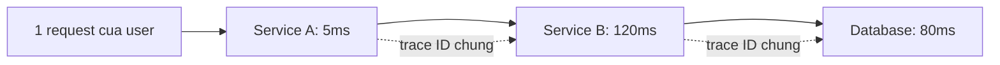

# Health Checks & Observability cơ bản

!!! info "bạn đang ở đây"
    cần trước: bạn đã cấu hình middleware pipeline (`app.Use...`, thứ tự đăng ký) và biết giới hạn tốc độ request bằng `AddRateLimiter`. Chương đó bảo vệ app khỏi quá tải do traffic đến; chương này trả lời câu hỏi khác — app đang chạy có "khỏe" không (bất kể traffic nhiều hay ít), và ai theo dõi điều đó.
    mở khoá: sau chương này bạn hiểu vì sao load balancer/orchestrator (Kubernetes, Azure App Service) cần một endpoint riêng để hỏi "app còn sống không, app đã sẵn sàng nhận traffic chưa", và biết ba trụ cột quan sát hệ thống (log, metric, trace) khác nhau ở điểm nào — nền tảng để đọc dashboard production và debug sự cố nhiều service sau này.

> Mục tiêu (đo được): sau chương này bạn **phân biệt** được Liveness và Readiness, **viết** được health check endpoint bằng `AddHealthChecks`/`MapHealthChecks` (kể cả check kết nối database qua `AddNpgSql` và check tuỳ chỉnh bằng `IHealthCheck`), **giải thích** được quy tắc tổng hợp trạng thái khi có nhiều check, và **phân biệt** được vai trò riêng của Logs, Metrics, Traces trong observability cùng vị trí của OpenTelemetry.

---

## 0. Đoán nhanh trước khi học

App của bạn đã khởi động xong (process đang chạy), nhưng connection pool tới PostgreSQL vừa bị đứt vì database đang restart. Load balancer vẫn gửi request người dùng tới instance này, và mọi request đều trả lỗi 500.

Health check nào — nếu bạn có — sẽ giúp load balancer **tự động ngừng gửi traffic** tới instance này cho đến khi database kết nối lại được?

??? note "Đáp án"
    **Readiness check**, không phải Liveness check. App vẫn "sống" (process chạy, không cần restart) nên Liveness vẫn trả `Healthy`. Nhưng app **chưa sẵn sàng phục vụ** vì phụ thuộc (database) đang lỗi — Readiness check phải kiểm tra kết nối database và trả `Unhealthy`, để load balancer/orchestrator biết đường rút instance này ra khỏi danh sách nhận traffic. Mục 2 giải thích chi tiết sự khác biệt này.

    Lưu ý thêm: nếu bạn chỉ có Liveness check (không có Readiness riêng biệt), tình huống này sẽ **không được phát hiện** — Liveness chỉ hỏi "process còn sống không", và process vẫn hoàn toàn sống dù database đứt kết nối. Đây chính là lý do một hệ thống production nghiêm túc cần cả hai loại check, không chỉ một.

---

## 1. `AddHealthChecks` + `MapHealthChecks`: endpoint báo cáo trạng thái app

**Định nghĩa (một câu):** Health check là một endpoint HTTP riêng (thường `/health`) mà app tự báo cáo "tôi đang ổn hay không" bằng một trong ba trạng thái — `Healthy`, `Degraded`, `Unhealthy` — để một hệ thống bên ngoài tự động đọc và quyết định hành động.

Đây không phải là API nghiệp vụ (không trả dữ liệu cho người dùng cuối) — nó là một "cổng kiểm tra" nội bộ dành cho hạ tầng vận hành, tồn tại song song với các endpoint nghiệp vụ khác (`GET /san-pham`, `POST /don-hang`...) nhưng phục vụ một mục đích hoàn toàn khác: không phải để trả dữ liệu cho người dùng, mà để trả **tình trạng** của chính ứng dụng.

Ba trạng thái `Healthy`/`Degraded`/`Unhealthy` là một `enum` có sẵn (`HealthStatus`) trong ASP.NET Core — bạn không tự định nghĩa trạng thái mới, mà chọn một trong ba giá trị này cho mỗi check tuỳ theo mức độ nghiêm trọng thực tế của vấn đề phát hiện được.

Ví dụ tối thiểu, độc lập, chỉ minh hoạ đúng khái niệm "khai báo health check và expose endpoint":

```csharp title="Program.cs"
// test:compile health check toi thieu - luon tra Healthy
var builder = WebApplication.CreateBuilder(args);

builder.Services.AddHealthChecks(); // đăng ký hạ tầng health check (chưa có check nào cụ thể)

var app = builder.Build();

app.MapHealthChecks("/health"); // expose endpoint GET /health

app.Run();
```

Giải thích từng dòng:

- `AddHealthChecks()` đăng ký dịch vụ health check vào DI container — trả về một `IHealthChecksBuilder` để bạn gắn thêm các check cụ thể (mục 3 sẽ dùng `.AddNpgSql(...)`).
- `MapHealthChecks("/health")` tạo một endpoint GET tại đường dẫn chỉ định. Nếu không đăng ký check nào cụ thể (như ví dụ trên), endpoint này luôn trả `Healthy` — vì "không có gì để kiểm tra" đồng nghĩa "không có gì thất bại".

Gọi `GET /health` với ví dụ trên trả về:

```text title="Response"
HTTP/1.1 200 OK
Content-Type: text/plain

Healthy
```

**Nếu dùng sai/thiếu:** nếu bạn quên `MapHealthChecks(...)` nhưng vẫn gọi `AddHealthChecks()`, ứng dụng biên dịch và chạy bình thường — nhưng không có endpoint `/health` nào tồn tại, load balancer gọi vào sẽ nhận `404 Not Found`. Nhiều orchestrator (ví dụ Kubernetes) hiểu `404` là "probe thất bại" giống như app lỗi thật, dẫn đến việc **restart liên tục một app đang chạy hoàn toàn bình thường** — chỉ vì thiếu một dòng cấu hình.

Điều ngược lại cũng là một lỗi thực tế: nếu bạn gọi `MapHealthChecks("/health")` nhưng **quên** `builder.Services.AddHealthChecks()` ở phần đăng ký dịch vụ, ứng dụng sẽ ném ngay một exception khi khởi động (`InvalidOperationException: Unable to find the required services`) — vì `MapHealthChecks` cần các service mà `AddHealthChecks()` đăng ký để hoạt động. Đây là lỗi phát hiện được ngay lúc `dotnet run` (fail-fast), khác với lỗi thiếu `MapHealthChecks` ở trên (chỉ phát hiện được khi có ai gọi vào `/health` và nhận `404`).

Một điểm dễ nhầm khi mới học: `AddHealthChecks()` **không tự tạo ra check nào** — nó chỉ mở "khung" để bạn gắn thêm. Nếu bạn không gắn thêm gì (như ví dụ mục 1), endpoint vẫn hoạt động và luôn trả `Healthy`, nhưng về mặt thực tế nó **không kiểm tra bất kỳ điều gì có ý nghĩa** — chỉ xác nhận "process ASP.NET Core đang chạy và có thể trả response". Điều này *đủ* cho một Liveness check đơn giản, nhưng *không đủ* cho Readiness — mục 2 sẽ giải thích vì sao hai mục đích này cần cấu hình khác nhau.

Có thể bạn tự hỏi: vì sao không dùng luôn một endpoint nghiệp vụ bình thường (ví dụ `GET /`) làm health check, thay vì cần một cơ chế riêng? Sự khác biệt nằm ở **ngữ nghĩa và độ tin cậy**: một endpoint nghiệp vụ trả `200 OK` chỉ chứng minh "route matching hoạt động", chưa chắc chứng minh app thực sự sẵn sàng phục vụ nghiệp vụ (ví dụ nó có thể trả `200` với dữ liệu rỗng dù database đã mất kết nối, nếu code không kiểm tra kỹ). Health check là một hợp đồng (contract) rõ ràng, tách biệt hoàn toàn khỏi logic nghiệp vụ, chuyên trách duy nhất một việc: trả lời trung thực "hạ tầng có nên tin tưởng route traffic vào đây không" — nhờ tách biệt mục đích, code health check có thể thay đổi độc lập với logic nghiệp vụ mà không ảnh hưởng lẫn nhau.

**HTTP status code thật sự trả về là gì?** Đây là chi tiết quan trọng vì phần lớn hạ tầng vận hành (load balancer, orchestrator) chỉ đọc **status code**, không đọc nội dung body. Mặc định, ASP.NET Core map ba trạng thái sang status code như sau:

| Trạng thái health check | HTTP status code mặc định |
|---|---|
| `Healthy` | `200 OK` |
| `Degraded` | `200 OK` |
| `Unhealthy` | `503 Service Unavailable` |

Chú ý: `Degraded` mặc định **vẫn** trả `200 OK` — vì ý nghĩa của `Degraded` là "còn hoạt động được, chỉ có vấn đề đáng chú ý", không phải "ngừng phục vụ". Nếu hạ tầng của bạn cần phân biệt `Degraded` khác `Healthy` ở tầng HTTP status code (ví dụ để load balancer giảm tỷ trọng traffic gửi tới instance đang `Degraded` mà không rút hẳn), bạn phải tự cấu hình `ResultStatusCodes` trong `HealthCheckOptions` — hành vi này không có sẵn tự động.

Nếu bạn không biết chi tiết này và giả định "cứ không phải `Healthy` là status code khác 200", việc đọc log truy cập (access log) của load balancer sẽ gây hiểu lầm: bạn thấy toàn `200` cho endpoint `/health` dù nội bộ health check đang `Degraded`, dẫn đến bỏ sót cảnh báo sớm về một vấn đề đang âm thầm tích lũy.

---

## 2. Liveness và Readiness: hai câu hỏi khác nhau

**Định nghĩa (một câu) — Liveness:** Liveness trả lời câu hỏi "process của app **còn chạy, chưa bị deadlock/treo** không" — nếu Liveness thất bại, hành động đúng duy nhất là **khởi động lại (restart) instance đó**, vì không có cách nào tự hồi phục.

**Định nghĩa (một câu) — Readiness:** Readiness trả lời câu hỏi khác hẳn: "app đã **sẵn sàng nhận traffic thật** chưa" — ví dụ đã kết nối được database, đã load xong cấu hình, đã warm-up cache — nếu Readiness thất bại, hành động đúng là **tạm ngừng gửi traffic** tới instance đó (không restart, vì process vẫn khỏe, chỉ là một phụ thuộc bên ngoài đang có vấn đề tạm thời).

Bảng phân biệt hai khái niệm (chỉ đưa ra **sau khi** đã định nghĩa riêng từng khái niệm ở trên):

| Tiêu chí | Liveness | Readiness |
|---|---|---|
| Câu hỏi | App còn sống không? | App sẵn sàng nhận traffic chưa? |
| Kiểm tra gì | Process, event loop, deadlock | Phụ thuộc ngoài: database, cache, service khác |
| Thất bại → hành động | Restart instance | Rút khỏi danh sách nhận traffic (không restart) |
| Ví dụ thất bại | App treo, không phản hồi bất kỳ request nào | Database đang restart, chưa kết nối được |

Vì hai câu hỏi khác nhau và dẫn tới hai hành động khác nhau, ASP.NET Core cho phép gắn **tag** cho từng check để tách hai endpoint riêng:

```csharp title="Program.cs"
// test:compile tach Liveness va Readiness bang tag va predicate
var builder = WebApplication.CreateBuilder(args);

builder.Services.AddHealthChecks()
    .AddCheck("self", () => HealthCheckResult.Healthy("App van song"), tags: new[] { "live" });
    // check "readiness" thật (ví dụ AddNpgSql) sẽ được thêm ở mục 3, không gắn tag "live"

var app = builder.Build();

// Endpoint Liveness: chỉ chạy check có tag "live" (nhẹ, không phụ thuộc ngoài)
app.MapHealthChecks("/health/live", new HealthCheckOptions
{
    Predicate = check => check.Tags.Contains("live")
});

// Endpoint Readiness: chạy TẤT CẢ check (bao gồm cả kiểm tra database)
app.MapHealthChecks("/health/ready", new HealthCheckOptions
{
    Predicate = _ => true
});

app.Run();
```

`Predicate` quyết định check nào được chạy khi endpoint đó được gọi — endpoint `/health/live` chỉ chạy check gắn tag `"live"` (rẻ, nhanh, không chạm database), còn `/health/ready` chạy toàn bộ check đã đăng ký (kể cả check tốn thời gian gọi ra ngoài).

**Nếu dùng sai — hậu quả cụ thể:** nếu bạn gộp chung Liveness và Readiness thành **một** endpoint duy nhất mà check cả database, thì khi database restart tạm thời (vài giây), endpoint đó trả `Unhealthy` cho **cả hai mục đích** — orchestrator hiểu nhầm là app bị treo và **restart toàn bộ instance** (dùng cho Liveness), trong khi thực ra chỉ cần rút traffic ra tạm thời rồi chờ database hồi phục. Kết quả: restart hàng loạt không cần thiết, gây downtime dài hơn chính vấn đề ban đầu, và nếu database vẫn chưa kịp hồi phục thì instance mới khởi động lại cũng lại `Unhealthy` — tạo vòng lặp restart (crash loop) làm hệ thống không bao giờ ổn định.

Đáng chú ý: hậu quả này **không phải lỗi biên dịch, không phải exception** — code vẫn chạy đúng như bạn viết, `AddHealthChecks`/`MapHealthChecks` hoạt động chính xác theo API. Vấn đề nằm ở **thiết kế** — gán sai ý nghĩa cho một endpoint, khiến hạ tầng vận hành đưa ra quyết định sai dựa trên dữ liệu đúng. Đây là lý do phần "Định nghĩa (một câu)" của Liveness và Readiness ở trên quan trọng hơn cú pháp: hiểu sai khái niệm dẫn tới thiết kế sai, mà thiết kế sai thì không có công cụ nào (compiler, IDE) cảnh báo cho bạn.

Đây cũng là lý do vì sao tài liệu chính thức của nhiều orchestrator luôn khuyến nghị tách riêng hai endpoint ngay từ đầu, thay vì "gộp cho tiện" rồi tách sau — chi phí tách sau (khi hệ thống đã production, đã có nhiều nơi cấu hình probe trỏ vào một endpoint duy nhất) luôn cao hơn chi phí thiết kế đúng từ đầu.

Cũng cần phân biệt rõ: `Predicate` trong `HealthCheckOptions` chỉ lọc **check nào được chạy** khi endpoint đó được gọi — nó không tạo ra hai "instance" của health check system, mà cả hai endpoint (`/health/live` và `/health/ready`) đều đọc từ **cùng một** danh sách check đã đăng ký qua `AddHealthChecks()`, chỉ khác nhau ở việc lọc theo tag lúc chạy.

Một cách hình dung khác giúp nhớ lâu: hãy nghĩ Liveness giống câu hỏi bác sĩ hỏi khi bạn vào phòng cấp cứu — "**bệnh nhân còn thở không**" (có/không, nhị phân, và nếu không thì hành động là hồi sức cấp cứu ngay). Readiness giống câu hỏi khác — "**bệnh nhân đã đủ khỏe để xuất viện, tự đi lại, ăn uống được chưa**" (một câu hỏi phức tạp hơn, phụ thuộc nhiều yếu tố, và câu trả lời "chưa" không có nghĩa là phải cấp cứu — chỉ là chưa nên cho về, cần theo dõi thêm). App "còn thở" (process sống) nhưng "chưa đủ khỏe để tiếp khách" (chưa kết nối được phụ thuộc) là trạng thái hoàn toàn hợp lý và phổ biến, đặc biệt ngay sau khi khởi động hoặc trong lúc một phụ thuộc đang gặp sự cố tạm thời.

---

## 3. Readiness thật: kiểm tra kết nối database bằng `AddNpgSql`

**Định nghĩa (một câu):** `AddNpgSql(connectionString)` là một health check có sẵn (gói `AspNetCore.HealthChecks.NpgSql`) tự động mở một kết nối thử tới PostgreSQL và trả `Unhealthy` nếu kết nối thất bại hoặc timeout — dùng đúng nghĩa cho Readiness vì database là một phụ thuộc ngoài.

```csharp title="Program.cs"
// test:skip can package ngoai AspNetCore.HealthChecks.NpgSql, khong co san trong dotnet new web
var builder = WebApplication.CreateBuilder(args);

var connectionString = builder.Configuration.GetConnectionString("Default")!;

builder.Services.AddHealthChecks()
    .AddCheck("self", () => HealthCheckResult.Healthy(), tags: new[] { "live" })
    .AddNpgSql(connectionString, name: "postgres", tags: new[] { "ready" });

var app = builder.Build();

app.MapHealthChecks("/health/live", new HealthCheckOptions
{
    Predicate = check => check.Tags.Contains("live")
});

app.MapHealthChecks("/health/ready", new HealthCheckOptions
{
    Predicate = check => check.Tags.Contains("ready")
});

app.Run();
```

Khi database đang chạy bình thường, `GET /health/ready` trả `Healthy`. Khi database restart hoặc mất kết nối, `AddNpgSql` sẽ thử mở connection, thất bại, và check tự động trả `Unhealthy` — không cần bạn viết logic try/catch thủ công.

Package tương tự tồn tại cho nhiều loại phụ thuộc khác — ví dụ `AspNetCore.HealthChecks.Redis` cho Redis, `AspNetCore.HealthChecks.SqlServer` cho SQL Server, `AspNetCore.HealthChecks.Uris` để kiểm tra một service ngoài qua HTTP GET đơn giản. Tất cả đều theo cùng nguyên tắc: gói sẵn logic "thử kết nối, bắt lỗi, trả về `HealthCheckResult`" cho một loại phụ thuộc cụ thể, để bạn không phải tự viết lại từ đầu cho từng loại phụ thuộc phổ biến.

Điểm chung quan trọng cần nhớ: dù dùng package có sẵn (`AddNpgSql`, `AddRedis`...) hay tự viết (`IHealthCheck`, mục kế tiếp), kết quả cuối cùng luôn được chuẩn hoá về cùng một hình dạng — `HealthCheckResult` với trạng thái (`Healthy`/`Degraded`/`Unhealthy`), một chuỗi mô tả, và tuỳ chọn dữ liệu bổ sung (`Data`, dạng key-value) để đính kèm chi tiết chẩn đoán. Nhờ sự chuẩn hoá này, `MapHealthChecks` có thể tổng hợp bất kỳ tổ hợp check nào (có sẵn lẫn tự viết) mà không cần biết chi tiết bên trong từng check.

**Nếu dùng sai/thiếu:** nếu bạn không có bất kỳ Readiness check nào kiểm tra database, một instance mới khởi động (process đã "sống" nên Liveness `Healthy`) có thể nhận traffic **ngay lập tức** trước khi kết nối database kịp thiết lập xong — người dùng đầu tiên chạm vào instance đó nhận lỗi 500. Đây là nguyên nhân phổ biến của các lỗi "thoáng qua" (transient errors) ngay sau khi deploy hoặc scale-out.

`AddNpgSql` là một extension method có sẵn trong package `AspNetCore.HealthChecks.NpgSql` (một package cộng đồng phổ biến, không phải một phần lõi của ASP.NET Core, khác với `AddHealthChecks()`/`MapHealthChecks()` vốn có sẵn trong Web SDK) — nó tự triển khai sẵn logic "mở connection, chạy một câu lệnh đơn giản (thường `SELECT 1`), đóng connection, bắt exception nếu có" và bọc kết quả thành `Healthy`/`Unhealthy`. Bạn không cần tự viết logic này, nhưng cần hiểu **hình dạng chung** của mọi health check tuỳ chỉnh, vì không phải phụ thuộc nào cũng có sẵn package như `AddNpgSql` — ví dụ kiểm tra một dịch vụ nội bộ tự viết, hoặc kiểm tra dung lượng đĩa còn trống.

Mọi health check — có sẵn hay tự viết — đều tuân theo cùng một interface: `IHealthCheck`, với một phương thức duy nhất `CheckHealthAsync`. Ví dụ tự viết một check tối thiểu, độc lập, chỉ minh hoạ hình dạng interface này (không phụ thuộc package ngoài):

```csharp title="Program.cs"
// test:compile tu viet health check bang IHealthCheck, khong can package ngoai
using Microsoft.Extensions.Diagnostics.HealthChecks;

var builder = WebApplication.CreateBuilder(args);

builder.Services.AddHealthChecks()
    .AddCheck<DiskSpaceHealthCheck>("dia-trong", tags: new[] { "ready" });

var app = builder.Build();

app.MapHealthChecks("/health/ready");

app.Run();

sealed class DiskSpaceHealthCheck : IHealthCheck
{
    public Task<HealthCheckResult> CheckHealthAsync(
        HealthCheckContext context, CancellationToken cancellationToken = default)
    {
        var freeBytes = new DriveInfo("/").AvailableFreeSpace;
        const long nguongToiThieu = 500_000_000; // 500 MB

        if (freeBytes < nguongToiThieu)
        {
            return Task.FromResult(
                HealthCheckResult.Unhealthy($"Chi con {freeBytes / 1_000_000} MB dia trong"));
        }

        return Task.FromResult(HealthCheckResult.Healthy());
    }
}
```

`CheckHealthAsync` nhận vào `HealthCheckContext` (chứa thông tin về registration của chính check này, ít dùng trong trường hợp đơn giản) và một `CancellationToken` — bạn **phải** tôn trọng token này nếu check gọi tài nguyên ngoài (ví dụ HTTP call), để tránh check bị treo vô thời hạn khi hệ thống health check đã huỷ yêu cầu (thường do timeout tổng thể).

So sánh với `AddCheck(...)` dạng lambda đã dùng ở mục 2 (`AddCheck("self", () => HealthCheckResult.Healthy(), ...)`): đó là cách viết **tắt** cho những check cực đơn giản, không cần logic phức tạp hay inject dependency nào. `AddCheck<T>()` với class triển khai `IHealthCheck` là cách viết **đầy đủ**, cần dùng khi check cần gọi tài nguyên bất đồng bộ, cần inject service khác qua constructor (ví dụ `IHttpClientFactory`, một repository), hoặc logic đủ phức tạp để tách thành một class riêng dễ test hơn là nhồi vào một lambda.

Vì `DiskSpaceHealthCheck` triển khai `IHealthCheck`, nó cũng được đăng ký vào DI container như mọi service khác — nếu constructor của nó cần một dependency (ví dụ `ILogger<DiskSpaceHealthCheck>`), bạn khai báo tham số constructor như bình thường và DI container tự động cung cấp, không cần cấu hình gì thêm ngoài `AddCheck<DiskSpaceHealthCheck>(...)`.

**Nếu dùng sai — hậu quả cụ thể:** nếu `CheckHealthAsync` ném exception thay vì trả `HealthCheckResult.Unhealthy(...)` một cách có kiểm soát, hệ thống health check của ASP.NET Core **vẫn** bắt được exception đó và tự động chuyển thành `Unhealthy` — nhưng bạn mất đi thông điệp lỗi rõ ràng (mô tả cụ thể vì sao unhealthy) mà lẽ ra có thể cung cấp cho người đọc log/dashboard, khiến việc chẩn đoán khi có sự cố chậm hơn không cần thiết.

Nói cách khác: ném exception vẫn "an toàn" theo nghĩa hệ thống không sập, nhưng là một lựa chọn kém hơn về mặt chất lượng chẩn đoán — luôn ưu tiên trả `HealthCheckResult.Unhealthy("mô tả cụ thể lý do")` một cách chủ động bất cứ khi nào bạn *biết trước* điều gì gây ra thất bại, chỉ để exception "lọt qua" trong các trường hợp bất ngờ, ngoài dự đoán.

---

## 4. Nhiều check trong một endpoint: quy tắc tổng hợp trạng thái

**Định nghĩa (một câu):** Khi một endpoint (ví dụ `/health/ready`) chạy nhiều check cùng lúc (database, cache, dịch vụ ngoài...), ASP.NET Core tổng hợp trạng thái cuối cùng theo quy tắc "**mức độ tệ nhất thắng**" (worst status wins) — chỉ cần **một** check trả `Unhealthy`, toàn bộ endpoint trả `Unhealthy`, bất kể các check khác đang `Healthy`.

Thứ tự mức độ tệ, từ nhẹ đến nặng: `Healthy` < `Degraded` < `Unhealthy`. Ví dụ minh hoạ ba check cùng đăng ký cho một endpoint, với các trạng thái giả định khác nhau để thấy quy tắc tổng hợp:

```csharp title="Program.cs"
// test:compile 3 check dang ky cung endpoint - minh hoa quy tac tong hop trang thai
using Microsoft.Extensions.Diagnostics.HealthChecks;

var builder = WebApplication.CreateBuilder(args);

builder.Services.AddHealthChecks()
    .AddCheck("database", () => HealthCheckResult.Healthy(), tags: new[] { "ready" })
    .AddCheck("cache", () => HealthCheckResult.Degraded("Cache miss cao bat thuong"), tags: new[] { "ready" })
    .AddCheck("dich-vu-thanh-toan", () => HealthCheckResult.Unhealthy("Khong ket noi duoc"), tags: new[] { "ready" });

var app = builder.Build();

app.MapHealthChecks("/health/ready", new HealthCheckOptions
{
    Predicate = check => check.Tags.Contains("ready")
});

app.Run();
```

Với ba check có trạng thái `Healthy`, `Degraded`, `Unhealthy` như trên, endpoint `/health/ready` tổng hợp và trả **`Unhealthy`** cho toàn bộ — vì `Unhealthy` là mức tệ nhất trong ba, dù `database` hoàn toàn ổn.

**Nếu không hiểu quy tắc này — hậu quả cụ thể:** một team gắn quá nhiều check "không thật sự bắt buộc" (ví dụ check một dịch vụ gửi thông báo không quan trọng) vào **cùng** endpoint Readiness chính. Khi dịch vụ phụ đó gặp cố (dù không ảnh hưởng chức năng cốt lõi), toàn bộ endpoint Readiness trả `Unhealthy` theo quy tắc "tệ nhất thắng" — khiến load balancer rút **toàn bộ instance** khỏi traffic, dù 95% chức năng của app vẫn hoạt động bình thường. Đây là lý do mục 3 (bài tập 2) nhấn mạnh: chỉ đưa phụ thuộc **thật sự bắt buộc** vào endpoint Readiness chính; phụ thuộc không bắt buộc nên dùng `Degraded` và/hoặc đặt ở endpoint/tag riêng để không kéo cả hệ thống theo.

Ngược lại, nếu bạn **muốn** một endpoint chỉ phản ánh đúng một nhóm nhỏ check (không bị "lây" trạng thái tệ từ check khác không liên quan), giải pháp chính là dùng `Predicate` với tag để tách nhóm — đúng như cách mục 2 đã tách `"live"` khỏi `"ready"`. Nguyên tắc chung: **một endpoint = một tập check có cùng mức độ quan trọng và cùng hành động mong muốn khi thất bại.**

Một tình huống thực tế hay gặp: app của bạn đang **shutdown có chủ đích** (ví dụ đội vận hành đang deploy phiên bản mới, chuẩn bị dừng instance cũ). Trong khoảnh khắc này, process vẫn còn sống (Liveness vẫn `Healthy`) nhưng bạn **muốn** Readiness chuyển sang `Unhealthy` ngay lập tức, để load balancer rút traffic ra **trước khi** process thực sự dừng — tránh việc request đang bay tới bị rớt giữa đường. Đây gọi là graceful shutdown, và nó liên quan trực tiếp tới việc tôn trọng `CancellationToken` khi shutdown (nguyên tắc bạn đã gặp nếu học `BackgroundService.ExecuteAsync`): khi host nhận tín hiệu dừng, một cờ trạng thái nội bộ nên được set thành "đang shutdown", và health check tuỳ chỉnh đọc cờ đó để trả `Unhealthy` ngay, tách biệt hoàn toàn khỏi việc database/cache có đang ổn hay không:

```csharp title="Program.cs"
// test:compile readiness phan anh trang thai shutdown co chu dich
using Microsoft.Extensions.Diagnostics.HealthChecks;

var builder = WebApplication.CreateBuilder(args);
var dangShutdown = false;

builder.Services.AddHealthChecks()
    .AddCheck("shutdown-guard", () =>
        dangShutdown
            ? HealthCheckResult.Unhealthy("App dang shutdown, khong nhan traffic moi")
            : HealthCheckResult.Healthy(),
        tags: new[] { "ready" });

var app = builder.Build();

// Đăng ký callback khi host bắt đầu quy trình dừng (nhận SIGTERM/Ctrl+C)
app.Lifetime.ApplicationStopping.Register(() => dangShutdown = true);

app.MapHealthChecks("/health/ready", new HealthCheckOptions
{
    Predicate = check => check.Tags.Contains("ready")
});

app.Run();
```

`app.Lifetime.ApplicationStopping` là một `CancellationToken` được host tự động kích hoạt (trigger) ngay khi bắt đầu quy trình dừng — trước khi các kết nối hiện tại bị đóng. Đăng ký callback ở đây cho phép Readiness "biết trước" và báo hiệu ngay, tạo ra một khoảng đệm an toàn giữa "load balancer biết rút traffic" và "process thực sự dừng hẳn".

**Nếu thiếu graceful shutdown này:** khi bạn dừng một instance (deploy, scale-down), load balancer vẫn tưởng instance đó `Healthy`/`Ready` cho tới khi nó thực sự ngừng phản hồi — một số request đang được gửi tới đúng lúc process dừng sẽ **bị rớt kết nối giữa đường** (connection reset), người dùng nhận lỗi mạng khó hiểu, dù về lý thuyết hệ thống có nhiều instance khác vẫn khỏe mạnh và có thể phục vụ request đó nếu load balancer biết rút traffic sớm hơn vài trăm milliseconds.

---

## 5. Ai/cái gì gọi endpoint health check

Health check không phải để người dùng cuối gọi — nó được gọi **tự động, định kỳ** bởi hạ tầng vận hành, ví dụ:

- **Load balancer** (Azure Load Balancer, AWS ELB, Nginx upstream check): gọi định kỳ (ví dụ mỗi 10-30 giây) để quyết định instance nào đủ điều kiện nhận traffic — dựa trên Readiness.
- **Orchestrator** (Kubernetes với `livenessProbe`/`readinessProbe`, Azure App Service health check): gọi định kỳ để quyết định restart pod/instance (dựa trên Liveness) hoặc tạm rút khỏi service endpoint (dựa trên Readiness), hoàn toàn không cần con người can thiệp.
- **Hệ thống giám sát/uptime monitor** (bên thứ ba hoặc nội bộ): gọi để cảnh báo (alert) nhóm vận hành khi phát hiện `Unhealthy` kéo dài.

Điểm chung: tất cả đều là **máy gọi máy**, tự động, định kỳ — không có con người bấm F5 vào `/health` trong vận hành thật. Đây là lý do endpoint health check nên trả lời **nhanh** (không chạy logic nặng) và **không yêu cầu xác thực** phức tạp (vì hạ tầng gọi nó, không phải người dùng đăng nhập) — nhưng vẫn nên hạn chế truy cập từ Internet công khai nếu nội dung trả về tiết lộ chi tiết hạ tầng (xem mục Cạm bẫy).

Ví dụ cụ thể trong Kubernetes — cấu hình pod (không phải C#, chỉ để thấy "phía gọi" thực tế trông như thế nào):

```yaml title="deployment.yaml (trich doan, minh hoa)"
livenessProbe:
  httpGet:
    path: /health/live
    port: 8080
  periodSeconds: 10      # goi lai moi 10 giay
  failureThreshold: 3    # 3 lan lien tiep that bai moi coi la thuc su Unhealthy

readinessProbe:
  httpGet:
    path: /health/ready
    port: 8080
  periodSeconds: 5       # goi thuong xuyen hon vi anh huong truc tiep viec nhan traffic
  failureThreshold: 2
```

Chú ý `failureThreshold` — Kubernetes **không** hành động ngay ở lần gọi thất bại đầu tiên; nó chờ đủ số lần thất bại liên tiếp mới coi là thật. Đây là một cơ chế chống nhiễu (chống false positive do một request đơn lẻ bị mạng chậm nhất thời), không phải một chi tiết ngẫu nhiên — nếu `failureThreshold: 1`, một lần timeout mạng ngẫu nhiên (không phản ánh tình trạng thật của app) đã có thể kích hoạt restart hoặc rút traffic không cần thiết.

Mặc định, `MapHealthChecks` trả về **text thuần** (`Healthy`/`Unhealthy`/`Degraded`), đủ cho hầu hết orchestrator (chúng chỉ cần đọc HTTP status code — mặc định `200` cho `Healthy`, `503` cho `Unhealthy`). Nhưng khi bạn muốn hệ thống giám sát đọc được **chi tiết từng check** (không chỉ tổng thể), gắn `ResponseWriter` tuỳ chỉnh để trả JSON:

```csharp title="Program.cs"
// test:compile ResponseWriter tuy chinh - tra JSON chi tiet tung check
using System.Text.Json;
using Microsoft.Extensions.Diagnostics.HealthChecks;

var builder = WebApplication.CreateBuilder(args);

builder.Services.AddHealthChecks()
    .AddCheck("self", () => HealthCheckResult.Healthy(), tags: new[] { "ready" });

var app = builder.Build();

app.MapHealthChecks("/health/ready", new HealthCheckOptions
{
    ResponseWriter = async (context, report) =>
    {
        context.Response.ContentType = "application/json";

        var payload = new
        {
            trangThaiTongThe = report.Status.ToString(),
            cacCheck = report.Entries.Select(e => new
            {
                ten = e.Key,
                trangThai = e.Value.Status.ToString(),
                thoiGianMs = e.Value.Duration.TotalMilliseconds
            })
        };

        await context.Response.WriteAsync(JsonSerializer.Serialize(payload));
    }
});

app.Run();
```

Response giờ mang thông tin đủ để một dashboard hiển thị **từng check riêng lẻ đang ở trạng thái nào**, thay vì chỉ một chữ `Healthy`/`Unhealthy` tổng quát — hữu ích khi bạn có nhiều check (database, cache, dịch vụ ngoài) và muốn biết ngay check nào đang gây vấn đề mà không cần vào log tìm.

Đây cũng là điểm nối giữa health check và Metrics (mục 6 sẽ định nghĩa rõ): nhiều hệ thống giám sát không chỉ đọc `/health` một lần rồi bỏ — chúng **thu thập lịch sử** kết quả gọi `/health` theo thời gian, biến một endpoint "chỉ trả trạng thái hiện tại" thành một nguồn dữ liệu cho biểu đồ "tỷ lệ % thời gian app ở trạng thái `Healthy` trong 30 ngày qua" (uptime/SLA). Nói cách khác, health check là nguồn dữ liệu **thô** (điểm dữ liệu tại một thời điểm); Metrics là lớp **tổng hợp theo thời gian** phía trên nó — hai khái niệm liên quan nhưng không đồng nhất, dễ nhầm nếu chỉ nghe tên.

---

## 6. Observability: ba trụ cột

**Định nghĩa (một câu) — Observability:** Observability là khả năng **hiểu được chuyện gì đang xảy ra bên trong hệ thống đang chạy** chỉ từ dữ liệu nó phát ra ra ngoài (log, số liệu, dấu vết request), không cần gắn debugger vào production.

Ba trụ cột, mỗi trụ cột trả lời một câu hỏi khác nhau — định nghĩa riêng từng cái trước khi so sánh:

- **Logs (đã học ở P4):** **định nghĩa** — dòng ghi lại một **sự kiện rời rạc** đã xảy ra tại một thời điểm cụ thể (ví dụ: "user 42 đăng nhập thất bại lúc 10:03:12"). Trả lời câu hỏi "chuyện gì đã xảy ra".
- **Metrics:** **định nghĩa** — một **số liệu đo được, tích lũy theo thời gian**, thường là con số tổng hợp (ví dụ: số request/giây, độ trễ trung bình, số lỗi 500 trong 1 phút). Trả lời câu hỏi "hệ thống đang vận hành ở mức độ nào" — nhìn theo xu hướng (trend), không phải từng sự kiện đơn lẻ.
- **Traces:** **định nghĩa** — bản ghi theo dõi **một request cụ thể đi qua nhiều service/tầng khác nhau**, gắn cùng một định danh (trace ID) xuyên suốt, giúp thấy request đó tốn bao lâu ở mỗi tầng. Trả lời câu hỏi "request này chậm ở đâu, trong hệ thống có nhiều service".



**Nếu thiếu một trụ cột — hậu quả cụ thể:** có Logs và Metrics nhưng thiếu Traces, bạn biết "API chậm trung bình 800ms" (Metrics) và biết "có exception ở service X" (Logs) — nhưng khi hệ thống gồm 5 service gọi lẫn nhau, bạn **không biết request chậm đó đi qua đường nào**, tốn thời gian ở tầng nào. Kết quả: debug production kéo dài hàng giờ vì phải đoán, thay vì nhìn một trace và thấy ngay "Service B chờ Database 80ms trong tổng 120ms của nó".

Để thấy rõ hơn sự khác biệt, hãy xét cùng một sự cố production được nhìn qua ba lăng kính khác nhau:

- **Qua Logs:** bạn tìm thấy dòng `[10:03:41] ERROR OrderService: Timeout khi goi PaymentService cho order #4471`. Biết được **chuyện gì đã xảy ra** với **một** order cụ thể, tại **một** thời điểm cụ thể.
- **Qua Metrics:** bạn thấy biểu đồ "tỷ lệ lỗi 5xx của OrderService" tăng từ 0.1% lên 8% trong 10 phút qua. Biết được **quy mô vấn đề** (8% request đang lỗi), nhưng không biết order cụ thể nào, không biết vì sao.
- **Qua Traces:** bạn mở một trace của order #4471, thấy dạng cây: `OrderService (200ms) → PaymentService (180ms, TIMEOUT) → GatewayNganHang (không có phản hồi)`. Biết được **chính xác vị trí** trong chuỗi gọi mà thời gian bị "ăn" hết.

Ba góc nhìn này **không thay thế nhau** — Metrics cho bạn biết "có vấn đề đáng để nhìn vào", Logs cho bạn biết "một trường hợp cụ thể trông như thế nào", Traces cho bạn biết "vấn đề đó nằm ở đâu trong chuỗi gọi nhiều tầng". Một hệ thống production nghiêm túc cần đủ cả ba — thiếu bất kỳ trụ cột nào cũng để lại một "điểm mù" nhất định khi debug.

Một điểm cần phân biệt tiếp: Metrics có hai dạng phổ biến — **counter** (số đếm chỉ tăng, ví dụ tổng số request đã xử lý từ lúc khởi động) và **histogram/gauge** (giá trị đo được tại một thời điểm hoặc phân bố giá trị, ví dụ độ trễ của từng request để tính percentile p95/p99). "Số request/giây" thực chất được tính từ counter (đếm số request trong một khung thời gian rồi chia cho thời gian đó), còn "độ trễ trung bình" cần histogram để biết được phân bố, không chỉ một con số trung bình dễ gây hiểu lầm (trung bình có thể thấp dù phần lớn request chậm, nếu có vài request cực nhanh kéo trung bình xuống).

Nhìn lại hình vẽ ở trên: mỗi mũi tên nét đứt (`-.trace ID chung.-`) biểu diễn việc trace ID được **truyền kèm** từ service gọi sang service được gọi (thường qua một HTTP header chuẩn hoá, ví dụ `traceparent` theo chuẩn W3C Trace Context — chuẩn này chính là một phần của OpenTelemetry, mục 7 sẽ giải thích). Nếu không có cơ chế truyền kèm này, mỗi service sẽ tự tạo trace ID riêng của mình khi nhận request, và ba đoạn `5ms`/`120ms`/`80ms` trong hình sẽ trở thành ba trace **hoàn toàn tách biệt**, không ai biết chúng thuộc về cùng một request gốc của người dùng.

---

## 7. OpenTelemetry: chuẩn mở, không phải sản phẩm riêng của một hãng

**Định nghĩa (một câu, giới thiệu ở mức không sâu):** OpenTelemetry (viết tắt OTel) là một **chuẩn mở** (open standard) định nghĩa cách thu thập và định dạng dữ liệu cho cả ba trụ cột — Logs, Metrics, Traces — để code của bạn không bị **khoá chặt (vendor lock-in)** vào một công cụ giám sát cụ thể; bạn viết code theo chuẩn OTel một lần, rồi chọn gửi dữ liệu tới bất kỳ hệ thống giám sát nào hỗ trợ chuẩn này (ví dụ Azure Monitor, Grafana, Jaeger, Prometheus).

Điểm quan trọng cần phân biệt: OpenTelemetry **không phải** là một sản phẩm giám sát bạn "mở lên xem dashboard" — nó là lớp **thu thập và chuẩn hoá dữ liệu**; bạn vẫn cần một backend riêng (Grafana, Azure Monitor...) để lưu trữ và hiển thị.

Code minh hoạ Metrics (chỉ để thấy hình dạng API, không chạy được nếu thiếu package):

```csharp title="Program.cs"
// test:skip can package ngoai OpenTelemetry.Extensions.Hosting + OpenTelemetry.Exporter.*, khong co san trong dotnet new web
var builder = WebApplication.CreateBuilder(args);

builder.Services.AddOpenTelemetry()
    .WithMetrics(metrics => metrics
        .AddAspNetCoreInstrumentation() // tự đo số request/giây, độ trễ, mã trạng thái
        .AddConsoleExporter());        // xuất số liệu ra console (demo); production dùng exporter khác

var app = builder.Build();
app.Run();
```

Code minh hoạ Traces (cùng lý do test:skip):

```csharp title="Program.cs"
// test:skip can package ngoai OpenTelemetry.Extensions.Hosting + OpenTelemetry.Exporter.*, khong co san trong dotnet new web
var builder = WebApplication.CreateBuilder(args);

builder.Services.AddOpenTelemetry()
    .WithTracing(tracing => tracing
        .AddAspNetCoreInstrumentation() // tự tạo trace cho mỗi request HTTP đến
        .AddHttpClientInstrumentation() // tự nối trace khi request đó gọi tiếp ra service khác
        .AddConsoleExporter());

var app = builder.Build();
app.Run();
```

`AddAspNetCoreInstrumentation()` tự động tạo một trace mới cho mỗi request đến, và nếu handler của request đó dùng `HttpClient` (đã cấu hình `AddHttpClientInstrumentation()`) để gọi service khác, trace ID được **truyền kèm theo** trong header HTTP ra ngoài — đây là cơ chế giúp nối các đoạn trace rời rạc ở nhiều service thành **một** trace hoàn chỉnh xuyên suốt.

**Nếu dùng sai/thiếu:** thiếu `AddHttpClientInstrumentation()` khi Service A gọi Service B qua `HttpClient`, trace ID không được truyền kèm — Service B tạo một trace **mới, độc lập**, không nối được với trace của Service A. Kết quả: bạn thấy hai trace rời rạc không liên quan, mất khả năng theo dõi một request end-to-end qua nhiều service, đúng cái Traces được sinh ra để giải quyết.

Code minh hoạ Logs qua OpenTelemetry (cùng chuẩn, để thấy cả ba trụ cột dùng chung một cách cấu hình nhất quán):

```csharp title="Program.cs"
// test:skip can package ngoai OpenTelemetry.Extensions.Hosting + OpenTelemetry.Exporter.*
var builder = WebApplication.CreateBuilder(args);

builder.Logging.AddOpenTelemetry(logging =>
{
    logging.IncludeFormattedMessage = true;
    logging.IncludeScopes = true;
    // exporter cụ thể (console, OTLP tới Grafana/Jaeger...) cấu hình thêm ở đây
});

var app = builder.Build();
app.Run();
```

Điểm cần ghi nhớ: `AddOpenTelemetry()` (cho Metrics/Traces) và `builder.Logging.AddOpenTelemetry(...)` (cho Logs) là **hai điểm cấu hình khác nhau** trong cùng một chuẩn OTel — vì Logs trong .NET đã có sẵn hạ tầng riêng từ trước (`ILogger`, đã học ở P4), OpenTelemetry **tích hợp vào** hạ tầng logging có sẵn đó thay vì thay thế nó.

Ba dòng code Metrics/Traces/Logs ở trên có một điểm chung đáng chú ý: cả ba đều dùng `AddAspNetCoreInstrumentation()` hoặc tương đương — nghĩa là chỉ cần **một lần cấu hình instrumentation**, OpenTelemetry tự động gắn cùng một `trace ID`/`span ID` vào cả log, cả metric, cả trace của cùng một request. Đây chính là giá trị thực sự của một "chuẩn mở thống nhất": bạn có thể nhảy từ một dòng log lỗi sang xem trace đầy đủ của đúng request đó, sang xem metric tại đúng thời điểm đó — vì cả ba đều mang cùng định danh.

**Instrumentation tự động vs. instrumentation tự viết:** các dòng `AddAspNetCoreInstrumentation()`/`AddHttpClientInstrumentation()` ở trên là instrumentation **tự động** — chúng tự gắn vào các điểm chuẩn của framework (nhận request, gửi request ra ngoài) mà bạn không cần sửa code nghiệp vụ. Nhưng đôi khi bạn cần đo một điều **riêng của nghiệp vụ**, ví dụ "số đơn hàng đã tạo thành công" — không có sẵn instrumentation tự động nào biết khái niệm "đơn hàng" của bạn. Khi đó bạn tự tạo một **custom metric** (counter) ngay trong code nghiệp vụ:

```csharp title="OrderService.cs"
// test:skip can package ngoai System.Diagnostics.Metrics (co san trong BCL nhung Counter<T> tu OpenTelemetry.Api can package rieng de export dung chuan)
using System.Diagnostics.Metrics;

sealed class OrderService
{
    private static readonly Meter _meter = new("MyShop.Orders");
    private static readonly Counter<int> _donHangDaTao =
        _meter.CreateCounter<int>("don_hang_da_tao", description: "So don hang tao thanh cong");

    public void TaoDonHang(string maDonHang)
    {
        // ... logic nghiệp vụ tạo đơn hàng ...

        _donHangDaTao.Add(1); // tang counter len 1 moi lan tao don hang thanh cong
    }
}
```

`Counter<int>` chỉ có một hướng — chỉ tăng, không giảm — đúng bản chất "số đơn hàng đã tạo" (một con số tích lũy, không có ý nghĩa "giảm ngược"). Khi cấu hình OpenTelemetry, bạn khai báo tên `Meter` (`"MyShop.Orders"`) để hệ thống biết lắng nghe counter tự viết này cùng với các counter tự động khác.

Tương tự, đôi khi bạn cần tự tạo một **span** (một đoạn trong trace) cho một bước xử lý nội bộ không tự động được instrument — ví dụ một bước tính toán phức tạp trong nghiệp vụ mà bạn muốn thấy riêng trong trace:

```csharp title="OrderService.cs"
// test:skip can package ngoai System.Diagnostics.DiagnosticSource + cau hinh OpenTelemetry tuong ung
using System.Diagnostics;

sealed class OrderService
{
    private static readonly ActivitySource _activitySource = new("MyShop.Orders");

    public void TinhPhiVanChuyen(string maDonHang)
    {
        using var activity = _activitySource.StartActivity("TinhPhiVanChuyen");
        activity?.SetTag("ma_don_hang", maDonHang);

        // ... logic tính phí vận chuyển, có thể tốn thời gian ...
    }
}
```

`using var activity = ...StartActivity(...)` tạo một span mới, tự động **lồng vào** trace hiện tại (nếu request đang xử lý đã có trace context từ `AddAspNetCoreInstrumentation()`), và tự kết thúc khi biến `activity` ra khỏi phạm vi (`using`) — bạn thấy được chính xác bước `TinhPhiVanChuyen` này tốn bao lâu, nằm ở đâu trong toàn bộ trace của request.

**Nếu dùng sai/thiếu:** viết custom metric/span nhưng quên đăng ký đúng tên `Meter`/`ActivitySource` trong cấu hình OpenTelemetry (`.AddMeter("MyShop.Orders")` hoặc `.AddSource("MyShop.Orders")`), dữ liệu vẫn được tạo ra trong code nhưng **không bao giờ được xuất (export)** đi đâu cả — không có lỗi, không có exception, chỉ đơn giản là "biến mất" một cách im lặng, khiến bạn tưởng đã đo được nhưng thực ra dashboard không hiện gì.

---

## Cạm bẫy & thực chiến

- **Gộp chung Liveness và Readiness vào một endpoint check cả database:** khi database restart tạm thời, orchestrator hiểu nhầm là app bị treo và restart instance không cần thiết, có thể tạo crash loop nếu database chưa hồi phục kịp thời điểm instance mới khởi động lại.
- **Endpoint `/health` trả về chi tiết nội bộ (connection string, tên server database, version hệ điều hành) mà không hạn chế truy cập:** nếu endpoint này expose công khai ra Internet, kẻ tấn công dùng nó để **thu thập thông tin trinh sát (reconnaissance)** về hạ tầng trước khi tấn công — cần đặt sau firewall/network riêng cho hạ tầng vận hành, hoặc lọc bớt chi tiết trả về khi gọi từ ngoài.
- **Health check nặng (query phức tạp, gọi nhiều service phụ thuộc dây chuyền) chạy mỗi vài giây:** làm tăng tải không cần thiết lên chính các phụ thuộc đó — health check nên kiểm tra **nhanh và rẻ** (mở/đóng một connection, không chạy business logic), vì nó bị gọi liên tục.
- **Không đặt timeout cho check phụ thuộc ngoài:** nếu `AddNpgSql` hoặc check tuỳ chỉnh gọi ra ngoài mà không giới hạn thời gian chờ, một phụ thuộc bị treo (không lỗi hẳn, chỉ chậm) có thể khiến chính health check endpoint bị treo theo — biến công cụ chẩn đoán thành một điểm nghẽn mới.
- **Nhầm `Degraded` với `Unhealthy`:** `Degraded` nghĩa là "vẫn hoạt động nhưng có vấn đề đáng chú ý" (ví dụ: cache miss nhiều bất thường) — không nên tự động restart hay rút traffic như `Unhealthy`; xử lý sai mức độ này khiến hệ thống phản ứng thái quá (restart khi chỉ cần cảnh báo) hoặc bỏ sót cảnh báo thật.
- **Chỉ nhìn Metrics mà không có Traces khi hệ thống nhiều service:** thấy được "có vấn đề" (tỷ lệ lỗi tăng) nhưng không biết vấn đề nằm ở tầng nào trong chuỗi gọi — biến việc debug thành dò tìm thủ công qua từng service một, thay vì mở một trace và thấy ngay.
- **Không truyền trace ID/context khi gọi service khác qua hàng đợi message (queue) bất đồng bộ:** `AddHttpClientInstrumentation()` chỉ tự động nối trace cho lời gọi HTTP đồng bộ; nếu Service A đẩy message vào queue để Service B xử lý sau, trace ID phải được **tự tay đính kèm** vào message (thường qua header của message), nếu không hai service sẽ luôn hiện thành hai trace rời rạc dù thực chất là một luồng xử lý nghiệp vụ.
- **Không xử lý graceful shutdown, chỉ dựa vào Liveness/Readiness "tĩnh":** nếu instance dừng đột ngột mà không báo hiệu Readiness `Unhealthy` trước, load balancer vẫn gửi request tới nó cho tới khi kết nối thực sự bị đóng — một số request giữa đường bị rớt (connection reset), gây lỗi khó hiểu cho người dùng ngay trong lúc deploy, vốn là thời điểm hệ thống lẽ ra phải zero-downtime.

---

## Bài tập

**Bài 1 (giàn giáo):** App của bạn có health check sau, nhưng team vận hành báo rằng mỗi khi database bảo trì định kỳ (dự kiến, không phải lỗi), toàn bộ instance bị Kubernetes restart liên tục thay vì chỉ tạm rút traffic. Tìm lỗi và sửa.

```csharp title="Program.cs (có lỗi)"
// test:skip can package ngoai AspNetCore.HealthChecks.NpgSql
var builder = WebApplication.CreateBuilder(args);
var connectionString = builder.Configuration.GetConnectionString("Default")!;

builder.Services.AddHealthChecks()
    .AddNpgSql(connectionString, name: "postgres");

var app = builder.Build();

// Chỉ có MỘT endpoint, dùng cho cả livenessProbe và readinessProbe trong Kubernetes
app.MapHealthChecks("/health");

app.Run();
```

Gợi ý giàn giáo: Kubernetes gọi `/health` cho cả `livenessProbe` và `readinessProbe` cùng lúc — nghĩa là khi database bảo trì, endpoint duy nhất này trả `Unhealthy`, và Kubernetes hiểu đó là **Liveness thất bại** nên restart pod, dù process ứng dụng hoàn toàn khỏe.

??? success "Lời giải + vì sao"
    ```csharp title="Program.cs (đã sửa)"
    // test:skip can package ngoai AspNetCore.HealthChecks.NpgSql
    var builder = WebApplication.CreateBuilder(args);
    var connectionString = builder.Configuration.GetConnectionString("Default")!;

    builder.Services.AddHealthChecks()
        .AddCheck("self", () => HealthCheckResult.Healthy(), tags: new[] { "live" })
        .AddNpgSql(connectionString, name: "postgres", tags: new[] { "ready" });

    var app = builder.Build();

    app.MapHealthChecks("/health/live", new HealthCheckOptions
    {
        Predicate = check => check.Tags.Contains("live")
    });

    app.MapHealthChecks("/health/ready", new HealthCheckOptions
    {
        Predicate = check => check.Tags.Contains("ready")
    });

    app.Run();
    ```

    **Vì sao:** tách riêng hai endpoint theo tag — `livenessProbe` của Kubernetes trỏ vào `/health/live` (chỉ kiểm tra process, không đụng database), `readinessProbe` trỏ vào `/health/ready` (kiểm tra database qua `AddNpgSql`). Khi database bảo trì, chỉ `/health/ready` trả `Unhealthy` — Kubernetes rút pod khỏi danh sách nhận traffic mà **không restart**, đúng hành vi mong muốn.

**Bài 2 (thiết kế):** Thiết kế health check cho một API có hai phụ thuộc: PostgreSQL (bắt buộc, không có DB thì không thể phục vụ bất kỳ request nào) và một dịch vụ gửi email bên thứ ba (không bắt buộc — nếu email lỗi, app vẫn phục vụ được các chức năng khác, chỉ tính năng gửi mail bị ảnh hưởng). Endpoint Readiness nên phản ứng thế nào với từng phụ thuộc?

??? success "Lời giải + vì sao"
    - **PostgreSQL lỗi** → Readiness phải trả `Unhealthy` (dùng `AddNpgSql`, tag `"ready"`) — đúng vì không có DB thì hầu hết chức năng đều fail, cần rút traffic khỏi instance này.
    - **Dịch vụ email lỗi** → không nên làm Readiness tổng thể trả `Unhealthy` (nếu không, một dịch vụ phụ trợ lỗi sẽ kéo rút traffic khỏi cả API, ảnh hưởng cả những chức năng không liên quan tới email). Cách hợp lý: viết check tuỳ chỉnh trả `HealthCheckResult.Degraded(...)` cho dịch vụ email, gắn tag riêng (ví dụ `"non-critical"`), không đưa vào `Predicate` của endpoint `/health/ready` chính — hoặc đưa vào một endpoint giám sát riêng để cảnh báo (alert) nhóm vận hành mà không kích hoạt hành động rút traffic tự động.

    **Vì sao:** mức độ nghiêm trọng của từng phụ thuộc phải phản ánh đúng vào hành động tự động mà hạ tầng thực hiện — trộn chung phụ thuộc bắt buộc và không bắt buộc vào một trạng thái duy nhất khiến hệ thống phản ứng sai (quá mức hoặc thiếu).

**Bài 3 (phân tích):** Đội vận hành báo rằng dashboard giám sát cho thấy "tỷ lệ lỗi 5xx của API Đặt hàng tăng từ 0.2% lên 12% trong 5 phút qua" (đọc được từ Metrics). Không có Traces được cấu hình trong hệ thống (chỉ có Logs và Metrics). Hệ thống gồm 4 service: API Đặt hàng → Service Kiểm tra kho → Service Thanh toán → Service Gửi email xác nhận. Hãy mô tả quy trình debug **khi có** và **khi không có** Traces, để thấy rõ giá trị thực tế của trụ cột này.

??? success "Lời giải + vì sao"
    **Khi không có Traces:** người vận hành phải mở log của **từng service một** theo thứ tự nghiệp vụ, tìm timestamp gần đúng lúc lỗi tăng, cố gắng khớp thủ công các dòng log của 4 service lại với nhau bằng mắt (dựa vào order ID nếu log có ghi, hoặc dựa vào timestamp gần nhau) để đoán request nào gọi request nào. Với lưu lượng cao, nhiều request chạy đồng thời, việc khớp thủ công này dễ nhầm và tốn nhiều thời gian — có thể mất hàng giờ để xác định chính xác Service Thanh toán là nơi gây lỗi.

    **Khi có Traces:** mở một trace bất kỳ của một order bị lỗi 5xx gần đây, thấy ngay cấu trúc cây gọi với thời gian mỗi tầng: `API Đặt hàng (tổng 3.2s) → Kiểm tra kho (40ms, OK) → Thanh toán (3.1s, lỗi 502) → [Gửi email không được gọi vì Thanh toán đã lỗi]`. Ngay lập tức xác định được Service Thanh toán là điểm nghẽn/lỗi, không cần khớp log thủ công.

    **Vì sao:** Traces gắn cùng một định danh (trace ID) xuyên suốt nhiều service cho **một** request cụ thể — giải quyết đúng vấn đề "request này đi qua đâu, chậm/lỗi ở đâu" mà Logs (từng sự kiện rời rạc) và Metrics (số liệu tổng hợp, không theo từng request) không thể trả lời trực tiếp.

**Bài 4 (dự đoán kết quả):** Cho đoạn cấu hình health check sau, với ba check được đăng ký cùng tag `"ready"`:

```csharp title="Program.cs"
// test:compile bai tap 4 - du doan ket qua tong hop
using Microsoft.Extensions.Diagnostics.HealthChecks;

var builder = WebApplication.CreateBuilder(args);

builder.Services.AddHealthChecks()
    .AddCheck("cau-hinh", () => HealthCheckResult.Healthy(), tags: new[] { "ready" })
    .AddCheck("bo-nho-cache", () => HealthCheckResult.Degraded("Cache hit rate thap"), tags: new[] { "ready" })
    .AddCheck("hang-doi-tin-nhan", () => HealthCheckResult.Healthy(), tags: new[] { "ready" });

var app = builder.Build();

app.MapHealthChecks("/health/ready", new HealthCheckOptions
{
    Predicate = check => check.Tags.Contains("ready")
});

app.Run();
```

Gọi `GET /health/ready` trả về trạng thái tổng hợp nào, và HTTP status code là bao nhiêu? Sau đó, đổi check `"bo-nho-cache"` thành `HealthCheckResult.Unhealthy(...)` — trạng thái tổng hợp và status code thay đổi thế nào?

??? success "Lời giải + vì sao"
    **Trường hợp gốc** (`Healthy`, `Degraded`, `Healthy`): tổng hợp là **`Degraded`** (mức tệ nhất trong ba), HTTP status code vẫn là **`200 OK`** (vì mặc định `Degraded` cũng map sang `200`, giống mục 1 đã nói).

    **Sau khi đổi `"bo-nho-cache"` thành `Unhealthy`:** tổng hợp là **`Unhealthy`** (mức tệ nhất bây giờ là `Unhealthy`, vượt qua cả `Degraded`), HTTP status code chuyển thành **`503 Service Unavailable`**.

    **Vì sao:** quy tắc tổng hợp "mức độ tệ nhất thắng" (mục 4) áp dụng bất kể có bao nhiêu check `Healthy` khác — chỉ cần một check ở mức tệ hơn, toàn bộ endpoint phản ánh mức tệ đó. Đây đúng là lý do phải cẩn trọng khi quyết định check nào thuộc "cùng một endpoint": một check không quan trọng nhưng dễ `Unhealthy` (ví dụ phụ thuộc hay chập chờn) có thể kéo cả endpoint xuống `Unhealthy` dù các phần quan trọng vẫn ổn.

---

## Tự kiểm tra

1. Liveness check thất bại thì hành động đúng là gì, và vì sao không phải là "rút traffic"?

    ??? note "Đáp án"
        Restart instance. Liveness kiểm tra process có còn sống/phản hồi không — nếu thất bại, nghĩa là process đã treo hoặc deadlock, không có cách nào tự hồi phục ngoài khởi động lại. "Rút traffic" chỉ hợp lý khi process vẫn khỏe nhưng một phụ thuộc ngoài đang lỗi — đó là vai trò của Readiness.

2. Vì sao endpoint `/health/live` không nên kiểm tra kết nối database?

    ??? note "Đáp án"
        Vì nếu database lỗi tạm thời, endpoint Liveness sẽ trả `Unhealthy`, khiến orchestrator hiểu nhầm là process bị treo và restart instance — trong khi process vẫn hoàn toàn khỏe, chỉ cần rút traffic (Readiness) là đủ.

3. `AddNpgSql(...)` dùng để làm gì trong health check?

    ??? note "Đáp án"
        Tự động mở một kết nối thử tới PostgreSQL và trả `Unhealthy` nếu kết nối thất bại hoặc timeout — dùng cho Readiness check vì database là một phụ thuộc ngoài ứng dụng.

4. Ai gọi endpoint `/health` trong vận hành thật — người dùng cuối hay hạ tầng?

    ??? note "Đáp án"
        Hạ tầng vận hành (load balancer, orchestrator như Kubernetes, hệ thống giám sát) — gọi tự động, định kỳ, để quyết định route traffic hoặc restart instance. Người dùng cuối không gọi endpoint này trong vận hành bình thường.

5. Metrics khác Logs ở điểm nào?

    ??? note "Đáp án"
        Logs ghi lại từng **sự kiện rời rạc** tại một thời điểm cụ thể ("chuyện gì đã xảy ra"). Metrics là **số liệu tích lũy theo thời gian**, thường là con số tổng hợp như số request/giây hoặc độ trễ trung bình — cho biết hệ thống đang vận hành ở mức nào, nhìn theo xu hướng chứ không phải từng sự kiện.

6. Traces giải quyết vấn đề gì mà Logs và Metrics không giải quyết được?

    ??? note "Đáp án"
        Theo dõi **một request cụ thể** đi qua nhiều service khác nhau, gắn cùng trace ID xuyên suốt, để thấy request đó tốn bao lâu ở mỗi tầng. Logs/Metrics cho biết "có lỗi" hoặc "chậm trung bình", nhưng không cho biết đường đi cụ thể của một request qua hệ thống nhiều service.

7. OpenTelemetry là một sản phẩm giám sát cụ thể của một hãng, đúng hay sai?

    ??? note "Đáp án"
        Sai. OpenTelemetry là một **chuẩn mở** định nghĩa cách thu thập/định dạng dữ liệu cho Logs, Metrics, Traces — không khoá bạn vào một công cụ cụ thể. Bạn vẫn cần chọn một backend riêng (Grafana, Azure Monitor...) để lưu trữ và hiển thị dữ liệu đã thu thập.

8. `failureThreshold: 3` trong cấu hình probe của Kubernetes nghĩa là gì, và vì sao orchestrator không hành động ngay ở lần thất bại đầu tiên?

    ??? note "Đáp án"
        Orchestrator chờ đủ **3 lần gọi probe thất bại liên tiếp** mới coi là thật sự `Unhealthy` rồi mới hành động (restart hoặc rút traffic). Đây là cơ chế chống nhiễu — tránh một lần timeout mạng ngẫu nhiên, không phản ánh tình trạng thật của app, kích hoạt restart hoặc rút traffic không cần thiết.

9. Một endpoint có 3 check với trạng thái `Healthy`, `Healthy`, `Unhealthy`. Trạng thái tổng hợp của endpoint là gì?

    ??? note "Đáp án"
        `Unhealthy` — theo quy tắc tổng hợp "mức độ tệ nhất thắng", chỉ cần một check `Unhealthy` là toàn bộ endpoint trả `Unhealthy`, bất kể các check khác đang `Healthy`.

10. Vì sao cần gắn `AddMeter("TenMeter")`/`AddSource("TenActivitySource")` khi tự viết custom metric/span, và nếu quên thì hậu quả là gì?

    ??? note "Đáp án"
        OpenTelemetry chỉ lắng nghe (export) dữ liệu từ các `Meter`/`ActivitySource` đã được đăng ký rõ ràng trong cấu hình. Nếu quên đăng ký, code tạo custom metric/span vẫn chạy bình thường (không lỗi, không exception) nhưng dữ liệu đó **không bao giờ được xuất đi đâu cả** — biến mất âm thầm, khiến bạn tưởng đã đo được nhưng dashboard không hiển thị gì.

---

??? abstract "DEEP DIVE: startup probe, chi phí health check ở quy mô lớn, và mối liên hệ với Polly/rate limiting đã học"
    Một số orchestrator (Kubernetes) còn có khái niệm thứ ba ngoài Liveness/Readiness: **startup probe** — dùng riêng cho pha khởi động chậm (ví dụ app cần load một model AI lớn vào RAM, hoặc chạy migration database trước khi sẵn sàng), để tránh Liveness probe hiểu nhầm "app khởi động chậm" là "app bị treo" và restart liên tục trong lúc app vẫn đang khởi động hợp lệ. Startup probe chạy trước, dùng `failureThreshold` × `periodSeconds` lớn hơn nhiều so với Liveness bình thường (vì cho phép khởi động chậm), và chỉ khi nó báo thành công thì Liveness/Readiness probe mới bắt đầu được orchestrator gọi.

    Ở quy mô lớn (hàng trăm instance, probe gọi mỗi vài giây), tổng số lượt gọi health check có thể lớn hơn cả traffic nghiệp vụ thật — đây là lý do check phải rẻ. Với check tốn kém hơn (ví dụ gọi một service phụ thuộc dây chuyền), một kỹ thuật thường dùng là **cache kết quả check trong vài giây** (không chạy lại full check mỗi lần probe gọi vào), đánh đổi độ chính xác theo-thời-gian-thực để giảm tải — chấp nhận được vì trạng thái hạ tầng hiếm khi đổi trong vài giây. ASP.NET Core hỗ trợ điều này qua tham số `Period`/`Timeout` khi đăng ký check, hoặc bạn tự cache thủ công trong `IHealthCheck.CheckHealthAsync`.

    Một câu hỏi hay gặp: health check có thay thế được Polly (retry/circuit-breaker đã học ở chương gọi API ngoài) không? Câu trả lời là **không** — hai công cụ giải quyết hai vấn đề khác nhau và bổ trợ cho nhau. Polly hoạt động **trong lúc một request nghiệp vụ đang xử lý**, quyết định retry/short-circuit ngay lập tức khi gọi một service ngoài thất bại. Health check hoạt động **độc lập, định kỳ, ngoài luồng request nghiệp vụ**, chỉ báo cáo tình trạng tổng thể cho hạ tầng biết để quyết định route traffic. Trong thực tế, một circuit breaker (Polly) đang ở trạng thái "Open" (đã ngừng gọi ra service lỗi để tránh làm quá tải thêm) là một dấu hiệu tốt để đưa vào chính health check tuỳ chỉnh — ví dụ viết một `IHealthCheck` đọc trạng thái circuit breaker hiện tại và trả `Degraded` nếu breaker đang mở, giúp hạ tầng biết instance này đang gặp khó khăn với một phụ thuộc cụ thể mà không cần đợi request thật thất bại.

    Cũng cần phân biệt với rate limiting (chương trước, `AddRateLimiter`): rate limiting bảo vệ app khỏi **quá tải do chính traffic đến** (quá nhiều request cùng lúc), còn health check báo cáo **tình trạng sức khoẻ tổng thể** không phụ thuộc vào số lượng request. Một app có thể đồng thời: đang từ chối request vì vượt rate limit (429 Too Many Requests, do quá nhiều traffic) **và** vẫn `Healthy` ở health check (vì bản thân app và các phụ thuộc của nó vẫn hoạt động tốt, chỉ là traffic đến vượt ngưỡng cho phép) — hai cơ chế đo hai chiều hoàn toàn khác nhau của "app đang ổn không".

Tiếp theo -> logging co cau truc va correlation id
