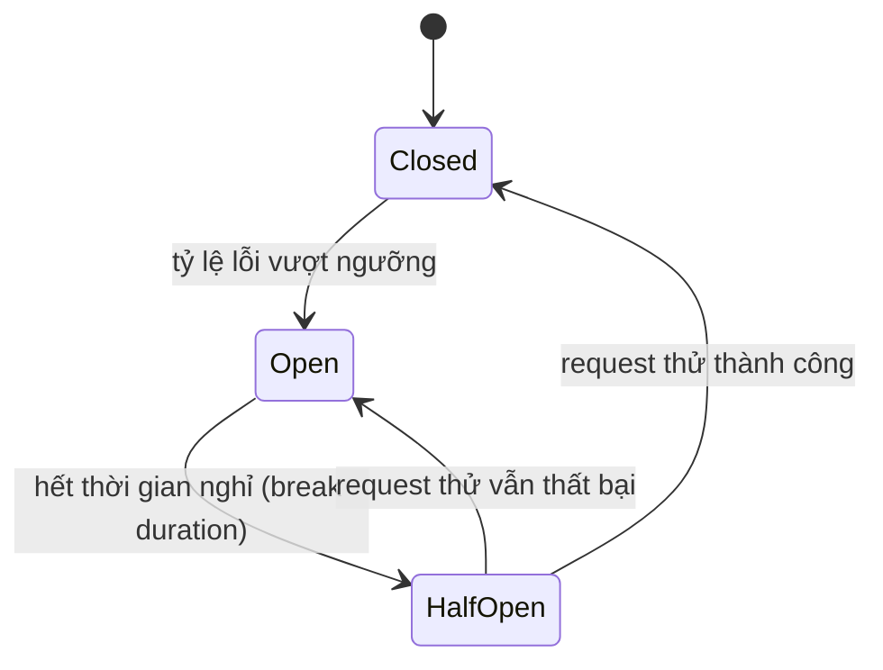

# Resilience Patterns nâng cao: Retry, Circuit Breaker với Polly

!!! info "bạn đang ở đây"
    cần trước: bạn đã biết đăng ký `IHttpClientFactory` qua `AddHttpClient`, gọi `GetFromJsonAsync`/`PostAsJsonAsync`, và đã nghe giới thiệu ngắn về Polly ở chương gọi api bên ngoài (retry + circuit breaker chỉ ở mức "biết tên").
    mở khoá: sau chương này bạn tự viết được policy Polly thật (không chỉ nhận diện khái niệm), kết hợp nhiều policy cùng lúc qua `ResiliencePipeline`, và hiểu đúng 3 trạng thái circuit breaker — nền tảng để đọc code production gọi microservice/API bên thứ ba ổn định.

> **Mục tiêu (đo được):** sau chương này bạn **viết** được retry policy với exponential backoff, **áp dụng** đúng circuit breaker với 3 trạng thái Closed/Open/Half-Open, **phân biệt** được Polly Timeout với `HttpClient.Timeout`, và **kết hợp** được Retry + Circuit Breaker + Timeout trong một `ResiliencePipeline` theo đúng thứ tự.

Toàn bộ code Polly trong chương này dùng tag `test:skip` vì cần package ngoài (`Microsoft.Extensions.Http.Resilience`, dựng trên `Polly.Core`) — không có sẵn trong Web SDK trần như `dotnet new web`. Các đoạn không dùng API Polly (ví dụ minh hoạ Fallback bằng `IMemoryCache` thuần) vẫn dùng `test:compile` như bình thường.

---

## 0. Đoán nhanh trước khi học

Bạn có một API thanh toán bên ngoài đang bị sập hoàn toàn (server trả lỗi 503 liên tục trong 10 phút do quá tải). Ứng dụng của bạn cấu hình retry: mỗi request thất bại thì thử lại ngay lập tức 3 lần, không có độ trễ giữa các lần thử. Ứng dụng của bạn nhận khoảng 200 request/giây gọi tới API thanh toán này.

??? question "Đoán trước, đáp án ở dưới"
    Gợi ý: 200 request/giây, mỗi request thất bại tự nhân thành 4 lần gọi (1 lần gốc + 3 lần retry ngay lập tức). Điều gì xảy ra với tải thực tế đổ vào API thanh toán đang sập, và điều gì xảy ra khi API đó bắt đầu hồi phục?

??? note "Đáp án"
    Tải thực tế đổ vào API thanh toán tăng gấp **4 lần** (200 → 800 request/giây), vì mỗi request gốc thất bại kéo theo 3 lần thử lại ngay lập tức, không có thời gian nghỉ. Đây gọi là **thundering herd** — hàng loạt client cùng dồn request vào một dịch vụ đang yếu, đúng vào lúc dịch vụ đó cần được giảm tải để hồi phục. Tệ hơn: khi API thanh toán vừa hồi phục được vài giây, làn sóng retry dồn dập từ tất cả client cùng lúc lại đánh sập nó lần nữa — dịch vụ không bao giờ có cơ hội ổn định. Mục 1 giải thích vì sao backoff tăng dần là bắt buộc, và mục 2 giới thiệu circuit breaker — cơ chế giải quyết triệt để vấn đề "dịch vụ đã sập hẳn, retry không giúp được gì".

---

## 1. Retry policy với exponential backoff: viết policy thật bằng Polly

Chương gọi api bên ngoài đã giới thiệu Polly ở mức khái niệm (retry = tự động gọi lại khi lỗi tạm thời, circuit breaker = tạm ngừng gọi khi dịch vụ sập). Mục này viết **policy thật**, đi vào từng tham số.

**Định nghĩa:** Retry policy là cấu hình chỉ định ứng dụng **tự động gọi lại** một request đã thất bại, với điều kiện: (a) chỉ retry với lỗi **tạm thời** (transient — ví dụ mất gói tin mạng thoáng qua, server quá tải trong khoảnh khắc), và (b) có **exponential backoff** — thời gian chờ giữa các lần thử **tăng dần theo cấp số nhân** (ví dụ 2 giây, 4 giây, 8 giây) thay vì thử lại ngay lập tức, để không dồn thêm tải vào một dịch vụ đang gặp khó khăn.

**Định nghĩa "thundering herd":** đây là hiện tượng nhiều client (hoặc nhiều request của cùng một client) đồng loạt gửi lại request vào **cùng một thời điểm** hoặc với độ trễ quá ngắn giữa các lần thử, khiến tổng tải đổ vào dịch vụ đích tăng vọt đúng lúc dịch vụ đó yếu nhất — làm chậm hoặc ngăn hẳn khả năng hồi phục của dịch vụ đó. Exponential backoff không chỉ kéo dài thời gian chờ mà còn (kết hợp với **jitter** — độ trễ ngẫu nhiên thêm vào) giúp giãn các lần retry của nhiều client ra theo thời gian, tránh việc tất cả cùng gọi lại vào đúng giây thứ 2, giây thứ 4.

Ví dụ tối thiểu — retry với exponential backoff dùng Polly v8 (`Microsoft.Extensions.Http.Resilience`, thư viện Polly thế hệ mới tích hợp `IHttpClientFactory`):

```csharp title="Program.cs"
// test:skip can package ngoai Polly (Microsoft.Extensions.Http.Resilience), khong co san trong Web SDK tran
var builder = WebApplication.CreateBuilder(args);

builder.Services.AddHttpClient("PaymentApi", client =>
{
    client.BaseAddress = new Uri("https://api.payment.example/");
})
.AddResilienceHandler("retry-pipeline", pipelineBuilder =>
{
    // Retry: toi da 3 lan, cho tang dan theo cap so nhan (2s, 4s, 8s) giua moi lan.
    pipelineBuilder.AddRetry(new HttpRetryStrategyOptions
    {
        MaxRetryAttempts = 3,
        BackoffType = DelayBackoffType.Exponential,
        Delay = TimeSpan.FromSeconds(2),
        UseJitter = true // them do tre ngau nhien nho, tranh nhieu client cung retry dung mot giay
    });
});

var app = builder.Build();
app.Run();
```

Với `Delay = 2 giây` và `BackoffType = Exponential`, thời gian chờ thực tế xấp xỉ 2s, 4s, 8s cho ba lần thử lại (công thức lũy thừa cơ số 2), cộng thêm jitter ngẫu nhiên vài trăm milliseconds mỗi lần để tránh đồng bộ giữa nhiều instance ứng dụng đang chạy song song.

Một chi tiết dễ nhầm khi tính tải thực tế: `MaxRetryAttempts` đếm số lần **thử lại**, không tính lần gọi gốc. Với `MaxRetryAttempts = 3`, tổng số lần gọi HTTP thực tế cho một request thất bại liên tục là **4** (1 lần gốc + 3 lần retry) — chi tiết này quan trọng khi ước tính tải tối đa có thể đổ vào dịch vụ đích trong trường hợp xấu nhất (mọi request đều thất bại và retry hết số lần cho phép).

**Điều gì xảy ra khi dùng sai — không có backoff (retry ngay lập tức, giống ví dụ mục 0):**

- Với dịch vụ đích chỉ lỗi **thoáng qua** (ví dụ 1 gói tin mất trong 50ms): retry ngay lập tức vẫn hoạt động, vì gần như chắc chắn lần thử thứ hai đã thành công — sai lầm này **không lộ ra** trong test hoặc môi trường tải thấp.
- Dưới tải cao và dịch vụ đích **thật sự quá tải** (không phải lỗi thoáng qua đơn lẻ): retry ngay lập tức nhân tải lên gấp `1 + số lần retry` lần đúng vào lúc dịch vụ yếu nhất — đây chính là thundering herd mô tả ở mục 0, có thể khiến một sự cố nhỏ (chậm vài giây) biến thành sự cố lớn (sập hoàn toàn, mất hàng chục phút để hồi phục vì tải dồn liên tục).
- Retry với lỗi **không tạm thời** (ví dụ 400 Bad Request — request sai cú pháp) là lãng phí hoàn toàn: request sai thì thử lại 100 lần vẫn sai, chỉ tốn thời gian và tài nguyên. Cấu hình Polly mặc định cho HTTP (`HttpRetryStrategyOptions`) chỉ tự động coi các lỗi tạm thời (timeout, 5xx, lỗi mạng) là điều kiện retry — không retry với 4xx.

### 1.1 `MaxRetryAttempts` quá lớn: khi retry biến thành một dạng DoS tự gây ra

Một sai lầm tinh vi hơn là đặt `MaxRetryAttempts` quá cao (ví dụ 10) với hy vọng "cứ thử nhiều lần cho chắc". Với backoff cấp số nhân cơ số 2 bắt đầu từ 2 giây, 10 lần thử sẽ tích lũy thời gian chờ xấp xỉ 2+4+8+16+32+64+128+256+512+1024 giây — hơn **34 phút** cho một request duy nhất trước khi báo lỗi cuối cùng. Trong lúc đó:

- Thread hoặc tác vụ async xử lý request đó vẫn "sống" (đang `await` chờ backoff), giữ tài nguyên (ví dụ kết nối database đang mở trong cùng transaction, hoặc slot trong connection pool) trong suốt 34 phút.
- Người dùng cuối (hoặc client gọi API của bạn) gần như chắc chắn đã bỏ đi hoặc timeout ở tầng của họ từ lâu — retry vẫn tiếp diễn nhưng không còn ai chờ kết quả, lãng phí hoàn toàn.

Giá trị `MaxRetryAttempts` hợp lý cho hầu hết API nội bộ/bên thứ ba là **2-4 lần** — đủ để vượt qua lỗi thoáng qua thật sự, không đủ để biến một request thành một tác vụ chạy hàng chục phút.

### 1.2 Retry với request không "idempotent": nguy cơ nhân đôi tác dụng phụ

**Định nghĩa idempotent (trong ngữ cảnh retry):** một request được gọi là idempotent nếu gọi nó nhiều lần với cùng dữ liệu tạo ra **cùng kết quả cuối** như gọi một lần — ví dụ `GET` (đọc dữ liệu) và `PUT` (ghi đè toàn bộ) thường idempotent, còn `POST` (tạo mới) thường **không** idempotent.

Retry một request `POST /orders` (tạo đơn hàng mới) khi request đầu tiên **thực ra đã thành công** ở phía server nhưng response bị mất trên đường về (ví dụ mạng đứt ngay sau khi server xử lý xong) sẽ khiến client nghĩ là thất bại, retry, và server tạo ra **đơn hàng thứ hai** trùng lặp — khách hàng bị trừ tiền hai lần. Đây không phải lỗi của Polly; đây là hệ quả của việc áp dụng retry cho một endpoint không idempotent mà không có biện pháp bảo vệ bổ sung. Biện pháp phổ biến là **idempotency key** — client gửi kèm một mã định danh duy nhất cho mỗi lần "ý định" tạo đơn hàng, server lưu lại mã này và trả về kết quả cũ nếu thấy mã đã xử lý trước đó, dù request có bị gửi lại bao nhiêu lần. Chương này không đi sâu cài đặt idempotency key (thuộc phạm vi thiết kế API), nhưng cần nhớ: **không áp dụng retry cho `POST` tạo mới mà không có idempotency key**, trong khi `GET` và các thao tác đọc luôn an toàn để retry.

### 1.3 Jitter bằng con số cụ thể: vì sao "tăng dần" chưa đủ, cần thêm "ngẫu nhiên"

Giả sử 500 instance của cùng một ứng dụng (chạy trong một cluster lớn) đều gọi tới cùng một API bên thứ ba, và API đó bị lỗi đúng vào giây thứ 0 cho tất cả 500 instance cùng lúc (ví dụ do một lần deploy lỗi ở phía API đó). Không có jitter, với `Delay = 2 giây` và `BackoffType = Exponential`, cả 500 instance sẽ retry lần 1 đúng vào giây thứ 2, lần 2 đúng vào giây thứ 6 (2+4), lần 3 đúng vào giây thứ 14 (2+4+8) — tạo ra ba "đợt sóng" tải đồng loạt 500 request dồn vào đúng cùng một khoảnh khắc, dù đã có backoff tăng dần. Đây vẫn là một dạng thundering herd, chỉ là bị **trì hoãn** và **lặp lại theo chu kỳ** thay vì liên tục.

`UseJitter = true` thêm một khoảng lệch ngẫu nhiên (ví dụ ±30% giá trị delay tính toán) vào mỗi lần chờ, khiến 500 instance đó retry rải ra trong một khoảng thời gian (ví dụ giây 1.4 tới 2.6 cho lần 1) thay vì dồn vào chính xác giây thứ 2 — làm tải đổ vào dịch vụ đích **trải đều** theo thời gian, giúp dịch vụ đó có cơ hội xử lý dần thay vì bị dội một lượng lớn request cùng lúc mỗi lần backoff kết thúc.

---

## 2. Circuit Breaker: 3 trạng thái Closed, Open, Half-Open

**Định nghĩa:** Circuit Breaker là cơ chế theo dõi tỷ lệ lỗi của các lời gọi tới một dịch vụ đích; khi tỷ lệ lỗi vượt ngưỡng trong một khoảng thời gian, nó **tạm ngừng gọi tiếp** dịch vụ đó (trả lỗi ngay lập tức, không gọi mạng) trong một khoảng thời gian nghỉ, nhằm cho dịch vụ đang gặp sự cố **cơ hội hồi phục** mà không phải chịu thêm tải từ những request chắc chắn sẽ thất bại.

Tên gọi "circuit breaker" (bộ ngắt mạch) mượn từ ngành điện: một bộ ngắt mạch điện thật sự tự động "nhảy" (ngắt) khi dòng điện vượt ngưỡng an toàn, bảo vệ toàn bộ hệ thống điện phía sau khỏi hư hại do quá tải — circuit breaker trong phần mềm hoạt động theo đúng tinh thần đó, chỉ khác là nó "ngắt" các lời gọi tới một dịch vụ đang gặp sự cố để bảo vệ cả dịch vụ đó (khỏi bị dồn thêm tải) và ứng dụng của bạn (khỏi lãng phí thời gian chờ những lời gọi chắc chắn thất bại).

Circuit breaker có ba trạng thái, mỗi trạng thái có hành vi khác nhau:

- **Closed (đóng mạch):** trạng thái bình thường — mọi request được gọi thẳng tới dịch vụ đích. Circuit breaker chỉ đếm số lỗi/tỷ lệ lỗi trong một cửa sổ thời gian trượt (sliding window). Khi tỷ lệ lỗi vượt ngưỡng cấu hình, chuyển sang **Open**.
- **Open (mở mạch):** circuit breaker **chặn hoàn toàn** — mọi request tới dịch vụ đích bị từ chối ngay lập tức tại tầng client (ném exception `BrokenCircuitException`), **không** gửi request thật ra mạng. Trạng thái này kéo dài trong một khoảng thời gian cấu hình (break duration), sau đó tự chuyển sang **Half-Open**.
- **Half-Open (mạch thử):** circuit breaker cho **một số lượng nhỏ** request thử đi qua để "dò" xem dịch vụ đích đã hồi phục chưa. Nếu các request thử này thành công, chuyển về **Closed** (hoạt động bình thường trở lại); nếu vẫn thất bại, chuyển ngược lại **Open** và tiếp tục nghỉ thêm một khoảng thời gian.



Ví dụ tối thiểu — cấu hình circuit breaker với Polly:

```csharp title="Program.cs"
// test:skip can package ngoai Polly (Microsoft.Extensions.Http.Resilience)
var builder = WebApplication.CreateBuilder(args);

builder.Services.AddHttpClient("PaymentApi", client =>
{
    client.BaseAddress = new Uri("https://api.payment.example/");
})
.AddResilienceHandler("circuit-breaker-pipeline", pipelineBuilder =>
{
    pipelineBuilder.AddCircuitBreaker(new HttpCircuitBreakerStrategyOptions
    {
        FailureRatio = 0.5,                       // 50% loi tro len trong cua so -> mo mach
        SamplingDuration = TimeSpan.FromSeconds(30), // cua so thoi gian de tinh ty le loi
        MinimumThroughput = 10,                    // can it nhat 10 request trong cua so moi tinh ty le
        BreakDuration = TimeSpan.FromSeconds(30)   // Open keo dai 30 giay truoc khi chuyen Half-Open
    });
});

var app = builder.Build();
app.Run();
```

**Điều gì xảy ra khi dùng sai:**

- **Không dùng circuit breaker, chỉ dùng retry, khi dịch vụ đích đã sập hoàn toàn (không phải lỗi tạm thời):** mỗi request vẫn phải chạy hết toàn bộ chuỗi retry (chờ 2s, 4s, 8s rồi mới báo lỗi — tổng cộng khoảng 14 giây "lãng phí" mỗi request) trước khi trả lỗi cho người dùng cuối. Với hàng trăm request/giây, đây vừa làm chậm trải nghiệm người dùng (họ chờ 14 giây để nhận lỗi thay vì gần như ngay lập tức), vừa tiếp tục dồn tải mạng vào dịch vụ đã sập, cản trở nó hồi phục.
- **`MinimumThroughput` đặt quá thấp (ví dụ 1):** với lưu lượng thấp, chỉ cần 1-2 request lỗi liên tiếp ngẫu nhiên (không phải dấu hiệu dịch vụ thật sự sập) đã đủ khiến circuit breaker mở mạch — gây **false positive**, chặn cả những request có thể thành công nếu được thử.
- **`BreakDuration` quá ngắn:** circuit breaker liên tục dao động Open → Half-Open → Open (gọi là "flapping") nếu dịch vụ đích chưa hồi phục hẳn nhưng đã đủ khoẻ để trả lời được vài request thử — gây lãng phí resource để liên tục kiểm tra mà không ổn định trạng thái.
- **Nhầm lẫn `BrokenCircuitException` là lỗi từ dịch vụ đích:** khi circuit đang Open, exception `BrokenCircuitException` do chính Polly ném ra tại tầng client — **không** phải lỗi thật từ API bên ngoài (request chưa từng được gửi ra mạng). Xử lý sai (ví dụ log như một lỗi API) làm sai lệch thông tin debug.

### 2.1 Circuit breaker là trạng thái CHIA SẺ theo client, không theo từng request

Một điểm dễ hiểu lầm: circuit breaker **không** hoạt động độc lập cho mỗi request — nó giữ **một trạng thái chung** (Closed/Open/Half-Open) cho toàn bộ named client (ví dụ `"PaymentApi"`) trong suốt vòng đời ứng dụng (hoặc cho tới khi handler bị luân phiên bởi `IHttpClientFactory`, tương tự cơ chế đã học ở chương gọi api bên ngoài). Điều này có nghĩa:

- Nếu request A khiến mạch chuyển sang Open, thì request B (khác hoàn toàn về nội dung, nhưng cùng gọi tới `"PaymentApi"`) đến ngay sau đó **cũng bị chặn ngay lập tức** — dù request B chưa từng thất bại trước đó. Đây là hành vi **đúng theo thiết kế**: circuit breaker bảo vệ cho cả dịch vụ đích, không phải cho một loại request cụ thể.
- Nếu ứng dụng của bạn chạy nhiều instance song song (ví dụ 5 pod trong Kubernetes), **mỗi instance giữ trạng thái circuit breaker riêng** (Polly không tự đồng bộ trạng thái qua nhiều instance qua mạng). Instance A có thể đang ở Open trong khi instance B vẫn Closed, vì mỗi instance quan sát tỷ lệ lỗi độc lập dựa trên các request nó tự xử lý. Với hệ thống cần đồng bộ trạng thái circuit breaker qua nhiều instance (ví dụ để toàn bộ cluster phản ứng cùng lúc), cần giải pháp bổ sung ở tầng hạ tầng (ví dụ dựa vào health check tổng hợp), nằm ngoài phạm vi một thư viện resilience phía client.

### 2.2 Theo dõi một chuỗi request thật qua cả 3 trạng thái

Với cấu hình `FailureRatio = 0.5`, `SamplingDuration = 30s`, `MinimumThroughput = 10`, `BreakDuration = 30s` (ví dụ ở mục 2), theo dõi timeline cụ thể khi API thanh toán bắt đầu gặp sự cố:

```text title="Timeline cu the qua 3 trang thai circuit breaker"
00:00 - 00:29  Closed. 12 request duoc goi, 7 that bai (ty le loi 58%, vuot 50%,
               va da du 10 request toi thieu) -> circuit chuyen sang Open luc 00:29.
00:29 - 00:59  Open. Tat ca request trong 30 giay nay bi chan ngay tai client,
               nhan BrokenCircuitException, KHONG co request nao thuc su goi ra mang.
00:59          Het BreakDuration -> circuit tu chuyen sang Half-Open.
00:59 - 01:00  Half-Open. Mot so request thu duoc cho di qua thuc su.
               Neu thanh cong -> circuit ve Closed, hoat dong binh thuong tro lai.
               Neu van that bai -> circuit ve lai Open, nghi them 30 giay nua (den 01:29).
```

Điểm quan trọng cần nhớ: trong khoảng `00:29 - 00:59` (Open), **không có bất kỳ request nào chạm tới mạng** — nếu bạn đặt log ở phía server đích, bạn sẽ thấy log trống hoàn toàn trong khoảng này (không phải vì server không nhận được gì do lỗi mạng, mà vì client chủ động không gửi). Đây chính là cách circuit breaker "giảm tải" cho dịch vụ đang gặp sự cố — nó dừng hẳn việc gửi request trong một khoảng thời gian, không chỉ retry chậm hơn.

---

## 3. Timeout policy của Polly: khác gì với `HttpClient.Timeout`

**Định nghĩa:** Timeout policy của Polly là cấu hình **huỷ** một tác vụ (không nhất thiết là HTTP) nếu nó chạy quá một khoảng thời gian chỉ định, ném `TimeoutRejectedException` khi thời gian đó hết.

**Phân biệt với `HttpClient.Timeout` (đã học ở chương gọi api bên ngoài):** `HttpClient.Timeout` chỉ áp dụng cho **một request HTTP cụ thể** — nó đo từ lúc gửi request tới lúc nhận xong response, và chỉ hoạt động trong phạm vi lời gọi HTTP đó. Polly Timeout hoạt động ở tầng **cao hơn** — nó bọc quanh **bất kỳ đoạn logic nào** bạn đưa vào pipeline, không bắt buộc phải là HTTP. Ví dụ: bạn có thể dùng Polly Timeout để giới hạn thời gian cho một phép tính phức tạp, một truy vấn database, hoặc **toàn bộ chuỗi retry + circuit breaker** của một lời gọi HTTP (giới hạn tổng thời gian kể cả các lần thử lại, không chỉ một lần gọi đơn).

```csharp title="Program.cs"
// test:skip can package ngoai Polly (Microsoft.Extensions.Http.Resilience)
var builder = WebApplication.CreateBuilder(args);

builder.Services.AddHttpClient("PaymentApi", client =>
{
    client.BaseAddress = new Uri("https://api.payment.example/");
})
.AddResilienceHandler("timeout-pipeline", pipelineBuilder =>
{
    // Polly Timeout: huy toan bo pipeline (ke ca cac lan retry ben trong, xem muc 4)
    // neu tong thoi gian vuot qua 15 giay - khac voi HttpClient.Timeout chi tinh 1 request.
    pipelineBuilder.AddTimeout(TimeSpan.FromSeconds(15));
});

var app = builder.Build();
app.Run();
```

**Điều gì xảy ra khi dùng sai:**

- **Chỉ đặt `HttpClient.Timeout` mà không có Polly Timeout khi kết hợp với retry:** nếu `HttpClient.Timeout` là 5 giây và bạn retry 3 lần, tổng thời gian người dùng phải chờ trước khi nhận lỗi cuối cùng có thể lên tới ~20 giây (5 giây mỗi lần thử, cộng thời gian backoff) — không có giới hạn tổng thể nào chặn việc này, vì `HttpClient.Timeout` chỉ biết về **một** lần gọi, không biết gì về vòng lặp retry bên ngoài nó.
- **Nhầm `TimeoutRejectedException` (Polly) với `TaskCanceledException` (HttpClient):** đây là hai loại exception **khác nhau** từ hai tầng khác nhau. Nếu code chỉ `catch (TaskCanceledException)` (như đã học ở chương gọi api bên ngoài) nhưng timeout thực tế đến từ Polly Timeout bọc ngoài, exception `TimeoutRejectedException` sẽ không bị bắt và lọt ra ngoài thành lỗi chưa xử lý.
- **Đặt Polly Timeout ngắn hơn tổng thời gian retry cần để hoàn thành hợp lệ:** ví dụ Polly Timeout 5 giây nhưng retry pipeline bên trong cần tối thiểu 2+4+8 = 14 giây cho 3 lần thử — Polly Timeout sẽ huỷ pipeline giữa lần thử thứ hai, khiến retry **không bao giờ có cơ hội chạy hết**, biến cấu hình retry thành vô nghĩa. Thứ tự và thời gian giữa các policy phải được tính toán cùng nhau — xem mục 4.

### 3.1 Timeout áp dụng cho logic không phải HTTP: ví dụ tính toán nội bộ

Vì Polly Timeout không gắn với `HttpClient`, nó có thể bọc quanh bất kỳ đoạn code async nào — kể cả không có lời gọi mạng. Ví dụ: giới hạn thời gian cho một phép tính tổng hợp báo cáo phức tạp (đọc nhiều bảng, tính toán trong bộ nhớ) để tránh một request duy nhất "treo" mãi và giữ tài nguyên server:

```csharp title="Program.cs (minh hoa Timeout cho logic khong phai HTTP)"
// test:skip can package ngoai Polly (Polly.Core) - vi du minh hoa Timeout ap dung cho logic thuan, khong phai HttpClient
var pipeline = new ResiliencePipelineBuilder()
    .AddTimeout(TimeSpan.FromSeconds(3))
    .Build();

// TinhToanBaoCaoPhucTapAsync khong goi HTTP - la mot phep tinh CPU/database noi bo.
async Task<Report> TinhToanBaoCaoPhucTapAsync(CancellationToken ct)
{
    await Task.Delay(TimeSpan.FromSeconds(10), ct); // gia lap tinh toan lau
    return new Report("Xong");
}

try
{
    var report = await pipeline.ExecuteAsync(
        async ct => await TinhToanBaoCaoPhucTapAsync(ct));
}
catch (TimeoutRejectedException)
{
    // Qua 3 giay ma phep tinh chua xong -> Polly huy va nem TimeoutRejectedException,
    // du day khong phai mot request HTTP nao ca.
}

sealed record Report(string Status);
```

Đây là điểm khác biệt cốt lõi so với `HttpClient.Timeout` (chỉ tồn tại **bên trong** `HttpClient`, không dùng được cho code không phải HTTP): Polly Timeout là một cơ chế **chung**, độc lập với loại tác vụ được bọc bên trong.

### 3.2 Chọn giá trị timeout hợp lý: đánh đổi giữa "chờ đủ lâu" và "thất bại nhanh"

Chọn giá trị timeout không có công thức cố định, nhưng có hai nguyên tắc thực chiến giúp tránh cả hai cực đoan:

- **Timeout quá dài** (ví dụ 60 giây cho mọi API): nếu dịch vụ đích đang treo (không phải chậm, mà treo hẳn — không bao giờ trả lời), mỗi request giữ tài nguyên (thread pool, kết nối) trong 60 giây trước khi báo lỗi. Với lưu lượng cao, điều này có thể làm cạn thread pool của chính ứng dụng bạn — biến sự cố của dịch vụ đích thành sự cố của ứng dụng bạn (một dạng "cascading failure" — lỗi lan truyền từ dịch vụ phụ thuộc sang dịch vụ gọi nó).
- **Timeout quá ngắn** (ví dụ 500ms cho một API vốn cần 2 giây để xử lý trong điều kiện bình thường, không phải lỗi): timeout sẽ kích hoạt liên tục dù dịch vụ đích hoàn toàn khoẻ mạnh — request bị huỷ giữa chừng, kích hoạt retry không cần thiết, tạo tải giả tạo không phản ánh sự cố thật.

Nguyên tắc thực chiến: đo (hoặc hỏi đội vận hành dịch vụ đích) **thời gian phản hồi bình thường ở percentile cao** (ví dụ p99 — 99% request phản hồi trong khoảng thời gian này), rồi đặt timeout gấp khoảng 2-3 lần giá trị đó. Ví dụ nếu p99 của một API là 3 giây, đặt timeout khoảng 6-9 giây — đủ dư để không cắt ngang các request hợp lệ nhưng chậm hơn bình thường, nhưng vẫn đủ ngắn để phát hiện sự cố treo thật sự trong thời gian hợp lý.

---

## 4. Kết hợp Retry + Circuit Breaker + Timeout qua `ResiliencePipeline`

**Định nghĩa:** `ResiliencePipeline` là một pipeline Polly cho phép **xếp nhiều policy chồng lên nhau** theo một thứ tự cụ thể, trong đó mỗi policy bọc quanh (wrap) các policy được thêm sau nó — thứ tự thêm vào quyết định thứ tự thực thi thực tế: policy thêm **trước** nằm ở **ngoài** (chạy trước, kết thúc sau), policy thêm **sau** nằm ở **trong** (chạy sau, kết thúc trước).

Thứ tự khuyến nghị khi kết hợp cả ba: **Timeout tổng (ngoài) → Circuit Breaker (giữa) → Retry → Timeout mỗi lần thử (trong)**. Lý do: timeout tổng phải bọc ngoài cùng để giới hạn **toàn bộ** thời gian kể cả các lần retry bên trong (giải quyết đúng vấn đề nêu ở mục 3); circuit breaker cần nằm ngoài retry để nó nhìn thấy **tất cả** lần thử (kể cả các lần retry) khi tính tỷ lệ lỗi, và để nó có thể chặn **toàn bộ chuỗi retry** ngay từ đầu khi mạch đang Open (không lãng phí thời gian bắt đầu retry rồi mới bị chặn).

Với `AddResilienceHandler`, mỗi lệnh gọi `pipelineBuilder.AddXxx(...)` bên trong lambda được thêm theo đúng thứ tự bạn viết trong code — không cần khai báo tường minh "cái nào ngoài, cái nào trong" bằng cú pháp riêng, thứ tự dòng lệnh chính là thứ tự bọc. Đây là lý do thứ tự các dòng `AddTimeout`/`AddCircuitBreaker`/`AddRetry` trong ví dụ dưới quan trọng ngang với chính các tham số bên trong từng policy — đổi thứ tự dòng lệnh là đổi hành vi runtime, dù các tham số giữ nguyên.

```csharp title="Program.cs"
// test:skip can package ngoai Polly (Microsoft.Extensions.Http.Resilience)
var builder = WebApplication.CreateBuilder(args);

builder.Services.AddHttpClient("PaymentApi", client =>
{
    client.BaseAddress = new Uri("https://api.payment.example/");
})
.AddResilienceHandler("full-pipeline", pipelineBuilder =>
{
    // 1. Timeout TONG THE - boc ngoai cung, gioi han ca chuoi retry ben trong.
    pipelineBuilder.AddTimeout(TimeSpan.FromSeconds(20));

    // 2. Circuit Breaker - nhin thay tat ca lan goi (ke ca cac lan retry), chan som khi mach Open.
    pipelineBuilder.AddCircuitBreaker(new HttpCircuitBreakerStrategyOptions
    {
        FailureRatio = 0.5,
        SamplingDuration = TimeSpan.FromSeconds(30),
        MinimumThroughput = 10,
        BreakDuration = TimeSpan.FromSeconds(30)
    });

    // 3. Retry - thu lai toi da 3 lan, backoff tang dan.
    pipelineBuilder.AddRetry(new HttpRetryStrategyOptions
    {
        MaxRetryAttempts = 3,
        BackoffType = DelayBackoffType.Exponential,
        Delay = TimeSpan.FromSeconds(2),
        UseJitter = true
    });

    // 4. Timeout MOI LAN THU - boc trong cung, gioi han 1 lan goi HTTP don le.
    pipelineBuilder.AddTimeout(TimeSpan.FromSeconds(5));
});

var app = builder.Build();
app.Run();
```

Với cấu hình trên, một request điển hình đi qua thứ tự: timeout tổng (20 giây) bắt đầu tính giờ → circuit breaker kiểm tra mạch còn Closed không → nếu Closed, retry bắt đầu thử → mỗi lần thử bị giới hạn bởi timeout 5 giây riêng lẻ → nếu thất bại, chờ backoff rồi thử lại → toàn bộ quá trình này phải hoàn tất trong 20 giây tổng, nếu không `TimeoutRejectedException` từ tầng ngoài sẽ huỷ tất cả, bất kể retry đang ở lần thử thứ mấy.

**Điều gì xảy ra khi dùng sai — đặt sai thứ tự (ví dụ Retry bọc ngoài Circuit Breaker):** nếu retry nằm ngoài circuit breaker, mỗi lần retry sẽ **tạo một lần "gọi" circuit breaker riêng** thay vì để circuit breaker nhìn thấy toàn bộ chuỗi thử như một đơn vị — hệ quả là khi mạch đã Open, code vẫn **bắt đầu** một chuỗi retry mới cho mỗi request tới, thay vì bị chặn ngay từ request đầu tiên. Điều này vô hiệu hoá gần như hoàn toàn lợi ích của circuit breaker (giảm tải nhanh khi dịch vụ sập), vì mỗi request vẫn phải "cố gắng" ít nhất một lần trước khi có thể bị đánh dấu là lỗi để circuit breaker đếm.

### 4.1 Đọc thứ tự thực thi bằng ví dụ cụ thể theo từng bước

Để chắc chắn hiểu đúng "ai bọc ai", theo dõi một request thất bại 2 lần rồi thành công ở lần thứ 3, với pipeline đã cấu hình ở trên:

```text title="Thu tu thuc thi thuc te tung buoc (khong phai code, chi de doc-hieu)"
1. Timeout tong (20s) bat dau dem gio cho toan bo qua trinh phia duoi.
2. Circuit Breaker kiem tra: mach dang Closed -> cho di qua.
3. Retry bat dau lan thu #1:
   3a. Timeout moi lan thu (5s) bat dau dem gio cho lan thu nay.
   3b. Goi HTTP thuc su -> that bai (vi du 503).
   3c. Circuit Breaker ghi nhan 1 loi vao thong ke cua no.
4. Retry cho backoff (~2s), roi bat dau lan thu #2:
   4a. Timeout moi lan thu (5s) bat dau lai tu dau cho lan nay.
   4b. Goi HTTP thuc su -> that bai (vi du 503) lan nua.
   4c. Circuit Breaker ghi nhan them 1 loi.
5. Retry cho backoff (~4s), bat dau lan thu #3:
   5a. Timeout moi lan thu (5s) bat dau lai.
   5b. Goi HTTP thuc su -> THANH CONG.
   5c. Circuit Breaker ghi nhan 1 thanh cong.
6. Ket qua thanh cong duoc tra ve nguoi goi. Timeout tong (20s) van con du thoi gian
   (tong da dung het ~2+2+4 = 8s trong 20s cho phep).
```

Nếu ở bước 5b thất bại thêm một lần nữa (vượt `MaxRetryAttempts = 3`), Retry sẽ dừng và ném lỗi cuối cùng lên cho Circuit Breaker và Timeout tổng xử lý tiếp — Circuit Breaker ghi nhận đủ số lỗi để có thể chuyển sang Open cho các request **sau này**, còn Timeout tổng chỉ can thiệp nếu toàn bộ quá trình (bước 3 tới 5) vượt quá 20 giây.

---

## 5. Fallback policy: "lưới an toàn" cuối cùng khi mọi policy khác đã thất bại

**Định nghĩa:** Fallback policy là cấu hình chỉ định một **giá trị hoặc hành động thay thế** được trả về khi tất cả các policy khác trong pipeline (retry, circuit breaker, timeout) đều đã thất bại — mục tiêu là tránh để lỗi kỹ thuật (exception) lan thẳng ra người dùng cuối, thay vào đó trả về một kết quả "chấp nhận được" (ví dụ dữ liệu cache cũ, danh sách rỗng, giá trị mặc định).

Ví dụ tối thiểu — API gợi ý sản phẩm bị lỗi thì trả về danh sách rỗng thay vì để lỗi 500 lan ra:

```csharp title="Program.cs"
// test:skip can package ngoai Polly (Microsoft.Extensions.Http.Resilience)
var builder = WebApplication.CreateBuilder(args);

builder.Services.AddHttpClient("RecommendationApi", client =>
{
    client.BaseAddress = new Uri("https://api.recommendation.example/");
})
.AddResilienceHandler("recommendation-pipeline", pipelineBuilder =>
{
    pipelineBuilder.AddRetry(new HttpRetryStrategyOptions
    {
        MaxRetryAttempts = 2,
        BackoffType = DelayBackoffType.Exponential,
        Delay = TimeSpan.FromSeconds(1)
    });

    // Fallback: neu Retry cung da het hy vong, tra ve response rong (200 OK, JSON "[]")
    // thay vi de exception lan ra - trang san pham van hien thi, chi thieu phan goi y.
    pipelineBuilder.AddFallback(new HttpFallbackStrategyOptions
    {
        FallbackAction = _ => Outcome.FromResultAsValueTask(
            new HttpResponseMessage(HttpStatusCode.OK)
            {
                Content = new StringContent("[]", Encoding.UTF8, "application/json")
            })
    });
});

var app = builder.Build();
app.Run();
```

**Vì sao Fallback thường được thêm cuối cùng (nằm ngoài cùng, bọc quanh mọi policy khác):** nó là lớp bảo vệ **cuối cùng** — chỉ nên can thiệp khi mọi cơ hội khác (retry, chờ circuit breaker) đã cạn. Nếu đặt Fallback nằm **trong** retry, mỗi lần retry thất bại sẽ bị Fallback "che" ngay lập tức, khiến Retry nhìn thấy một kết quả "thành công giả" và dừng thử lại sớm — vô hiệu hoá tác dụng của retry.

**Điều gì xảy ra khi dùng sai:**

- **Dùng Fallback cho MỌI lời gọi API, bao gồm cả API quan trọng (ví dụ xác nhận thanh toán):** Fallback trả về giá trị mặc định khi API thanh toán lỗi có thể khiến ứng dụng **âm thầm coi giao dịch là thành công** trong khi thực ra chưa được xử lý — đây là lỗi nghiêm trọng hơn nhiều so với việc để lỗi 500 hiển thị rõ ràng cho người dùng. Fallback chỉ phù hợp với dữ liệu **không quan trọng** (gợi ý sản phẩm, banner khuyến mãi, thống kê hiển thị) — không dùng cho các luồng nghiệp vụ then chốt như thanh toán, đặt hàng, xác thực.
- **Fallback không log lại lỗi gốc:** vì Fallback "nuốt" lỗi và trả về giá trị thay thế, nếu không log lại nguyên nhân gốc (exception bị Fallback bắt), đội vận hành sẽ **không biết** dịch vụ gợi ý sản phẩm đang gặp sự cố — hệ thống "trông như vẫn hoạt động" (không có lỗi 500) nhưng thực chất một tính năng đã ngừng hoạt động từ lâu mà không ai phát hiện.

### 5.1 Một dạng Fallback phổ biến hơn: trả về dữ liệu cache cũ

Thay vì trả về một giá trị mặc định "rỗng" như ví dụ trên, một chiến lược Fallback thường gặp hơn trong production là trả về **dữ liệu đã cache từ lần gọi thành công gần nhất** (dùng `IMemoryCache` — cache trong tiến trình, đã học ở chương cache; hoặc distributed cache nếu cần dùng chung giữa nhiều instance) — dữ liệu "cũ nhưng còn dùng được" thường tốt hơn dữ liệu rỗng hoàn toàn:

```csharp title="Program.cs (minh hoa Fallback tra ve du lieu cache cu)"
// test:compile khong dung API Polly nao ca trong doan nay - chi IMemoryCache + IHttpClientFactory co san trong Web SDK
using Microsoft.Extensions.Caching.Memory;
var builder = WebApplication.CreateBuilder(args);
builder.Services.AddMemoryCache();

builder.Services.AddHttpClient("RecommendationApi", client =>
{
    client.BaseAddress = new Uri("https://api.recommendation.example/");
});

var app = builder.Build();

app.MapGet("/recommendations/{userId}", async (
    string userId, IHttpClientFactory factory, IMemoryCache cache) =>
{
    var cacheKey = $"recommendations:{userId}";
    var client = factory.CreateClient("RecommendationApi");

    try
    {
        var fresh = await client.GetFromJsonAsync<List<string>>($"users/{userId}/recommendations");
        // Goi thanh cong -> cap nhat cache de dung lam fallback cho lan sau neu API loi.
        cache.Set(cacheKey, fresh, TimeSpan.FromHours(6));
        return Results.Ok(fresh);
    }
    catch (Exception)
    {
        // API loi -> dung du lieu cu trong cache (neu co) thay vi tra ve rong hoan toan.
        if (cache.TryGetValue(cacheKey, out List<string>? cached))
        {
            return Results.Ok(cached);
        }
        return Results.Ok(new List<string>());
    }
});

app.Run();
```

Cách này minh hoạ rõ vì sao Fallback không nhất thiết phải trả về giá trị "rỗng" — miễn là giá trị thay thế **an toàn để hiển thị** cho người dùng (không gây hiểu lầm về trạng thái nghiệp vụ như "đơn hàng đã đặt thành công"), việc trả về dữ liệu cũ thường mang lại trải nghiệm tốt hơn nhiều so với danh sách rỗng hoặc trang lỗi.

---

## Cạm bẫy & thực chiến

- **Retry không có backoff (thử lại ngay lập tức):** gây thundering herd — tải dồn vào dịch vụ đích đúng lúc nó yếu nhất, có thể biến sự cố nhỏ thành sập hoàn toàn (mục 0, mục 1). Luôn dùng `BackoffType = DelayBackoffType.Exponential` kèm `UseJitter = true`.
- **Retry với lỗi không tạm thời (4xx):** lãng phí — request sai cú pháp thử lại bao nhiêu lần vẫn sai. Chỉ retry lỗi tạm thời (timeout, 5xx, lỗi mạng) — cấu hình `HttpRetryStrategyOptions` mặc định cho HTTP đã tự làm đúng điều này, không cần tự cấu hình thủ công.
- **Không có circuit breaker khi dịch vụ đích sập hoàn toàn:** mỗi request vẫn phải chạy hết toàn bộ chuỗi retry (tốn nhiều giây) trước khi báo lỗi, vừa làm chậm trải nghiệm người dùng vừa tiếp tục dồn tải cản trở dịch vụ hồi phục (mục 2).
- **`MinimumThroughput` quá thấp hoặc `BreakDuration` quá ngắn:** gây false positive (mở mạch do vài lỗi ngẫu nhiên) hoặc flapping (dao động liên tục giữa Open/Half-Open) (mục 2).
- **Nhầm `TimeoutRejectedException` (Polly) với `TaskCanceledException` (`HttpClient.Timeout`):** hai exception từ hai tầng khác nhau — bắt sai loại khiến exception lọt ra ngoài không kiểm soát (mục 3).
- **Đặt sai thứ tự policy trong `ResiliencePipeline`** (ví dụ Retry bọc ngoài Circuit Breaker, hoặc Timeout tổng ngắn hơn tổng thời gian retry cần): vô hiệu hoá lợi ích của các policy khác hoặc khiến retry không bao giờ hoàn thành (mục 3, mục 4).
- **Retry một request `POST` không idempotent (ví dụ tạo đơn hàng) mà không có idempotency key:** nếu request đầu tiên thực ra đã thành công ở server nhưng response bị mất trên đường về, retry sẽ tạo ra bản ghi **trùng lặp** — khách hàng bị trừ tiền hai lần cho một đơn hàng (mục 1.2).
- **`MaxRetryAttempts` quá lớn (ví dụ 10) với backoff cấp số nhân:** tích lũy hàng chục phút chờ cho một request duy nhất, giữ tài nguyên (connection, thread) trong khi người gọi đã bỏ đi từ lâu (mục 1.1).
- **Quên rằng circuit breaker giữ trạng thái riêng theo từng instance ứng dụng:** trong hệ thống nhiều instance (nhiều pod/container), mỗi instance có trạng thái Closed/Open độc lập — không có đồng bộ tự động qua mạng (mục 2.1).
- **Dùng Fallback cho luồng nghiệp vụ quan trọng (thanh toán, đặt hàng) hoặc không log lại lỗi gốc bị Fallback che:** có thể khiến hệ thống âm thầm coi một giao dịch thất bại là thành công, hoặc che khuất một sự cố thật đang diễn ra mà không ai phát hiện (mục 5).
- **Đặt timeout quá dài (chờ mãi khi dịch vụ treo) hoặc quá ngắn (kích hoạt liên tục dù dịch vụ khoẻ mạnh):** timeout quá dài giữ tài nguyên (thread, kết nối) và có thể khiến sự cố của dịch vụ đích lan sang chính ứng dụng bạn; timeout quá ngắn tạo tải giả tạo không phản ánh sự cố thật (mục 3.2). Đo p99 thời gian phản hồi bình thường của dịch vụ đích rồi đặt timeout gấp 2-3 lần giá trị đó.

---

## Bài tập

**Bài 1 (có giàn giáo).** Đoạn dưới cấu hình retry nhưng không có backoff — mỗi lần thử lại diễn ra ngay lập tức, gây rủi ro thundering herd khi dịch vụ đích quá tải. Sửa để dùng exponential backoff kèm jitter.

```csharp title="Program.cs"
// test:skip bai 1 - can sua: chua co backoff
var builder = WebApplication.CreateBuilder(args);

builder.Services.AddHttpClient("PaymentApi", client =>
{
    client.BaseAddress = new Uri("https://api.payment.example/");
})
.AddResilienceHandler("retry-pipeline", pipelineBuilder =>
{
    pipelineBuilder.AddRetry(new HttpRetryStrategyOptions
    {
        MaxRetryAttempts = 3,
        Delay = TimeSpan.Zero // KHONG co do tre - thu lai ngay lap tuc
    });
});

var app = builder.Build();
app.Run();
```

Gợi ý giàn giáo: thêm `BackoffType = DelayBackoffType.Exponential`, đặt `Delay` khác `TimeSpan.Zero`, và thêm `UseJitter = true`.

??? success "Lời giải + vì sao"
    ```csharp title="Program.cs"
    // test:skip bai 1 da sua - exponential backoff kem jitter
    var builder = WebApplication.CreateBuilder(args);

    builder.Services.AddHttpClient("PaymentApi", client =>
    {
        client.BaseAddress = new Uri("https://api.payment.example/");
    })
    .AddResilienceHandler("retry-pipeline", pipelineBuilder =>
    {
        pipelineBuilder.AddRetry(new HttpRetryStrategyOptions
        {
            MaxRetryAttempts = 3,
            BackoffType = DelayBackoffType.Exponential,
            Delay = TimeSpan.FromSeconds(2),
            UseJitter = true
        });
    });

    var app = builder.Build();
    app.Run();
    ```

    **Vì sao:** `Delay = TimeSpan.Zero` khiến ba lần thử lại diễn ra gần như tức thời, không có khoảng nghỉ — dưới tải cao và dịch vụ đích đang quá tải, đây chính là thundering herd (mục 0, mục 1). Đặt `BackoffType = Exponential` với `Delay = 2 giây` cho thời gian chờ tăng dần (~2s, 4s, 8s), và `UseJitter = true` thêm độ trễ ngẫu nhiên nhỏ để tránh nhiều instance ứng dụng cùng retry vào đúng cùng một giây.

**Bài 2 (thiết kế).** Bạn cần cấu hình một `ResiliencePipeline` cho named client `"InventoryApi"` với yêu cầu: (a) circuit breaker mở mạch khi tỷ lệ lỗi vượt 60% trong cửa sổ 20 giây, cần tối thiểu 8 request để tính, nghỉ 15 giây khi Open; (b) retry tối đa 2 lần, backoff tăng dần bắt đầu từ 1 giây; (c) timeout tổng thể toàn pipeline là 12 giây. Viết cấu hình, đúng thứ tự các policy.

??? success "Lời giải + vì sao"
    ```csharp title="Program.cs"
    // test:skip bai 2 - ket hop Timeout tong + Circuit Breaker + Retry dung thu tu
    var builder = WebApplication.CreateBuilder(args);

    builder.Services.AddHttpClient("InventoryApi", client =>
    {
        client.BaseAddress = new Uri("https://api.inventory.example/");
    })
    .AddResilienceHandler("inventory-pipeline", pipelineBuilder =>
    {
        // 1. Timeout tong the - boc ngoai cung, gioi han ca chuoi retry ben trong.
        pipelineBuilder.AddTimeout(TimeSpan.FromSeconds(12));

        // 2. Circuit Breaker - nhin thay toan bo lan goi, chan som khi mach Open.
        pipelineBuilder.AddCircuitBreaker(new HttpCircuitBreakerStrategyOptions
        {
            FailureRatio = 0.6,
            SamplingDuration = TimeSpan.FromSeconds(20),
            MinimumThroughput = 8,
            BreakDuration = TimeSpan.FromSeconds(15)
        });

        // 3. Retry - toi da 2 lan, backoff tang dan bat dau tu 1 giay.
        pipelineBuilder.AddRetry(new HttpRetryStrategyOptions
        {
            MaxRetryAttempts = 2,
            BackoffType = DelayBackoffType.Exponential,
            Delay = TimeSpan.FromSeconds(1),
            UseJitter = true
        });
    });

    var app = builder.Build();
    app.Run();
    ```

    **Vì sao:** Timeout tổng (12 giây) phải nằm ngoài cùng để giới hạn đúng **toàn bộ** thời gian kể cả các lần retry bên trong nó (mục 3) — nếu đặt trong cùng, nó chỉ giới hạn một lần thử đơn lẻ, không bảo vệ được tổng thời gian người dùng phải chờ. Circuit breaker nằm giữa Timeout và Retry để nó nhìn thấy **tất cả** các lần thử (kể cả retry) khi tính tỷ lệ lỗi, và để nó chặn được **toàn bộ chuỗi retry** ngay từ đầu khi mạch đang Open, thay vì để mỗi request vẫn phải bắt đầu thử trước khi bị tính là lỗi (mục 4).

**Bài 3 (tìm lỗi).** Đội của bạn cấu hình pipeline dưới đây cho endpoint tạo đơn hàng `POST /orders` gọi tới `"OrderApi"`, với retry tối đa 3 lần. Sau khi triển khai, đội hỗ trợ khách hàng báo cáo một số khách bị **trừ tiền hai lần** cho một đơn hàng duy nhất khi mạng chập chờn. Cấu hình Polly có lỗi gì không? Giải thích nguyên nhân thật sự và cách khắc phục đúng.

```csharp title="Program.cs"
// test:skip bai 3 - tim nguyen nhan khach bi tru tien hai lan
var builder = WebApplication.CreateBuilder(args);

builder.Services.AddHttpClient("OrderApi", client =>
{
    client.BaseAddress = new Uri("https://api.orders.example/");
})
.AddResilienceHandler("order-pipeline", pipelineBuilder =>
{
    pipelineBuilder.AddRetry(new HttpRetryStrategyOptions
    {
        MaxRetryAttempts = 3,
        BackoffType = DelayBackoffType.Exponential,
        Delay = TimeSpan.FromSeconds(2),
        UseJitter = true
    });
});

var app = builder.Build();

app.MapPost("/place-order", async (IHttpClientFactory factory, OrderRequest order) =>
{
    var client = factory.CreateClient("OrderApi");
    var response = await client.PostAsJsonAsync("orders", order);
    return Results.Ok(await response.Content.ReadFromJsonAsync<OrderConfirmation>());
});

app.Run();

sealed record OrderRequest(string ProductId, int Quantity);
sealed record OrderConfirmation(string OrderId, string Status);
```

??? success "Lời giải + vì sao"
    **Cấu hình Polly về mặt cú pháp không sai** — retry với exponential backoff kèm jitter đúng như mục 1 dạy. Vấn đề nằm ở việc **áp dụng retry cho một request không idempotent** (mục 1.2): `POST /orders` tạo một đơn hàng **mới** mỗi lần được server xử lý thành công. Khi mạng chập chờn, tình huống thực tế là: server đã nhận request, xử lý xong, **tạo đơn hàng và trừ tiền thành công**, nhưng response trả về bị mất trên đường về (mạng đứt ngay sau khi server xử lý). Client (Polly) không nhận được response, coi đây là lỗi tạm thời, và **retry** — gửi lại y nguyên request `POST /orders`, khiến server tạo ra đơn hàng **thứ hai** và trừ tiền lần thứ hai.

    **Cách khắc phục đúng:** không gỡ bỏ retry (nó vẫn cần thiết cho các lỗi tạm thời thật sự không tạo tác dụng phụ, ví dụ `GET`), mà bổ sung **idempotency key** ở tầng API: client sinh một mã định danh duy nhất cho mỗi "ý định" đặt hàng (ví dụ GUID sinh một lần trước khi gọi, gửi kèm header `Idempotency-Key`), server lưu mã này cùng kết quả xử lý — nếu nhận được request với mã đã xử lý trước đó (dù do retry hay do client gọi lại thủ công), server trả về **kết quả cũ** thay vì tạo đơn hàng mới. Với idempotency key, retry trở nên an toàn tuyệt đối cho cả request tạo mới. Đây là lý do chương này nhấn mạnh: **retry không tự động an toàn cho mọi loại request** — cần biết request nào idempotent, request nào cần biện pháp bảo vệ bổ sung trước khi bật retry.

---

## Tự kiểm tra

1. Vì sao retry không có backoff (thử lại ngay lập tức) lại nguy hiểm dưới tải cao, và tên gọi của hiện tượng này là gì?

    ??? note "Đáp án"
        Gây **thundering herd** — số lần gọi thực tế tới dịch vụ đích tăng gấp nhiều lần (bằng `1 + số lần retry`) đúng vào lúc dịch vụ đó yếu nhất, có thể khiến sự cố nhỏ trở thành sập hoàn toàn và cản trở dịch vụ hồi phục.

2. Circuit Breaker có bao nhiêu trạng thái, kể tên và mô tả ngắn từng trạng thái.

    ??? note "Đáp án"
        Ba trạng thái: **Closed** (bình thường, gọi thẳng và đếm lỗi), **Open** (chặn hoàn toàn, trả lỗi ngay không gọi mạng, kéo dài trong break duration), **Half-Open** (cho một số request thử đi qua để kiểm tra dịch vụ đã hồi phục chưa — thành công thì về Closed, thất bại thì về lại Open).

3. Trong trạng thái Open, exception nào được ném ra khi có request tới, và exception này có nghĩa là dịch vụ đích đã thật sự nhận được request đó không?

    ??? note "Đáp án"
        `BrokenCircuitException`. Exception này **không** có nghĩa dịch vụ đích nhận được request — nó được ném ra ngay tại tầng client bởi Polly, request chưa từng được gửi ra mạng.

4. Polly Timeout khác `HttpClient.Timeout` như thế nào? Nêu một ví dụ tình huống chỉ Polly Timeout giải quyết được mà `HttpClient.Timeout` không giải quyết được.

    ??? note "Đáp án"
        `HttpClient.Timeout` chỉ giới hạn thời gian của **một** request HTTP đơn lẻ. Polly Timeout có thể bọc quanh **bất kỳ logic nào**, bao gồm cả toàn bộ chuỗi retry (nhiều lần gọi HTTP cộng lại) — ví dụ giới hạn tổng thời gian tối đa 20 giây cho cả 3 lần thử retry cộng backoff, điều `HttpClient.Timeout` không làm được vì nó chỉ biết về một lần gọi.

5. Khi kết hợp Retry + Circuit Breaker + Timeout tổng trong `ResiliencePipeline`, thứ tự thêm policy nào là đúng, và policy thêm trước nằm ở vị trí "ngoài" hay "trong" so với policy thêm sau?

    ??? note "Đáp án"
        Thứ tự đúng: Timeout tổng → Circuit Breaker → Retry (→ Timeout mỗi lần thử nếu có). Policy thêm **trước** nằm ở **ngoài** (bọc quanh các policy thêm sau), chạy trước và kết thúc sau.

6. Vì sao Circuit Breaker cần nằm ngoài Retry (không phải trong) trong pipeline kết hợp?

    ??? note "Đáp án"
        Để Circuit Breaker nhìn thấy **toàn bộ** các lần thử (kể cả các lần retry) khi tính tỷ lệ lỗi, và để nó có thể chặn **cả chuỗi retry** ngay từ request đầu tiên khi mạch đang Open — nếu Retry nằm ngoài, mỗi request vẫn phải bắt đầu một chuỗi retry riêng trước khi bị tính là lỗi, làm mất tác dụng giảm tải nhanh của circuit breaker.

7. `MinimumThroughput` trong cấu hình circuit breaker dùng để làm gì, và điều gì xảy ra nếu đặt giá trị này quá thấp?

    ??? note "Đáp án"
        `MinimumThroughput` là số lượng request tối thiểu cần có trong cửa sổ thời gian (`SamplingDuration`) trước khi circuit breaker tính tỷ lệ lỗi để quyết định mở mạch. Đặt quá thấp (ví dụ 1) gây false positive — chỉ vài lỗi ngẫu nhiên (không phải dấu hiệu dịch vụ thật sự sập) đã đủ khiến mạch mở, chặn cả những request có thể thành công.

8. Nếu bạn chỉ `catch (TaskCanceledException)` nhưng ứng dụng dùng Polly Timeout bọc ngoài retry, điều gì xảy ra khi Polly Timeout hết hạn?

    ??? note "Đáp án"
        Polly Timeout ném `TimeoutRejectedException`, không phải `TaskCanceledException`. Nếu code chỉ bắt `TaskCanceledException`, exception `TimeoutRejectedException` sẽ không được bắt và lọt ra ngoài thành lỗi chưa xử lý.

9. Vì sao retry một request `POST` tạo đơn hàng mới lại rủi ro hơn retry một request `GET`, và biện pháp phổ biến để retry an toàn cho request tạo mới là gì?

    ??? note "Đáp án"
        `GET` không có tác dụng phụ (idempotent) — gọi lại nhiều lần cho kết quả giống nhau. `POST` tạo mới **không** idempotent — nếu request đầu tiên đã thành công ở server nhưng response bị mất, retry sẽ gửi lại và server tạo thêm một bản ghi trùng lặp (ví dụ đơn hàng thứ hai, trừ tiền lần hai). Biện pháp phổ biến là **idempotency key**: client gửi kèm một mã định danh duy nhất, server lưu lại và trả về kết quả cũ nếu thấy mã đã xử lý, dù request bị gửi lại bao nhiêu lần.

10. Fallback policy nên được đặt ở vị trí nào trong `ResiliencePipeline` (so với Retry), và vì sao không nên dùng Fallback cho luồng xác nhận thanh toán?

    ??? note "Đáp án"
        Fallback nên nằm **ngoài cùng** (bọc quanh Retry và các policy khác) vì nó là lớp bảo vệ cuối cùng, chỉ nên can thiệp khi mọi cơ hội khác đã cạn — nếu đặt trong Retry, mỗi lần thất bại sẽ bị Fallback che ngay, khiến Retry dừng thử lại sớm. Không dùng Fallback cho thanh toán vì nó có thể khiến ứng dụng âm thầm coi một giao dịch thất bại là thành công (trả về giá trị thay thế) — sai lệch nghiêm trọng hơn nhiều so với việc để lỗi hiển thị rõ ràng.

11. Vì sao timeout đặt quá dài cho một API bị treo hoàn toàn (không phải chỉ chậm) có thể biến sự cố của dịch vụ đích thành sự cố của chính ứng dụng bạn?

    ??? note "Đáp án"
        Mỗi request gọi tới dịch vụ treo sẽ giữ tài nguyên (thread, kết nối trong connection pool) trong suốt thời gian timeout dài đó trước khi báo lỗi. Dưới lưu lượng cao, nhiều request cùng giữ tài nguyên như vậy có thể làm cạn thread pool hoặc connection pool của chính ứng dụng bạn — một dạng "cascading failure" (lỗi lan truyền), khiến ứng dụng của bạn cũng chậm hoặc treo theo, dù bản thân ứng dụng không có lỗi gì.

---

??? abstract "DEEP DIVE: Rate Limiter policy phía client và observability qua `OnRetry`/telemetry callback"
    Ngoài Retry, Circuit Breaker, Timeout, và Fallback đã học trong chương này, Polly (qua `Microsoft.Extensions.Http.Resilience`) còn cung cấp **Rate Limiter policy** — một khái niệm dễ nhầm với `AddRateLimiter` ở tầng ASP.NET Core (đã học ở chương rate limiting cho request đi **vào** ứng dụng của bạn). Rate Limiter trong Polly hoạt động ở **hướng ngược lại**: nó giới hạn số lượng request **đi ra** từ ứng dụng của bạn tới một dịch vụ đích, hữu ích khi API bên thứ ba áp đặt giới hạn số request/phút (ví dụ "tối đa 100 request/phút mỗi API key") và bạn cần tự giới hạn phía client để tránh bị họ trả về lỗi 429 Too Many Requests hoặc khoá hẳn tài khoản API của bạn:

    ```csharp title="Program.cs (minh hoa Rate Limiter phia client, khac AddRateLimiter tang ASP.NET Core)"
    // test:skip can package ngoai Polly (Microsoft.Extensions.Http.Resilience)
    var builder = WebApplication.CreateBuilder(args);

    builder.Services.AddHttpClient("ThirdPartyApi", client =>
    {
        client.BaseAddress = new Uri("https://api.thirdparty.example/");
    })
    .AddResilienceHandler("rate-limited-pipeline", pipelineBuilder =>
    {
        // Gioi han request DI RA toi ThirdPartyApi - vi dich vu nay chi cho 100 request/phut.
        pipelineBuilder.AddRateLimiter(new HttpRateLimiterStrategyOptions
        {
            RateLimiter = args => new SlidingWindowRateLimiter(
                new SlidingWindowRateLimiterOptions
                {
                    PermitLimit = 100,
                    Window = TimeSpan.FromMinutes(1)
                }).AcquireAsync(cancellationToken: args.Context.CancellationToken)
        });
    });

    var app = builder.Build();
    app.Run();
    ```

    Về observability, mỗi policy Polly hỗ trợ **callback** để quan sát hành vi runtime — ví dụ `OnRetry` (chạy mỗi khi có một lần retry xảy ra, nhận thông tin lần thử số mấy và exception gây ra retry) hoặc `OnOpened`/`OnClosed`/`OnHalfOpened` cho circuit breaker (chạy khi mạch chuyển trạng thái):

    ```csharp title="Program.cs (minh hoa callback OnRetry de log/quan sat)"
    // test:skip can package ngoai Polly (Microsoft.Extensions.Http.Resilience)
    var builder = WebApplication.CreateBuilder(args);

    builder.Services.AddHttpClient("PaymentApi", client =>
    {
        client.BaseAddress = new Uri("https://api.payment.example/");
    })
    .AddResilienceHandler("observed-pipeline", pipelineBuilder =>
    {
        pipelineBuilder.AddRetry(new HttpRetryStrategyOptions
        {
            MaxRetryAttempts = 3,
            BackoffType = DelayBackoffType.Exponential,
            Delay = TimeSpan.FromSeconds(2),
            // OnRetry chay MOI LAN co mot lan thu lai - noi ly tuong de log/tang counter metric.
            OnRetry = args =>
            {
                Console.WriteLine(
                    $"Retry lan {args.AttemptNumber} sau loi: {args.Outcome.Exception?.Message}");
                return default;
            }
        });
    });

    var app = builder.Build();
    app.Run();
    ```

    Trong hệ thống production, các callback này thường được nối vào hệ thống logging có cấu trúc hoặc metrics (ví dụ tăng một counter mỗi lần circuit breaker mở mạch), giúp đội vận hành biết ngay khi một dịch vụ phụ thuộc bắt đầu gặp sự cố — thay vì chỉ phát hiện qua báo cáo lỗi từ người dùng cuối. Đây là điểm nối trực tiếp tới các chương observability/logging nâng cao (structured logging, distributed tracing) sẽ học sau.

Tiếp theo -> health checks & readiness probes
