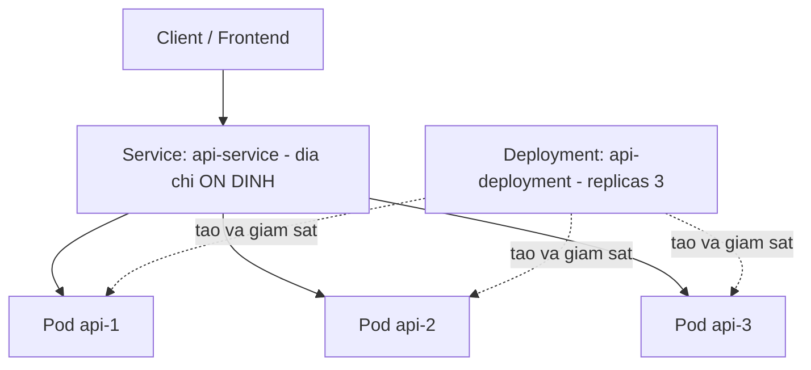

# Container Orchestration: Kubernetes cơ bản

!!! info "Bạn đang ở đây"
    cần trước: cloud fundamentals (iaas, paas, saas) và đã biết đóng gói ứng dụng .NET thành container docker.
    mở khoá: infrastructure as code, vận hành production nhiều container ở quy mô lớn.

> **Mục tiêu:** sau chương này bạn **giải thích** được vì sao cần một hệ thống orchestration khi chạy nhiều container, định nghĩa đúng ba khái niệm nền tảng của Kubernetes (Pod, Deployment, Service), và phân biệt rõ vai trò của từng thành phần trong việc giữ ứng dụng luôn "sống" và có địa chỉ mạng ổn định.

## 0. Đoán nhanh trước khi học

Trước khi đọc tiếp, thử trả lời (sai không sao, đoán rồi đọc sẽ nhớ lâu hơn):

1. Bạn có 20 container Docker của cùng một API đang chạy trên 5 máy chủ khác nhau. Một container bị crash lúc 3 giờ sáng. Ai là người khởi động lại nó?
2. Nếu bạn khởi động lại một container Docker bị crash bằng tay, nó có giữ nguyên địa chỉ IP cũ không?
3. Nếu client (ví dụ một web frontend) gọi thẳng vào IP của một container backend, và container đó bị thay bằng container mới có IP khác, chuyện gì xảy ra với request đang gọi vào IP cũ?

??? note "Đáp án"
    1. Không ai, trừ khi bạn có một tiến trình con người ngồi canh log 24/7 hoặc viết script riêng để canh và tự khởi động lại — đây chính là vấn đề orchestration giải quyết, bạn sẽ thấy ở mục 1.
    2. Không chắc. Docker có thể cấp IP nội bộ mới cho container mới, tuỳ cấu hình network — nói cách khác, IP của container **không đảm bảo** giữ nguyên qua các lần tạo lại.
    3. Request đó thất bại (`Connection refused` hoặc timeout) vì IP cũ không còn dẫn tới đâu cả. Đây chính là vấn đề mà khái niệm **Service** ở mục 4 giải quyết.

## 1. Vấn đề gốc: vì sao cần orchestration

**Định nghĩa bằng lời:** vấn đề orchestration container là bài toán "làm sao tự động khởi động, giám sát, khởi động lại, và phân phối tải cho hàng chục/hàng trăm container chạy trên nhiều máy chủ, mà không cần con người can thiệp bằng tay cho từng container."

Bạn đã học ở phần đóng gói Docker rằng một container là một tiến trình bị cách ly. Vấn đề bắt đầu xuất hiện khi bạn không chỉ có 1 container mà có hàng chục container của cùng một API, chạy trên nhiều máy chủ khác nhau để chịu tải và chịu lỗi. Lúc đó xuất hiện ba việc mà làm bằng tay không còn khả thi ở quy mô lớn:

- **Khởi động lại container chết:** một container bị crash (hết bộ nhớ, lỗi runtime) cần được phát hiện và thay thế ngay, không phải chờ ai đó thấy alert rồi gõ lệnh `docker run` lại.
- **Phân phối tải:** 50 request/giây cần được chia đều cho nhiều container đang chạy, không dồn hết vào một container khiến nó quá tải trong khi các container khác rảnh.
- **Scale theo nhu cầu:** giờ cao điểm cần nhiều container hơn, giờ vắng khách cần ít container hơn để tiết kiệm chi phí — quyết định và thực thi việc này bằng tay cho hàng chục máy chủ là không thực tế.

Ví dụ cụ thể: giả sử bạn có 20 container API chạy trên 5 máy chủ (mỗi máy 4 container). Lúc 3 giờ sáng, một container trên máy chủ số 3 bị crash vì hết bộ nhớ. Nếu không có gì giám sát, container đó nằm im ở trạng thái "đã dừng" cho tới khi có người (thường là qua alert, vài phút tới vài chục phút sau) đăng nhập vào đúng máy chủ số 3 và gõ lệnh khởi động lại bằng tay. Trong lúc đó, 1/20 khả năng phục vụ đã mất, và nếu load balancer vẫn gửi request tới container đã chết, một phần request của người dùng thất bại.

```text title="Cach lam bang tay khong the mo rong (khong kha thi o quy mo lon)"
03:00 - Container api-3 tren may chu #3 crash (het bo nho)
03:00 - Khong ai/khong gi phat hien ngay
03:07 - He thong alert gui canh bao qua email/Slack
03:15 - Ky su tinh day, dang nhap vao may chu #3
03:18 - Ky su go lenh "docker run" khoi dong lai container
=> 18 phut container khong hoat dong, tren MOT container trong 20 container
=> Nhan 100 container tren 20 may chu: khong con kha thi lam bang tay
```

Điều gì xảy ra nếu bạn cố gắng giải quyết vấn đề này bằng cách viết script cron riêng để tự kiểm tra và khởi động lại container? Bạn sẽ dần dần viết lại chính những gì một hệ thống orchestration đã làm sẵn — theo dõi trạng thái, quyết định khi nào cần hành động, và tự thực thi hành động đó — nhưng thiếu các cơ chế đã được kiểm chứng ở quy mô lớn (phân phối tải, tự phục hồi khi cả một máy chủ chết, cập nhật phiên bản không downtime). Đây là động lực ra đời của các hệ thống orchestration, trong đó Kubernetes là phổ biến nhất hiện nay.

!!! danger "Hiểu lầm phổ biến — chớ mắc"
    "Chỉ cần `docker-compose` là đủ để chạy production ở quy mô lớn." Không đúng ở quy mô nhiều máy chủ. `docker-compose` (đã học ở chương đóng gói Docker) quản lý nhiều container **trên một máy chủ duy nhất** — nó không tự động khởi động lại container trên máy chủ khác nếu cả máy chủ đó chết, và không tự phân phối container qua nhiều máy chủ. Đó chính là phần việc Kubernetes giải quyết.

## 2. Kubernetes là gì

**Định nghĩa bằng lời:** **Kubernetes** (thường viết tắt K8s) là một hệ thống phần mềm tự động quản lý vòng đời của nhiều container chạy trên nhiều máy chủ — nó liên tục theo dõi "trạng thái mong muốn" bạn khai báo (ví dụ "tôi muốn 5 container của API này luôn chạy") và tự hành động (khởi động, dừng, di chuyển container) để trạng thái thực tế luôn khớp với trạng thái mong muốn đó.

Điểm khác biệt cốt lõi so với chạy Docker thủ công: bạn không ra lệnh "làm bước A rồi bước B" (imperative), mà bạn khai báo "tôi muốn kết quả cuối cùng là gì" (declarative), và Kubernetes tự tìm cách đạt được và duy trì kết quả đó liên tục, không chỉ một lần.

```text title="Tu duy khai bao cua Kubernetes (khong phai ra lenh tung buoc)"
Ban khong noi:
  "Chay container A tren may 1, container B tren may 2..."

Ban noi (khai bao trang thai mong muon):
  "Toi muon LUON CO 5 ban sao dang chay cua image api:1.0"

Kubernetes tu quyet dinh:
  - Chay 5 ban sao do o may chu nao trong cluster
  - Kiem tra lien tuc: dung 5 ban chua?
  - Neu thieu (vi du 1 ban chet) -> tu tao ban moi ngay
```

Điều gì xảy ra nếu cụm máy chủ (cluster) Kubernetes chỉ có một hệ thống theo dõi trạng thái nhưng không có quyền tự hành động (chỉ báo cáo, không tự sửa)? Nó sẽ chỉ là một công cụ giám sát (monitoring), không phải orchestration — bạn vẫn phải tự tay khởi động lại container khi thấy báo cáo lỗi, quay lại đúng vấn đề đã nêu ở mục 1. Điểm làm Kubernetes trở thành orchestration thực sự là nó **tự hành động** để trạng thái thực tế khớp trạng thái mong muốn, không cần người can thiệp cho từng sự cố.

!!! danger "Hiểu lầm phổ biến — chớ mắc"
    "Kubernetes là một loại Docker mạnh hơn." Không chính xác. Docker (đã học ở chương trước) là công cụ tạo và chạy **một** container. Kubernetes là tầng ở trên, điều phối **nhiều** container (có thể được tạo ra bởi Docker hoặc một container runtime khác) trên **nhiều máy chủ** — hai công cụ giải quyết hai bài toán khác nhau, không thay thế nhau mà bổ trợ nhau.

## 3. Pod: đơn vị nhỏ nhất Kubernetes quản lý

**Định nghĩa bằng lời:** một **Pod** là đơn vị nhỏ nhất mà Kubernetes tạo ra và quản lý — nó chứa một hoặc nhiều container luôn được đặt cùng nhau trên một máy chủ, chia sẻ chung một địa chỉ IP nội bộ và chung một không gian lưu trữ tạm (storage), như thể các container đó sống trong "một căn hộ" chung.

Điểm quan trọng cần nắm ngay: Kubernetes **không** quản lý container riêng lẻ trực tiếp — nó luôn quản lý ở cấp Pod. Trường hợp phổ biến nhất (và cũng là trường hợp bạn nên dùng khi mới học) là một Pod chỉ chứa **một** container duy nhất — container API .NET của bạn.

```yaml title="Pod toi thieu — mo ta 1 Pod chua 1 container"
apiVersion: v1
kind: Pod
metadata:
  name: api-pod
spec:
  containers:
    - name: api
      image: myapi:1.0
      ports:
        - containerPort: 8080
```

Đây là mô tả khai báo cho **một** Pod duy nhất, chứa **một** container tên `api`, chạy image `myapi:1.0` — image .NET bạn đã đóng gói ở chương Docker. Pod này có một địa chỉ IP nội bộ riêng do Kubernetes cấp, và container bên trong lắng nghe cổng `8080` trên chính IP đó.

Điều gì xảy ra nếu bạn cố tạo trực tiếp một container mà không đặt nó trong một Pod? Trong Kubernetes, việc này thực ra không tồn tại — mọi container, dù bạn khai ít hay khai nhiều, đều bắt buộc phải nằm trong một Pod; Pod là đơn vị lập lịch (scheduling) nhỏ nhất mà Kubernetes đặt lên một máy chủ trong cluster. Bạn không thể yêu cầu Kubernetes "chạy container này" mà bỏ qua khái niệm Pod.

!!! danger "Hiểu lầm phổ biến — chớ mắc"
    "Một Pod luôn chỉ có một container, giống như một Pod = một container." Không hoàn toàn đúng. Một Pod **có thể** chứa nhiều container (ví dụ container chính API + một container phụ đọc log gửi ra hệ thống giám sát), và các container trong cùng Pod chia sẻ network/storage nên gọi nhau qua `localhost` được. Trường hợp phổ biến và đơn giản nhất — cũng là trường hợp bạn nên bắt đầu học — là 1 Pod = 1 container, nhưng đó là *cách dùng thường gặp*, không phải *định nghĩa bắt buộc*.

## 4. Deployment: duy trì đúng số lượng Pod mong muốn

**Định nghĩa bằng lời:** một **Deployment** là một khai báo nói với Kubernetes "tôi muốn luôn có N Pod đang chạy phiên bản X của ứng dụng" — Kubernetes liên tục theo dõi và **tự động** tạo Pod mới thay thế bất cứ khi nào số Pod đang chạy thực tế thấp hơn N.

Bạn không tự tay tạo từng Pod riêng lẻ ở production (mục 3 chỉ để hiểu Pod là gì) — bạn khai một Deployment, và Deployment tự sinh ra đúng số Pod theo yêu cầu.

```yaml title="Deployment toi thieu — luon giu 3 Pod chay image myapi:1.0"
apiVersion: apps/v1
kind: Deployment
metadata:
  name: api-deployment
spec:
  replicas: 3
  selector:
    matchLabels:
      app: myapi
  template:
    metadata:
      labels:
        app: myapi
    spec:
      containers:
        - name: api
          image: myapi:1.0
          ports:
            - containerPort: 8080
```

`replicas: 3` là con số khai báo mà bạn vừa học ở mục 2 dưới dạng ý tưởng — ở đây nó cụ thể hoá thành "luôn có 3 Pod, mỗi Pod chạy image `myapi:1.0`". Trường ba dòng `template` mô tả *khuôn mẫu* để Kubernetes dùng khi cần tạo một Pod mới — nó gần như chính là nội dung Pod ở mục 3, chỉ khác là Deployment sẽ tạo ra nhiều bản sao từ khuôn mẫu này.

Ví dụ cụ thể điều gì xảy ra khi một Pod chết: giả sử Deployment trên đang chạy đúng 3 Pod (`api-1`, `api-2`, `api-3`). Pod `api-2` bị crash vì hết bộ nhớ.

```text title="Deployment tu phat hien va thay the Pod chet"
Truoc khi crash:
  api-1  Running
  api-2  Running
  api-3  Running
  (dung 3/3 nhu khai bao "replicas: 3")

Pod api-2 bi crash (het bo nho) luc 03:00:
  api-1  Running
  api-2  Failed      <- Kubernetes phat hien ngay, KHONG can nguoi bao
  api-3  Running
  (chi con 2/3, khong dung so luong mong muon)

Kubernetes tu hanh dong (vai giay sau, khong can lenh tay):
  api-1  Running
  api-2  Failed         (Pod cu, se bi don dep)
  api-3  Running
  api-4  Running (MOI)  <- Deployment tu tao Pod thay the tu khuon mau
  (tro lai dung 3/3)
```

Đây chính là câu trả lời trực tiếp cho vấn đề đã nêu ở mục 1: không cần ai thức lúc 3 giờ sáng để khởi động lại container — Deployment liên tục so sánh "đang có bao nhiêu Pod chạy" với "`replicas` yêu cầu bao nhiêu" và tự tạo Pod mới khi thiếu.

Điều gì xảy ra nếu bạn quên khai `replicas` (hoặc đặt `replicas: 1`) cho một API quan trọng? Khi Pod duy nhất đó chết, toàn bộ API mất khả năng phục vụ hoàn toàn trong khoảng thời gian Deployment phát hiện và tạo Pod mới thay thế (thường vài giây tới vài chục giây, nhưng vẫn có khoảng downtime bằng 0 dự phòng) — không có Pod nào khác gánh tải trong lúc đó. Đặt `replicas` từ 2 trở lên là cách tối thiểu để luôn có ít nhất một Pod khác phục vụ trong khi Pod chết được thay thế.

!!! danger "Hiểu lầm phổ biến — chớ mắc"
    "Sau khi Pod `api-2` chết và được thay bằng `api-4`, Kubernetes 'khởi động lại' đúng Pod `api-2` cũ." Sai. Pod bị crash không được "hồi sinh" — nó bị đánh dấu hỏng và loại bỏ; Deployment tạo ra một Pod **hoàn toàn mới** (tên khác, IP nội bộ khác) từ khuôn mẫu `template`. Đây là lý do bạn không nên để bất cứ thứ gì (client, service khác) phụ thuộc vào tên hay IP cụ thể của một Pod — nó có thể biến mất và được thay bằng một Pod khác bất cứ lúc nào.

## 5. Service: địa chỉ mạng ổn định cho một nhóm Pod

**Định nghĩa bằng lời:** một **Service** là một địa chỉ mạng (tên và IP) **ổn định, không đổi**, đứng trước một nhóm Pod — client gọi vào địa chỉ của Service, và Service tự chuyển tiếp request tới một trong các Pod đang chạy phía sau nó, mà client không cần biết Pod nào cụ thể đang tồn tại vào lúc gọi.

Đây là điểm cần **phân biệt rõ**, nối trực tiếp với hậu quả đã thấy ở mục 4: mỗi khi Pod bị thay thế (crash, cập nhật phiên bản, hay bị Kubernetes di chuyển sang máy chủ khác), Pod mới sinh ra có **IP nội bộ khác** Pod cũ — IP của Pod không ổn định và không nên bị client gọi trực tiếp vào. Service giải quyết đúng vấn đề này: nó có một IP/tên **cố định**, không đổi theo vòng đời của từng Pod bên dưới.

```yaml title="Service toi thieu — dia chi on dinh truoc trong Deployment o muc 4"
apiVersion: v1
kind: Service
metadata:
  name: api-service
spec:
  selector:
    app: myapi
  ports:
    - port: 80
      targetPort: 8080
```

Trường `selector: app: myapi` là cách Service "tìm" đúng nhóm Pod cần đứng trước — nó khớp với nhãn (`label`) `app: myapi` đã khai trong `template.metadata.labels` của Deployment ở mục 4. Bất kể Deployment đang có bao nhiêu Pod, Pod nào mới được tạo, Pod nào vừa chết, Service `api-service` luôn tự động cập nhật danh sách Pod đích phía sau — còn tên `api-service` và địa chỉ nó cấp thì không đổi.

```text title="So sanh: goi thang vao Pod (SAI) va goi qua Service (DUNG)"
Cach SAI - client goi thang vao IP cua tung Pod:
  Client --> 10.0.1.5 (Pod api-1)
  Pod api-1 chet, duoc thay bang Pod moi IP 10.0.1.9
  Client van goi 10.0.1.5 --> KHONG CON AI O DO --> loi Connection refused

Cach DUNG - client goi vao dia chi cua Service:
  Client --> api-service (dia chi KHONG DOI)
  Service tu chuyen tiep toi Pod dang chay bat ky (api-1, api-3, api-4...)
  Pod nao chet, Pod nao moi sinh ra, dia chi "api-service" ma client goi
  KHONG BAO GIO DOI --> client khong can biet, khong can sua gi ca
```

Điều gì xảy ra nếu bạn bỏ qua Service và cấu hình frontend gọi thẳng vào IP của một Pod cụ thể (giống ví dụ SAI ở trên)? Đúng như dự đoán ở mục 0: khi Pod đó bị Deployment thay thế (rất thường xảy ra — crash, cập nhật, di chuyển máy chủ), IP cũ không còn dẫn tới đâu, request thất bại ngay, và bạn phải tự tay cập nhật lại IP ở phía gọi — đúng việc thủ công không mở rộng được mà orchestration được sinh ra để loại bỏ.

!!! danger "Hiểu lầm phổ biến — chớ mắc"
    "Service là một Pod đặc biệt, hoặc Service 'chứa' các Pod." Không đúng. Service không chạy container, không có vòng đời như Pod — nó chỉ là một mục cấu hình mạng (một địa chỉ IP nội bộ ổn định + quy tắc chuyển tiếp) trỏ tới các Pod khớp `selector` tại đúng thời điểm request tới. Service không "sở hữu" Pod theo nghĩa Deployment sở hữu và tạo/xoá Pod.

## 6. Sơ đồ kiến trúc tối thiểu

Sơ đồ dưới ghép lại đúng ba khái niệm đã học theo thứ tự: Deployment tạo và duy trì Pod, Service đứng trước và phân phối request tới các Pod đó.



Đọc sơ đồ theo đúng hai luồng khác nhau: luồng **request** (đường liền) đi từ client qua Service rồi mới tới một Pod cụ thể — client không bao giờ thấy hay gọi trực tiếp Deployment. Luồng **quản lý vòng đời** (đường chấm) là việc Deployment liên tục theo dõi và tạo/thay thế Pod — đây là việc diễn ra "phía sau", không liên quan tới đường đi của một request cụ thể.

## 7. Tổng hợp vai trò ba thành phần

Chỉ sau khi đã hiểu riêng từng khái niệm ở các mục 3, 4, 5, bảng dưới tổng hợp lại để so sánh vai trò — không có khái niệm mới nào xuất hiện lần đầu ở đây:

| Thành phần | Câu hỏi nó trả lời | Vai trò chính | Điều gì đổi liên tục | Điều gì giữ ổn định |
|---|---|---|---|---|
| **Pod** | "Container nào chạy cùng nhau, trên máy nào?" | Đơn vị nhỏ nhất chứa 1+ container, chia sẻ network/storage | Có thể bị tạo mới/xoá bất cứ lúc nào | Không gì — Pod là đơn vị hay thay đổi nhất |
| **Deployment** | "Cần bao nhiêu bản chạy, và ai đảm bảo đủ số đó?" | Khai báo số lượng Pod mong muốn, tự tạo Pod thay thế khi thiếu | Danh sách Pod cụ thể đang chạy | Số lượng Pod mong muốn (`replicas`) và cấu hình khuôn mẫu |
| **Service** | "Client gọi vào đâu để luôn chạm đúng một Pod đang sống?" | Cấp một địa chỉ mạng ổn định, chuyển tiếp tới Pod hợp lệ | Danh sách Pod đích phía sau (tự cập nhật) | Tên và địa chỉ IP nội bộ của Service |

## Cạm bẫy & thực chiến

- **Gọi thẳng vào IP của Pod thay vì qua Service.** Đây là lỗi phổ biến nhất khi mới học Kubernetes — vì IP Pod nhìn "có vẻ hoạt động" lúc test, nhưng sẽ gãy ngay khi Pod bị thay thế (crash, deploy phiên bản mới, hay chỉ đơn giản là Kubernetes di chuyển Pod sang máy chủ khác để cân bằng tài nguyên). Luôn gọi qua tên/địa chỉ của Service.
- **Đặt `replicas: 1` cho dịch vụ quan trọng ở production.** Với đúng 1 Pod, mọi lần Pod đó cần được thay thế (crash, hoặc cả khi cập nhật phiên bản bình thường) đều tạo ra một khoảng downtime hoàn toàn — không có Pod thứ hai gánh tải trong lúc đó. Cần tối thiểu 2 Pod trở lên cho dịch vụ chịu traffic thật.
- **Nhãn (`label`) giữa `Deployment.template.metadata.labels` và `Service.selector` không khớp.** Nếu bạn gõ nhầm `app: myapi` thành `app: my-api` ở một trong hai nơi, Service sẽ không tìm thấy Pod nào để chuyển tiếp request tới — không có lỗi báo rõ ràng nào bật ra ngay, Service vẫn "tồn tại" nhưng không có Pod đích nào cả, request tới Service sẽ timeout hoặc bị từ chối.
- **Nhầm lẫn giữa "Pod đang chạy (`Running`)" và "Pod đã sẵn sàng nhận traffic".** Một Pod mới được Deployment tạo ra có thể ở trạng thái `Running` (tiến trình đã bắt đầu) nhưng ứng dụng .NET bên trong chưa nạp xong cấu hình hoặc chưa kết nối được database — nếu Service chuyển traffic tới Pod này ngay, request có thể thất bại trong vài giây đầu. (Cách khắc phục đúng — readiness probe — thuộc phần vận hành nâng cao, không phải phạm vi khái niệm nền tảng của chương này.)
- **Tưởng rằng sửa file trực tiếp trong một Pod đang chạy sẽ "sửa vĩnh viễn" ứng dụng.** Giống hệt bài học ở container Docker: nếu Pod đó bị thay thế (điều chắc chắn sẽ xảy ra), Pod mới được tạo lại từ `image` khai trong khuôn mẫu Deployment, không mang theo bất kỳ thay đổi bạn từng chỉnh tay bên trong Pod cũ.

## Bài tập

**Bài 1 (giàn giáo).** Điền vào chỗ trống để hoàn thành một Deployment luôn giữ đúng 4 Pod chạy image `myapi:2.0`, và một Service tên `api-service` chuyển tiếp cổng 80 tới cổng 8080 của các Pod có nhãn `app: myapi`.

```yaml title="Deployment + Service (gian giao)"
apiVersion: apps/v1
kind: Deployment
metadata:
  name: api-deployment
spec:
  replicas: 0            # TODO 1: sua thanh so luong Pod mong muon la 4
  selector:
    matchLabels:
      app: myapi
  template:
    metadata:
      labels:
        app: myapi
    spec:
      containers:
        - name: api
          image: myapi:2.0
          ports:
            - containerPort: 8080
---
apiVersion: v1
kind: Service
metadata:
  name: api-service
spec:
  selector:
    app: TODO             # TODO 2: dien dung nhan de khop voi Pod cua Deployment tren
  ports:
    - port: 80
      targetPort: 8080
```

??? success "Lời giải & giải thích"
    ```yaml title="Deployment + Service (dap an)"
    apiVersion: apps/v1
    kind: Deployment
    metadata:
      name: api-deployment
    spec:
      replicas: 4
      selector:
        matchLabels:
          app: myapi
      template:
        metadata:
          labels:
            app: myapi
        spec:
          containers:
            - name: api
              image: myapi:2.0
              ports:
                - containerPort: 8080
    ---
    apiVersion: v1
    kind: Service
    metadata:
      name: api-service
    spec:
      selector:
        app: myapi
      ports:
        - port: 80
          targetPort: 8080
    ```
    TODO 1 cần `replicas: 4` đúng theo yêu cầu bài — số này chính là "trạng thái mong muốn" mà Deployment sẽ luôn duy trì. TODO 2 cần `app: myapi`, khớp đúng với nhãn `app: myapi` khai ở `template.metadata.labels` của Deployment — nếu hai giá trị này lệch nhau, Service sẽ không tìm thấy Pod đích nào, đúng cạm bẫy đã nêu ở mục "Cạm bẫy & thực chiến".

**Bài 2 (tình huống thực chiến).** Deployment của bạn khai `replicas: 3`. Vào lúc 2 giờ sáng, máy chủ vật lý đang chạy 2 trong 3 Pod đó bị mất điện hoàn toàn (2 Pod biến mất khỏi cluster ngay lập tức, không có cách "khởi động lại" tại chỗ vì máy chủ chết hẳn). Hãy giải thích Kubernetes sẽ làm gì tiếp theo, và Service `api-service` đứng trước nhóm Pod này có bị ảnh hưởng gián đoạn kéo dài không.

??? success "Lời giải & giải thích"
    Deployment liên tục so sánh số Pod đang chạy thực tế với `replicas: 3` đã khai. Khi 2 Pod biến mất do máy chủ chết, số Pod thực tế tụt xuống 1/3 — Deployment phát hiện sai lệch này và **tự tạo 2 Pod mới** (trên các máy chủ còn sống trong cluster) từ đúng khuôn mẫu `template` đã khai, không cần ai can thiệp bằng tay. Trong khoảng thời gian ngắn đó, Service `api-service` không hề "gãy" theo kiểu vĩnh viễn: nó chỉ đơn giản còn 1 Pod hợp lệ trong danh sách đích, vẫn tiếp tục chuyển request tới đúng Pod còn sống đó, cho tới khi 2 Pod mới sẵn sàng thì Service tự thêm chúng vào danh sách đích. Vì Service dùng địa chỉ ổn định (không phải IP của từng Pod cụ thể), client gọi vào `api-service` không cần biết hay quan tâm việc 2 Pod vừa chết và 2 Pod mới vừa được tạo ra ở đâu.

## Tự kiểm tra

1. Vì sao chạy vài chục container thủ công bằng `docker run` không mở rộng được, cụ thể là ba việc nào trở nên bất khả thi?
2. Kubernetes khác gì so với chỉ dùng `docker-compose` khi hệ thống chạy trên nhiều máy chủ?
3. Pod là gì, và vì sao Kubernetes không quản lý container trực tiếp mà luôn quản lý qua Pod?
4. Nếu bạn khai `replicas: 3` trong một Deployment và 1 Pod bị crash, điều gì xảy ra tiếp theo, và Pod mới có giữ nguyên tên/IP của Pod cũ không?
5. Vì sao client không nên gọi thẳng vào IP của một Pod cụ thể? Service giải quyết vấn đề đó bằng cách nào?
6. Trong sơ đồ Service -> nhiều Pod, nếu `selector` của Service không khớp `label` của Pod, hậu quả cụ thể là gì?
7. Nêu vai trò khác nhau của Pod, Deployment, và Service chỉ trong một câu mỗi thành phần.

??? note "Đáp án"
    1. Ba việc: (1) tự phát hiện và khởi động lại container chết mà không cần người canh, (2) tự phân phối tải đều cho nhiều container, (3) tự điều chỉnh số lượng container theo nhu cầu — tất cả đều cần làm liên tục ở quy mô hàng chục/hàng trăm container trên nhiều máy chủ, vượt quá khả năng thao tác tay của con người.
    2. `docker-compose` quản lý nhiều container nhưng chỉ trên **một máy chủ duy nhất**; nó không tự khởi động lại container trên máy chủ khác nếu cả máy chủ đó chết, và không tự phân phối container qua nhiều máy chủ như Kubernetes.
    3. Pod là đơn vị nhỏ nhất Kubernetes tạo ra và lập lịch (scheduling), chứa 1+ container chia sẻ network/storage. Kubernetes quản lý qua Pod (không phải container riêng lẻ) vì đây là đơn vị nó đặt lên một máy chủ trong cluster — mọi container, dù chỉ một, đều buộc phải nằm trong một Pod.
    4. Deployment phát hiện số Pod thực tế (2) thấp hơn `replicas` mong muốn (3) và tự tạo một Pod mới thay thế. Pod mới **không** giữ nguyên tên hay IP của Pod cũ — nó là một Pod hoàn toàn mới được tạo từ khuôn mẫu `template`.
    5. Vì IP của Pod không ổn định — Pod có thể bị thay thế bất cứ lúc nào (crash, cập nhật, di chuyển máy chủ) và Pod mới sẽ có IP khác. Service giải quyết bằng cách cấp một địa chỉ mạng cố định, tự động chuyển tiếp request tới bất kỳ Pod hợp lệ đang chạy phía sau, nên client không cần biết IP của từng Pod.
    6. Service sẽ không tìm thấy Pod đích nào để chuyển tiếp request tới — Service vẫn "tồn tại" về mặt cấu hình nhưng danh sách Pod đích trống, khiến request gọi tới Service bị timeout hoặc từ chối, dù các Pod thực tế vẫn đang chạy bình thường.
    7. Pod: đơn vị nhỏ nhất chứa container, chia sẻ network/storage. Deployment: khai báo và duy trì đúng số lượng Pod mong muốn, tự thay Pod chết. Service: cấp một địa chỉ mạng ổn định đứng trước một nhóm Pod để client gọi vào mà không cần biết Pod nào đang sống.

??? abstract "DEEP DIVE — nâng cao (ngoài fast path)"
    - **Namespace:** Kubernetes cho phép chia một cluster thành nhiều không gian tên (namespace) riêng biệt (ví dụ `dev`, `staging`, `production`) để cách ly tài nguyên và quyền truy cập giữa các môi trường, dùng chung một cluster vật lý.
    - **ConfigMap và Secret:** thay vì hardcode biến môi trường trong `image` (bài học đã có ở chương Docker), Kubernetes cung cấp `ConfigMap` (cấu hình không nhạy cảm) và `Secret` (dữ liệu nhạy cảm như connection string, API key) để tách cấu hình khỏi image, mount vào Pod lúc chạy.
    - **Readiness probe và liveness probe:** hai loại kiểm tra sức khoẻ mà Kubernetes tự gọi vào từng Pod — `liveness probe` quyết định "Pod này còn sống hay cần bị khởi động lại", `readiness probe` quyết định "Pod này đã sẵn sàng nhận traffic từ Service hay chưa" — mở rộng trực tiếp từ khái niệm Liveness/Readiness đã học ở chương health check (P8).
    - **Ingress:** một tầng định tuyến HTTP/HTTPS ở trước nhiều Service, cho phép định tuyến theo domain hoặc đường dẫn URL (ví dụ `/api` vào Service A, `/admin` vào Service B) từ một điểm vào duy nhất của cluster.
    - **Horizontal Pod Autoscaler (HPA):** một cơ chế tự động tăng/giảm `replicas` của Deployment dựa trên chỉ số thực tế (ví dụ CPU trung bình vượt 70%), tự động hoá chính việc "scale theo nhu cầu" đã nêu là vấn đề gốc ở mục 1, thay vì bạn phải tự sửa `replicas` bằng tay.
    - **Rolling update:** khi bạn đổi `image` trong Deployment sang phiên bản mới, Kubernetes mặc định thay Pod cũ bằng Pod mới theo từng đợt nhỏ (không xoá hết Pod cũ cùng lúc), giữ dịch vụ luôn có Pod phục vụ trong suốt quá trình cập nhật.

Tiếp theo -> infrastructure as code
